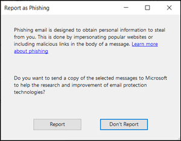
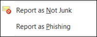

# <a name="install-and-use-the-junk-email-reporting-add-in-for-microsoft-outlook"></a>Installieren und Verwenden des Junk-E-Mail-Berichterstellungs-Add-Ins für Microsoft Outlook

[!INCLUDE [Microsoft 365 Defender rebranding](../includes/microsoft-defender-for-office.md)]

**Gilt für**
- [Exchange Online Protection](https://go.microsoft.com/fwlink/?linkid=2148611)
- [Microsoft Defender für Office 365 Plan 1 und Plan 2](https://go.microsoft.com/fwlink/?linkid=2148715)
- [Microsoft 365 Defender](https://go.microsoft.com/fwlink/?linkid=2118804)

> [!NOTE]
> Wenn Sie das Junk-E-Mail-Berichterstellungs-Add-In derzeit nicht verwenden, empfehlen wir stattdessen das [Add-In](enable-the-report-message-add-in.md) "Nachricht melden" oder das ["Phishing-Add-In](enable-the-report-phish-add-in.md) melden". Weitere Informationen finden Sie unter [Melden von Nachrichten und Dateien an Microsoft](report-junk-email-messages-to-microsoft.md).

Das Add-in "Junk-E-Mail-Berichterstellung" für Microsoft Outlook ermöglicht Es Benutzern, falsch positive Ergebnisse (gute E-Mails als Spam gekennzeichnet), falsch negative Ergebnisse (ungültige E-Mails sind zulässig) und Phishingnachrichten an Microsoft zu senden. Wenn Ihre Organisation Exchange Online Protection nicht verwendet (z. B. lokale Exchange- oder andere E-Mail-Dienste als Exchange Online), wirkt sich Ihre Übermittlung des Junk-E-Mail-Berichts nicht auf Ihre Spamfilterung aus.

In diesem Thema wird erläutert, wie Sie das Junk-E-Mail-Berichterstellungs-Add-In installieren und verwenden.

## <a name="what-do-you-need-to-know-before-you-begin"></a>Was sollten Sie wissen, bevor Sie beginnen?

- Informationen zum Installieren des Add-Ins "Junk-E-Mail-Berichterstellung" finden Sie im Abschnitt "Installieren des [Junk-E-Mail-Berichts-Add-Ins"](#install-the-junk-email-reporting-add-in) weiter später in diesem Artikel.

- Das Junk-E-Mail-Bericht-Add-In funktioniert mit den folgenden Versionen von Outlook:

  - Outlook 2013 oder höher
  - Outlook im Lieferumfang von Microsoft 365 Apps for Enterprise

- Weitere Informationen zum Melden von Nachrichten an Microsoft finden Sie unter ["Melden von Nachrichten und Dateien an Microsoft".](report-junk-email-messages-to-microsoft.md)

## <a name="use-the-junk-email-reporting-add-in-to-report-spam-and-phishing-messages"></a>Verwenden des Junk-E-Mail-Berichterstellungs-Add-Ins zum Melden von Spam- und Phishingnachrichten

1. Verwenden Sie für Nachrichten im Posteingang oder einem anderen E-Mail-Ordner mit Ausnahme von Junk-E-Mails eine der folgenden Methoden, um Spam- und Phishingnachrichten zu melden:

   - Wählen Sie die Nachricht aus, oder öffnen Sie die Nachricht. Klicken Sie  **auf der Registerkarte "Start"** oder "Nachricht" im Menüband auf **"Junk",** und wählen Sie "Als Junk melden" oder "Als Phishing **melden" aus.** 

     

   - Klicken Sie mit der rechten Maustaste auf die Nachricht, wählen **Sie "Junk"** aus, und wählen Sie dann **"Als Junk melden"** oder "Als Phishing **melden" aus.**

     

   - Wählen Sie mehrere Nachrichten aus, klicken Sie mit der rechten Maustaste, und wählen Sie dann **"Als Junk melden"** oder "Als Phishing **melden" aus.**

     

2. Lesen Sie im angezeigten Dialogfeld die Informationen, und klicken Sie auf **"Bericht".** Wenn Sie Ihre Meinung ändern, klicken Sie auf **"Nicht melden"**.

   

   

3. Die ausgewählten Nachrichten werden zur Analyse an Microsoft gesendet und:

   - In den Junk-E-Mail-Ordner verschoben, wenn er als Spam gemeldet wurde.
   - Gelöscht, wenn es als Phishing gemeldet wurde.

   Wenn Sie überprüfen möchten, ob die Nachrichten gesendet wurden, öffnen Sie den Ordner **Gesendete Objekte**, in dem die gesendeten Nachrichten angezeigt werden sollten.

## <a name="use-the-junk-email-reporting-add-in-to-report-non-spam-and-phishing-messages-from-the-junk-email-folder"></a>Verwenden des Add-Ins "Junk-E-Mail-Berichterstellung" zum Melden von Nichtspam- und Phishingnachrichten aus dem Junk-E-Mail-Ordner

1. Verwenden Sie im Junk-E-Mail-Ordner eine der folgenden Methoden, um falsch positive Spam- oder Phishingnachrichten zu melden:

   - Wählen Sie die Nachricht aus, oder öffnen Sie die Nachricht. Klicken Sie  **auf der Registerkarte "Start"** oder "Nachricht" im Menüband auf "Kein **Junk",** und wählen Sie dann "Als Nicht-Junk-E-Mail melden" oder "Als Phishing **melden" aus.** 

     

   - Klicken Sie mit der rechten Maustaste auf die Nachricht, klicken Sie auf **"Junk",** und wählen Sie "Als Nicht-Junk-E-Mail **melden"** oder "Als Phishing **melden" aus.**

     

   - Wählen Sie mehrere Nachrichten aus, klicken Sie mit der rechten Maustaste, und wählen Sie dann "Als Nicht-Junk-E-Mail **melden"** oder **"Als Phishing melden" aus.**

     

2. Lesen Sie im angezeigten Dialogfeld die Informationen, und klicken Sie auf **"Bericht".** Wenn Sie Ihre Meinung ändern, klicken Sie auf **"Nicht melden"**.

   

   

3. Die ausgewählten Nachrichten werden zur Analyse an Microsoft gesendet und:

   - In den Junk-E-Mail-Ordner verschoben, wenn er als Spam gemeldet wurde.
   - Gelöscht, wenn es als Phishing gemeldet wurde.

   Wenn Sie überprüfen möchten, ob die Nachrichten gesendet wurden, öffnen Sie den Ordner **Gesendete Objekte**, in dem die gesendeten Nachrichten angezeigt werden sollten.

## <a name="install-the-junk-email-reporting-add-in"></a>Installieren des Junk-E-Mail-Berichterstellungs-Add-Ins

- Sie benötigen Administratorrechte auf dem Computer, auf dem Sie das Add-in installieren.

- Laden Sie die entsprechende MSI-Datei für Ihre Version von Office an einen leicht zu findenen Speicherort herunter, und laden Sie <https://www.microsoft.com/download/details.aspx?id=18275> sie herunter:

  - **32-Bit:**`Junk Reporting Add-in for Office 2007, 2010, 2013, and 2016 (32-bit).msi`
  - **64-Bit:**`Junk Reporting Add-in for Office 2007, 2010, 2013, and 2016 (64-bit).msi`

- Für Outlook 2013 oder höher ist microsoft .NET Framework 2.0 die einzige Voraussetzung. In Windows 10 installieren Sie .NET Framework 2.0 nicht aus einem Download.

### <a name="install-the-junk-email-reporting-add-in-using-the-setup-wizard"></a>Installieren des Junk-E-Mail-Berichterstellungs-Add-Ins mithilfe des Setup-Assistenten

1. Schließen Sie Outlook auf Ihrem Computer.

2. Überprüfen Sie in Windows 10, ob .NET Framework 2.0 aktiviert ist. Anweisungen finden Sie unter [Aktivieren von .NET Framework 3.5 in der Systemsteuerung.](https://docs.microsoft.com/dotnet/framework/install/dotnet-35-windows-10#enable-the-net-framework-35-in-control-panel)

3. Suchen Sie die heruntergeladene MSI-Datei, und doppelklicken Sie darauf.

4. Klicken Sie auf der Seite **Willkommen beim Setup des Microsoft-Add-Ins "Junk-E-Mail-Berichtsprogramm"** auf **Weiter**.

5. Überprüfen Sie den Lizenzvertrag, klicken Sie auf **"Ich** stimme den Bedingungen des Lizenzvertrags zu, wenn Sie den Bedingungen zustimmen, und klicken Sie dann auf **"Weiter".**

6. Klicken Sie nach Abschluss des Assistenten auf **Fertig stellen**.

Starten Sie Outlook.

Suchen Sie im Menüband von Outlook nach der Schaltfläche **"Junk".** Sie können Microsoft nun Junk-E-Mails melden, indem Sie die entsprechenden E-Mails im Posteingang auswählen und dann auf die Schaltfläche **Junk-E-Mails melden** klicken.

Wählen Sie den Pfeil nach unten neben **Junk** aus, um weitere Optionen anzuzeigen, z. B. **Als betrügerischen Phishing-Versuch melden**, wenn Sie Phishing-Scam-E-Mails an Microsoft melden möchten. In Ihrem Junk-E-Mailordner können Sie auch **Keine Junk-E-Mail** auswählen, wenn eine E-Mail-Nachricht fälschlicherweise als Junk-E-Mail gekennzeichnet wurde.

### <a name="install-the-junk-email-reporting-add-in-using-silent-mode"></a>Installieren des Add-Ins „Junk-E-Mail-Berichtsprogramm“ im unbeaufsichtigten Modus

1. Schließen Sie Outlook auf Ihrem Computer.

2. Installieren Sie in Windows 10 .NET Framework 2.0, indem Sie den folgenden Befehl ausführen:

   ```dos
   DISM /Online /Enable-Feature /FeatureName:NetFx3 /All
   ```

3. Öffnen Sie eine Eingabeaufforderung, und verwenden Sie die folgende Syntax, um das #A0 ohne Benutzerinteraktion zu installieren:

   ```dos
   msiexec /qn /i "<PathToMSIFile>\<MSIFile>" [MaxMessageSelection=<1-50>] [BccEmailAddress="<EmailAddress1>; <EmailAddress2>"...]
   ```

   - `MaxMessageSelection` gibt die maximale Anzahl von Nachrichten an, die Sie für eine einzelne Übermittlung auswählen können. Gültige Werte sind 1 bis 50. Der Standardwert ist 15.

   - `BccEmailAddress` gibt zusätzliche Bcc-Empfänger an, die eine Kopie aller Benutzerübermittlungen erhalten. Der Standardwert ist leer (keine zusätzlichen Bcc-Empfänger).

   In diesem Beispiel wird die 64-Bit-Version des Add-Ins aus dem angegebenen Pfad mit den Standardeinstellungen installiert.

   ```dos
   msiexec /qn /i "C:\Downloads\Junk Reporting Add-in for Office 2007, 2010, 2013, and 2016 (64-bit).msi"
   ```

   In diesem Beispiel wird die 32-Bit-Version des Add-Ins aus dem angegebenen Pfad mit den folgenden zusätzlichen Einstellungen installiert:

   - Bis zu 20 Nachrichten können in einer einzigen Übermittlung ausgewählt werden.
   - junkreports@contoso.com und hollyd@treyresearch.net erhalten Bcc-Kopien aller Übermittlungen.

   ```dos
   msiexec /qn /i "C:\Downloads\Junk Reporting Add-in for Office 2007, 2010, 2013, and 2016 (32-bit).msi" MaxMessageSelection=20 BccEmailAddress="junkreports@contoso.com; hollyd@treyresearch.net"
   ```

### <a name="how-do-you-know-this-worked"></a>Woher wissen Sie, dass dieses Verfahren erfolgreich war?

Um zu überprüfen, ob Sie das Junk-E-Mail-Berichterstellungs-Add-In erfolgreich installiert haben, gehen Sie in Outlook wie folgt vor:

- Wählen Sie die Nachricht aus, oder öffnen Sie die Nachricht. Klicken Sie  **auf der Registerkarte "Start"** oder "Nachricht" im Menüband auf **"Junk",** und stellen Sie sicher, dass die folgenden Optionen verfügbar sind:

  - **Melden als Junk-E-Mail**
  - **Melden als Phishing**
  - **Optionen für die Junk-Berichterstellung**
  - **Melden der Junk-Online-Hilfe**

  

- Klicken Sie mit der rechten Maustaste auf die Nachricht, wählen **Sie "Junk"** aus, und stellen Sie sicher, dass die folgenden Optionen verfügbar sind:

  - **Melden als Junk-E-Mail**
  - **Melden als Phishing**
  - **Optionen für die Junk-Berichterstellung**
  - **Melden der Junk-Online-Hilfe**

  

- Wählen Sie mehrere Nachrichten aus, klicken Sie mit der rechten Maustaste, und stellen Sie sicher, dass die folgenden Optionen verfügbar sind:

  - **Melden als Junk-E-Mail**
  - **Melden als Phishing**

  

- Gehen Sie wie zuvor im Junk-E-Mail-Ordner vor, und stellen Sie sicher, dass die vorherigen **Junk-E-Mail-Berichtsoptionen** jetzt **"Kein Junk" sind.** 

  

  

  

## <a name="uninstall-the-junk-email-reporting-add-in"></a>Deinstallieren des Add-Ins "Junk-E-Mail-Berichtsprogramm"

Nachdem Sie Outlook geschlossen haben, verwenden Sie eines der folgenden Verfahren, um das Junk-E-Mail-Berichterstellungs-Add-In zu deinstallieren:

- **Systemsteuerung:** Drücken Sie die Windows-TASTE + R. Geben Sie im dialogfeld **"Ausführen"** ein, das geöffnet wird, `control appwiz.cpl` und klicken Sie dann auf **"OK".**

  Suchen Sie das **Microsoft-Add-In "Junk-E-Mail-Berichterstellung"** in der Liste, und wählen Sie es aus, und klicken Sie dann auf **"Deinstallieren".**

- **Windows Installer-Paket:** Suchen oder herunterladen Sie die entsprechende MSI-Datei, und doppelklicken Sie darauf.

  - **32-Bit:**`Junk Reporting Add-in for Office 2007, 2010, 2013, and 2016 (32-bit).msi`

  - **64-Bit:**`Junk Reporting Add-in for Office 2007, 2010, 2013, and 2016 (64-bit).msi`

  Wählen Sie im angezeigten Dialogfeld **"Microsoft Junk-E-Mail-Berichterstellungs-Add-In für Outlook** entfernen" aus, und klicken Sie dann auf **"Weiter".**

- **Silent Mode**: Suchen oder Herunterladen der entsprechenden MSI-Datei. Ersetzen Sie in einem Eingabeaufforderungsfenster durch den Speicherort der MSI-Datei, und führen Sie einen der \<PathToFile\> folgenden Befehle aus:

  - **32-Bit:**

    ```dos
    msiexec /x "<PathToFile>\Junk Reporting Add-in for Office 2007, 2010, 2013, and 2016 (32-bit).msi" /qn MSIRESTARTMANAGERCONTROL="DisableShutdown"
    ```

  - **64-Bit:**

    ```dos
    msiexec /x "<PathToFile>\Junk Reporting Add-in for Office 2007, 2010, 2013, and 2016 (64-bit).msi" /qn MSIRESTARTMANAGERCONTROL="DisableShutdown"
    ```

Wenn Sie Outlook nach der Deinstallation öffnen, sollten die Junk-, nicht Junk- und Phishingberichtsoptionen weg sein.

## <a name="troubleshooting-the-junk-email-reporting-add-in"></a>Problembehandlung für das Junk-E-Mail-Berichterstellungs-Add-In

Gelegentlich können Probleme mit Outlook nach dem Hinzufügen des Junk-E-Mail-Berichterstattungs-Add-Ins angezeigt werden. In diesem Abschnitt werden Probleme beschrieben, die auftreten können, sowie Tipps zum Beheben dieser Probleme.

### <a name="troubleshooting-for-users"></a>Problembehandlung für Benutzer

Eines oder mehrere der folgenden Probleme werden auftreten:

- Das Programm reagiert nicht, wenn Sie auf **Junk-E-Mail melden** klicken
- Outlook reagiert nicht mehr, wenn Sie eine E-Mail auswählen
- Gemeldete Junk-E-Mails können nicht übermittelt werden, und es wird eine Unzustellbarkeitsnachricht angezeigt

Gehen Sie wie folgt vor, um dieses Problem zu beheben:

1. Schließen Sie Outlook, und starten Sie es neu.
2. Erstellen und senden Sie eine Testnachricht, und stellen Sie sicher, dass der Empfänger die Nachricht empfangen hat.
3. Wenn das Problem weiterhin besteht, wenden Sie sich an Ihren Administrator.

Weitere Methoden, die Sie zum Übermitteln von Nachrichten an Microsoft verwenden können, finden Sie unter "Nachrichten und Dateien an [Microsoft melden".](report-junk-email-messages-to-microsoft.md)

### <a name="troubleshooting-for-admins"></a>Problembehandlung für Administratoren

#### <a name="problem-an-error-message-continually-appears-that-asks-users-to-contact-their-system-administrator"></a>Problem: Es wird ständig eine Fehlermeldung angezeigt, in der Benutzer zur Kontaktaufnahme mit ihrem Systemadministrator gefragt werden.

1. Überprüfen oder legen Sie `LoggingLevel` den Registrierungsschlüssel auf den Wert "Verbose" (Ausführlich) ein:

   - **32-Bit-Version von Outlook unter 32-Bit-Windows:**

     ```text
     Windows Registry Editor Version 5.00

     [HKEY_LOCAL_MACHINE\Software\Microsoft\Junk Email Reporting\Addins]
     "LoggingLevel"="Verbose"
     ```

   - **32-Bit-Version von Outlook unter 64-Bit-Windows:**

     ```text
     Windows Registry Editor Version 5.00

     [HKEY_LOCAL_MACHINE\Software\Wow6432Node\Microsoft\Junk Email Reporting\Addins]
     "LoggingLevel"="Verbose"
     ```

   - **64-Bit-Version von Outlook:**

     ```text
     Windows Registry Editor Version 5.00

     [HKEY_LOCAL_MACHINE\Software\Microsoft\Junk E-mail Reporting\Addins]
     "LoggingLevel"="Verbose"
     ```

2. Starten Sie Outlook neu, und bitten Sie die Benutzer, sich zu melden, wenn die Fehlermeldung angezeigt wird.

3. Erfassen Sie die Protokollinformationen am folgenden Speicherort:

   `%LOCALAPPDATA%\Microsoft\Junk Email Reporting Add-in\SpamReporterAddinLog.txt`

4. Kontaktieren Sie den technischen Support für Exchange Online Protection, und übergeben Sie den Mitarbeitern diese Protokollinformationen.

#### <a name="problem-users-selected-not-to-receive-a-confirmation-prompt-when-they-report-messages-and-now-they-want-the-prompt-back"></a>Problem: Benutzer haben ausgewählt, dass beim Melden von Nachrichten keine Bestätigungsaufforderung angezeigt werden soll. Jetzt möchten sie die Aufforderung zurück

1. Erstellen Sie `ConfirmReportJunk` den Registrierungsschlüssel mit dem Wert "True":

   ```text
   Windows Registry Editor Version 5.00

   HKEY_CURRENT_USER\Software\Microsoft\Junk E-mail Reporting\Preferences]
   "ConfirmReportJunk"="True"
   ```

2. Starten Sie Outlook neu.
