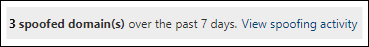

# <a name="spoof-intelligence-insight-in-eop"></a>Einblick in die Spoofintelligenz in EOP

[!INCLUDE [Microsoft 365 Defender rebranding](../includes/microsoft-defender-for-office.md)]

**Gilt für**
- [Exchange Online Protection](exchange-online-protection-overview.md)
- [Microsoft Defender für Office 365 Plan 1 und Plan 2](defender-for-office-365.md)
- [Microsoft 365 Defender](../defender/microsoft-365-defender.md)

> [!NOTE]
> Die in diesem Artikel beschriebenen Features befinden sich in der Vorschau, können geändert werden und sind nicht in allen Organisationen verfügbar. Wenn Ihre Organisation nicht über die in diesem Artikel beschriebenen Funktionen verfügt, lesen Sie die ältere Spoofverwaltungserfahrung unter [Verwalten von gefälschten Absendern mithilfe der Spoofintelligenz-Richtlinie und des Einblicks in die Spoofintelligenz in EOP.](walkthrough-spoof-intelligence-insight.md)

In Microsoft 365 Organisationen mit Postfächern in Exchange Online oder EOP-Organisationen (Standalone Exchange Online Protection) ohne Exchange Online Postfächer werden eingehende E-Mail-Nachrichten automatisch vor Spoofing geschützt. EOP verwendet **Spoofintelligenz** als Teil des allgemeinen Schutzes Ihrer Organisation gegen Phishing. Weitere Informationen finden Sie unter [Antispoofingschutz in EOP.](anti-spoofing-protection.md)

Wenn ein Absender eine E-Mail-Adresse spooft, scheint er ein Benutzer in einer der Domänen Ihrer Organisation oder ein Benutzer in einer externen Domäne zu sein, die E-Mails an Ihre Organisation sendet. Angreifer, die Absender zum Senden von Spam- oder Phishing-E-Mails spoofen, müssen blockiert werden. Es gibt jedoch Szenarien, in denen seriöse Absender Spoofing ausführen. Beispiel:

- Legitime Szenarien für spoofing interne Domänen:
  - Absender von Drittanbietern verwenden Ihre Domäne, um Massen-E-Mails für Unternehmensumfragen an Ihre eigenen Mitarbeiter zu senden.
  - Ein externes Unternehmen generiert und sendet Werbung oder Produktupdates in Ihrem Auftrag.
  - Ein Assistent muss regelmäßig E-Mails für eine andere Person in Ihrer Organisation senden.
  - Eine interne Anwendung sendet E-Mail-Benachrichtigungen.

- Legitime Szenarien für spoofing externe Domänen:
  - Der Absender befindet sich in einer Mailingliste (auch als Diskussionsliste bezeichnet), und die Mailingliste leitet E-Mails vom ursprünglichen Absender an alle Teilnehmer in der Mailingliste weiter.
  - Ein externes Unternehmen sendet E-Mails im Auftrag eines anderen Unternehmens (z. B. einen automatisierten Bericht oder ein Software-as-a-Service-Unternehmen).

Sie können den Einblick in die **Spoofintelligenz** im Microsoft 365 Defender Portal verwenden, um gefälschte Absender schnell zu identifizieren, die Ihnen legitimerweise nicht authentifizierte E-Mails senden (Nachrichten von Domänen, die keine SPF-, DKIM- oder DMARC-Prüfungen bestehen) und diese Absender manuell zuzulassen.

Indem Sie bekannten Absendern erlauben, gefälschte Nachrichten von bekannten Speicherorten zu senden, können Sie falsch positive Ergebnisse reduzieren (gute E-Mails werden als "schlecht" markiert). Durch die Überwachung der zulässigen gefälschten Absender stellen Sie eine zusätzliche Sicherheitsebene bereit, um zu verhindern, dass unsichere Nachrichten in Ihrer Organisation eintreffen.

Ebenso können Sie gefälschte Absender überprüfen, die durch Spoofintelligenz zugelassen wurden, und diese Absender manuell am Spoofintelligenz-Einblick blockieren.

Im restlichen Teil dieses Artikels wird erläutert, wie Sie den Einblick in die Spoofintelligenz im Microsoft 365 Defender-Portal und in PowerShell verwenden (Exchange Online PowerShell für Microsoft 365 Organisationen mit Postfächern in Exchange Online; eigenständige EOP PowerShell für Organisationen ohne Exchange Online Postfächer).

> [!NOTE]
>
> - Im Einblick in die Spoofintelligenz werden nur gefälschte Absender angezeigt, die von der Spoofintelligenz erkannt wurden. Wenn Sie die Zulassungs- oder Blockbewertung in der Einblicke außer Kraft setzen, wird der gefälschte Absender zu einem manuellen Zulassungs- oder Blockierungseintrag, der nur auf der Registerkarte **"Spoof"** in der Mandanten-Zulassungs-/Sperrliste angezeigt wird. Sie können auch manuell Zulassungseinträge für gefälschte Absender erstellen oder blockieren, bevor sie von der Spoofintelligenz erkannt werden. Weitere Informationen finden Sie unter [Verwalten der Mandantenzulassungsliste/ -sperrliste in EOP](tenant-allow-block-list.md).
>
> - Der Einblick in die Spoofintelligenz und die Registerkarte **"Spoofing"** in der Liste "Mandanten zulassen/blockieren" ersetzen die Funktionalität der Spoofintelligenz-Richtlinie, die auf der Seite "Antispamrichtlinie" im Security & Compliance Center verfügbar war.
>
>- Der Einblick in die Spoofintelligenz zeigt Daten im Wert von 7 Tagen an. Das Cmdlet **"Get-SpoofIntelligenceInsight"** zeigt Daten im Wert von 30 Tagen an.

## <a name="what-do-you-need-to-know-before-you-begin"></a>Was sollten Sie wissen, bevor Sie beginnen?

- Sie öffnen das Microsoft 365 Defender-Portal unter <https://security.microsoft.com/>. Um direkt zur **Antiphishingseite** zu wechseln, verwenden Sie <https://security.microsoft.com/antiphishing> . Verwenden Sie zum direkten Aufrufen der Einblicksseite für **spoofintelligenz** <https://security.microsoft.com/spoofintelligence> .

- Wie Sie eine Verbindung mit Exchange Online PowerShell herstellen, finden Sie unter [Herstellen einer Verbindung mit Exchange Online PowerShell](/powershell/exchange/connect-to-exchange-online-powershell). Informationen zum Herstellen einer Verbindung mit dem eigenständigen Exchange Online Protection PowerShell finden Sie unter [Verbinden mit PowerShell in Exchange Online Protection](/powershell/exchange/connect-to-exchange-online-protection-powershell).

- Sie müssen in **Exchange Online** Berechtigungen erhalten, bevor Sie die in diesem Artikel beschriebenen Schritte ausführen können:
  - Um die Spoofintelligenz-Richtlinie zu ändern oder Spoofintelligenz zu aktivieren oder zu deaktivieren, müssen Sie Mitglied der Rollengruppen **"Organisationsverwaltung"** oder **"Sicherheitsadministrator"** sein.
  - Für den schreibgeschützten Zugriff auf die Spoof Intelligence-Richtlinie müssen Sie Mitglied der Rollengruppe **"Globaler Leser"** oder **"Sicherheitsleseberechtigter"** sein.

  Weitere Informationen finden Sie unter [Berechtigungen in Exchange Online](/exchange/permissions-exo/permissions-exo).

  > [!NOTE]
  > - Durch das Hinzufügen von Benutzern zur entsprechenden Azure Active Directory-Rolle im Microsoft 365 Admin Center erhalten Benutzer die erforderlichen Berechtigungen _und_ Berechtigungen für andere Features in Microsoft 365. Weitere Informationen finden Sie unter [Informationen zu Administratorrollen](../../admin/add-users/about-admin-roles.md).
  > - Die Rollengruppe **Organisationsverwaltung mit Leserechten** in [Exchange Online](/Exchange/permissions-exo/permissions-exo#role-groups) ermöglicht auch einen schreibgeschützten Zugriff auf das Feature.

- Sie aktivieren und deaktivieren Spoofintelligenz in Antiphishingrichtlinien in EOP und Microsoft Defender für Office 365. Spoofintelligenz ist standardmäßig aktiviert. Weitere Informationen finden Sie unter [Konfigurieren von Antiphishingrichtlinien in EOP](configure-anti-phishing-policies-eop.md) oder [Konfigurieren von Antiphishingrichtlinien in Microsoft Defender für Office 365.](configure-mdo-anti-phishing-policies.md)

- Unsere empfohlenen Einstellungen für Spoofintelligenz finden Sie unter [EOP Antiphishing-Richtlinieneinstellungen.](recommended-settings-for-eop-and-office365-atp.md#eop-anti-phishing-policy-settings)

## <a name="open-the-spoof-intelligence-insight-in-the-microsoft-365-defender-portal"></a>Öffnen Des Einblicks in die Spoofintelligenz im Microsoft 365 Defender Portal

1. Wechseln Sie im portal Microsoft 365 Defender zu **E-Mail-&** \> **Zusammenarbeitsrichtlinien &** \> **Regel-Bedrohungsrichtlinien** Seite \> **Mandanten-Zulassungs-/Sperrlisten.**

2. Auf der Seite **"Mandanten-Zulassungs-/Sperrlisten"** sieht der Einblick in die Spoofintelligenz wie folgt aus:

   

   Der Einblick hat zwei Modi:

   - **Insight-Modus:** Wenn Spoofintelligenz aktiviert ist, zeigt ihnen der Einblick, wie viele Nachrichten in den letzten sieben Tagen von der Spoofintelligenz erkannt wurden.
   - **Was wäre, wenn der Modus**: Wenn die Spoofintelligenz deaktiviert ist, zeigt der Einblick, wie viele Nachrichten in den letzten sieben Tagen durch Spoofintelligenz erkannt worden *wären.*

Klicken Sie zum Anzeigen von Informationen zu den Erkennungen der Spoofintelligenz auf **"Spoofing-Aktivität** anzeigen" im Einblick in die Spoofintelligenz.

### <a name="view-information-about-spoofed-messages"></a>Anzeigen von Informationen zu gefälschten Nachrichten

> [!NOTE]
> Denken Sie daran, dass nur gefälschte Absender, die von Spoofintelligenz erkannt wurden, auf dieser Seite angezeigt werden. Wenn Sie die Zulassungs- oder Blockbewertung in der Einblicke außer Kraft setzen, wird der gefälschte Absender zu einem manuellen Zulassungs- oder Blockierungseintrag, der nur auf der Registerkarte **"Spoof"** in der Mandanten-Zulassungs-/Sperrliste angezeigt wird.

Auf der Seite mit den Einblicken zur **Spoofintelligenz,** die angezeigt wird, nachdem Sie im Spoofintelligenz-Insight auf **"Spoofingaktivität anzeigen"** geklickt haben, enthält die Seite die folgenden Informationen:

- **Gefälschter Benutzer:** Die **Domäne** des gefälschten Benutzers, die im Feld **"Von"** in E-Mail-Clients angezeigt wird. Die Absenderadresse wird auch als `5322.From` Adresse bezeichnet.
- **Sendende Infrastruktur:** wird auch als _Infrastruktur_ bezeichnet. Die sendende Infrastruktur ist einer der folgenden Werte:
  - Die Domäne in einer reversen DNS-Suche (PTR-Eintrag) der IP-Adresse des Quell-E-Mail-Servers.
  - Wenn die Quell-IP-Adresse keinen PTR-Eintrag aufweist, wird die sendende Infrastruktur als \<source IP\> /24 identifiziert (z. B. 192.168.100.100/24).
- **Nachrichtenanzahl:** Die Anzahl der Nachrichten aus der Kombination aus der gefälschten Domäne _und_ der sendenden Infrastruktur an Ihre Organisation innerhalb der letzten 7 Tage.
- **Zuletzt angezeigt:** Das letzte Datum, an dem eine Nachricht von der sendenden Infrastruktur empfangen wurde, die die gefälschte Domäne enthält.
- **Spooftyp:** Einer der folgenden Werte:
  - **Intern:** Der gefälschte Absender befindet sich in einer Domäne, die zu Ihrer Organisation gehört (einer [akzeptierten Domäne).](/exchange/mail-flow-best-practices/manage-accepted-domains/manage-accepted-domains)
  - **Extern:** Der gefälschte Absender befindet sich in einer externen Domäne.
- **Aktion:** Dieser Wert ist **zulässig** oder **blockiert:**
  - **Zulässig:** Die Domäne hat die explizite E-Mail-Authentifizierung überprüft [SPF,](how-office-365-uses-spf-to-prevent-spoofing.md) [DKIM](use-dkim-to-validate-outbound-email.md)und [DMARC](use-dmarc-to-validate-email.md)). Die Domäne hat jedoch unsere impliziten E-Mail-Authentifizierungsprüfungen[(zusammengesetzte Authentifizierung)](email-validation-and-authentication.md#composite-authentication)bestanden. Daher wurde keine Antispoofingaktion für die Nachricht ausgeführt.
  - **Blockiert:** Nachrichten aus der Kombination aus der gefälschten Domäne _und_ der sendenden Infrastruktur werden durch Spoofintelligenz als "schlecht" gekennzeichnet. Die Aktion, die für gefälschte Nachrichten ausgeführt wird, wird durch die Standardmäßige Antiphishingrichtlinie oder benutzerdefinierte Antiphishingrichtlinien gesteuert (der Standardwert ist **"Nachricht in Junk-E-Mail-Ordner verschieben").** Weitere Informationen finden Sie unter [Konfigurieren von Antiphishingrichtlinien in Microsoft Defender für Office 365](configure-mdo-anti-phishing-policies.md).

Sie können auf ausgewählte Spaltenüberschriften klicken, um die Ergebnisse zu sortieren.

Zum Filtern der Ergebnisse stehen Ihnen die folgenden Optionen zur Verfügung:

- Klicken Sie auf die Schaltfläche **"Filtern".** Im angezeigten **Flyout "Filter"** können Sie die Ergebnisse filtern nach:
  - **Spooftyp**
  - **Action**
- Verwenden Sie das **Suchfeld,** um eine durch Kommas getrennte Liste mit gefälschten Domänenwerten einzugeben oder Infrastrukturwerte zu senden, um die Ergebnisse zu filtern.

### <a name="view-details-about-spoofed-messages"></a>Anzeigen von Details zu gefälschten Nachrichten

Wenn Sie einen Eintrag aus der Liste auswählen, wird ein Detail-Flyout mit den folgenden Informationen und Features angezeigt:

- **Spoofing** zulassen oder **Spoofing blockieren:** Wählen Sie einen dieser Werte aus, um die ursprüngliche Bewertung der Spoofintelligenz außer Kraft zu setzen und den Eintrag aus dem Einblick in die Spoofintelligenz in die Mandanten-Zulassungs-/Sperrliste als Zulassungs- oder Sperreintrag für Spoofing zu verschieben.
- Warum wir dies abgefangen haben.
- Was Sie tun müssen.
- Eine Domänenzusammenfassung, die die meisten der gleichen Informationen von der Hauptseite der Spoofintelligenz enthält.
- WhoIs-Daten über den Absender.
- Ein Link zum Öffnen des [Bedrohungs-Explorers,](threat-explorer.md) um weitere Details zum Absender anzuzeigen (Microsoft Defender für Office 365).
- Ähnliche Nachrichten, die wir in Ihrem Mandanten vom gleichen Absender gesehen haben.

### <a name="about-allowed-spoofed-senders"></a>Informationen zu zulässigen gefälschten Absendern

Ein zulässiger gefälschter Absender im Einblick in die Spoofintelligenz oder ein blockierter spoofed-Absender, den Sie manuell in **Spoofing zulassen** geändert haben, lässt nur Nachrichten aus der Kombination aus der gefälschten Domäne *und* der sendenden Infrastruktur zu. E-Mails aus der gefälschten Domäne werden nicht von einer Quelle zugelassen, und E-Mails von der sendenden Infrastruktur für eine Domäne werden nicht zugelassen.

Beispielsweise darf der folgende gefälschte Absender Spoofing ausführen:

- **Domäne:** gmail.com
- **Infrastruktur:** tms.mx.com

Nur E-Mails von diesem Domänen-/Sendeinfrastrukturpaar dürfen Spoofing ausführen. Andere Absender, die versuchen, gmail.com zu spoofen, sind nicht automatisch zulässig. Nachrichten von Absendern in anderen Domänen, die aus tms.mx.com stammen, werden weiterhin durch Spoofintelligenz überprüft und können blockiert werden.

## <a name="use-the-spoof-intelligence-insight-in-exchange-online-powershell-or-standalone-eop-powershell"></a>Verwenden des Einblicks in die Spoofintelligenz in Exchange Online PowerShell oder der eigenständigen EOP-PowerShell

In PowerShell verwenden Sie das Cmdlet **"Get-SpoofIntelligenceInsight",** um zulässige und blockierte Spoofing-Absender **anzuzeigen,** die von der Spoofintelligenz erkannt wurden. Um spoofierte Absender manuell zuzulassen oder zu blockieren, müssen Sie das Cmdlet **"New-TenantAllowBlockListSpoofItems"** verwenden. Weitere Informationen finden Sie unter [Verwenden von PowerShell zum Konfigurieren der Mandanten-Zulassungs-/Sperrliste.](tenant-allow-block-list.md#use-exchange-online-powershell-or-standalone-eop-powershell-to-configure-the-tenant-allowblock-list)

Führen Sie den folgenden Befehl aus, um die Informationen im Einblick in die Spoofintelligenz anzuzeigen:

```powershell
Get-SpoofIntelligenceInsight
```

Ausführliche Informationen zu Syntax und Parametern finden Sie unter ["Get-SpoofIntelligenceInsight".](/powershell/module/exchange/get-spoofintelligenceinsight)

## <a name="other-ways-to-manage-spoofing-and-phishing"></a>Weitere Möglichkeiten zum Verwalten von Spoofing und Phishing

Seien Sie vorsichtig mit Spoofing und Phishing-Schutz. Hier sind verwandte Möglichkeiten, um Absender zu überprüfen, die Ihre Domäne spoofen, und um zu verhindern, dass sie Ihre Organisation beschädigen:

- Überprüfen Sie den **Spoof-E-Mail-Bericht.** Sie können diesen Bericht häufig verwenden, um gefälschte Absender anzuzeigen und zu verwalten. Weitere Informationen finden Sie im [Bericht "Spooferkennungen".](view-email-security-reports.md#spoof-detections-report)

- Überprüfen Sie die Konfiguration des Sender Policy Framework (SPF). Eine kurze Einführung in SPF und seine schnelle Konfiguration finden Sie unter [Einrichten von SPF in Microsoft 365 zur Verhinderung von Spoofing](set-up-spf-in-office-365-to-help-prevent-spoofing.md). Ausführlichere Informationen zur Verwendung von SPF durch Office 365 oder zur Problembehandlung oder zu nicht standardmäßigen Bereitstellungen, z. B. Hybridbereitstellungen, finden Sie unter [How Office 365 uses Sender Policy Framework (SPF) to prevent spoofing](how-office-365-uses-spf-to-prevent-spoofing.md).

- Überprüfen Sie ihre DomainKeys Identified Mail (DKIM)-Konfiguration. Sie sollten DKIM zusätzlich zu SPF und DMARC verwenden, um zu verhindern, dass Angreifer Nachrichten senden, die so aussehen, als ob sie aus Ihrer Domäne stammen. Mit DKIM können Sie E-Mail-Nachrichten in der Kopfzeile der Nachricht eine digitale Signatur hinzufügen. Weitere Informationen finden Sie unter [Verwenden von DKIM zum Überprüfen ausgehender E-Mails, die von Ihrer benutzerdefinierten Domäne in Office 365 gesendet wurden.](use-dkim-to-validate-outbound-email.md)

- Überprüfen Sie Ihre dmarc-Konfiguration (Domain-based Message Authentication, Reporting, And Conformance). Die Implementierung von DMARC zusammen mit SPF und DKIM bietet zusätzlichen Schutz vor Spoofing- und Phishing-E-Mails. DMARC unterstützt die E-Mail-Systeme der Empfänger bei der Behandlung von Nachrichten, die von Ihrer Domäne gesendet wurden, jedoch die SPF- oder DKIM-Prüfungen nicht bestanden haben. Weitere Informationen finden Sie unter Verwenden von DMARC zum Überprüfen von [E-Mails in Office 365.](use-dmarc-to-validate-email.md)
