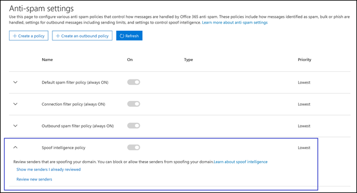

# <a name="configure-spoof-intelligence-in-eop"></a>Konfigurieren von Spoof Intelligence in EoP

[!INCLUDE [Microsoft 365 Defender rebranding](../includes/microsoft-defender-for-office.md)]


In Microsoft 365-Organisationen mit Postfächern in Exchange Online-oder eigenständigen Exchange Online Schutzorganisationen (EoP) ohne Exchange Online Postfächer werden eingehende e-Mail-Nachrichten automatisch ab Oktober 2018 vor Spoofing durch EoP geschützt. EoP verwendet Spoof Intelligence als Teil der gesamten Verteidigung ihrer Organisation gegen Phishing. Weitere Informationen finden Sie unter [Anti-Spoofing-Schutz in EoP](anti-spoofing-protection.md).

Wenn ein Absender eine e-Mail-Adresse spooft, scheinen Sie ein Benutzer in einer ihrer Organisationsdomänen oder ein Benutzer in einer externen Domäne zu sein, der e-Mails an Ihre Organisation sendet. Angreifer, die Absender zum Senden von Spam-oder Phishing-e-Mails Spoofing, müssen blockiert werden. Es gibt jedoch Szenarien, in denen legitime Absender Spoofing durchsetzen. Beispiel:

- Legitime Szenarien für Spoofing interner Domänen:

  - Absender von Drittanbietern verwenden Ihre Domäne, um Massen-e-Mails an Ihre eigenen Mitarbeiter für Unternehmensumfragen zu senden.
  - Ein externes Unternehmen generiert und sendet Werbungs-oder Produktaktualisierungen in Ihrem Auftrag.
  - Ein Assistent muss regelmäßig e-Mails für eine andere Person in Ihrer Organisation senden.
  - Eine interne Anwendung sendet e-Mail-Benachrichtigungen.

- Legitime Szenarien für Spoofing externer Domänen:

  - Der Absender befindet sich auf einer Mailingliste (wird auch als Diskussionsliste bezeichnet), und die Mailingliste leitet e-Mails vom ursprünglichen Absender an alle Teilnehmer der Mailingliste weiter.
  - Ein externes Unternehmen sendet e-Mails im Auftrag eines anderen Unternehmens (beispielsweiseeines automatisierten Berichts oder eines Software-as-a-Service-Unternehmens).

Spoof Intelligence und speziell die standardmäßige Spoof Intelligence-Richtlinie gewährleisten, dass die gefälschten e-Mail-Nachrichten, die von legitimen Absendern gesendet werden, nicht in EoP-Spamfiltern oder externen e-Mail-Systemen erfasst werden, während Ihre Benutzer vor Spam-oder Phishing-Angriffen geschützt werden.

Sie können Spoof Intelligence im Security & Compliance Center oder in PowerShell (Exchange Online PowerShell für Microsoft 365-Organisationen mit Postfächern in Exchange Online; eigenständige EoP PowerShell für Organisationen ohne Exchange Online Postfächer) verwalten.

## <a name="what-do-you-need-to-know-before-you-begin"></a>Was sollten Sie wissen, bevor Sie beginnen?

- Sie öffnen das Security & Compliance Center unter <https://protection.office.com/>. Um direkt zur Seite **Antispameinstellungen** zu wechseln, verwenden Sie <https://protection.office.com/antispam>. Wenn Sie direkt zur Seite **Anti-Phishing** wechseln möchten, verwenden Sie <https://protection.office.com/antiphishing> .

- Wie Sie eine Verbindung mit Exchange Online PowerShell herstellen, finden Sie unter [Herstellen einer Verbindung mit Exchange Online PowerShell](https://docs.microsoft.com/powershell/exchange/connect-to-exchange-online-powershell). Informationen zum Herstellen einer Verbindung mit dem eigenständigen Exchange Online Protection PowerShell finden Sie unter [Verbinden mit PowerShell in Exchange Online Protection](https://docs.microsoft.com/powershell/exchange/connect-to-exchange-online-protection-powershell).

- Bevor Sie die Verfahren in diesem Artikel ausführen können, müssen Ihnen im Security & Compliance Center Berechtigungen zugewiesen werden.
  - Um die Spoof Intelligence-Richtlinie zu ändern oder Spoof Intelligence zu aktivieren oder zu deaktivieren, müssen Sie Mitglied der Rollengruppen " **Organisationsverwaltung** " oder " **Sicherheits Administrator** " sein.
  - Für den schreibgeschützten Zugriff auf die Spoof Intelligence-Richtlinie müssen Sie ein Mitglied der Rollengruppen " **globaler Leser** " oder " **Sicherheits Leser** " sein.

  Weitere Informationen finden Sie unter [Berechtigungen im Security & Compliance Center](permissions-in-the-security-and-compliance-center.md).

  **Hinweise**:

  - Durch das Hinzufügen von Benutzern zur entsprechenden Azure Active Directory-Rolle im Microsoft 365 Admin Center erhalten Benutzer die erforderlichen Berechtigungen im Security & Compliance Center _und_ Berechtigungen für andere Features in Microsoft 365. Weitere Informationen finden Sie unter [Informationen zu Administratorrollen](https://docs.microsoft.com/microsoft-365/admin/add-users/about-admin-roles).
  - Die Rollengruppe **Organisationsverwaltung mit Leserechten** in [Exchange Online](https://docs.microsoft.com/Exchange/permissions-exo/permissions-exo#role-groups) ermöglicht auch einen schreibgeschützten Zugriff auf das Feature.

- Unsere empfohlenen Einstellungen für Spoof Intelligence finden Sie unter [EoP default Anti-Phishing Policy Settings](recommended-settings-for-eop-and-office365-atp.md#eop-default-anti-phishing-policy-settings).

## <a name="use-the-security--compliance-center-to-manage-spoofed-senders"></a>Verwenden des Security & Compliance Center zum Verwalten von gefälschten Absendern

> [!NOTE]
> Wenn Sie ein Microsoft 365 Enterprise E5-Abonnement haben oder ein Microsoft Defender separat für Office 365-Add-on erworben haben, können Sie auch Absender verwalten, die Ihre Domäne durch [Spoofing Intelligence Insight](walkthrough-spoof-intelligence-insight.md)manipulieren.

1. Navigieren Sie im Security & Compliance Center zu **Bedrohungsmanagement** \> **Richtlinie** \> **Antispam**.

2. Klicken Sie auf der Seite **Anti-Spam-Einstellungen** auf  , um **Spoof Intelligence Policy** zu erweitern.

   

3. Wählen Sie eine der folgenden Optionen aus:

   - **Überprüfen neuer Absender**
   - **Mir bereits überprüfte Absender anzeigen**

4. Wählen Sie im Feld entscheiden Sie, ob diese Absender das geöffnete Flyout des **Benutzers spoofen dürfen** , eine der folgenden Registerkarten aus:

   - **Ihre Domänen**: Absender Spoofing-Benutzer in ihren internen Domänen.
   - **Externe Domänen**: Absender Spoofing-Benutzer in externen Domänen.

5. Klicken Sie  in der Spalte **zulässig als spoof?** auf Symbol erweitern. Wählen Sie **Ja** aus, um den gefälschten Absender zuzulassen, oder wählen Sie **Nein** aus, um die Nachricht als gefälscht zu markieren. Die Aktion wird von der standardmäßigen Anti-Phishing-Richtlinie oder von benutzerdefinierten Anti-Phishing-Richtlinien gesteuert (der Standardwert ist **"Nachricht in Junk-e-Mail-Ordner"**). Weitere Informationen finden Sie unter [Spoof Settings in Anti-Phishing Policies](set-up-anti-phishing-policies.md#spoof-settings).

   

   Die Spalten und Werte, die angezeigt werden, werden in der folgenden Liste erläutert:

   - **Spoofed User**: das Benutzerkonto, das gefälscht wird. Dies ist der Absender der Nachricht in der von-Adresse (auch als `5322.From` Adresse bezeichnet), die in e-Mail-Clients angezeigt wird. Die Gültigkeit dieser Adresse wird von SPF nicht überprüft.

     - Auf der Registerkarte **Ihre Domänen** enthält der Wert eine einzelne e-Mail-Adresse, oder wenn der Quell-e-Mail-Server mehrere Benutzerkonten fälscht, enthält er **mehr als einen**.

     - Auf der Registerkarte **externe Domänen** enthält der Wert die Domäne des gefälschten Benutzers und nicht die vollständige e-Mail-Adresse.

   - **Sendeinfrastruktur**: die Domäne, die in einer Reverse-DNS-Suche (PTR-Eintrag) der IP-Adresse des Quell-e-Mail-Servers gefunden wurde. Wenn die Quell-IP-Adresse keinen PTR-Eintrag aufweist, wird die sendende Infrastruktur als \<source IP\> /24 identifiziert (beispielsweise 192.168.100.100/24).

     Weitere Informationen zu Nachrichtenquellen und Nachrichten Absendern finden Sie unter [Übersicht über Standards für e-Mail-Nachrichten](how-office-365-validates-the-from-address.md#an-overview-of-email-message-standards).

   - Anzahl von **Nachrichten**: die Anzahl der Nachrichten von der sendenden Infrastruktur an Ihre Organisation, die die angegebenen gefälschten Absender oder Absender innerhalb der letzten 30 Tage enthalten.

   - **Anzahl von Benutzer Reklamationen**: Beschwerden, die von Ihren Benutzern in den letzten 30 Tagen gegen diesen Absender eingereicht wurden. Beschwerden sind in der Regel in Form von Junk-Übermittlungen an Microsoft.

   - **Authentifizierungsergebnis**: einer der folgenden Werte:
      - **Übergeben**: der Absender hat Absender-e-Mail-Authentifizierungsprüfungen (SPF oder DKIM) übergeben.
      - **Fehler**: Fehler beim Absender Authentifizierungsüberprüfung bei EoP.
      - **Unbekannt**: das Ergebnis dieser Prüfungen ist nicht bekannt.

   - **Entscheidung festgelegt von**: zeigt an, wer ermittelt hat, ob die sendende Infrastruktur den Benutzer Spoofing erlaubt:
       - **Spoof Intelligence Policy** (automatisch)
       - **Admin** (manuell)

   - **Zuletzt gesehen**: das letzte Datum, an dem eine Nachricht von der sendenden Infrastruktur empfangen wurde, die den gefälschten Benutzer enthält.

   - **Spoofing erlaubt?**: die Werte, die Sie hier sehen, sind:
     - **Yes**: Nachrichten aus der Kombination von Spoofing-Benutzer und sendender Infrastruktur sind zulässig und werden nicht als gefälschte e-Mails behandelt.
     - **No**: Nachrichten aus der Kombination von Spoofing-Benutzer und-Sendeinfrastruktur werden als gefälscht gekennzeichnet. Die Aktion wird von der standardmäßigen Anti-Phishing-Richtlinie oder von benutzerdefinierten Anti-Phishing-Richtlinien gesteuert (der Standardwert ist **"Nachricht in Junk-e-Mail-Ordner"**). Weitere Informationen finden Sie im nächsten Abschnitt.

     - **Einige Benutzer** (nur die Registerkarte "**Domains** "): eine sendende Infrastruktur Spoofing mehrere Benutzer, bei denen einige gefälschte Benutzer zulässig sind und andere nicht. Verwenden Sie die **detaillierte** Registerkarte, um die spezifischen Adressen anzuzeigen.

6. Klicken Sie unten auf der Seite auf **Speichern**.

## <a name="use-powershell-to-manage-spoofed-senders"></a>Verwenden von PowerShell zum Verwalten von gefälschten Absendern

Verwenden Sie die folgende Syntax, um zugelassene und blockierte Absender in Spoof Intelligence anzuzeigen:

```powershell
Get-PhishFilterPolicy [-AllowedToSpoof <Yes | No | Partial>] [-ConfidenceLevel <Low | High>] [-DecisionBy <Admin | SpoofProtection>] [-Detailed] [-SpoofType <Internal | External>]
```

In diesem Beispiel werden detaillierte Informationen zu allen Absendern zurückgegeben, die Benutzer in ihren Domänen spoofen dürfen.

```powershell
Get-PhishFilterPolicy -AllowedToSpoof Yes -Detailed -SpoofType Internal
```

Ausführliche Informationen zu Syntax und Parametern finden Sie unter [Get-PhishFilterPolicy](https://docs.microsoft.com/powershell/module/exchange/get-phishfilterpolicy).

Führen Sie die folgenden Schritte aus, um zugelassene und blockierte Absender in Spoof Intelligence zu konfigurieren:

1. Erfassen Sie die aktuelle Liste der erkannten gefälschten Absender, indem Sie die Ausgabe des Cmdlets **Get-PhishFilterPolicy** in eine CSV-Datei schreiben:

   ```powershell
   Get-PhishFilterPolicy -Detailed | Export-CSV "C:\My Documents\Spoofed Senders.csv"
   ```

2. Bearbeiten Sie die CSV-Datei, um die Werte **SpoofedUser** (e-Mail-Adresse) und **AllowedToSpoof** (ja oder Nein) hinzuzufügen oder zu ändern. Speichern Sie die Datei, lesen Sie die Datei, und speichern Sie den Inhalt als Variable mit dem Namen `$UpdateSpoofedSenders` :

   ```powershell
   $UpdateSpoofedSenders = Get-Content -Raw "C:\My Documents\Spoofed Senders.csv"
   ```

3. Verwenden Sie die- `$UpdateSpoofedSenders` Variable, um die Spoof Intelligence-Richtlinie zu konfigurieren:

   ```powershell
   Set-PhishFilterPolicy -Identity Default -SpoofAllowBlockList $UpdateSpoofedSenders
   ```

Ausführliche Informationen zu Syntax und Parametern finden Sie unter [Sets-PhishFilterPolicy](https://docs.microsoft.com/powershell/module/exchange/set-phishfilterpolicy).

## <a name="use-the-security--compliance-center-to-configure-spoof-intelligence"></a>Konfigurieren von Spoof Intelligence mithilfe des Security & Compliance Center

Die Konfigurationsoptionen für Spoof Intelligence werden unter [Spoof Settings in Anti-Phishing Policies](set-up-anti-phishing-policies.md#spoof-settings)beschrieben.

Sie können Spoof Intelligence-Einstellungen in der standardmäßigen Anti-Phishing-Richtlinie und auch in benutzerdefinierten Richtlinien konfigurieren. Anweisungen basierend auf Ihrem Abonnement finden Sie in einem der folgenden Themen:

- [Konfigurieren von Anti-Phishing-Richtlinien in EoP](configure-anti-phishing-policies-eop.md).

- [Konfigurieren von Anti-Phishing-Richtlinien in Microsoft Defender für Office 365](configure-atp-anti-phishing-policies.md).

## <a name="how-do-you-know-these-procedures-worked"></a>Wie können Sie feststellen, dass diese Verfahren erfolgreich waren?

Führen Sie einen der folgenden Schritte aus, um zu überprüfen, ob Sie Spoof Intelligence mit Absendern konfiguriert haben, die zulässig sind und nicht gefälscht werden dürfen und dass Sie die Spoof Intelligence-Einstellungen konfiguriert haben:

- Wechseln Sie im Security & Compliance Center zu **Threat Management** \> **Policy** \> **Anti-Spam** \> Erweitern Sie **Spoof Intelligence Policy** \> Select **Show Me Senders I bereits überprüft** \> Wählen Sie die Registerkarte **Domänen** oder **externe Domänen** aus, und überprüfen Sie die **Berechtigung zum Spoofing?** Wert für den Absender.

- Führen Sie in PowerShell die folgenden Befehle aus, um die Absender anzuzeigen, die zulässig sind und nicht Spoofing zulässig sind:

  ```powershell
  Get-PhishFilterPolicy -AllowedToSpoof Yes -SpoofType Internal
  Get-PhishFilterPolicy -AllowedToSpoof No -SpoofType Internal
  Get-PhishFilterPolicy -AllowedToSpoof Yes -SpoofType External
  Get-PhishFilterPolicy -AllowedToSpoof No -SpoofType External
  ```

- Führen Sie in PowerShell den folgenden Befehl aus, um die Liste aller gefälschten Absender in eine CSV-Datei zu exportieren:

   ```powershell
   Get-PhishFilterPolicy -Detailed | Export-CSV "C:\My Documents\Spoofed Senders.csv"
   ```

- Wechseln Sie im Security & Compliance Center zu **Threat Management** \> **Policy** \> **Anti-Phishing** oder **ATP Anti-Phishing**, und führen Sie einen der folgenden Schritte aus:  

  - Wählen Sie eine Richtlinie aus der Liste aus. Überprüfen Sie im Flyout, das angezeigt wird, die Werte im **Spoof** -Abschnitt.
  - Klicken Sie auf **Standardrichtlinie**. Überprüfen Sie im Flyout, das angezeigt wird, die Werte im **Spoof** -Abschnitt.

- Ersetzen Sie in Exchange Online PowerShell \<Name\> durch Office365 AntiPhishing default oder den Namen einer benutzerdefinierten Richtlinie, und führen Sie den folgenden Befehl aus, um die Einstellungen zu überprüfen:

  ```PowerShell
  Get-AntiPhishPolicy -Identity "<Name>" | Format-List EnableAntiSpoofEnforcement,EnableUnauthenticatedSender,AuthenticationFailAction
  ```

## <a name="other-ways-to-manage-spoofing-and-phishing"></a>Andere Methoden zum Verwalten von Spoofing und Phishing

Sie sollten sich sorgfältig mit Spoofing und Phishing-Schutz bemühen. Im folgenden finden Sie ähnliche Möglichkeiten zum Überprüfen von Absendern, die Ihre Domäne Spoofing und dazu beitragen, dass Sie Ihre Organisation nicht schädigen:

- Überprüfen Sie den **Spoof-e-Mail-Bericht**. Sie können diesen Bericht häufig verwenden, um gefälschte Absender anzuzeigen und zu verwalten. Weitere Informationen finden Sie unter [Spoof Detections Report](view-email-security-reports.md#spoof-detections-report).

- Überprüfen Sie die SPF-Konfiguration (Sender Policy Framework). Eine kurze Einführung in SPF und seine schnelle Konfiguration finden Sie unter [Einrichten von SPF in Microsoft 365 zur Verhinderung von Spoofing](set-up-spf-in-office-365-to-help-prevent-spoofing.md). Ausführlichere Informationen zur Verwendung von SPF durch Office 365 oder zur Problembehandlung oder zu nicht standardmäßigen Bereitstellungen, z. B. Hybridbereitstellungen, finden Sie unter [How Office 365 uses Sender Policy Framework (SPF) to prevent spoofing](how-office-365-uses-spf-to-prevent-spoofing.md).

- Überprüfen Sie Ihre DomainKeys Identified Mail (DKIM)-Konfiguration. Sie sollten zusätzlich zu SPF und DMARC DKIM verwenden, um zu verhindern, dass Angreifer Nachrichten senden können, die so aussehen, wie Sie von Ihrer Domäne stammen. Mit DKIM können Sie E-Mail-Nachrichten in der Kopfzeile der Nachricht eine digitale Signatur hinzufügen. Weitere Informationen finden Sie unter [Verwenden von DKIM zum Überprüfen von ausgehenden e-Mails, die von Ihrer benutzerdefinierten Domäne in Office 365 gesendet wurden](use-dkim-to-validate-outbound-email.md).

- Überprüfen Sie die Konfiguration der domänenbasierten Nachrichtenauthentifizierung, Berichterstellung und Konformität (DMARC). Die Implementierung von DMARC zusammen mit SPF und DKIM bietet zusätzlichen Schutz vor Spoofing- und Phishing-E-Mails. DMARC unterstützt die E-Mail-Systeme der Empfänger bei der Behandlung von Nachrichten, die von Ihrer Domäne gesendet wurden, jedoch die SPF- oder DKIM-Prüfungen nicht bestanden haben. Weitere Informationen finden Sie unter [Verwenden von DMARC zum Überprüfen von e-Mails in Office 365](use-dmarc-to-validate-email.md).
