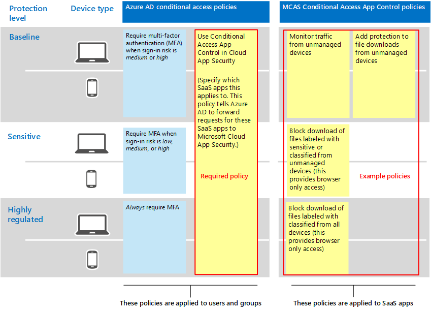

# Empfohlene Microsoft Cloud App Security-Richtlinien für SaaS-AppsRecommended Microsoft Cloud App Security policies for SaaS apps
Microsoft Cloud App Security baut auf Azure AD-Richtlinien für bedingten Zugriff auf, um die Echtzeitüberwachung und Steuerung präziser Aktionen mit SaaS-Apps zu ermöglichen, z. B. das Blockieren von Downloads, Uploads, Kopieren und Einfügen und Drucken.Microsoft Cloud App Security builds on Azure AD conditional access policies to enable real-time monitoring and control of granular actions with SaaS apps, such as blocking downloads, uploads, copy and paste, and printing. Dieses Feature fügt Sitzungen, die ein inhärentes Risiko darstellen, Sicherheit hinzu, z. B. wenn auf Unternehmensressourcen von nicht verwalteten Geräten oder von Gastbenutzern zugegriffen wird.This feature adds security to sessions that carry inherent risk, such as when corporate resources are accessed from unmanaged devices or by guest users. 

Microsoft Cloud App Security integriert sich auch systemeigener Weise in Microsoft Information Protection und bietet Eine Echtzeit-Inhaltsprüfung, um vertrauliche Daten basierend auf vertraulichen Informationstypen und Vertraulichkeitsbezeichnungen zu finden und geeignete Maßnahmen zu ergreifen.Microsoft Cloud App Security also integrates natively with Microsoft Information Protection, providing real-time content inspection to find sensitive data based on sensitive information types and sensitivity labels and to take appropriate action. 

Diese Anleitung enthält Empfehlungen für die folgenden Szenarien:This guidance includes recommendations for these scenarios:
- Hinzufügen von SaaS-Apps in die IT-VerwaltungBring SaaS apps into IT management
- Optimieren des Schutzes für bestimmte SaaS-AppsTune protection for specific SaaS apps
- Konfigurieren der Verhinderung von Datenverlust (Data Loss Prevention, DLP) zur Einhaltung von DatenschutzbestimmungenConfigure data loss prevention (DLP) to help comply with data protection regulations

## Hinzufügen von SaaS-Apps in die IT-VerwaltungBring SaaS apps into IT management

Der erste Schritt bei der Verwendung von Microsoft Cloud App Security zum Verwalten von SaaS-Apps besteht im Ermitteln und anschließenden Hinzufügen zu Ihrem Azure AD-Mandanten.The first step in using Microsoft Cloud App Security to manage SaaS apps is to discover these and then add them to your Azure AD tenant. Wenn Sie Hilfe bei der Ermittlung benötigen, lesen [Sie Entdecken und Verwalten von SaaS-Apps in Ihrem Netzwerk.](https://docs.microsoft.com/cloud-app-security/tutorial-shadow-it)If you need help with discovery, see [Discover and manage SaaS apps in your network](https://docs.microsoft.com/cloud-app-security/tutorial-shadow-it). Nachdem Sie Apps entdeckt haben, [fügen Sie diese ihrem Azure AD-Mandanten hinzu.](https://docs.microsoft.com/azure/active-directory/manage-apps/add-application-portal)After you've discovered apps, [add these to your Azure AD tenant](https://docs.microsoft.com/azure/active-directory/manage-apps/add-application-portal).  

Sie können damit beginnen, diese zu verwalten, indem Sie die folgenden Schritte tun:You can begin to manage these by doing the following:
1. Erstellen Sie zunächst in Azure AD eine neue Richtlinie für bedingten Zugriff, und konfigurieren Sie sie so, dass sie "App-Steuerelement für bedingten Zugriff verwenden" verwendet wird.First, in Azure AD, create a new conditional access policy and configure it to "Use Conditional Access App Control." Dadurch wird die Anforderung an Cloud App Security umgeleitet.This redirects the request to Cloud App Security. Sie können eine Richtlinie erstellen und dieser Richtlinie alle SaaS-Apps hinzufügen.You can create one policy and add all SaaS apps to this policy.
1. Erstellen Sie als Nächstes in Cloud App Security Sitzungsrichtlinien.Next, in Cloud App Security, create session policies. Erstellen Sie eine Richtlinie für jedes Steuerelement, das Sie anwenden möchten.Create one policy for each control you want to apply. 

Berechtigungen für SaaS-Apps basieren in der Regel auf der geschäftlichen Notwendigkeit für den Zugriff auf die App.Permissions to SaaS apps are typically based on business need for access to the app. Diese Berechtigungen können sehr dynamisch sein.These permissions can be highly dynamic. Die Verwendung von Cloud App Security-Richtlinien stellt den Schutz von App-Daten sicher, unabhängig davon, ob Benutzer einer Azure AD-Gruppe zugewiesen sind, die dem basisbasierten, vertraulichen oder streng regulierten Schutz zugeordnet ist.Using Cloud App Security policies ensures protection to app data, regardless of whether users are assigned to an Azure AD group associated with baseline, sensitive, or highly regulated protection.

Zum Schutz von Daten in Ihrer gesamten Sammlung von SaaS-Apps veranschaulicht das folgende Diagramm die erforderliche Azure AD-Richtlinie für bedingten Zugriff sowie vorgeschlagene Richtlinien, die Sie in Cloud App Security erstellen können.To protect data across your collection of SaaS apps, the following diagram illustrates the necessary Azure AD conditional access policy plus suggested policies you can create in Cloud App Security. In diesem Beispiel gelten die in Cloud App Security erstellten Richtlinien für alle von Ihnen verwalteten SaaS-Apps.In this example, the policies created in Cloud App Security apply to all SaaS apps you are managing. Diese sollen geeignete Steuerelemente anwenden, die darauf basieren, ob Geräte verwaltet werden, sowie Vertraulichkeitsbezeichnungen, die bereits auf Dateien angewendet werden.These are designed to apply appropriate controls based on whether devices are managed as well as sensitivity labels that are already applied to files. 

 

In der folgenden Tabelle ist die neue Richtlinie für bedingten Zugriff aufgeführt, die Sie in Azure AD erstellen müssen.The following table lists the new conditional access policy you must create in Azure AD.

|SchutzebeneProtection level|RichtliniePolicy|Weitere InformationenMore information|
|---|---|---|
|Alle SchutzstufenAll protection levels | [Verwenden der App-Steuerung für bedingten Zugriff in Cloud App SecurityUse Conditional Access App Control in Cloud App Security](https://docs.microsoft.com/cloud-app-security/proxy-deployment-aad#configure-integration-with-azure-ad) |Dadurch wird Ihr IdP (Azure AD) für die Verwendung mit Cloud App Security konfiguriert.This configures your IdP (Azure AD) to work with Cloud App Security. |

In der nächsten Tabelle sind die oben dargestellten Beispielrichtlinien aufgeführt, die Sie zum Schutz aller SaaS-Apps erstellen können.This next table lists the example policies illustrated above that you can create to protect all SaaS apps. Achten Sie darauf, Ihre eigenen Geschäfts-, Sicherheits- und Complianceziele zu bewerten und dann Richtlinien zu erstellen, die den am besten geeigneten Schutz für Ihre Umgebung bieten.Be sure to evaluate your own business, security, and compliance objectives and then create policies that provide the most appropriate protection for your environment. 

|SchutzebeneProtection level|RichtliniePolicy|
|---|---|
|BaselineBaseline | Überwachen des Datenverkehrs von nicht verwalteten GerätenMonitor traffic from unmanaged devices  Hinzufügen von Schutz zu Dateidownloads von nicht verwalteten GerätenAdd protection to file downloads from unmanaged devices | 
|VertraulichSensitive  | Blockieren des Downloads von Dateien mit der Bezeichnung "vertraulich" oder "klassifiziert" von nicht verwalteten Geräten (dadurch wird nur Browserzugriff ermöglicht)Block download of files labeled with sensitive or classified from unmanaged devices (this provides browser only access)  | 
| Streng geregeltHighly regulated | Blockieren des Downloads von Dateien, die von allen Geräten mit der Bezeichnung klassifiziert sind (dies bietet nur Browserzugriff)Block download of files labeled with classified from all devices (this provides browser only access)  |   
|  |   |  

Eine End-to-End-Anleitung zum Einrichten der App-Steuerung für bedingten Zugriff finden Sie unter [Deploy Conditional Access App Control for featured apps](https://docs.microsoft.com/cloud-app-security/proxy-deployment-aad).For end-to-end instructions for setting up Conditional Access App Control, see [Deploy Conditional Access App Control for featured apps](https://docs.microsoft.com/cloud-app-security/proxy-deployment-aad). In diesem Artikel werden Sie durch den Prozess des Erstellens der erforderlichen Richtlinie für bedingten Zugriff in Azure AD und testen Ihrer SaaS-Apps erläutert.This article walks you through the process of creating the necessary conditional access policy in Azure AD and testing your SaaS apps.

Weitere Informationen finden Sie unter [Schützen von Apps mit Microsoft Cloud App Security Conditional Access App Control](https://docs.microsoft.com/cloud-app-security/proxy-intro-aad).For more information, see [Protect apps with Microsoft Cloud App Security Conditional Access App Control](https://docs.microsoft.com/cloud-app-security/proxy-intro-aad). 

## Optimieren des Schutzes für bestimmte SaaS-AppsTune protection for specific SaaS apps
Möglicherweise möchten Sie zusätzliche Überwachung und Steuerelemente auf bestimmte SaaS-Apps in Ihrer Umgebung anwenden.You might want to apply additional monitoring and controls to specific SaaS apps in your environment. Cloud App Security ermöglicht Ihnen dies.Cloud App Security allows you to accomplish this. Wenn beispielsweise eine App wie Box in Ihrer Umgebung stark verwendet wird, ist es sinnvoll, zusätzliche Steuerelemente anzuwenden.For example, if an app like Box is used heavily in your environment, it makes sense to apply additional controls. Wenn Ihre Rechts- oder Finanzabteilung eine bestimmte SaaS-App für vertrauliche Geschäftsdaten verwendet, können Sie diesen Apps zusätzlichen Schutz bieten.Or, if your legal or finance department is using a specific SaaS app for sensitive business data, you can target extra protection to these apps. 

Beispielsweise können Sie Ihre Box-Umgebung mit den folgenden Typen von integrierten Richtlinienvorlagen für die Erkennung von Anomalie schützen:For example, you can protect your Box environment with these types of built-in anomaly detection policy templates:
- Aktivität von anonymen IP-AdressenActivity from anonymous IP addresses
- Aktivität von seltenem LandActivity from infrequent country
- Aktivität von verdächtigen IP-AdressenActivity from suspicious IP addresses
- Unmöglicher OrtswechselImpossible travel
- Vom beendeten Benutzer ausgeführte Aktivität (erfordert AAD als IdP)Activity performed by terminated user (requires AAD as IdP)
- SchadsoftwareerkennungMalware detection
- Mehrere fehlgeschlagene AnmeldeversucheMultiple failed login attempts
- Ransomware-AktivitätRansomware activity
- Riskante Oauth-AppRisky Oauth App
- Ungewöhnliche DateifreigabeaktivitätUnusual file share activity

Dies sind Beispiele.These are examples. Weitere Richtlinienvorlagen werden regelmäßig hinzugefügt.Additional policy templates are added on a regular basis. Beispiele zum Anwenden eines zusätzlichen Schutzes auf bestimmte Apps finden Sie unter [Protecting connected apps](https://docs.microsoft.com/cloud-app-security/protect-connected-apps).For examples of how to apply additional protection to specific apps, see [Protecting connected apps](https://docs.microsoft.com/cloud-app-security/protect-connected-apps). 

[Wie Cloud App Security Ihre Box-Umgebung](https://docs.microsoft.com/cloud-app-security/protect-box) schützt, veranschaulicht die Arten von Steuerelementen, die Ihnen helfen können, Ihre Geschäftsdaten in Box und anderen Apps mit vertraulichen Daten zu schützen.[How Cloud App Security helps protect your Box environment](https://docs.microsoft.com/cloud-app-security/protect-box) demonstrates the types of controls that can help you protect your business data in Box and other apps with sensitive data.

## Konfigurieren der Verhinderung von Datenverlust (Data Loss Prevention, DLP) zur Einhaltung von DatenschutzbestimmungenConfigure data loss prevention (DLP) to help comply with data protection regulations

Cloud App Security kann ein wertvolles Tool zum Konfigurieren des Schutzes für Compliancebestimmungen sein.Cloud App Security can be a valuable tool for configuring protection for compliance regulations. In diesem Fall erstellen Sie bestimmte Richtlinien, um nach bestimmten Daten zu suchen, auf die eine Verordnung angewendet wird, und konfigurieren jede Richtlinie, um geeignete Maßnahmen zu ergreifen.In this case, you create specific policies to look for specific data that a regulation applies to and configure each policy to take appropriate action. 

Die folgende Abbildung und Tabelle enthält mehrere Beispiele für Richtlinien, die zur Einhaltung der DSGVO konfiguriert werden können.The following illustration and table provide several examples of policies that can be configured to help comply with  the General Data Protection Regulation (GDPR). In diesen Beispielen suchen Richtlinien nach bestimmten Daten.In these examples, policies look for specific data. Basierend auf der Vertraulichkeit der Daten ist jede Richtlinie so konfiguriert, dass sie geeignete Maßnahmen ergreifen kann.Based on the sensitivity of the data, each policy is configured to take appropriate action. 

|SchutzebeneProtection level|BeispielrichtlinienExample policies|
|:---------------|:-------|
| BaselineBaseline |Warnung, wenn Dateien mit diesem vertraulichen Informationstyp ("Kreditkartennummer") außerhalb der Organisation freigegeben werdenAlert when files containing this sensitive information type ("Credit Card Number") are shared outside the organization   Blockieren von Downloads von Dateien mit diesem vertraulichen Informationstyp ("Kreditkartennummer") auf nicht verwaltete GeräteBlock downloads of files containing this sensitive information type (”Credit card number") to unmanaged devices|
| VertraulichSensitive  | Schützen von Downloads von Dateien mit diesem vertraulichen Informationstyp ("Kreditkartennummer") auf verwaltete GeräteProtect downloads of files containing this sensitive information type ("Credit card number") to managed devices   Blockieren von Downloads von Dateien mit diesem vertraulichen Informationstyp ("Kreditkartennummer") auf nicht verwaltete GeräteBlock downloads of files containing this sensitive information type ("Credit card number") to unmanaged devices   Warnung, wenn eine Datei mit on dieser Bezeichnungen in OneDrive for Business oder Box hochgeladen wird (Kundendaten, Personalwesen: Gehaltsdaten,Personalwesen, Mitarbeiterdaten)Alert when a file with on of these labels is uploaded to OneDrive for Business or Box (Customer data, Human Resources: Salary Data,Human Resources, Employee data)|
| Streng geregeltHighly regulated |Warnung, wenn Dateien mit dieser Bezeichnung ("Hochgradig klassifiziert") auf verwaltete Geräte heruntergeladen werdenAlert when files with this label ("Highly classified") are downloaded to managed devices 
Blockieren von Downloads von Dateien mit dieser Bezeichnung ("Hochgradig klassifiziert") auf nicht verwaltete GeräteBlock downloads of files with this label ("Highly classified") to unmanaged devices |
| | |

## Nächste SchritteNext steps

Weitere Informationen zur Verwendung von Cloud App Security finden Sie in [der Microsoft Cloud App Security-Dokumentation](https://docs.microsoft.com//cloud-app-security/).For more information about using Cloud App Security, see [Microsoft Cloud App Security documentation](https://docs.microsoft.com//cloud-app-security/). 