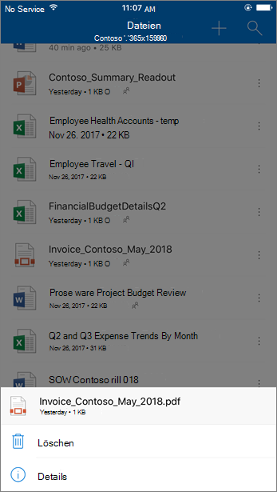

# Sichere Anlagen für SharePoint, OneDrive und Microsoft Teams

[!INCLUDE [Microsoft 365 Defender rebranding](../includes/microsoft-defender-for-office.md)]

**Gilt für**
- [Microsoft Defender für Office 365 Plan 1 und Plan 2](defender-for-office-365.md)
- [Microsoft 365 Defender](../defender/microsoft-365-defender.md)

Safe Anlagen für SharePoint, OneDrive und Microsoft Teams in [Microsoft Defender für Office 365](whats-new-in-defender-for-office-365.md) bieten eine zusätzliche Schutzebene für Dateien, die bereits zum Uploadzeitpunkt vom allgemeinen [Virenerkennungsmodul in Microsoft 365](virus-detection-in-spo.md)gescannt wurden. Safe Anlagen für SharePoint, OneDrive und Microsoft Teams helfen dabei, vorhandene Dateien zu erkennen und zu blockieren, die in Teamwebsites und Dokumentbibliotheken als bösartig erkannt und blockiert werden.

Safe Anlagen für SharePoint, OneDrive und Microsoft Teams sind nicht standardmäßig aktiviert. Informationen zum Aktivieren finden Sie unter [Aktivieren Safe Anlagen für SharePoint, OneDrive und Microsoft Teams.](turn-on-mdo-for-spo-odb-and-teams.md)

## Funktionsweise von Anlagen für SharePoint, OneDrive und Microsoft Teams Safe

Wenn Safe Anlagen für SharePoint, OneDrive und Microsoft Teams aktiviert ist und eine Datei als bösartig identifiziert, wird die Datei durch direkte Integration in die Dateispeicher gesperrt. Die folgende Abbildung zeigt ein Beispiel für eine in einer Bibliothek erkannten böswilligen Datei.

Obwohl die blockierte Datei weiterhin in der Dokumentbibliothek und in Web-, Mobil- oder Desktopanwendungen aufgeführt ist, können Benutzer die Datei nicht öffnen, kopieren, verschieben oder freigeben. Sie können die blockierte Datei jedoch löschen.

Hier ist ein Beispiel, wie eine blockierte Datei auf einem mobilen Gerät aussieht:

Standardmäßig können Benutzer eine blockierte Datei herunterladen. Das Herunterladen einer blockierten Datei sieht auf einem mobilen Gerät wie folgt aus:

SharePoint Onlineadministratoren können verhindern, dass Benutzer schädliche Dateien herunterladen. Anweisungen finden Sie unter [Verwenden von SharePoint Online PowerShell, um zu verhindern, dass Benutzer schädliche Dateien herunterladen.](turn-on-mdo-for-spo-odb-and-teams.md#step-2-recommended-use-sharepoint-online-powershell-to-prevent-users-from-downloading-malicious-files)

Weitere Informationen zur Benutzererfahrung, wenn eine Datei als bösartig erkannt wurde, finden Sie unter ["Was tun, wenn eine schädliche Datei in SharePoint Online, OneDrive oder Microsoft Teams gefunden wird."](https://support.microsoft.com/office/01e902ad-a903-4e0f-b093-1e1ac0c37ad2)

## Anzeigen von Informationen zu schädlichen Dateien, die von Safe Anlagen für SharePoint, OneDrive und Microsoft Teams erkannt wurden

Dateien, die von Safe Anlagen für SharePoint, OneDrive und Microsoft Teams als bösartig erkannt werden, werden in [Berichten für Microsoft Defender für Office 365](view-reports-for-mdo.md) und im Explorer [(und Echtzeiterkennungen)](threat-explorer.md)angezeigt.

Wenn eine Datei ab Mai 2018 von Safe Anlagen für SharePoint, OneDrive und Microsoft Teams als bösartig erkannt wird, ist die Datei auch in Quarantäne. Weitere Informationen finden Sie unter [Verwalten von isolierten Dateien in Defender für Office 365.](manage-quarantined-messages-and-files.md#use-the-microsoft-365-defender-portal-to-manage-quarantined-files-in-defender-for-office-365)

## Beachten Sie diese Punkte

- Defender für Office 365 überprüft nicht jede einzelne Datei in SharePoint Online, OneDrive for Business oder Microsoft Teams. Es handelt sich hierbei um ein beabsichtigtes Verhalten. Dateien werden asynchron gescannt. Der Prozess verwendet Freigabe- und Gastaktivitätsereignisse zusammen mit intelligenten Heuristiken und Bedrohungssignalen, um schädliche Dateien zu identifizieren.

- Stellen Sie sicher, dass Ihre SharePoint Websites für die Verwendung der [modernen Benutzeroberfläche](/sharepoint/guide-to-sharepoint-modern-experience)konfiguriert sind. Defender für Office 365 Schutz gilt unabhängig davon, ob die moderne oder die klassische Ansicht verwendet wird. Visuelle Indikatoren, die eine Datei blockiert, sind jedoch nur in der modernen Benutzeroberfläche verfügbar.

- Safe Anlagen für SharePoint, OneDrive und Microsoft Teams sind Teil der allgemeinen Bedrohungsschutzstrategie Ihrer Organisation, die den Antispam- und Antischadsoftwareschutz in Exchange Online Protection (EOP) sowie Safe Links und Safe Anlagen in Microsoft Defender für Office 365 umfasst. Weitere Informationen finden Sie unter ["Schutz vor Bedrohungen in Office 365."](protect-against-threats.md)
