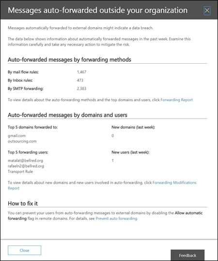

# Bericht über automatisch weitergeleitete Nachrichten

Der Bericht " **automatisch weitergeleitete Nachrichten** " im Nachrichtenfluss-Dashboard zeigt Informationen zu Nachrichten an, die von Ihrer Organisation automatisch an Empfänger in externen domänenweiter geleitet werden.

## Details zu automatisch weitergeleiteten Nachrichten

Wenn Sie auf die Anzahl der Nachrichten im Widget klicken, wird ein Flyout-Bereich angezeigt, der den automatisch weitergeleiteten Nachrichtenstatus anzeigt. Sie können die Details anzeigen, indem Sie auf den Link **Weiterleiten des Berichts** klicken.

## Insights

Basierend auf den Berichtsdaten werden zwei Erkenntnisse generiert: **neue Weiterleitungs Benutzer** und **neue Weiterleitungs Domänen**. Jede Insight enthält eine Zusammenfassung der Anzahl von neuen Weiterleitungen oder Domänen mit einem Link zum **neuen Weiterleitungs Bericht** , der ausführlichere Informationen zu den beiden Datentypen bereitstellt. Der **neue Weiterleitungs Bericht** zeigt auch eine Zeitachsenansicht der neuen Aktivität an, und die Details-Tabelle identifiziert, wer die Weiterleitung gestartet hat und zu welchen Domänen.

## Siehe auch

Weitere Informationen zu anderen e-Mail-Fluss-Einblicken im Nachrichtenfluss-Dashboard finden Sie unter [Mail Flow Insights in the Security & Compliance Center](mail-flow-insights-v2.md).
