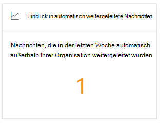
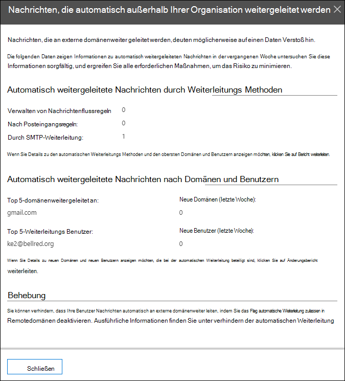

# Einblicke automatisch weitergeleiteter Nachrichten im Security & Compliance CenterAuto-forwarded messages insight in the Security & Compliance Center

Die automatisch **weitergeleiteten Nachrichten** Insight im [Nachrichtenfluss-Dashboard](mail-flow-insights-v2.md) im Security & Compliance Center zeigt Informationen zu Nachrichten an, die von Ihrer Organisation automatisch an Empfänger in externen domänenweiter geleitet werden.The **Auto-forwarded messages** insight in the [Mail flow dashboard](mail-flow-insights-v2.md) in the Security & Compliance Center displays information about messages that are automatically forwarded from your organization to recipients in external domains.

## Details zu automatisch weitergeleiteten NachrichtenAuto-forwarded messages details

Wenn Sie auf die Anzahl der Nachrichten im Widget klicken, wird ein Flyout-Bereich angezeigt, der weitere Informationen zu den automatisch weitergeleiteten Nachrichten zeigt:When you click the number of messages in the widget, a flyout pane appears that shows more information about the auto-forwarded messages:

- **Nachrichten werden nach Weiterleitungs Methoden automatisch weitergeleitet**:**Auto-forwarded messages by forwarding methods**:

  - **Nachrichtenfluss Regeln****By mail flow rules**
  - **Nach Posteingangsregeln****By Inbox rules**
  - **Durch SMTP-Weiterleitung****By SMTP forwarding**
  - Einen Link zum [Weiterleitungs Bericht](view-mail-flow-reports.md#forwarding-report) für weitere Details.A link to the [Forwarding report](view-mail-flow-reports.md#forwarding-report) for more details.

- **Automatisch weitergeleitete Nachrichten nach Domänen und Benutzern**:**Auto-forwarded messages by domains and users**:

  - **Top 5-domänenweiter geleitet an****Top 5 domains forwarded to**
  - **Neue Domänen (letzte Woche)****New domains (last week)**
  - **Die ersten 5 Weiterleitungs Benutzer****Top 5 forwarding users**
  - **Neue Benutzer (letzte Woche)****New users (last week)**
  - Einen Link zum [Weiterleitungs Änderungsbericht](mfi-new-users-forwarding-email.md#forwarding-modifications-report) für weitere Details.A link to the [Forwarding modifications report](mfi-new-users-forwarding-email.md#forwarding-modifications-report) for more details.

## InsightsInsights

Basierend auf den Berichtsdaten werden zwei Erkenntnisse generiert:Two insights are generated based on the report data:

- [Neue Benutzer, die e-Mails weiterleitenNew users forwarding email](mfi-new-users-forwarding-email.md)
- [Neue Domänen, die e-Mail weitergeleitet werdenNew domains being forwarded email](mfi-new-domains-being-forwarded-email.md)

## Weitere ArtikelSee also

Informationen zu weiteren Einblicken im Nachrichtenfluss-Dashboard finden Sie unter [Mail Flow Insights in the Security & Compliance Center](mail-flow-insights-v2.md).For information about other insights in the Mail flow dashboard, see [Mail flow insights in the Security & Compliance Center](mail-flow-insights-v2.md).
