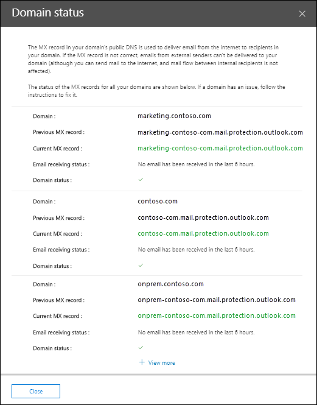

# Top-Domain-Nachrichtenflussstatus Einblicke im Security & Compliance CenterTop domain mail flow status insight in the Security & Compliance Center

[!INCLUDE [Microsoft 365 Defender rebranding](../includes/microsoft-defender-for-office.md)]

Der **Nachrichtenflussstatus "Top Domain"** im [Nachrichten](mail-flow-insights-v2.md) Fluss-Dashboard im [Security & Compliance Center](https://protection.office.com) gibt Ihnen den aktuellen Status für die Domänen Ihrer Organisation im Hinblick auf den Nachrichtenfluss.The **Top domain mail flow status** insight in the [Mail flow dashboard](mail-flow-insights-v2.md) in the [Security & Compliance Center](https://protection.office.com) gives you the current status for your organization's domains in terms of mail flow. Diese Einblicke helfen Ihnen bei der Identifizierung und Problembehandlung von Domänen, die sich auf Probleme mit dem ***e-Mail-Fluss auswirken*** (beispielsweise kann keine externe e-Mail empfangen werden), vor allem Domänen Ablauf oder Domänen mit falschen MX-Einträgen.This insight helps you identify and troubleshoot domains that are experiencing ***mail flow impacting*** issues (for example, unable to receive external email), especially domain expirations or domains with incorrect MX records.

Wenn Sie im Widget auf **Details anzeigen** klicken, wird ein Flyout für **Domänenstatus** angezeigt, in dem Sie weitere Informationen zum Status der einzelnen Domänen erhalten:When you click **View details** in the widget, a **Domain status** flyout appears that shows you more details for the status of each domain:

- **Domäne****Domain**
- **Vorheriger MX-Eintrag****Previous MX record**
- **Aktueller MX-Eintrag****Current MX record**
- **E-Mail-Empfangsstatus****Email receiving status**
- **Domänenstatus**: ein grünes Häkchen gibt an, dass der aktuelle MX-Eintrag (zu dem Zeitpunkt, zu dem Sie auf das Widget geklickt haben) dem Wert entspricht, den wir im Datensatz haben, und dass die Domäne in den letzten zwei Stunden e-Mails empfangen hat.**Domain status**: A green check mark indicates the current MX record (at the time you clicked on the widget) matches the value we have on record, and that the domain has received email during the past two hours.

  Ein rotes X gibt an, dass der MX-Eintrag geändert wurde und dass die Domäne während der letzten 6 Stunden keine e-Mails erhalten hat.A red X indicates the MX record has been changed, and that the domain has received no email during the past 6 hours. Dies deutet wahrscheinlich darauf hin, dass Ihre Domäne abgelaufen ist oder dass der MX-Eintrag falsch aktualisiert wurde.This likely indicates that your domain has expired, or that the MX record has been incorrectly updated. Erkundigen Sie sich bei Ihrer Domänenregistrierungsstelle oder Ihrem DNS-Hostingdienst, ob die Domäne abgelaufen ist oder ob der MX-Eintrag der Domäne falsch ist.Check with your domain registrar or DNS hosting service to see if the domain has expired, or if the domain's MX record is incorrect.

Sie können auf **mehr anzeigen** klicken, um dieselben Informationen für weitere Domänen anzuzeigen.You can click **View more** to see the same information for more domains.

## Verwandte ThemenRelated topics

Informationen zu weiteren Einblicken im Nachrichtenfluss-Dashboard finden Sie unter [Mail Flow Insights in the Security & Compliance Center](mail-flow-insights-v2.md).For information about other insights in the Mail flow dashboard, see [Mail flow insights in the Security & Compliance Center](mail-flow-insights-v2.md).
