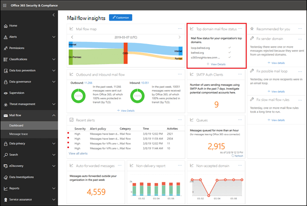
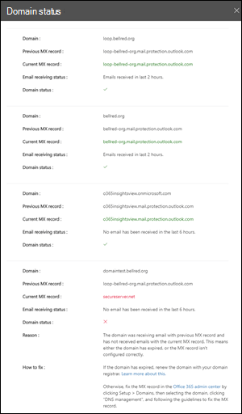

# Einblick in den Top-Domain-NachrichtenflussstatusTop domain mail flow status insight

In der **oberen Domäne der Nachrichtenflussstatus** Insight erhalten Sie den aktuellen Status für die Domänen Ihrer Organisation im Hinblick auf den Nachrichtenfluss.The **Top domain mail flow status** insight gives you the current status for your organization's domains in terms of mail flow. Diese Einblicke helfen Ihnen bei der Identifizierung und Problembehandlung von Domänen, die sich auf Probleme mit dem ***e-Mail-Fluss auswirken*** (beispielsweise kann keine externe e-Mail empfangen werden), vor allem Domänen Ablauf oder Domänen mit falschen MX-Einträgen.This insight helps you identify and troubleshoot domains that are experiencing ***mail flow impacting*** issues (for example, unable to receive external email), especially domain expirations or domains with incorrect MX records.

Wenn Sie in der Insight auf **Details anzeigen** klicken, wird ein Flyout angezeigt, in dem Sie weitere Informationen zum Status der einzelnen Domänen erhalten.When you click **View details** in the insight, a flyout appears that shows you more details for the status of each domain.

Ein grünes Häkchen für eine Domäne gibt an, dass der aktuelle MX-Eintrag (beim Browsen in das Nachrichtenfluss-Einblicke-Dashboard) dem Wert entspricht, den wir im Datensatz haben, und dass die Domäne in den letzten zwei Stunden e-Mails empfangen hat.A green check mark for a domain indicates the current MX record (when you browsed to the mail flow insights dashboard) matches the value we have on record, and that the domain has received email during the past two hours.

Ein rotes x für eine Domäne gibt an, dass der MX-Eintrag geändert wurde und dass in den letzten 6 Stunden keine e-Mails für die Domäne empfangen wurden.A red x for a domain indicates the MX record has been changed, and that the domain has received no email during the past 6 hours. Dies deutet wahrscheinlich darauf hin, dass Ihre Domäne abgelaufen ist oder dass der MX-Eintrag falsch aktualisiert wurde.This likely indicates that your domain has expired, or that the MX record has been incorrectly updated. Erkundigen Sie sich bei Ihrer Domänenregistrierungsstelle oder Ihrem DNS-Hostingdienst, ob die Domäne abgelaufen ist oder ob der MX-Eintrag der Domäne falsch ist.Check with your domain registrar or DNS hosting service to see if the domain has expired, or if the domain's MX record is incorrect.

## Verwandte ThemenRelated topics

Weitere Informationen zu anderen e-Mail-Fluss-Einblicken im Nachrichtenfluss-Dashboard finden Sie unter [Mail Flow Insights in the Security & Compliance Center](mail-flow-insights-v2.md).For more information about other mail flow insights in the mail flow dashboard, see [Mail flow insights in the Security & Compliance Center](mail-flow-insights-v2.md).
