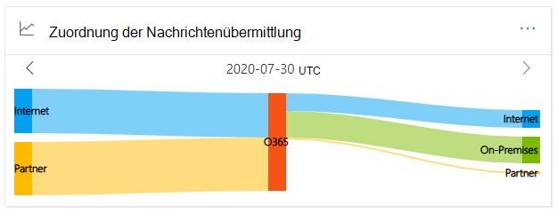
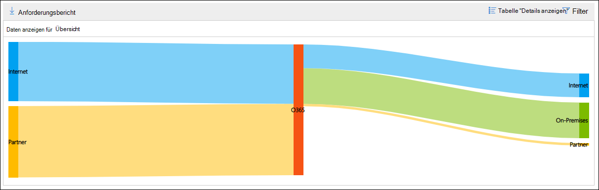
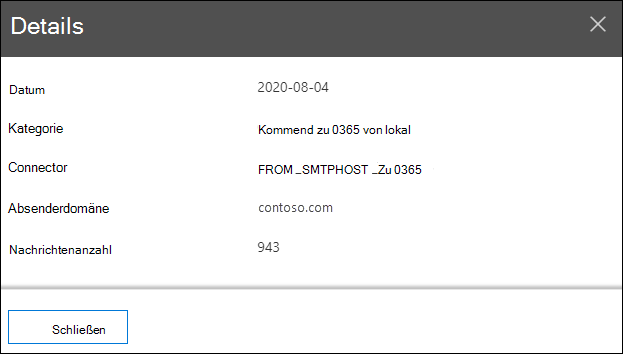

# Nachrichtenflusszuordnung im Security & Compliance Center

[!INCLUDE [Microsoft 365 Defender rebranding](../includes/microsoft-defender-for-office.md)]

**Gilt für**
- [Exchange Online Protection](exchange-online-protection-overview.md)
- [Microsoft Defender für Office 365 Plan 1 und Plan 2](defender-for-office-365.md)
- [Microsoft 365 Defender](../defender/microsoft-365-defender.md)

Die **Nachrichtenflusskarte** im Nachrichtenflussdashboard im [Security & Compliance Center](https://protection.office.com) gibt Einblick in den E-Mail-Fluss in Ihrer Organisation.  Sie können diese Informationen verwenden, um Muster zu erlernen, Anomalien zu identifizieren und Probleme bei deren Auftreten zu beheben.

Standardmäßig zeigt das Widget das Nachrichtenflussmuster vom Vortag in einem Diagramm an, das als *Sankey-Diagramm bezeichnet* wird. Sie können den Pfeil nach links und nach rechts zum Anzeigen von Informationen aus  verschiedenen Tagen  verwenden. Jede unterschiedliche Farbe stellt den Nachrichtenfluss über einen anderen ein- oder ausgehenden Connector (oder ohne Verwendung von Connectors) dar. Wenn Sie den Mauszeiger auf eine bestimmte Farbe zeigen, wird die Anzahl der Nachrichten für diesen Connectortyp angezeigt.

## Berichtsansicht für die Nachrichtenflusskarte

Wenn Sie auf das **Widget "Nachrichtenflusszuordnung"** klicken, werden Sie zum **Bericht "Nachrichtenflusszuordnung"** angezeigt.

Die folgenden Diagramme sind in der Berichtsansicht verfügbar:

- **Daten anzeigen für: Übersicht**: Dies ist im Wesentlichen eine größere Ansicht des Widgets. Wenn Sie den Mauszeiger auf eine bestimmte Farbe zeigen, wird die Anzahl der Nachrichten für diesen Connectortyp angezeigt.

  

- **Daten anzeigen für: Detail**: Diese Ansicht zeigt Details zu den Connectors und Zieldomänen. Die Top-Absender- und Empfängerdomänen werden aufgelistet, und der Rest wird in **Andere angegeben.** Wenn Sie auf eine bestimmte Farbe und einen bestimmten Abschnitt zeigen, wird die Anzahl der Nachrichten angezeigt.

  

Wenn Sie **in** einer Berichtsansicht auf Filter klicken, können Sie einen Datumsbereich mit **Startdatum** und **Enddatum angeben.**

Klicken Sie auf Herunterladen anfordern, um den Bericht für einen bestimmten Datumsbereich an einen oder mehrere **Empfänger zu senden.**

Verwandte Einblicke werden unterhalb der Nachrichtenflusskarte angezeigt, wenn sie verfügbar sind (z. B. die Möglichkeit einer E-Mail-Schleife [beheben).](mfi-mail-loop-insight.md)

## Detailtabelle für die Nachrichtenflusszuordnung

Wenn Sie in einer Berichtsansicht auf **Detailtabelle anzeigen** klicken, werden die folgenden Informationen angezeigt:

- **Date**
- **Kategorie**
- **Connector/Drittanbieter**
- **Absender-Empfänger-Domäne**
- **Anzahl der Nachrichten**

Wenn Sie in einer **Detailtabelle** auf Filter klicken, können Sie einen Datumsbereich mit **Startdatum** und **Enddatum angeben.**

Wenn Sie eine Zeile auswählen, werden ähnliche Details in einem Flyout angezeigt:

Klicken Sie auf Herunterladen anfordern, um den Bericht für einen bestimmten Datumsbereich an einen oder mehrere **Empfänger zu senden.**

Klicken Sie auf Bericht anzeigen, um zur Berichtsansicht **zurück zu wechseln.**

## Siehe auch

Weitere Informationen zu anderen Erkenntnissen im Nachrichtenflussdashboard finden Sie unter Einblicke in den Nachrichtenfluss [im Security & Compliance Center](mail-flow-insights-v2.md).
