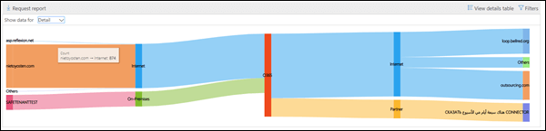

# Nachrichtenfluss-BerichtMail flow map report

Dieser Bericht gibt Einblicke in die Art und Weise, wie e-Mails in Ihrer Organisation fließen.This report gives insights as to how mail flows through your organization. Sie können diese Informationen verwenden, um Muster zu erfahren, Anomalien zu identifizieren und Probleme zu beheben, wenn diese auftreten.You can use this information to learn patterns, identify anomalies, and fix issues as they arise.

## Nachrichtenfluss-Map-widgetMail flow map widget

Standardmäßig zeigt die e-Mail-Fluss-Zuordnung das hochstufige Nachrichtenfluss Muster des vorherigen Tags an.By default, the mail flow map shows the high level mail flow pattern from the previous day. Sie können den linken und rechten Pfeil für unterschiedliche Tage verwenden.You can use the left and right arrows for different days. Wenn Sie den Mauszeiger über die einzelnen Bereiche im Bericht bewegen, wird das Volumen der e-Mails an und von Ihrer Organisation angezeigt, wie im folgenden Diagramm dargestellt:Hovering your mouse cursor over each area in the report will show the volume of mail to and from your organization as shown in the following diagram:

## Grundlagen der Nachrichtenfluss ÜbersichtMail flow map basics

Durch Klicken auf das Widget **"Nachrichtenfluss-Zuordnung** " gelangen Sie zum Bericht **"Nachrichtenfluss Karte** ".Clicking on the **Mail flow map** widget will take you to the **Mail flow map** report. Hier sehen Sie eine genauere Berichtebene, Sie können auf Detailtabelle anzeigen klicken, um detaillierte Daten anzuzeigen.Here you can see more granular level of report, you can click View details table to see detailed data. Sie können den detaillierten Bericht auch herunterladen, indem Sie auf Anforderungsbericht klicken.You can also download the detailed report by clicking Request report.

## DetailsDetails

Standardmäßig ist die Option **Daten für anzeigen** auf den Wert **Overview**festgelegt.By default, **Show data for** is set to the value **Overview**. Wenn Sie auf die Dropdownliste klicken und **Detail**auswählen, wechselt die Ansicht zu den Details der Domänenebene.When you click on the drop down and select **Detail**, the view switches to the domain level detail.

Die obersten Absender-und Empfängerdomänen werden aufgelistet, und der Rest wird in **andere** eingefügt, wie in den folgenden Diagrammen dargestellt:The top sender and recipient domains are listed, and the rest will be put in **Others** as shown in the following diagrams:

## Verwandte EinblickeRelated insights

Zugehörige Einblicke werden unterhalb der Nachrichtenfluss Zuordnung angezeigt, sofern Sie verfügbar sind (beispielsweise die Einblicke in die Sender Domain oder die Einblicke in die Mail-Schleife).Related insights are shown beneath the Mail flow map if they're available (for example, the Sender domain insight or the Mail loop insight).

## Siehe auchSee also

Weitere Informationen zu anderen e-Mail-Fluss-Einblicken im Nachrichtenfluss-Dashboard finden Sie unter [Mail Flow Insights in the Security & Compliance Center](mail-flow-insights-v2.md).For more information about other mail flow insights in the mail flow dashboard, see [Mail flow insights in the Security & Compliance Center](mail-flow-insights-v2.md).
