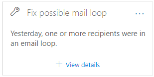

# Beheben möglicher Einblicke in die E-Mail-Schleife im Security & Compliance Center

[!INCLUDE [Microsoft 365 Defender rebranding](../includes/microsoft-defender-for-office.md)]

**Gilt für**
- [Exchange Online Protection](https://go.microsoft.com/fwlink/?linkid=2148611)
- [Microsoft Defender für Office 365 Plan 1 und Plan 2](https://go.microsoft.com/fwlink/?linkid=2148715)
- [Microsoft 365 Defender](https://go.microsoft.com/fwlink/?linkid=2118804)

E-Mail-Schleifen sind ungültig, weil:

- Sie verschwenden Systemressourcen.
- Sie nutzen das E-Mail-Volumenkontingent Ihrer Organisation.
- Sie senden verwirrende Unzustellbarkeitsberichte (auch NDRs oder Unzustellbarkeitsnachrichten bezeichnet) an die ursprünglichen Absender von Nachrichten.

The **Fix possible mail loop** insight in the Recommended for **you** area of the Mail [flow dashboard](mail-flow-insights-v2.md) in the Security & [Compliance Center](https://protection.office.com) notifies you when a mail loop is detected in your organization.

Dieser Einblick wird erst angezeigt, nachdem die Bedingung erkannt wurde (wenn Sie keine E-Mail-Schleifen haben, wird der Einblick nicht angezeigt).

Wenn Sie im **Widget auf Details** anzeigen klicken, wird ein Flyout mit weiteren Informationen angezeigt:

- **Domäne**
- **Anzahl der Nachrichten:**  Sie können auf  "Beispielmeldungen anzeigen" klicken, um die Ergebnisse der Nachrichtenverfolgung für eine Stichprobe der Nachrichten zu sehen, die von der Schleife betroffen waren.
- **Domänentyp**" Beispielsweise autorisierend oder nicht autorisierend.
- **MX-Eintrag:** Der Host (**E-Mail-Server**) und **die Prioritätswerte** des MX-Eintrags für die Domäne.
- **Loop reason** and **How to fix:** We'll identify the most common mail loop scenarios and provide recommended actions to fix the loop.

## Siehe auch

Weitere Informationen zu anderen Einblicken im Nachrichtenflussdashboard finden Sie unter "Einblicke in den Nachrichtenfluss" [im Security & Compliance Center.](mail-flow-insights-v2.md)
