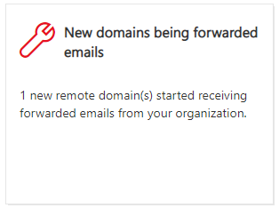

# Neue Domänen, die E-Mail-Einblicke im Security & Compliance Center weitergeleitet werden

[!INCLUDE [Microsoft 365 Defender rebranding](../includes/microsoft-defender-for-office.md)]

**Gilt für**
- [Exchange Online Protection](https://go.microsoft.com/fwlink/?linkid=2148611)
- [Microsoft Defender für Office 365 Plan 1 und Plan 2](https://go.microsoft.com/fwlink/?linkid=2148715)
- [Microsoft 365 Defender](https://go.microsoft.com/fwlink/?linkid=2118804)

Es gibt gültige geschäftliche Gründe für die Weiterleitung von E-Mail-Nachrichten an externe Empfänger in bestimmten Domänen. Es ist jedoch verdächtig, wenn Benutzer in Ihrer Organisation plötzlich Nachrichten an eine Domäne weiterleiten, an die niemand in Ihrer Organisation Nachrichten weitergeleitet hat (eine neue Domäne).

Diese Bedingung weist möglicherweise darauf hin, dass die Benutzerkonten gefährdet sind. Wenn Sie vermuten, dass die Konten gefährdet wurden, lesen Sie ["Reagieren auf ein gefährdetes E-Mail-Konto".](responding-to-a-compromised-email-account.md)

The **New domains being forwarded email** insight in the Security & Compliance [Center](https://protection.office.com) notifies you when users in your organization are forwarding messages to new domains.

Dieser Einblick wird nur angezeigt, wenn das Problem erkannt wird, und er wird auf der Seite ["Weiterleitungsbericht"](view-mail-flow-reports.md#forwarding-report) angezeigt.

Wenn Sie auf das Widget klicken, wird ein Flyout angezeigt, in dem Sie weitere Details zu den weitergeleiteten Nachrichten finden, einschließlich eines Links zurück zum [Weiterleitungsbericht.](view-mail-flow-reports.md#forwarding-report)

Sie können auch zu dieser Detailseite gelangen,  wenn Sie die Einblicke auswählen, nachdem Sie im Bereich "Top insights" **&** **(** Berichtsdashboard oder ) auf "Alle anzeigen" geklickt \>  haben. <https://protection.office.com/insightdashboard>

Um die automatische Nachrichten weiterleitung an externe Domänen zu verhindern, konfigurieren Sie eine Remotedomäne für einige oder alle externen Domänen. Weitere Informationen finden Sie unter [Verwalten von Remotedomänen in Exchange Online](https://docs.microsoft.com/Exchange/mail-flow-best-practices/remote-domains/manage-remote-domains).

## Verwandte Themen

Weitere Informationen zu anderen Einblicken im Nachrichtenflussdashboard finden Sie unter "Einblicke in den Nachrichtenfluss" [im Security & Compliance Center.](mail-flow-insights-v2.md)
