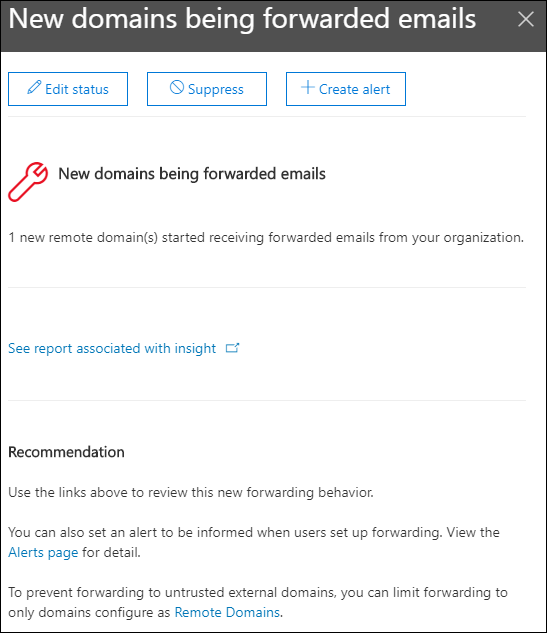

# Neue Domänen, die E-Mail-Einblicke im Security & Compliance Center erhaltenNew domains being forwarded email insight in the Security & Compliance Center

[!INCLUDE [Microsoft 365 Defender rebranding](../includes/microsoft-defender-for-office.md)]

**Gilt für****Applies to**
- [Exchange Online ProtectionExchange Online Protection](exchange-online-protection-overview.md)
- [Microsoft Defender für Office 365 Plan 1 und Plan 2Microsoft Defender for Office 365 plan 1 and plan 2](office-365-atp.md)
- [Microsoft 365 DefenderMicrosoft 365 Defender](../mtp/microsoft-threat-protection.md)

Es gibt gültige geschäftliche Gründe für die Weiterleitung von E-Mail-Nachrichten an externe Empfänger in bestimmten Domänen.There are valid business reasons to forward email messages to external recipients in specific domains. Es ist jedoch verdächtig, wenn Benutzer in Ihrer Organisation plötzlich mit der Weiterleitung von Nachrichten an eine Domäne beginnen, an die in Ihrer Organisation niemals Nachrichten weitergeleitet wurden (eine neue Domäne).However, it's suspicious when users in your organization suddenly start forwarding messages to a domain where no one in your organization has ever forwarded messages to (a new domain).

Diese Bedingung kann darauf hinweisen, dass die Benutzerkonten gefährdet sind.This condition might indicate that the user accounts are compromised. Wenn Sie vermuten, dass die Konten gefährdet wurden, lesen Sie [Antworten auf ein gefährdetes E-Mail-Konto](responding-to-a-compromised-email-account.md).If you suspect the accounts have been compromised, see [Responding to a compromised email account](responding-to-a-compromised-email-account.md).

Der **E-Mail-Einblick** in neue Domänen im [Security & Compliance Center](https://protection.office.com) benachrichtigt Sie, wenn Benutzer in Ihrer Organisation Nachrichten an neue Domänen weiterleiten.The **New domains being forwarded email** insight in the [Security & Compliance Center](https://protection.office.com) notifies you when users in your organization are forwarding messages to new domains.

Diese Einsicht wird nur angezeigt, wenn das Problem erkannt wird, und sie wird auf der [Seite Weiterleitungsbericht](view-mail-flow-reports.md#forwarding-report) angezeigt.This insight appears only when the issue is detected, and it appears on the [Forwarding report](view-mail-flow-reports.md#forwarding-report) page.

Wenn Sie auf das Widget klicken, wird ein Flyout angezeigt, in dem Sie weitere Details zu den weitergeleiteten Nachrichten finden, einschließlich eines Links zurück zum [Weiterleitungsbericht.](view-mail-flow-reports.md#forwarding-report)When you click on the widget, a flyout appears where you can find more details about the forwarded messages, including a link back to the [Forwarding report](view-mail-flow-reports.md#forwarding-report).

Sie können auch zu dieser Detailseite gelangen,  wenn Sie den Einblick auswählen, nachdem Sie im Bereich Top **insights & (** **Reports** Dashboard or ) auf Alle anzeigen geklickt \>  <https://protection.office.com/insightdashboard> haben.You can also get to this details page when you select the insight after you click **View all** in the **Top insights & recommendations** area on (**Reports** \> **Dashboard** or <https://protection.office.com/insightdashboard>).

Um die automatische Nachrichten weiterleitung an externe Domänen zu verhindern, konfigurieren Sie eine Remotedomäne für einige oder alle externen Domänen.To prevent automatic message forwarding to external domains, configure a remote domain for some or all external domains. Weitere Informationen finden Sie unter [Verwalten von Remotedomänen in Exchange Online](/Exchange/mail-flow-best-practices/remote-domains/manage-remote-domains).For more information, see [Manage remote domains in Exchange Online](/Exchange/mail-flow-best-practices/remote-domains/manage-remote-domains).

## Verwandte ThemenRelated topics

Weitere Informationen zu anderen Erkenntnissen im Nachrichtenflussdashboard finden Sie unter Einblicke in den Nachrichtenfluss [im Security & Compliance Center](mail-flow-insights-v2.md).For information about other insights in the Mail flow dashboard, see [Mail flow insights in the Security & Compliance Center](mail-flow-insights-v2.md).