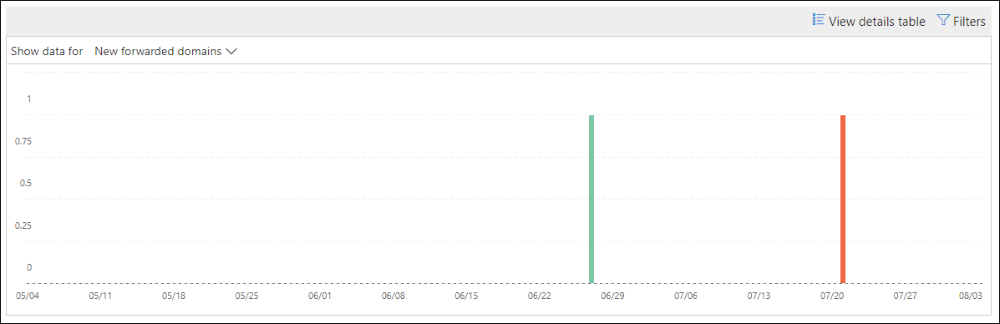

# Neue Benutzer, die e-Mail-Insight im Security & Compliance Center weiterleiten

[!INCLUDE [Microsoft 365 Defender rebranding](../includes/microsoft-defender-for-office.md)]

Es ist verdächtig, wenn neue Benutzerkonten in Ihrer Organisation plötzlich mit der Weiterleitung von e-Mail-Nachrichten an externe Domänen beginnen.

Die **neuen Domänen, die als e-Mail-Insight weitergeleitet** werden, werden in der [Security & Compliance Center](https://protection.office.com) benachrichtigt, wenn neu erstellte Benutzer in Ihrer Organisation Nachrichten an externe domänenweiter leiten. Diese Bedingung kann darauf hindeuten, dass kompromittierte Administratorkonten verwendet wurden, um die neuen Benutzer zu erstellen. Wenn Sie vermuten, dass die Konten kompromittiert wurden, finden Sie weitere Informationen unter [reagieren auf ein kompromittiertes e-Mail-Konto](responding-to-a-compromised-email-account.md).

Diese Einblicke wird nur angezeigt, wenn das Problem erkannt wird und auf der Seite [weiterleitender Bericht](view-mail-flow-reports.md#forwarding-report) angezeigt wird.

Wenn Sie auf das Widget klicken, wird ein Flyout angezeigt, in dem Sie weitere Details zu den weitergeleiteten Nachrichten finden können, einschließlich eines Links zum [Weiterleiten von Änderungs Berichten](#forwarding-modifications-report) wie weiter unten in diesem Thema beschrieben.

Sie können diese Detailseite auch aufrufen, wenn Sie die Einblicke auswählen, nachdem Sie auf **Alle anzeigen** im Bereich **Top Insights & Empfehlungen** auf (**Berichte** \> - **Dashboard** oder <https://protection.office.com/insightdashboard> ) klicken.

Sie können auf den Link **Bericht mit Insight zugeordnet sehen** klicken, um zum **weiter Leitungs Änderungsbericht** zu wechseln, wie im nächsten Abschnitt beschrieben.

## Änderungsbericht wird weitergeleitet

Der **Bericht zum Weiterleiten von Änderungen** zeigt Details zu Nachrichten an, die automatisch von Absendern in Ihrer Organisation weitergeleitet werden:

- Neu erstellte Konten, die Nachrichten an externe domänenweiter leiten.
- Konten, die Nachrichten an externe domänenweiter leiten, die noch nie von anderen Absendern in Ihrer Organisation weitergeleitet wurden.

Diese Typen von weitergeleiteten Nachrichten können ein Sicherheits-oder Konformitäts Risiko darstellen und möglicherweise auf kompromittierte Konten hindeuten.

Der Bericht enthält Daten für bis zu 90 Tage. Standardmäßig zeigt der Berichtdaten für die letzten 7 Tage an.

Dieser Bericht ist nicht direkt im [Nachrichtenfluss-Dashboard](mail-flow-insights-v2.md) oder im [Dashboard Berichte](view-mail-flow-reports.md)verfügbar. Neben dem Klicken auf den Link **Bericht mit Insight zugeordnet** in den **neuen Benutzern, die e-Mail-** Einblicke weiterleiten, gelangen Sie in den Bericht über die folgenden Informationen:

- Klicken Sie auf den Link **Weiterleitungsbenachrichtigungen weiterleiten** in den Details der [neuen Domänen, die in e-Mail-Insight weitergeleitet werden](mfi-new-domains-being-forwarded-email.md).
- Öffnen <https://protection.office.com/reportv2?id=MailFlowNewForwarding> .

### Berichtsansicht für den Weiterleitungs Änderungsbericht

Die folgenden Diagramme stehen in der Berichtsansicht zur Verfügung:

- **Daten anzeigen für: neue Weiterleitungs Benutzer**:

  

- **Daten anzeigen für: neue Weiterleitungs Domänen**:

  

Wenn Sie in einer Berichtsansicht auf **Filter** klicken, können Sie einen Datumsbereich mit **anfangs** -und **Enddatum** angeben.

### Detailtabellen Ansicht für den Weiterleitungs Änderungsbericht

Wenn Sie auf **Detailtabelle anzeigen** klicken, hängt die Anzeige der angezeigten Informationen von dem Diagramm ab, das Sie gesucht haben:

- **Daten anzeigen für: neue Weiterleitungs Benutzer**:

  - **Name**: die e-Mail-Adresse des Absenders.
  - **Weiterleitender Typ**
  - **Empfängeradresse**
  - **Details**
  - **Count**
  - **Erstes Termin Datum**

- **Daten anzeigen für: neue Weiterleitungs Domänen**:

  - **Name**: die e-Mail-Domäne des Absenders.
  - **Weiterleitender Typ**
  - **Empfängeradresse**
  - **Details**
  - **Count**
  - **Erstes Termin Datum**

Wenn Sie in einer Detailtabellen Ansicht auf **Filter** klicken, können Sie einen Datumsbereich mit **anfangs** -und **Enddatum** angeben.

Wenn Sie eine Zeile aus der Tabelle auswählen, wird ein **Detail** Flyout mit den folgenden Informationen angezeigt:

- **Name**: Dies ist entweder die e-Mail-Adresse des Absenders (von **Daten anzeigen für: neue Weiterleitungs Benutzer** anzeigen) oder die e-Mail-Domäne des Absenders (aus **Daten anzeigen für: neue Weiterleitungs Domänen** -Ansicht).
- **Weiterleitender Typ**
- **Empfänger**
- **Details**
- **Count**
- **Anfangstermin**
- **Empfehlung**: von hier aus können Sie auf den Link klicken, um den Benutzer im Microsoft 365 Admin Center zu verwalten.

Klicken Sie auf **Bericht anzeigen**, um zur Ansicht Berichte zurückzukehren.

## Verwandte Themen

Informationen zu weiteren Einblicken im Nachrichtenfluss-Dashboard finden Sie unter [Mail Flow Insights in the Security & Compliance Center](mail-flow-insights-v2.md).
