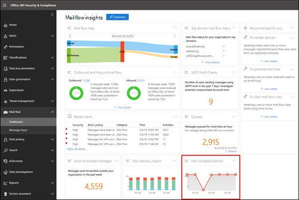
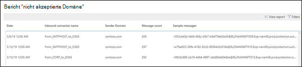

# Bericht zu nicht akzeptierten DomänenNon-accepted domain report

Ähnlich wie bei der **Absenderdomänen** Einsicht identifiziert die **nicht akzeptierte Domäne** Insight Nachrichten von Ihrer lokalen e-Mail-Organisation, aber die Domäne des Absenders ist nicht als akzeptierte Domäne in Ihrer Organisation konfiguriert.Similar to the **Sender domain** insight, the **Non-accepted domain** insight identifies messages from your on-premises email organization, but the sender's domain isn't configured as an accepted domain in your organization.

Microsoft 365 kann diese Nachrichten Drosseln, wenn wir Daten haben, um zu beweisen, dass die Absicht dieser Nachrichten bösartig ist.Microsoft 365 might throttle these messages if we have data to prove that the intent of these messages is malicious. Daher ist es wichtig, dass Sie verstehen, was passiert, und das Problem zu beheben.Therefore, it's important for you to understand what's happening and to fix the issue.

Wenn Sie auf das Widget klicken, werden Sie zum vollständigen Bericht geleitet.When you click on the widget, you're taken to the full report. Im vollständigen Bericht, in dem Sie auf **Details anzeigen** klicken können, um die Informationen in einer Tabelle anzuzeigen, wie im folgenden Diagramm dargestellt:In the full report, where you can click **View details** to view the information in a table as shown in the following diagram:

Wenn Sie eine Zeile in der Tabelle auswählen, werden weitere Details in einem Flyout angezeigt.When you select a row in the table, a flyout will show you more details. Sie können auf **Beispiel Meldungen anzeigen** klicken, um einige der identifizierten Nachrichten anzuzeigen.You can click **view sample messages** to see some of the identified messages.

## Verwandte ThemenRelated topics

Weitere Informationen zu anderen e-Mail-Fluss-Einblicken im Nachrichtenfluss-Dashboard finden Sie unter [Mail Flow Insights in the Security & Compliance Center](mail-flow-insights-v2.md).For more information about other mail flow insights in the mail flow dashboard, see [Mail flow insights in the Security & Compliance Center](mail-flow-insights-v2.md).
