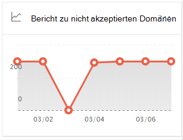
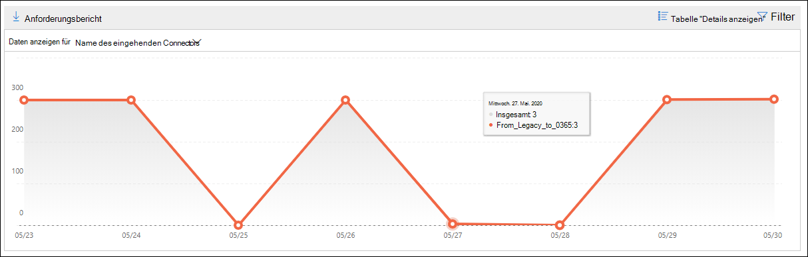
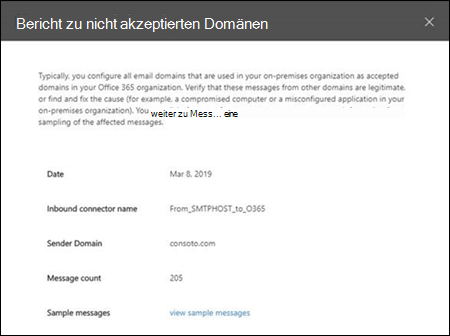

# Nicht akzeptierter Domänenbericht im Security & Compliance CenterNon-accepted domain report in the Security & Compliance Center

[!INCLUDE [Microsoft 365 Defender rebranding](../includes/microsoft-defender-for-office.md)]

**Gilt für****Applies to**
- [Exchange Online ProtectionExchange Online Protection](exchange-online-protection-overview.md)
- [Microsoft Defender für Office 365 Plan 1 und Plan 2Microsoft Defender for Office 365 plan 1 and plan 2](defender-for-office-365.md)
- [Microsoft 365 DefenderMicrosoft 365 Defender](../defender/microsoft-365-defender.md)

Der Bericht Nicht akzeptierter  Domänen im Nachrichtenflussdashboard im [Security & Compliance Center](https://protection.office.com) zeigt Informationen zu Nachrichten aus Ihrer lokalen **E-Mail-Organisation** an, in denen die Domäne des Absenders nicht als akzeptierte Domäne in Ihrer Microsoft 365-Organisation konfiguriert ist.The **Non-accepted domain** report in the [Mail flow dashboard](mail-flow-insights-v2.md) in the [Security & Compliance Center](https://protection.office.com) displays information about messages from your on-premises email organization where the sender's domain isn't configured as an accepted domain in your Microsoft 365 organization.

Microsoft 365 kann diese Nachrichten drosseln, wenn wir Daten zum Nachweis haben, dass die Absicht dieser Nachrichten bösartig ist.Microsoft 365 might throttle these messages if we have data to prove that the intent of these messages is malicious. Daher ist es wichtig, dass Sie verstehen, was geschieht, und das Problem beheben.Therefore, it's important for you to understand what's happening and to fix the issue.

## Berichtsansicht für den Nicht akzeptierten DomänenberichtReport view for the Non-accepted domain report

Wenn Sie im Widget Nicht **akzeptierte** Domänen auf das Diagramm klicken, werden Sie zum **Bericht Nicht akzeptierter Domänen** angezeigt.Clicking the chart on the **Non-accepted domain** widget will take you to the **Non-accepted domain** report.

Standardmäßig wird die Aktivität für alle betroffenen Connectors angezeigt.By default, the activity for all affected connectors is shown. Wenn Sie auf **Daten anzeigen für klicken,** können Sie in der Dropdownliste einen bestimmten Connector auswählen.If you click **Show data for**, you can select a specific connector from the dropdown.

Wenn Sie auf einen Datenpunkt (Tag) im Diagramm zeigen, wird die Gesamtanzahl der Nachrichten für den Connector angezeigt.If you hover over a data point (day) in the chart, you'll see the total number of messages for the connector.

## Detailtabelle für den Nicht akzeptierten DomänenberichtDetails table view for the Non-accepted domain report

Wenn Sie in einer Berichtsansicht auf **Detailtabelle anzeigen** klicken, werden die folgenden Informationen angezeigt:If you click **View details table** in a report view, the following information is shown:

- **Date****Date**
- **Name des eingehenden Connectors****Inbound connector name**
- **Absenderdomäne****Sender domain**
- **Anzahl der Nachrichten****Message count**
- **Beispielnachrichten:** Die Nachrichten-IDs eines Beispiels betroffener Nachrichten.**Sample messages**: The message IDs of a sample of affected messages.

Wenn Sie in einer **Detailtabelle** auf Filter klicken, können Sie einen Datumsbereich mit **Startdatum** und **Enddatum angeben.**If you click **Filters** in a details table view, you can specify a date range with **Start date** and **End date**.

Klicken Sie auf Herunterladen anfordern, um den Bericht für einen bestimmten Datumsbereich an einen oder mehrere **Empfänger zu senden.**To email the report for a specific date range to one or more recipients, click **Request download**.

Wenn Sie eine Zeile in der Tabelle auswählen, wird ein Flyout mit den folgenden Informationen angezeigt:When you select a row in the table, a flyout appears with the following information:

- **Date****Date**
- **Name des eingehenden Connectors****Inbound connector name**
- **Absenderdomäne****Sender domain**
- **Anzahl der Nachrichten****Message count**
- **Beispielnachrichten:** Sie können auf **Beispielnachrichten anzeigen klicken,** um die Ergebnisse der Nachrichtenverfolgung für ein Beispiel der betroffenen Nachrichten zu sehen. **Sample messages**: You can click **View sample messages** to see the [message trace](message-trace-scc.md) results for a sample of the affected messages.

Klicken Sie auf Bericht anzeigen, um zur Berichtsansicht **zurück zu wechseln.**To go back to the reports view, click **View report**.

## Verwandte ThemenRelated topics

Weitere Informationen zu anderen Erkenntnissen im Nachrichtenflussdashboard finden Sie unter Einblicke in den Nachrichtenfluss [im Security & Compliance Center](mail-flow-insights-v2.md).For information about other insights in the Mail flow dashboard, see [Mail flow insights in the Security & Compliance Center](mail-flow-insights-v2.md).
