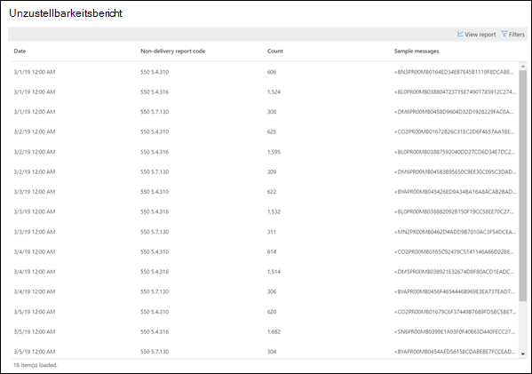

# Unzustellbarkeitsbericht

Im **Unzustellbarkeitsbericht** werden die am häufigsten auftretenden Fehlercodes in Unzustellbarkeitsberichten (auch als Unzustellbarkeitsberichte oder Unzustellbarkeitsnachrichten bezeichnet) für Benutzer in Ihrer Organisation angezeigt. Dieser Bericht dient zum Anzeigen der Details von Unzustellbarkeitsberichten, damit Sie Probleme beheben können.

Sie können Informationen zu allen NDR-Codes oder einem bestimmten Code anzeigen, indem Sie auf **Daten für anzeigen**klicken. Sie können auch auf **Tabelle Details anzeigen** klicken, um eine detailliertere Ansicht anzuzeigen, wie im folgenden Diagramm dargestellt:

Wenn Sie eine Zeile in der Tabelle auswählen, um die Details des jeweiligen Unzustellbarkeitsberichts anzuzeigen, können Sie die ausführlichen Informationen zur Problembehandlung und zum Ausführen der erforderlichen Aktionen verwenden.

## Siehe auch

Weitere Informationen zu anderen e-Mail-Fluss-Einblicken im Nachrichtenfluss-Dashboard finden Sie unter [Mail Flow Insights in the Security & Compliance Center](mail-flow-insights-v2.md).
