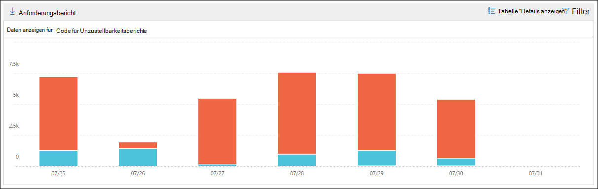

# Unzustellbarkeitsbericht im Security & Compliance CenterNon-delivery report in the Security & Compliance Center

Der **Unzustellbarkeitsbericht** im [Nachrichtenfluss-Dashboard](mail-flow-insights-v2.md) im Security & Compliance Center zeigt die am häufigsten auftretenden Fehlercodes in Unzustellbarkeitsberichten (auch bekannt als Unzustellbarkeitsberichte oder Bounce-Nachrichten) für Benutzer in Ihrer Organisation.The **Non-delivery report** in the [Mail flow dashboard](mail-flow-insights-v2.md) in the Security & Compliance Center shows the most-encountered error codes in non-delivery reports (also known as NDRs or bounce messages) for users in your organization. Dieser Bericht zeigt die Details von Unzustellbarkeitsberichten an, damit Sie Probleme mit der e-Mail-Zustellung beheben können.This report shows the details of NDRs so you can troubleshoot email delivery problems.

## Berichtsansicht für UnzustellbarkeitsberichtReport view for the Non-delivery report

Wenn Sie auf das Widget **nicht Zustellungsbericht** klicken, gelangen Sie zum **Unzustellbarkeitsbericht**.Clicking on the **Non-delivery report** widget will take you to the **Non-delivery report**.

Standardmäßig wird die Aktivität für alle Fehlercodes angezeigt.By default, the activity for all error codes is shown. Wenn Sie auf **Daten anzeigen für**klicken, können Sie einen bestimmten Fehlercode aus der Dropdownliste auswählen.If you click **Show data for**, you can select a specific error code from the dropdown.

Wenn Sie mit dem Mauszeiger auf eine bestimmte Farbe (Fehlercode) an einem bestimmten Tag im Diagramm zeigen, wird die Gesamtzahl der Nachrichten für den Fehler angezeigt.If you hover over a specific color (error code) on a specific day in the chart, you'll see the total number of messages for the error.

## Detailtabellen Ansicht für den UnzustellbarkeitsberichtDetails table view for the Non-delivery report

Wenn Sie in einer Berichtsansicht auf **Detailtabelle anzeigen** klicken, werden die folgenden Informationen angezeigt:If you click **View details table** in a report view, the following information is shown:

- **Date****Date**
- **Code für Unzustellbarkeitsberichte****Non-delivery report code**
- **Count****Count**
- **Beispiel Meldungen**: die Nachrichten-IDs einer Stichprobe betroffener Nachrichten.**Sample messages**: The message IDs of a sample of affected messages.

Wenn Sie in einer Detailtabellen Ansicht auf **Filter** klicken, können Sie einen Datumsbereich mit **anfangs** -und **Enddatum**angeben.If you click **Filters** in a details table view, you can specify a date range with **Start date** and **End date**.

Klicken Sie auf **Anforderungs Download**, um den Bericht für einen bestimmten Datumsbereich an einen oder mehrere Empfänger zu senden.To email the report for a specific date range to one or more recipients, click **Request download**.

Wenn Sie eine Zeile in der Tabelle auswählen, wird ein Flyout mit den folgenden Informationen angezeigt:When you select a row in the table, a flyout appears with the following information:

- **Date****Date**
- **Unzustellbarkeitsbericht Code**: Sie können auf den Link klicken, um weitere Informationen zu den Ursachen und Lösungen für den spezifischen Fehlercode zu erhalten.**Non-delivery report code**: You can click on the link to find for more information about the causes and solutions for the specific error code.
- **Count****Count**
- **Beispiel Meldungen**: Sie können auf **Beispiel Meldungen anzeigen** klicken, um die Ergebnisse der [Nachrichtenablaufverfolgung](message-trace-scc.md) für ein Beispiel der betroffenen Nachrichten anzuzeigen.**Sample messages**: You can click **View sample messages** to see the [message trace](message-trace-scc.md) results for a sample of the affected messages.

## Verwandte ThemenRelated topics

Informationen zu weiteren Einblicken im Nachrichtenfluss-Dashboard finden Sie unter [Mail Flow Insights in the Security & Compliance Center](mail-flow-insights-v2.md).For information about other insights in the Mail flow dashboard, see [Mail flow insights in the Security & Compliance Center](mail-flow-insights-v2.md).
