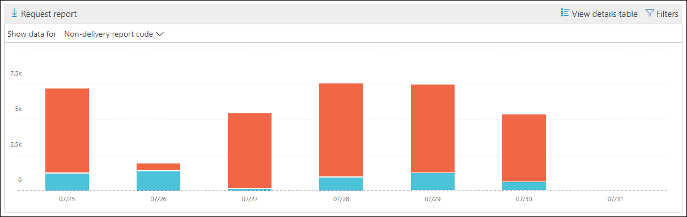

# Unzustellbarkeitsbericht im Security & Compliance Center

Der **Unzustellbarkeitsbericht** im [Nachrichtenfluss-Dashboard](mail-flow-insights-v2.md) im Security & Compliance Center zeigt die am häufigsten auftretenden Fehlercodes in Unzustellbarkeitsberichten (auch bekannt als Unzustellbarkeitsberichte oder Bounce-Nachrichten) für Benutzer in Ihrer Organisation. Dieser Bericht zeigt die Details von Unzustellbarkeitsberichten an, damit Sie Probleme mit der e-Mail-Zustellung beheben können.

## Berichtsansicht für Unzustellbarkeitsbericht

Wenn Sie auf das Widget **nicht Zustellungsbericht** klicken, gelangen Sie zum **Unzustellbarkeitsbericht**.

Standardmäßig wird die Aktivität für alle Fehlercodes angezeigt. Wenn Sie auf **Daten anzeigen für**klicken, können Sie einen bestimmten Fehlercode aus der Dropdownliste auswählen.

Wenn Sie mit dem Mauszeiger auf eine bestimmte Farbe (Fehlercode) an einem bestimmten Tag im Diagramm zeigen, wird die Gesamtzahl der Nachrichten für den Fehler angezeigt.

## Detailtabellen Ansicht für den Unzustellbarkeitsbericht

Wenn Sie in einer Berichtsansicht auf **Detailtabelle anzeigen** klicken, werden die folgenden Informationen angezeigt:

- **Date**
- **Code für Unzustellbarkeitsberichte**
- **Count**
- **Beispiel Meldungen**: die Nachrichten-IDs einer Stichprobe betroffener Nachrichten.

Wenn Sie in einer Detailtabellen Ansicht auf **Filter** klicken, können Sie einen Datumsbereich mit **anfangs** -und **Enddatum**angeben.

Klicken Sie auf **Anforderungs Download**, um den Bericht für einen bestimmten Datumsbereich an einen oder mehrere Empfänger zu senden.

Wenn Sie eine Zeile in der Tabelle auswählen, wird ein Flyout mit den folgenden Informationen angezeigt:

- **Date**
- **Unzustellbarkeitsbericht Code**: Sie können auf den Link klicken, um weitere Informationen zu den Ursachen und Lösungen für den spezifischen Fehlercode zu erhalten.
- **Count**
- **Beispiel Meldungen**: Sie können auf **Beispiel Meldungen anzeigen** klicken, um die Ergebnisse der [Nachrichtenablaufverfolgung](message-trace-scc.md) für ein Beispiel der betroffenen Nachrichten anzuzeigen.

## Verwandte Themen

Informationen zu weiteren Einblicken im Nachrichtenfluss-Dashboard finden Sie unter [Mail Flow Insights in the Security & Compliance Center](mail-flow-insights-v2.md).
