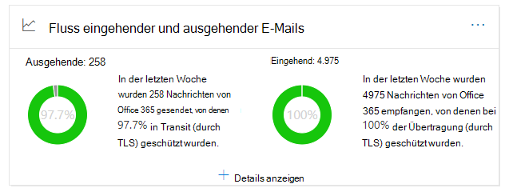
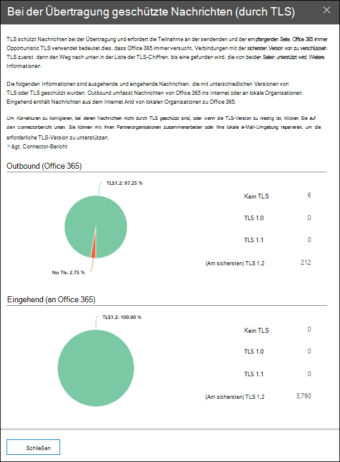

# Einblicke in den ausgehenden und eingehenden Nachrichtenfluss im Security & Compliance Center

Der Einblicke für **ausgehende und eingehende e-Mails** im [Nachrichtenfluss-Dashboard](mail-flow-insights-v2.md) im Security & Compliance Center kombiniert die Informationen aus dem [connectorbericht](view-mail-flow-reports.md#connector-report) und dem früheren TLS-Übersichts **Bericht** an einem zentralen Ort.

Das Widget zeigt die TLS-Verschlüsselung an, die für die Verbindung verwendet wird, wenn Nachrichten an und von Ihrer Organisation zugestellt werden. Die Verbindungen, die mit anderen e-Mail-Diensten hergestellt werden, werden durch TLS verschlüsselt, wenn beide Seiten TLS anbieten. Das Widget bietet eine Momentaufnahme der letzten Woche des Nachrichtenflusses.

Die Informationen im Widget beziehen sich auf Connectors und TLS-Nachrichtenschutz in Microsoft 365. Weitere Informationen finden Sie unter den folgenden Themen:

- [Konfigurieren des Nachrichtenflusses mit Connectors](https://docs.microsoft.com/exchange/mail-flow-best-practices/use-connectors-to-configure-mail-flow/use-connectors-to-configure-mail-flow)
- [Wie Exchange Online TLS zum Sichern von e-Mail-Verbindungen verwendet](https://docs.microsoft.com/microsoft-365/compliance/exchange-online-uses-tls-to-secure-email-connections)
- [Technische Referenzdetails zur Verschlüsselung in Microsoft 365](https://docs.microsoft.com/microsoft-365/compliance/technical-reference-details-about-encryption)

## Nachricht ist bei der Übertragung geschützt (durch TLS)

Wenn Sie auf das Widget **Details anzeigen** klicken, zeigt das Flyout **Nachricht geschützt in Transit (über TLS)** den TLS-Schutz für Nachrichten an, die in Ihre Organisation eingehen und diese verlassen.

Derzeit ist TLS 1,2 die sicherste Version von TLS, die von Microsoft 365 angeboten wird. Häufig müssen Sie die TLS-Verschlüsselung kennen, die für Compliance-Überprüfungen verwendet wird. Sie haben wahrscheinlich keine direkte Beziehung zu den meisten Quell-und Ziel-e-Mail-Servern (Sie besitzen diese nicht und auch nicht Microsoft), sodass Sie nicht viele Optionen zum Verbessern der TLS-Verschlüsselung haben, die von diesen Servern verwendet wird.

Sie können jedoch [Connectors](https://docs.microsoft.com/exchange/mail-flow-best-practices/use-connectors-to-configure-mail-flow/use-connectors-to-configure-mail-flow) verwenden, um den bestmöglichen TLS-Schutz für Nachrichten sicherzustellen, die zwischen Ihren e-Mail-Servern und Microsoft 365 gesendet werden. Der e-Mail-Fluss zwischen Microsoft 365 und ihren eigenen e-Mail-Servern oder Servern, die zu ihren Partnern gehören, ist häufig wichtiger und sensibler als reguläre Nachrichten, daher sollten Sie zusätzliche Sicherheit und Wachsamkeit für diese Nachrichten anwenden.

Sie können ein Upgrade oder eine Korrektur ihrer eigenen e-Mail-Server durchführen, um die verwendete TLS-Verschlüsselung zu verbessern oder Ihre Partner zu erreichen, um dasselbe zu tun. Im **Bericht "Connector** " werden sowohl das Nachrichtenfluss Volumen als auch die TLS-Verschlüsselung für Nachrichten angezeigt, die Ihre Microsoft 365-Connectors verwenden.

Sie können auf den Link **connectorbericht** klicken, um zum [connectorbericht](view-mail-flow-reports.md#connector-report)zu wechseln. Die folgenden Einblicke stehen möglicherweise auf der Seite **connectorbericht** zur Verfügung, wenn die zugeordnete Bedingung erkannt wurde:

- **Inbound-Partner-Konnektor, der signifikante TLS 1.0-Nachrichtenübermittlung sieht**
- **Eingehender onpremises-Konnektor, der signifikante TLS 1.0-Nachrichtenübermittlung sieht**

Für TLS 1,0-Verbindungen müssen Sie Ihren e-Mail-Server oder den Server Ihres Partners wirklich aktualisieren oder reparieren lassen, um Probleme zu vermeiden, wenn die TLS 1,0-Unterstützung in Microsoft 365 schließlich veraltet ist.

## Weitere Artikel

Informationen zu weiteren Einblicken im Nachrichtenfluss-Dashboard finden Sie unter [Mail Flow Insights in the Security & Compliance Center](mail-flow-insights-v2.md).
