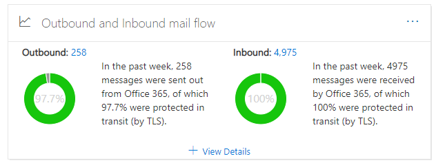

# Einblick in den Ausgehenden und eingehenden Nachrichtenfluss im Security & Compliance Center

[!INCLUDE [Microsoft 365 Defender rebranding](../includes/microsoft-defender-for-office.md)]

**Gilt für**
- [Exchange Online Protection](https://go.microsoft.com/fwlink/?linkid=2148611)
- [Microsoft Defender für Office 365 Plan 1 und Plan 2](https://go.microsoft.com/fwlink/?linkid=2148715)
- [Microsoft 365 Defender](https://go.microsoft.com/fwlink/?linkid=2118804)

Der **Einblick** in ausgehende und  eingehende Nachrichten im Nachrichtenflussdashboard im Security  [& Compliance Center](https://protection.office.com) kombiniert die Informationen aus dem Connectorbericht und dem früheren **TLS-Übersichtsbericht** an einem Ort.

Das Widget zeigt die TLS-Verschlüsselung an, die für die Verbindung verwendet wird, wenn Nachrichten an Und von Ihrer Organisation zugestellt werden. Die Verbindungen, die mit anderen E-Mail-Diensten hergestellt werden, werden von TLS verschlüsselt, wenn TLS von beiden Seiten angeboten wird. Das Widget bietet eine Momentaufnahme der letzten Woche des Nachrichtenflusses.

Die Informationen im Widget stehen im Zusammenhang mit Connectors und dem Schutz von TLS-Nachrichten in Microsoft 365. Weitere Informationen finden Sie unter den folgenden Themen:

- [Konfigurieren des Nachrichtenflusses mit Connectors](https://docs.microsoft.com/exchange/mail-flow-best-practices/use-connectors-to-configure-mail-flow/use-connectors-to-configure-mail-flow)
- [Wie Exchange Online mithilfe von TLS E-Mail-Verbindungen schützt](https://docs.microsoft.com/microsoft-365/compliance/exchange-online-uses-tls-to-secure-email-connections)
- [Technische Referenzdetails zur Verschlüsselung in Microsoft 365](https://docs.microsoft.com/microsoft-365/compliance/technical-reference-details-about-encryption)

## Nachricht, die bei der Übertragung geschützt ist (durch TLS)

Wenn Sie **auf** "Details anzeigen" im Widget klicken, wird im Flyout "Nachricht, die während der Übertragung **(durch TLS)** geschützt ist" der TLS-Schutz für Nachrichten angezeigt, die in Ihre Organisation ein- und austritten.

Derzeit ist TLS 1.2 die sicherste Version von TLS, die von Microsoft 365 angeboten wird. Häufig müssen Sie die TLS-Verschlüsselung kennen, die für Compliance-Überwachungen verwendet wird. Wahrscheinlich haben Sie keine direkte Beziehung mit den meisten Quell- und Ziel-E-Mail-Servern (Sie besitzen sie nicht, und microsoft auch nicht), sodass Sie nicht viele Optionen haben, um die von diesen Servern verwendete TLS-Verschlüsselung zu verbessern.

Sie können jedoch Connectors [verwenden,](https://docs.microsoft.com/exchange/mail-flow-best-practices/use-connectors-to-configure-mail-flow/use-connectors-to-configure-mail-flow) um den besten verfügbaren TLS-Schutz für Nachrichten sicherzustellen, die zwischen Ihren E-Mail-Servern und Microsoft 365 gesendet werden. Der E-Mail-Fluss zwischen Microsoft 365 und Ihren eigenen E-Mail-Servern oder -Servern, die Zu Ihren Partnern gehören, ist häufig wichtiger und vertraulicher als normale Nachrichten, daher sollten Sie zusätzliche Sicherheit und Meldungen auf diese Nachrichten anwenden.

Sie können Ihre eigenen E-Mail-Server aktualisieren oder korrigieren, um die verwendete TLS-Verschlüsselung zu verbessern, oder sich an Ihre Partner zu halten, um dies zu tun. Im **Connectorbericht werden** sowohl das Nachrichtenflussvolumen als auch die TLS-Verschlüsselung für Nachrichten angezeigt, die Ihre Microsoft 365-Connectors verwenden.

Sie können auf den **Connectorberichtslink** klicken, um zum [Connectorbericht zu wechseln.](view-mail-flow-reports.md#connector-report) Die folgenden Erkenntnisse sind möglicherweise auf der Seite **"Connectorbericht"** verfügbar, wenn die zugeordnete Bedingung erkannt wurde:

- **Eingehender Partnerconnector mit erheblichem TLS1.0-Nachrichtenfluss**
- **Eingehender "OnPremises"-Connector mit erheblichem TLS1.0-Nachrichtenfluss**

Für TLS 1.0-Verbindungen müssen Sie ihren E-Mail-Server oder den Server Ihres Partners aktualisiert oder behoben haben, um Probleme zu vermeiden, wenn der TLS 1.0-Support in Microsoft 365 möglicherweise nicht mehr unterstützt wird.

## Siehe auch

Weitere Informationen zu anderen Einblicken im Nachrichtenflussdashboard finden Sie unter "Einblicke in den Nachrichtenfluss" [im Security & Compliance Center.](mail-flow-insights-v2.md)
