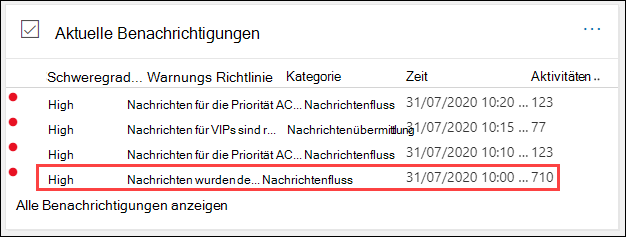
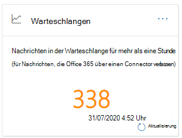

# Warteschlangen Einblicke im Security & Compliance CenterQueues insight in the Security & Compliance Center

[!INCLUDE [Microsoft 365 Defender rebranding](../includes/microsoft-defender-for-office.md)]

Wenn Nachrichten nicht über Connectors von Ihrer Organisation an Ihre lokalen oder Partner-e-Mail-Server gesendet werden können, werden die Nachrichten in Microsoft 365 in die Warteschlange eingereiht.When messages can't be sent from your organization to your on-premises or partner email servers using connectors, the messages are queued in Microsoft 365. Häufige Beispiele, die diese Bedingung verursachen, sind:Common examples that cause this condition are:

- Der Connector ist nicht ordnungsgemäß konfiguriert.The connector is incorrectly configured.
- In Ihrer lokalen Umgebung wurden Netzwerk-oder Firewall-Änderungen vorgenommen.There have been networking or firewall changes in your on-premises environment.

Microsoft 365 fährt fort, die Zustellung für 24 Stunden zu wiederholen.Microsoft 365 will continue to retry to delivery for 24 hours. Nach 24 Stunden laufen die Nachrichten ab und werden an die Absender in Unzustellbarkeitsberichten (auch als Unzustellbarkeitsberichte oder Bounce-Nachrichten bezeichnet) zurückgegeben.After 24 hours, the messages will expire and will be returned to the senders in non-delivery reports (also known as a NDRs or bounce messages).

Wenn das e-Mail-Volumen in der Warteschlange den vordefinierten Schwellenwert überschreitet (der Standardwert ist 200 Nachrichten), stehen die Informationen an den folgenden Speicherorten zur Verfügung:If the queued email volume exceeds the pre-defined threshold (the default value is 200 messages), the information is available in the following locations:

- Die **Queues** Insight im [Nachrichtenfluss-Dashboard](mail-flow-insights-v2.md) im [Security & Compliance Center](https://protection.office.com).The **Queues** insight in the [Mail flow dashboard](mail-flow-insights-v2.md) in the [Security & Compliance Center](https://protection.office.com). Weitere Informationen finden Sie im Abschnitt " [Queues Insight" im Abschnitt "Nachrichtenfluss-Dashboard](#queues-insight-in-the-mail-flow-dashboard) " in diesem Artikel.For more information, see the [Queues insight in the Mail flow dashboard](#queues-insight-in-the-mail-flow-dashboard) section in this article.

- Im Alerts-Dashboard im [Security & Compliance Center](https://protection.office.com) (**Alerts** -Dashboard oder) wird eine **Warnung in den** Benachrichtigungen für Benachrichtigungen angezeigt \>  <https://protection.office.com/alertsdashboard> .An alert is displayed in **Recent alerts** the Alerts dashboard in the [Security & Compliance Center](https://protection.office.com) (**Alerts** \> **Dashboard** or <https://protection.office.com/alertsdashboard>).

  

- Administratoren erhalten eine e-Mail-Benachrichtigung basierend auf der Konfiguration der Standard Warnungs Richtlinie mit dem Namen " **Nachrichten wurden verzögert**.Admins will receive an email notification based on the configuration of the default alert policy named **Messages have been delayed**. Informationen zum Konfigurieren der Benachrichtigungseinstellungen für diese Warnung finden Sie im nächsten Abschnitt.To configure the notification settings for this alert, see the next section.

  Weitere Informationen zu Warnungsrichtlinien finden Sie unter [Warnungsrichtlinien im Security & Compliance Center](../../compliance/alert-policies.md).For more information about alert policies, see [Alert policies in the Security & Compliance Center](../../compliance/alert-policies.md).

## Anpassen von Warteschlangen WarnungenCustomize queue alerts

1. Wechseln Sie im [Security & Compliance Center](https://protection.office.com) **zu Alerts** \> **Alerts Policies** oder Open <https://protection.office.com/alertpolicies> .In the [Security & Compliance Center](https://protection.office.com), go to **Alerts** \> **Alert policies** or open <https://protection.office.com/alertpolicies>.

2. Suchen und wählen Sie auf der Seite " **Warnungsrichtlinien** " die Richtlinie mit dem Namen " **Nachrichten wurden verzögert**" aus.On the **Alert policies** page, find and select the policy named **Messages have been delayed**.

3. In der **Meldung verzögertes** Flyout, das geöffnet wird, können Sie die Warnung aktivieren oder deaktivieren und die Benachrichtigungseinstellungen konfigurieren.In the **Message have been delayed** flyout that opens, you can turn the alert on or off and configure the notification settings.

   

   - **Status**: Sie können die Warnung aktivieren oder deaktivieren.**Status**: You can toggle the alert on or off.

   - Grenzwert für **e-Mail-Empfänger** und **tägliche Benachrichtigung**: Klicken Sie auf **Bearbeiten** , um die folgenden Einstellungen zu konfigurieren:**Email recipients** and **Daily notification limit**: Click **Edit** to configure the following settings:

4. Klicken Sie auf **Bearbeiten**, um die Benachrichtigungseinstellungen zu konfigurieren.To configure the notification settings, click **Edit**. Konfigurieren Sie im eingeblendeten **Editor-Richtlinien** Flyout die folgenden Einstellungen:In the **Edit policy** flyout that appears, configure the following settings:

   - **Senden von e-Mail-Benachrichtigungen**: der Standardwert ist "on".**Send email notifications**: The default value is on.
   - **E-Mail-Empfänger**: der Standardwert ist **TenantAdmins**.**Email recipients**: The default value is **TenantAdmins**.
   - **Grenzwert für tägliche Benachrichtigung**: der Standardwert ist **No Limit**.**Daily notification limit**: The default value is **No limit**.
   - **Threshold**: der Standardwert ist 200.**Threshold**: The default value is 200.

   

5. Wenn Sie fertig sind, klicken Sie auf **Speichern** und **Schließen**.When you're finished, click **Save** and **Close**.

## Queues Insight im Nachrichtenfluss-DashboardQueues insight in the Mail flow dashboard

Auch wenn das Nachrichten Volume in der Warteschlange den Schwellenwert nicht überschreitet und eine Warnung generiert hat, können Sie weiterhin die **Warteschlangen** Einblicke im [Nachrichtenfluss-Dashboard](mail-flow-insights-v2.md) verwenden, um Nachrichten anzuzeigen, die länger als eine Stunde in die Warteschlange gestellt wurden, und Aktionen durchführen, bevor die Anzahl der in der Warteschlange befindlichen Nachrichten zu groß wird.Even if the queued message volume hasn't exceeded the threshold and generated an alert, you can still use the **Queues** insight in the [Mail flow dashboard](mail-flow-insights-v2.md) to see messages that have been queued for more than one hour, and take action before the number of queued messages becomes too large.

Wenn Sie auf die Anzahl der Nachrichten im Widget klicken, wird ein Flyout mit **Nachrichten in der Warteschlange** mit den folgenden Informationen angezeigt:If you click the number of messages on the widget, a **Messages queued** flyout appears with the following information:

- **Anzahl von Nachrichten in der Warteschlange****Number of queued messages**
- **Connectorname**: Klicken Sie auf den Namen des Connectors, um den Connector im Exchange Admin Center (EAC) zu verwalten.**Connector name**: Click on the connector name to manage the connector in the Exchange admin center (EAC).
- **Warteschlangen-Anfangszeit****Queue started time**
- **Älteste Nachrichten abgelaufen****Oldest messages expired**
- **Zielserver****Destination server**
- **Letzte IP-Adresse****Last IP address**
- **Letzter Fehler****Last error**
- **Beheben von** Problemen: häufige Probleme und Lösungen sind verfügbar.**How to fix**: Common issues and solutions are available. Wenn es sich um einen **Fix-jetzt** -Link handelt, klicken Sie darauf, um das Problem zu beheben.If is a **Fix it now** link is available, click it to fix the problem. Klicken Sie andernfalls auf alle verfügbaren Links, um weitere Informationen zu dem Fehler und möglichen Lösungen zu erhalten.Otherwise, click on any available links for more information about the error and possible solutions.

Das gleiche Flyout wird angezeigt, nachdem Sie in den Details einer **verzögerten Warnung Nachrichten** auf **Warteschlange anzeigen** klicken.The same flyout is displayed after you click **View queue** in the details of a **Messages have been delayed** alert.

## Weitere InformationenSee also

Informationen zu weiteren Einblicken im Nachrichtenfluss-Dashboard finden Sie unter [Mail Flow Insights in the Security & Compliance Center](mail-flow-insights-v2.md).For information about other insights in the Mail flow dashboard, see [Mail flow insights in the Security & Compliance Center](mail-flow-insights-v2.md).
