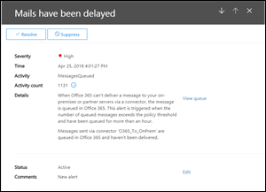

# Warteschlangenwarnungen und WarteschlangenQueue alerts and Queues

## Warteschlangen WarnungenQueue alerts

Wenn Nachrichten nicht von Ihrer Office 365 Organisation an Ihre lokalen oder Partner-e-Mail-Server mithilfe von Connectors gesendet werden können, werden die Nachrichten in Office 365 in die Warteschlange eingereiht.When messages can't be sent from your Office 365 organization to your on-premises or partner email servers using connectors, the messages are queued in Office 365. Häufige Beispiele, die diese Bedingung verursachen, sind:Common examples that cause this condition are:

- Der Connector ist nicht ordnungsgemäß konfiguriert.The connector is incorrectly configured.

- In Ihrer lokalen Umgebung wurden Netzwerk-oder Firewall-Änderungen vorgenommen.There have been networking or firewall changes in your on-premises environment.

Office 365 wird die Zustellung 24 Stunden lang erneut durchgeführt.Office 365 will continue to retry to delivery for 24 hours. Nach 24 Stunden laufen die Nachrichten ab und werden an die Absender in Unzustellbarkeitsberichten (auch als Unzustellbarkeitsberichte oder Bounce-Nachrichten bezeichnet) zurückgegeben.After 24 hours, the messages will expire and will be returned to the senders in non-delivery reports (also known as a NDRs or bounce messages).

Wenn das e-Mail-Volumen in der Warteschlange den vordefinierten Schwellenwert überschreitet (der Standardwert ist 2000 Nachrichten), werden die Warnungen bei den **letzten Warnungen**im Nachrichtenfluss-Dashboard zur Verfügung gestellt, und Administratoren erhalten eine e-Mail-Benachrichtigung (an Ihre alternative e-Mail-Adresse).If the queued email volume exceeds the pre-defined threshold (the default value is 2000 messages), the alerts will be available in the mail flow dashboard at **Recent alerts**, and admins will receive an email notification (to their alternative email address). Informationen zum Konfigurieren des warnungsschwellenwerts, des täglichen Benachrichtigungs Grenzwerts und/oder der Empfänger der Warnung finden Sie im Abschnitt **Anpassen von Warteschlangen Warnungen** weiter unten.To configure the alert threshold, daily notification limit, and/or recipients of the alert, see the **Customize queue alerts** section below.

## Anpassen von Warteschlangen WarnungenCustomize queue alerts

Einblicke in den Nachrichtenfluss erstellen eine Warnungs Richtlinie mit dem Namen " **Nachrichten wurden verzögert** (das Kontrollkästchen **e-Mail-Benachrichtigungen senden** " im Beispielbildschirm Screenshot unten) finden Sie unter **Alerts** \> **Alert Policies**.Mail flow insights create an alert policy named **Messages have been delayed** (the **Send email notifications** check box in the example screen shot below) found in **Alerts** \> **Alert Policies**. Sie können den Schwellenwert und die Benachrichtigungsempfänger ändern, indem Sie auf die Richtlinie klicken.You can modify the threshold and alert recipients by clicking on the policy.

Es wird ein neues Blade für Richtlinieninformationen angezeigt, und Sie können nun auf **Richtlinie bearbeiten**klicken.You'll see a new policy information blade, you can now click **Edit Policy**.

Das Informationsblatt wird in die **Bearbeitungs Richtlinie**geändert.The information blade will change to the **Edit Policy**. Sie können nun die Empfänger für die Benachrichtigungs-e-Mail, den Grenzwert für die Anzahl der pro Tag gesendeten Benachrichtigungen und den minimalen Schwellenwert für die Auslösung der Warnung ändern (200 oder mehr).You can now change the recipients for the alert email, the limit on the number of notifications sent per day, and the minimum threshold to trigger the alert (200 or more).

## Warnungsdetails für WarteschlangenQueue alert details

Wenn Sie auf die Warnung klicken, werden die Warnungsdetails in einem Flyout-Bereich angezeigt.When you click the alert, the alert details appear in a flyout pane.

Sie können in den Warnungsdetails auf **Warteschlange anzeigen** klicken, um die Warteschlangendetails, Probleme und Links zu den verfügbaren Korrekturen in einem neuen Flyout-Bereich anzuzeigen.You can click **View queue** in the alert details to see the queue details, problems, and links to the available fixes in a new flyout pane.

## WarteschlangenQueues

Auch wenn das Nachrichten Volume in der Warteschlange den Schwellenwert nicht überschreitet, können Sie weiterhin den Bereich **Warteschlangen** im Nachrichtenfluss-Dashboard verwenden, um Nachrichten anzuzeigen, die länger als eine Stunde in die Warteschlange gestellt wurden.Even if the queued message volume hasn't exceeded the threshold, you can still use the **Queues** area of the mail flow dashboard to see messages that have been queued for more than one hour. Sie können den Bereich **warte** Schlangen verwenden, um die Anzahl der in der Warteschlange befindlichen Nachrichten zu überwachen (der Wert 0 gibt an, dass der Nachrichtenfluss ordnungsgemäß ist), und es wird eine Aktion ausgeführt, bevor die Anzahl der NachrichtenYou can use the **Queues** area to monitor the number of queued messages (the value 0 indicates mail flow is OK) and take action before the number of queued messages becomes too large.

Wenn Sie auf die Anzahl der Warteschlangen Nachrichten in **warte**Schlangen klicken, werden die Warteschlangendetails und Anleitungen für die Behebung des Problems in einem Flyout-Bereich angezeigt (dasselbe Flyout, das angezeigt wird, nachdem Sie im Detail einer Warteschlangen Warnung auf **Warteschlange anzeigen** klicken).When you click the number of queued messages in **Queues**, the queue details and guidance for how to fix the issue will appear in a flyout pane (the same flyout that appears after you click **View queue** in the details of a queue alert).

## Siehe auchSee also

Weitere Informationen zu anderen e-Mail-Fluss-Einblicken im Nachrichtenfluss-Dashboard finden Sie unter [Mail Flow Insights in the Security #a0 Compliance Center](mail-flow-insights-v2.md).For more information about other mail flow insights in the mail flow dashboard, see [Mail flow insights in the Security & Compliance Center](mail-flow-insights-v2.md).
