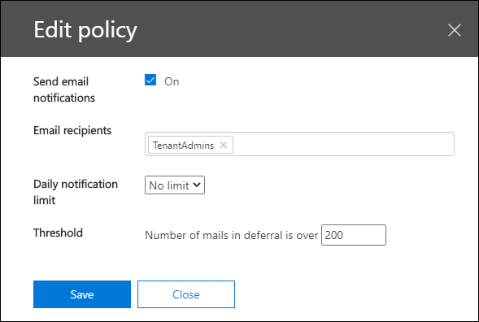
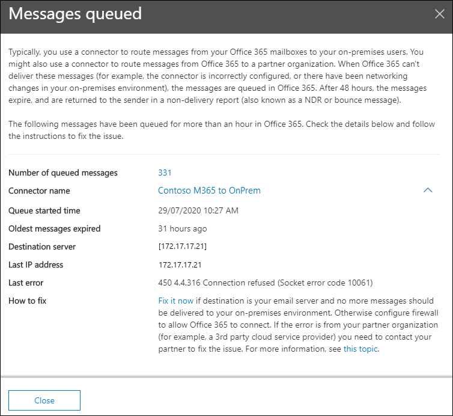

# Warteschlangen Einblicke im Security & Compliance Center

Wenn Nachrichten nicht über Connectors von Ihrer Organisation an Ihre lokalen oder Partner-e-Mail-Server gesendet werden können, werden die Nachrichten in Microsoft 365 in die Warteschlange eingereiht. Häufige Beispiele, die diese Bedingung verursachen, sind:

- Der Connector ist nicht ordnungsgemäß konfiguriert.
- In Ihrer lokalen Umgebung wurden Netzwerk-oder Firewall-Änderungen vorgenommen.

Microsoft 365 fährt fort, die Zustellung für 24 Stunden zu wiederholen. Nach 24 Stunden laufen die Nachrichten ab und werden an die Absender in Unzustellbarkeitsberichten (auch als Unzustellbarkeitsberichte oder Bounce-Nachrichten bezeichnet) zurückgegeben.

Wenn das e-Mail-Volumen in der Warteschlange den vordefinierten Schwellenwert überschreitet (der Standardwert ist 200 Nachrichten), stehen die Informationen an den folgenden Speicherorten zur Verfügung:

- Die **Queues** Insight im [Nachrichtenfluss-Dashboard](mail-flow-insights-v2.md) im Security & Compliance Center. Weitere Informationen finden Sie im Abschnitt " [Queues Insight" im Abschnitt "Nachrichtenfluss-Dashboard](#queues-insight-in-the-mail-flow-dashboard) " in diesem Thema.
  
- Im Alerts-Dashboard im [Security & Compliance Center](https://protection.office.com) (**Alerts** -Dashboard oder) wird eine **Warnung in den** Benachrichtigungen für Benachrichtigungen angezeigt \> **Dashboard** <https://protection.office.com/alertsdashboard> .

  

- Administratoren erhalten eine e-Mail-Benachrichtigung basierend auf der Konfiguration der Standard Warnungs Richtlinie mit dem Namen " **Nachrichten wurden verzögert**. Informationen zum Konfigurieren der Benachrichtigungseinstellungen für diese Warnung finden Sie im nächsten Abschnitt.

  Weitere Informationen zu Warnungsrichtlinien finden Sie unter [Warnungsrichtlinien im Security & Compliance Center](../../compliance/alert-policies.md).

## Anpassen von Warteschlangen Warnungen

1. Wechseln Sie im [Security & Compliance Center](https://protection.office.com) **zu Alerts** \> **Alerts Policies** oder Open <https://protection.office.com/alertpolicies> .

2. Suchen und wählen Sie auf der Seite " **Warnungsrichtlinien** " die Richtlinie mit dem Namen " **Nachrichten wurden verzögert**" aus.

3. In der **Meldung verzögertes** Flyout, das geöffnet wird, können Sie die Warnung aktivieren oder deaktivieren und die Benachrichtigungseinstellungen konfigurieren.

   

   - **Status**: Sie können die Warnung aktivieren oder deaktivieren.

   - Grenzwert für **e-Mail-Empfänger** und **tägliche Benachrichtigung**: Klicken Sie auf **Bearbeiten** , um die folgenden Einstellungen zu konfigurieren:

4. Klicken Sie auf **Bearbeiten**, um die Benachrichtigungseinstellungen zu konfigurieren. Konfigurieren Sie im eingeblendeten **Editor-Richtlinien** Flyout die folgenden Einstellungen:

   - **Senden von e-Mail-Benachrichtigungen**: der Standardwert ist "on".
   - **E-Mail-Empfänger**: der Standardwert ist **TenantAdmins**.
   - **Grenzwert für tägliche Benachrichtigung**: der Standardwert ist **No Limit**.
   - **Threshold**: der Standardwert ist 200.

   

5. Wenn Sie fertig sind, klicken Sie auf **Speichern** und **Schließen**.

## Queues Insight im Nachrichtenfluss-Dashboard

Auch wenn das Nachrichten Volume in der Warteschlange den Schwellenwert nicht überschreitet und eine Warnung generiert hat, können Sie weiterhin die **Warteschlangen** Einblicke im [Nachrichtenfluss-Dashboard](mail-flow-insights-v2.md) verwenden, um Nachrichten anzuzeigen, die länger als eine Stunde in die Warteschlange gestellt wurden, und Aktionen durchführen, bevor die Anzahl der in der Warteschlange befindlichen Nachrichten zu groß wird.

Wenn Sie auf die Anzahl der Nachrichten im Widget klicken, wird ein Flyout mit **Nachrichten in der Warteschlange** mit den folgenden Informationen angezeigt:

- **Anzahl von Nachrichten in der Warteschlange**
- **Connectorname**: Klicken Sie auf den Namen des Connectors, um den Connector im Exchange Admin Center (EAC) zu verwalten.
- **Warteschlangen-Anfangszeit**
- **Älteste Nachrichten abgelaufen**
- **Zielserver**
- **Letzte IP-Adresse**
- **Letzter Fehler**
- **Beheben von**Problemen: häufige Probleme und Lösungen sind verfügbar. Wenn es sich um einen **Fix-jetzt** -Link handelt, klicken Sie darauf, um das Problem zu beheben. Klicken Sie andernfalls auf alle verfügbaren Links, um weitere Informationen zu dem Fehler und möglichen Lösungen zu erhalten.

Das gleiche Flyout wird angezeigt, nachdem Sie in den Details einer **verzögerten Warnung Nachrichten** auf **Warteschlange anzeigen** klicken.

## Weitere Artikel

Informationen zu weiteren Einblicken im Nachrichtenfluss-Dashboard finden Sie unter [Mail Flow Insights in the Security & Compliance Center](mail-flow-insights-v2.md).
