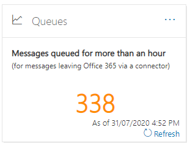

# Einblicke in Warteschlangen im Security & Compliance CenterQueues insight in the Security & Compliance Center

[!INCLUDE [Microsoft 365 Defender rebranding](../includes/microsoft-defender-for-office.md)]

**Gilt für****Applies to**
- [Exchange Online ProtectionExchange Online Protection](https://go.microsoft.com/fwlink/?linkid=2148611)
- [Microsoft Defender für Office 365 Plan 1 und Plan 2Microsoft Defender for Office 365 plan 1 and plan 2](https://go.microsoft.com/fwlink/?linkid=2148715)
- [Microsoft 365 DefenderMicrosoft 365 Defender](https://go.microsoft.com/fwlink/?linkid=2118804)

Wenn Nachrichten nicht über Connectors von Ihrer Organisation an Ihre lokalen oder Partner-E-Mail-Server gesendet werden können, werden die Nachrichten in microsoft 365 in die Warteschlange gestellt.When messages can't be sent from your organization to your on-premises or partner email servers using connectors, the messages are queued in Microsoft 365. Häufige Beispiele für diese Bedingung sind:Common examples that cause this condition are:

- Der Connector ist falsch konfiguriert.The connector is incorrectly configured.
- In Ihrer lokalen Umgebung wurden Netzwerk- oder Firewalländerungen vorgenommen.There have been networking or firewall changes in your on-premises environment.

Microsoft 365 retry to delivery for 24 hours.Microsoft 365 will continue to retry to delivery for 24 hours. Nach 24 Stunden laufen die Nachrichten ab und werden in Unzustellbarkeitsberichten (auch als Unzustellbarkeitsnachrichten oder Unzustellbarkeitsnachrichten bekannt) an die Absender zurückgesendet.After 24 hours, the messages will expire and will be returned to the senders in non-delivery reports (also known as a NDRs or bounce messages).

Wenn das E-Mail-Volume in der Warteschlange den vordefinierten Schwellenwert überschreitet (der Standardwert ist 200 Nachrichten), stehen die Informationen an den folgenden Speicherorten zur Verfügung:If the queued email volume exceeds the pre-defined threshold (the default value is 200 messages), the information is available in the following locations:

- Der **Einblick in Warteschlangen** im [Nachrichtenflussdashboard](mail-flow-insights-v2.md) im [Security & Compliance Center.](https://protection.office.com)The **Queues** insight in the [Mail flow dashboard](mail-flow-insights-v2.md) in the [Security & Compliance Center](https://protection.office.com). Weitere Informationen finden Sie in den Einblicken in Warteschlangen im Abschnitt zum [Nachrichtenflussdashboard](#queues-insight-in-the-mail-flow-dashboard) in diesem Artikel.For more information, see the [Queues insight in the Mail flow dashboard](#queues-insight-in-the-mail-flow-dashboard) section in this article.

- Eine Warnung wird  im Dashboard "Warnungen" im Security & Compliance Center **(Dashboard** für Warnungen oder ) in [den](https://protection.office.com) letzten Warnungen \>  <https://protection.office.com/alertsdashboard> angezeigt.An alert is displayed in **Recent alerts** the Alerts dashboard in the [Security & Compliance Center](https://protection.office.com) (**Alerts** \> **Dashboard** or <https://protection.office.com/alertsdashboard>).

  

- Administratoren erhalten eine E-Mail-Benachrichtigung, die auf der Konfiguration der standardmäßigen Warnungsrichtlinie namens **"Nachrichten wurden verzögert" basiert.**Admins will receive an email notification based on the configuration of the default alert policy named **Messages have been delayed**. Informationen zum Konfigurieren der Benachrichtigungseinstellungen für diese Warnung finden Sie im nächsten Abschnitt.To configure the notification settings for this alert, see the next section.

  Weitere Informationen zu Warnungsrichtlinien finden Sie unter [Warnungsrichtlinien im Security & Compliance Center](../../compliance/alert-policies.md).For more information about alert policies, see [Alert policies in the Security & Compliance Center](../../compliance/alert-policies.md).

## Anpassen von WarteschlangenwarnungenCustomize queue alerts

1. Wechseln Sie [im Security & Compliance Center](https://protection.office.com)zu Warnungsrichtlinien,  \> **oder** öffnen Sie . <https://protection.office.com/alertpolicies>In the [Security & Compliance Center](https://protection.office.com), go to **Alerts** \> **Alert policies** or open <https://protection.office.com/alertpolicies>.

2. Suchen Und wählen **Sie auf der** Seite "Warnungsrichtlinien" die Richtlinie mit dem Namen **"Nachrichten wurden verzögert" aus.**On the **Alert policies** page, find and select the policy named **Messages have been delayed**.

3. Im **flyout "Nachricht wurde verzögert",** das geöffnet wird, können Sie die Warnung aktivieren oder deaktivieren und die Benachrichtigungseinstellungen konfigurieren.In the **Message have been delayed** flyout that opens, you can turn the alert on or off and configure the notification settings.

   

   - **Status:** Sie können die Warnung ein- oder ausschalten.**Status**: You can toggle the alert on or off.

   - **E-Mail-Empfänger** **und Grenzwert für tägliche Benachrichtigungen:** Klicken Sie auf **"Bearbeiten",** um die folgenden Einstellungen zu konfigurieren:**Email recipients** and **Daily notification limit**: Click **Edit** to configure the following settings:

4. Klicken Sie auf Bearbeiten, um die Benachrichtigungseinstellungen **zu konfigurieren.**To configure the notification settings, click **Edit**. Konfigurieren Sie **im angezeigten** Flyout "Richtlinie bearbeiten" die folgenden Einstellungen:In the **Edit policy** flyout that appears, configure the following settings:

   - **E-Mail-Benachrichtigungen** senden: Der Standardwert ist aktiviert.**Send email notifications**: The default value is on.
   - **E-Mail-Empfänger:** Der Standardwert ist **TenantAdmins**.**Email recipients**: The default value is **TenantAdmins**.
   - **Grenzwert für tägliche** Benachrichtigungen: Der Standardwert ist **"No limit".****Daily notification limit**: The default value is **No limit**.
   - **Schwellenwert:** Der Standardwert ist 200.**Threshold**: The default value is 200.

   

5. Wenn Sie fertig sind, klicken Sie auf **"Speichern"** und **"Schließen".**When you're finished, click **Save** and **Close**.

## Einblick in Warteschlangen im NachrichtenflussdashboardQueues insight in the Mail flow dashboard

Auch wenn das Nachrichtenvolume in der Warteschlange den Schwellenwert nicht überschritten  und eine Warnung  generiert hat, können Sie die Einblicke in Warteschlangen im Nachrichtenflussdashboard verwenden, um Nachrichten anzuzeigen, die länger als eine Stunde in die Warteschlange eingereiht wurden, und Maßnahmen ergreifen, bevor die Anzahl der in die Warteschlange eingereihten Nachrichten zu groß wird.Even if the queued message volume hasn't exceeded the threshold and generated an alert, you can still use the **Queues** insight in the [Mail flow dashboard](mail-flow-insights-v2.md) to see messages that have been queued for more than one hour, and take action before the number of queued messages becomes too large.

Wenn Sie auf die Anzahl der  Nachrichten im Widget klicken, wird ein Flyout in der Warteschlange mit den folgenden Informationen angezeigt:If you click the number of messages on the widget, a **Messages queued** flyout appears with the following information:

- **Anzahl der Nachrichten in der Warteschlange****Number of queued messages**
- **Connectorname:** Klicken Sie auf den Connectornamen, um den Connector im Exchange Admin Center (EAC) zu verwalten.**Connector name**: Click on the connector name to manage the connector in the Exchange admin center (EAC).
- **Startzeit der Warteschlange****Queue started time**
- **Älteste Nachrichten sind abgelaufen****Oldest messages expired**
- **Zielserver****Destination server**
- **Letzte IP-Adresse****Last IP address**
- **Letzter Fehler****Last error**
- **Problembehebt:** Häufige Probleme und Lösungen sind verfügbar.**How to fix**: Common issues and solutions are available. If is a **Fix it now** link is available, click it to fix the problem.If is a **Fix it now** link is available, click it to fix the problem. Klicken Sie andernfalls auf alle verfügbaren Links, um weitere Informationen zu dem Fehler und möglichen Lösungen zu erhalten.Otherwise, click on any available links for more information about the error and possible solutions.

Das gleiche Flyout wird angezeigt, nachdem Sie **in** den Details einer Benachrichtigung auf "Warteschlange anzeigen" **geklickt** haben.The same flyout is displayed after you click **View queue** in the details of a **Messages have been delayed** alert.

## Siehe auchSee also

Weitere Informationen zu anderen Einblicken im Nachrichtenflussdashboard finden Sie unter "Einblicke in den Nachrichtenfluss" [im Security & Compliance Center.](mail-flow-insights-v2.md)For information about other insights in the Mail flow dashboard, see [Mail flow insights in the Security & Compliance Center](mail-flow-insights-v2.md).
