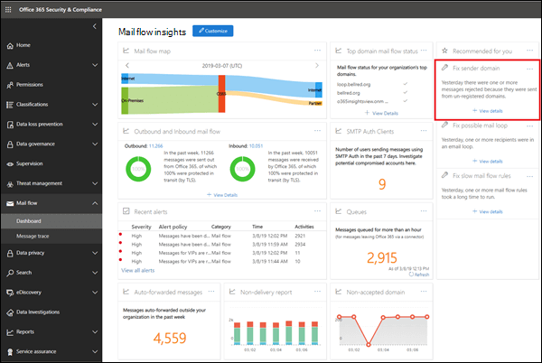
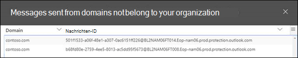

# Einblick in Absenderdomäne

Microsoft 365 erfordert Nachrichten, die von internen lokalen e-Mail-Umgebungen an Microsoft 365 gesendet werden, um bestimmte Sicherheitskriterien zu erfüllen:

- Sie haben in Microsoft 365 einen eingehenden Connector erstellt, um SMTP-Verbindungen von Ihrem lokalen e-Mail-Server mithilfe der Quell-IP-Adresse oder eines Zertifikats zu authentifizieren.

- Sie haben ihren lokalen e-Mail-Server so konfiguriert, dass e-Mails über Microsoft 365 an externe weltweiter geleitet werden.

- In Ihrer Konfiguration ist eine der folgenden Aussagen zutreffend:

  - Die e-Mail-Domäne des Absenders ist in Ihrer Organisation registriert. Weitere Informationen finden Sie unter Hinzufügen von Domänen in Office 365.

  - Der lokale e-Mail-Server ist für die Verwendung eines Zertifikats zum Senden von e-Mails an Microsoft 365 konfiguriert, das Zertifikat enthält einen Domänennamen, den Sie in Microsoft 365 registriert haben, oder stimmt genau überein und Sie haben einen zertifikatbasierten Connector in Microsoft 365 mit dieser Domäne erstellt. 

Nachrichten, die die Kriterien nicht erfüllen, werden nicht der Organisation zugeordnet und können zurückgewiesen werden.

Das **Fix Sender Domain** Insight zeigt Ihnen e-Mails von Ihrer lokalen Umgebung, die die Kriterien nicht erfüllen, unterstützt Sie bei der Ermittlung potenziell gefährdeter Computer und Benutzerkonten in Ihrer lokalen e-Mail-Umgebung und unterstützt Sie bei der Durchführung von Korrekturaktionen.

Wenn Sie auf **Details anzeigen**klicken, werden Sie zu einem anderen Widget mit weiteren Details weitergeleitet, wie im folgenden Diagramm dargestellt:

Sie sehen den eingehenden Connector, der für die Zustellung der Nachrichten an Office 365 verwendet wurde. Sie können auch auf **Beispiel Meldungs-IDs anzeigen** klicken, um Details zu den Nachrichten anzuzeigen, die von Ihrer lokalen e-Mail-Umgebung gesendet wurden. Da diese Nachrichten von Office 365 abgelehnt wurden, können Sie die Nachrichtenablaufverfolgung nicht verwenden, aber Sie können die Beispiel Nachrichten-IDs verwenden, um die Nachrichten in Ihrer lokalen e-Mail-Umgebung nachzuverfolgen.

## Siehe auch

Weitere Informationen zu anderen e-Mail-Fluss-Einblicken im Nachrichtenfluss-Dashboard finden Sie unter [Mail Flow Insights in the Security & Compliance Center](mail-flow-insights-v2.md).
