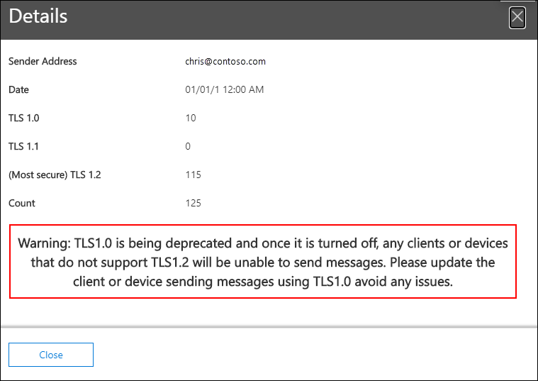

# Smtp-Authentifizierungsclients: Einblick und Bericht im Security & Compliance CenterSMTP Auth clients insight and report in the Security & Compliance Center

[!INCLUDE [Microsoft 365 Defender rebranding](../includes/microsoft-defender-for-office.md)]

**Gilt für****Applies to**
- [Exchange Online ProtectionExchange Online Protection](exchange-online-protection-overview.md)
- [Microsoft Defender für Office 365 Plan 1 und Plan 2Microsoft Defender for Office 365 plan 1 and plan 2](defender-for-office-365.md)
- [Microsoft 365 DefenderMicrosoft 365 Defender](../defender/microsoft-365-defender.md)

Die Einblicke der **SMTP-Authentifizierungsclients** im Nachrichtenflussdashboard und dem zugehörigen [SMTP-Authentifizierungsclientbericht](#smtp-auth-clients-report) im Security & Compliance Center unterstreichen die Verwendung des SMTP AUTH-Clientübermittlungsprotokolls durch Benutzer oder Systemkonten in Ihrer Organisation.  The **SMTP Auth clients** insight in the [Mail flow dashboard](mail-flow-insights-v2.md) and the associated [SMTP Auth clients report](#smtp-auth-clients-report) in the [Security & Compliance Center](https://protection.office.com) highlight the use of the SMTP AUTH client submission protocol by users or system accounts in your organization. Dieses Legacyprotokoll (das die Endpunkt-smtp.office365.com verwendet) bietet nur die Standardauthentifizierung und ist anfällig für die Verwendung durch gefährdete Konten zum Senden von E-Mails.This legacy protocol (which uses the endpoint smtp.office365.com) only offers Basic authentication, and is susceptible to being used by compromised accounts to send email. Mit dem Einblick und dem Bericht können Sie nach ungewöhnlichen Aktivitäten für SMTP-AUTH-E-Mail-Übermittlungen suchen.The insight and report allow you to check for unusual activity for SMTP AUTH email submissions. Außerdem werden die TLS-Verwendungsdaten für Clients oder Geräte mit SMTP AUTH angezeigt.It also shows the TLS usage data for clients or devices using SMTP AUTH.

Das Widget gibt die Anzahl der Benutzer oder Dienstkonten an, die das SMTP-Authentifizierungsprotokoll in den letzten 7 Tagen verwendet haben.The widget indicates the number of users or service accounts that have used the SMTP Auth protocol in the last 7 days.

Wenn Sie auf die Anzahl der Nachrichten im Widget klicken, wird ein Flyout für **SMTP-Authentifizierungsclients** angezeigt.If you click the number of messages on the widget, an **SMTP Auth clients** flyout appears. Das Flyout bietet eine aggregierte Ansicht der TLS-Nutzung und der Volumes für die letzte Woche.The flyout provides an aggregated view of the TLS usage and volumes for the last week.

Sie können auf den **Link SMTP-Authentifizierungsclients klicken,** um zum SMTP-Authentifizierungsclientbericht zu wechseln, wie im nächsten Abschnitt beschrieben.You can click the **SMTP Auth clients report** link to go to the SMTP Auth clients report as described in the next section.

## SMTP-Auth-ClientberichtSMTP Auth clients report

### Berichtsansicht für den SMTP-AuthentifizierungsclientberichtReport view for the SMTP Auth clients report

Standardmäßig werden im Bericht Daten für die letzten 7 Tage angezeigt, daten sind jedoch für die letzten 90 Tage verfügbar.By default, the report shows data for the last 7 days, but data is available for the last 90 days.

Der Abschnitt Übersicht enthält die folgenden Diagramme:The overview section contains the following charts:

- **Daten anzeigen nach:** Sendevolume : Standardmäßig zeigt das Diagramm die Anzahl der SMTP Auth-Clientnachrichten an, die von allen Domänen gesendet wurden ( Daten anzeigen **für: Alle** Absenderdomänen sind standardmäßig ausgewählt).**View data by: Sending volume**: By default, the chart shows the number of SMTP Auth client messages that were sent from all domains (**Show data for: All sender domains** is selected by default). Sie können die Ergebnisse in eine bestimmte  Absenderdomäne filtern, indem Sie in der Dropdownliste auf Daten für anzeigen klicken und die Absenderdomäne auswählen.You can filter the results to a specific sender domain by clicking **Show data for** and selecting the sender domain from the dropdown list. Wenn Sie auf einen bestimmten Datenpunkt (Tag) zeigen, wird die Anzahl der Nachrichten angezeigt.If you hover a specific data point (day), the number of messages is shown.

  

- **Daten anzeigen nach: TLS-Verwendung**: Das Diagramm zeigt den Prozentsatz der TLS-Nutzung für alle SMTP-Authentifizierungsclientnachrichten während des ausgewählten Zeitraums an.**View data by: TLS Usage**: The chart shows the percentage of TLS usage for all SMTP Auth client messages during the selected time period. In diesem Diagramm können Sie Benutzer und Systemkonten identifizieren und aktionen, die noch ältere Versionen von TLS verwenden.This chart allows you to identify and take action on users and system accounts that are still using older versions of TLS.

  

Wenn Sie **in** einer Berichtsansicht auf Filter klicken, können Sie einen Datumsbereich mit **Startdatum** und **Enddatum angeben.**If you click **Filters** in a report view, you can specify a date range with **Start date** and **End date**.

Klicken **Sie auf Bericht anfordern,** um eine ausführlichere Version des Berichts in einer E-Mail-Nachricht zu erhalten.Click **Request report** to receive a more detailed version of the report in an email message. Sie können den Datumsbereich und die Empfänger angeben, die den Bericht empfangen sollen.You can specify the date range and the recipients to receive the report.

### Detailtabelle für den SMTP-AuthentifizierungsclientberichtDetails table view for the SMTP Auth clients report

Wenn Sie auf **Detailtabelle anzeigen klicken,** hängen die angezeigten Informationen von dem Diagramm ab, das Sie sich angeschaut haben:If you click **View details table**, the information that's shown depends on the chart you were looking at:

- **Daten anzeigen nach: Sendevolume**: Die folgenden Informationen werden in einer Tabelle angezeigt:**View data by: Sending volume**: The following information is shown in a table:

  - **Absenderadresse****Sender address**
  - **Anzahl der Nachrichten****Message count**

  Wenn Sie eine Zeile auswählen, werden dieselben Details in einem Flyout angezeigt.If you select a row, the same details are shown in a flyout.

- **Daten anzeigen nach: TLS-Verwendung**: Die folgenden Informationen werden in einer Tabelle angezeigt:**View data by: TLS Usage**: The following information is shown in a table:

  - **Absenderadresse****Sender address**
  - **TLS1.0%**\***TLS1.0%**\*
  - **TLS1.1%**\***TLS1.1%**\*
  - **TLS1,2%**\***TLS1.2%**\*
  - **Anzahl der Nachrichten****Message count**

  \* Diese Spalte zeigt sowohl den Prozentsatz als auch die Anzahl der Nachrichten vom Absender an.\* This column shows both the percentage and number of messages from the sender.

Wenn Sie in einer **Detailtabelle** auf Filter klicken, können Sie einen Datumsbereich mit **Startdatum** und **Enddatum angeben.**If you click **Filters** in a details table view, you can specify a date range with **Start date** and **End date**.

Wenn Sie eine Zeile auswählen, werden ähnliche Details in einem Flyout angezeigt:If you select a row, similar details are shown in a flyout:

Klicken **Sie auf Bericht anfordern,** um eine ausführlichere Version des Berichts in einer E-Mail-Nachricht zu erhalten.Click **Request report** to receive a more detailed version of the report in an email message. Sie können den Datumsbereich und die Empfänger angeben, die den Bericht empfangen sollen.You can specify the date range and the recipients to receive the report.

Klicken Sie auf Bericht anzeigen, um zur Berichtsansicht **zurück zu wechseln.**To go back to the reports view, click **View report**.

## Verwandte ThemenRelated topics

Weitere Informationen zu anderen Erkenntnissen im Nachrichtenflussdashboard finden Sie unter Einblicke in den Nachrichtenfluss [im Security & Compliance Center](mail-flow-insights-v2.md).For information about other insights in the Mail flow dashboard, see [Mail flow insights in the Security & Compliance Center](mail-flow-insights-v2.md).
