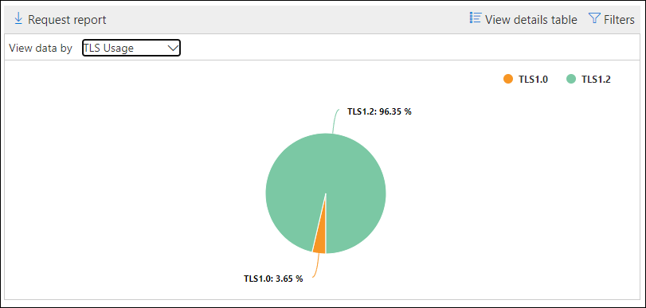

# Einblicke und Berichte von SMTP-Authentifizierungsclients im Security & Compliance CenterSMTP Auth clients insight and report in the Security & Compliance Center

Die Einblicke der **SMTP-Authentifizierungsclients** im [Nachrichtenfluss-Dashboard](mail-flow-insights-v2.md) und den zugeordneten [SMTP AUTH Clients-Bericht](#smtp-auth-clients-report) im [Security & Compliance Center](https://protection.office.com) heben die Verwendung des SMTP-Authentifizierungs Client-Übermittlungsprotokolls durch Benutzer oder Systemkonten in Ihrer Organisation hervor.The **SMTP Auth clients** insight in the [Mail flow dashboard](mail-flow-insights-v2.md) and the associated [SMTP Auth clients report](#smtp-auth-clients-report) in the [Security & Compliance Center](https://protection.office.com) highlight the use of the SMTP AUTH client submission protocol by users or system accounts in your organization. Dieses Legacy Protokoll (das den Endpunkt SMTP.office365.com verwendet) bietet nur die Standardauthentifizierung und ist anfällig für die Verwendung durch kompromittierte Konten zum Senden von e-Mails.This legacy protocol (which uses the endpoint smtp.office365.com) only offers Basic authentication, and is susceptible to being used by compromised accounts to send email. Die Einblicke und der Bericht ermöglichen es Ihnen, nach ungewöhnlichen Aktivitäten für SMTP-e-Mail-Übermittlungen zu suchen.The insight and report allow you to check for unusual activity for SMTP AUTH email submissions. Außerdem werden die TLS-Nutzungsdaten für Clients oder Geräte mithilfe der SMTP-Authentifizierung angezeigt.It also shows the TLS usage data for clients or devices using SMTP AUTH.

Das Widget gibt die Anzahl der Benutzer oder Dienstkonten an, die in den letzten 7 Tagen das SMTP-Authentifizierungsprotokoll verwendet haben.The widget indicates the number of users or service accounts that have used the SMTP Auth protocol in the last 7 days.

Wenn Sie auf die Anzahl der Nachrichten im Widget klicken, wird ein Flyout für **SMTP-Authentifizierungsclients** angezeigt.If you click the number of messages on the widget, an **SMTP Auth clients** flyout appears. Das Flyout bietet eine aggregierte Ansicht der TLS-Nutzung und-Volumes für die letzte Woche.The flyout provides an aggregated view of the TLS usage and volumes for the last week.

Sie können auf den Link **SMTP AUTH Clients Report** klicken, um zum Bericht SMTP AUTH Clients zu wechseln, wie im nächsten Abschnitt beschrieben.You can click the **SMTP Auth clients report** link to go to the SMTP Auth clients report as described in the next section.

## SMTP-Auth-ClientberichtSMTP Auth clients report

### Berichtsansicht für den Bericht "SMTP AUTH Clients"Report view for the SMTP Auth clients report

Standardmäßig zeigt der Berichtdaten für die letzten 7 Tage an, aber Daten sind für die letzten 90 Tage verfügbar.By default, the report shows data for the last 7 days, but data is available for the last 90 days.

Der Overview-Abschnitt enthält die folgenden Diagramme:The overview section contains the following charts:

- **Daten nach: Sending Volume**: Standardmäßig zeigt das Diagramm die Anzahl von SMTP-AUTH-Client Nachrichten an, die von allen Domänen gesendet wurden (**Daten anzeigen für: alle Absenderdomänen** sind standardmäßig ausgewählt).**View data by: Sending volume**: By default, the chart shows the number of SMTP Auth client messages that were sent from all domains (**Show data for: All sender domains** is selected by default). Sie können die Ergebnisse auf eine bestimmte Absenderdomäne filtern, indem Sie in der Dropdownliste auf **Daten für anzeigen** und die Absenderdomäne auswählen klicken.You can filter the results to a specific sender domain by clicking **Show data for** and selecting the sender domain from the dropdown list. Wenn Sie auf einen bestimmten Datenpunkt (Tag) zeigen, wird die Anzahl der Nachrichten angezeigt.If you hover a specific data point (day), the number of messages is shown.

  

- **Daten nach: TLS Usage**: das Diagramm zeigt den Prozentsatz der TLS-Nutzung für alle SMTP-AUTH-Client Nachrichten während des ausgewählten Zeitraums.**View data by: TLS Usage**: The chart shows the percentage of TLS usage for all SMTP Auth client messages during the selected time period. Dieses Diagramm ermöglicht es Ihnen, Benutzer und Systemkonten zu identifizieren und zu ergreifen, die noch ältere Versionen von TLS verwenden.This chart allows you to identify and take action on users and system accounts that are still using older versions of TLS.

  

Wenn Sie in einer Berichtsansicht auf **Filter** klicken, können Sie einen Datumsbereich mit **anfangs** -und **Enddatum**angeben.If you click **Filters** in a report view, you can specify a date range with **Start date** and **End date**.

Klicken Sie auf **Anforderungsbericht** , um eine detailliertere Version des Berichts in einer e-Mail-Nachricht zu erhalten.Click **Request report** to receive a more detailed version of the report in an email message. Sie können den Datumsbereich und die Empfänger angeben, um den Bericht zu empfangen.You can specify the date range and the recipients to receive the report.

### Tabellenansicht "Details" für den Bericht "SMTP AUTH Clients"Details table view for the SMTP Auth clients report

Wenn Sie auf **Detailtabelle anzeigen**klicken, hängt die Anzeige der angezeigten Informationen von dem Diagramm ab, das Sie gesucht haben:If you click **View details table**, the information that's shown depends on the chart you were looking at:

- **Daten anzeigen nach: Sending Volume**: die folgenden Informationen werden in einer Tabelle angezeigt:**View data by: Sending volume**: The following information is shown in a table:

  - **Absenderadresse****Sender address**
  - **Nachrichtenanzahl****Message count**

  Wenn Sie eine Zeile auswählen, werden dieselben Details in einem Flyout angezeigt.If you select a row, the same details are shown in a flyout.

- **Daten nach: TLS-Verwendung anzeigen**: die folgenden Informationen werden in einer Tabelle angezeigt:**View data by: TLS Usage**: The following information is shown in a table:

  - **Absenderadresse****Sender address**
  - **TLS 1.0%**\***TLS1.0%**\*
  - **TLS 1.1%**\***TLS1.1%**\*
  - **TLS 1.2%**\***TLS1.2%**\*
  - **Nachrichtenanzahl****Message count**

  \* In dieser Spalte werden sowohl der Prozentsatz als auch die Anzahl der Nachrichten des Absenders angezeigt.\* This column shows both the percentage and number of messages from the sender.

Wenn Sie in einer Detailtabellen Ansicht auf **Filter** klicken, können Sie einen Datumsbereich mit **anfangs** -und **Enddatum**angeben.If you click **Filters** in a details table view, you can specify a date range with **Start date** and **End date**.

Wenn Sie eine Zeile auswählen, werden ähnliche Details in einem Flyout angezeigt:If you select a row, similar details are shown in a flyout:

Klicken Sie auf **Anforderungsbericht** , um eine detailliertere Version des Berichts in einer e-Mail-Nachricht zu erhalten.Click **Request report** to receive a more detailed version of the report in an email message. Sie können den Datumsbereich und die Empfänger angeben, um den Bericht zu empfangen.You can specify the date range and the recipients to receive the report.

Klicken Sie auf **Bericht anzeigen**, um zur Ansicht Berichte zurückzukehren.To go back to the reports view, click **View report**.

## Verwandte ThemenRelated topics

Informationen zu weiteren Einblicken im Nachrichtenfluss-Dashboard finden Sie unter [Mail Flow Insights in the Security & Compliance Center](mail-flow-insights-v2.md).For information about other insights in the Mail flow dashboard, see [Mail flow insights in the Security & Compliance Center](mail-flow-insights-v2.md).
