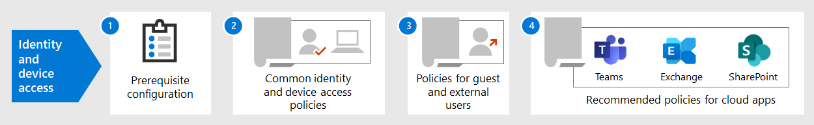

# Konfigurationen für den Identitäts- und Gerätezugriff

**Gilt für**
- [Exchange Online Protection](https://go.microsoft.com/fwlink/?linkid=2148611)
- [Microsoft Defender für Office 365 Plan 1 und Plan 2](https://go.microsoft.com/fwlink/?linkid=2148715)

Der moderne Sicherheitsperimeter Ihrer Organisation erstreckt sich jetzt über Ihr Netzwerk hinaus und umfasst Benutzer, die von jedem Standort aus mit einer Vielzahl von Geräten auf cloudbasierte Apps zugreifen. Ihre Sicherheitsinfrastruktur muss bestimmen, ob und unter welchen Bedingungen eine bestimmte Zugriffsanforderung gewährt werden soll.

Diese Bestimmung sollte auf dem Benutzerkonto der Anmeldung, dem verwendeten Gerät, der App, die der Benutzer für den Zugriff verwendet, dem Ort, von dem aus die Zugriffsanforderung erfolgt, und einer Bewertung des Risikos der Anforderung basieren. Diese Funktion trägt dazu bei, sicherzustellen, dass nur autorisierte Benutzer und Geräte auf Ihre kritischen Ressourcen zugreifen können.

In dieser Artikelreihe werden eine Reihe von Konfigurationen für identitäts- und gerätebasierte Zugriffsvoraussetzungen sowie ein Satz bedingter Azure Active Directory (Azure AD)-Zugriff, Microsoft Intune und andere Richtlinien zum Sichern des Zugriffs auf Microsoft 365 enterprise-Cloud-Apps und -Dienste, andere SaaS-Dienste und lokale Anwendungen beschrieben, die mit dem Azure AD-Anwendungsproxy veröffentlicht wurden.

Identitäts- und Gerätezugriffseinstellungen und -richtlinien werden in drei Ebenen empfohlen: Basisschutz, Schutz vertraulicher Daten und Schutz für Umgebungen mit streng regulierten oder vertraulichen Daten. Diese Ebenen und die entsprechenden Konfigurationen bieten einheitliche Schutzniveaus für Ihre Daten, Identitäten und Geräte.

Diese Funktionen und deren Empfehlungen:

- Werden in Microsoft 365 E3 und Microsoft 365 E5 unterstützt.
- Sie werden mit [der Microsoft Secure Score](https://docs.microsoft.com/microsoft-365/security/mtp/microsoft-secure-score) und der [Identitätsscore in Azure AD](https://docs.microsoft.com/azure/active-directory/fundamentals/identity-secure-score)abgestimmt und erhöhen diese Bewertungen für Ihre Organisation.
- Sie können diese fünf Schritte zum [Sichern Ihrer Identitätsinfrastruktur implementieren.](https://docs.microsoft.com/azure/security/azure-ad-secure-steps)

Wenn Ihre Organisation eindeutige Umgebungsanforderungen oder Komplexitäten hat, verwenden Sie diese Empfehlungen als Ausgangspunkt. Die meisten Organisationen können diese Empfehlungen jedoch wie vorgeschrieben implementieren.

> [!NOTE]
> Microsoft verkauft auch Enterprise Mobility + Security (EMS)-Lizenzen für Office 365-Abonnements. EMS E3- und EMS E5-Funktionen entsprechen denen in Microsoft 365 E3 und Microsoft 365 E5. Details [finden Sie in den EMS-Plänen.](https://www.microsoft.com/microsoft-365/enterprise-mobility-security/compare-plans-and-pricing)

## Zielgruppe

Diese Empfehlungen sind für Unternehmensarchitekten und IT-Experten gedacht, die mit microsoft 365-Cloud-Produktivitäts- und Sicherheitsdiensten vertraut sind, einschließlich Azure AD (Identität), Microsoft Intune (Geräteverwaltung) und Azure Information Protection (Datenschutz).

### Kundenumgebung

Die empfohlenen Richtlinien gelten für Unternehmen, die vollständig in der Microsoft Cloud arbeiten, und für Kunden mit hybrider Identitätsinfrastruktur, bei der es sich um eine lokale AD DS (Active Directory Domain Services)-Gesamtstruktur handelt, die mit einem Azure AD-Mandanten synchronisiert wird.

Viele der bereitgestellten Empfehlungen beruhen auf Diensten, die nur mit Lizenzen für Microsoft 365 E5, Microsoft 365 E3 mit dem Identity & Threat Protection-Add-On, EMS E5 oder Azure Premium P2 verfügbar sind.

Für Organisationen, die nicht über diese Lizenzen verfügen, empfiehlt Microsoft, dass Sie mindestens Sicherheitseinstellungen [implementieren,](https://docs.microsoft.com/azure/active-directory/fundamentals/concept-fundamentals-security-defaults)die in allen Microsoft 365-Plänen enthalten sind.

### Warnen

Ihre Organisation unterliegt möglicherweise behördlichen oder anderen Complianceanforderungen, einschließlich bestimmter Empfehlungen, die es erforderlich machen, Richtlinien anzuwenden, die von diesen empfohlenen Konfigurationen abweichen. Diese Konfigurationen empfehlen Verwendungssteuerelemente, die in der Vergangenheit nicht verfügbar waren. Wir empfehlen diese Steuerelemente, da sie unserer Meinung nach ein Gleichgewicht zwischen Sicherheit und Produktivität darstellen.

Wir haben unser Bestes getan, um eine Vielzahl von Organisatorischen Schutzanforderungen zu berücksichtigen, aber wir sind nicht in der Lage, alle möglichen Anforderungen oder alle einzigartigen Aspekte Ihrer Organisation zu berücksichtigen.

## Drei Schutzebenen

Die meisten Organisationen haben spezifische Anforderungen bezüglich Datensicherheit und Datenschutz. Diese Anforderungen variieren je nach Branche und Tätigkeiten im Unternehmen. Beispielsweise benötigen Ihre Rechtsabteilung und Administratoren möglicherweise zusätzliche Sicherheits- und Informationsschutzkontrollen für ihre E-Mail-Korrespondenz, die für andere Unternehmenseinheiten nicht erforderlich sind.

Jede Branche verfügt auch über ihren eigenen Satz von spezialisierten Vorschriften. Anstatt eine Liste aller möglichen Sicherheitsoptionen oder eine Empfehlung pro Branchensegment oder Stellenfunktion zur Verfügung zu stellen, wurden Empfehlungen für drei verschiedene Sicherheits- und Schutzebenen bereitgestellt, die basierend auf der Granularität Ihrer Anforderungen angewendet werden können.

- **Basisschutz:** Es wird empfohlen, einen Mindeststandard für den Schutz von Daten sowie die Identitäten und Geräte, die auf Ihre Daten zugreifen, zu erstellen. Sie können diese grundlegenden Empfehlungen befolgen, um einen starken Standardschutz zu bieten, der die Anforderungen vieler Organisationen erfüllt.
- **Schutz vertraulicher** Daten: Einige Kunden verfügen über eine Teilmenge von Daten, die auf höheren Ebenen geschützt werden müssen, oder sie erfordern möglicherweise, dass alle Daten auf einer höheren Ebene geschützt werden. Sie können einen erhöhten Schutz auf alle oder bestimmte Datensätze in Ihrer Microsoft 365-Umgebung anwenden. Es wird empfohlen, Identitäten und Geräte mit Zugriff auf sensible Daten mit einem vergleichbaren Grad an Sicherheit auszustatten.
- **Hochgradig reguliert:** Einige Organisationen verfügen möglicherweise über eine kleine Menge von Daten, die streng klassifiziert sind, Geschäftsgeheimnisse darstellen oder regulierte Daten sind. Microsoft stellt Funktionen bereit, die es Organisationen ermöglichen, diese Anforderungen zu erfüllen, wie etwa den zusätzlichen Schutz von Identitäten und Geräten.

Dieser Leitfaden zeigt Ihnen, wie Sie den Schutz für Identitäten und Geräte für jede dieser Schutzebenen implementieren. Verwenden Sie diese Anleitung als Ausgangspunkt für Ihre Organisation, und passen Sie die Richtlinien an die spezifischen Anforderungen Ihrer Organisation an.

Es ist wichtig, konsistente Schutzebenen für Daten, Identitäten und Geräte zu verwenden. Wenn Sie beispielsweise diese Anleitung implementieren, müssen Sie Ihre Daten auf vergleichbaren Ebenen schützen.

Das **Identitäts- und Geräteschutzmodell für Microsoft 365** zeigt Ihnen, welche Funktionen vergleichbar sind.

   [Als PDF anzeigen](../../downloads/MSFT_cloud_architecture_identity&device_protection.pdf) \| [Als PDF herunterladen](https://github.com/MicrosoftDocs/microsoft-365-docs/raw/public/microsoft-365/downloads/MSFT_cloud_architecture_identity&device_protection.pdf) \| [Als Visio herunterladen](https://github.com/MicrosoftDocs/microsoft-365-docs/raw/public/microsoft-365/downloads/MSFT_cloud_architecture_identity&device_protection.vsdx)  

Lesen Sie außerdem die [Lösung zum Bereitstellen von Informationsschutz für Datenschutzbestimmungen,](../../solutions/information-protection-deploy.md) um in Microsoft 365 gespeicherte Informationen zu schützen.

## Kompromisse in den Bereichen Sicherheit und Produktivität

Die Implementierung jeder Sicherheitsstrategie erfordert einen Trade-off zwischen Sicherheit und Produktivität. Es ist hilfreich zu bewerten, wie sich jede Entscheidung auf das Gleichgewicht von Sicherheit, Funktionalität und Benutzerfreundlichkeit auswirkt.

Die bereitgestellten Empfehlungen basieren auf den folgenden Grundsätzen:

- Kennen Sie Ihre Benutzer, und gestalten Sie ihre Sicherheits- und Funktionalen Anforderungen flexibel.
- Wenden Sie eine Sicherheitsrichtlinie just in time an, und stellen Sie sicher, dass sie sinnvoll ist.

## Dienste und Konzepte für den Identitäts- und Gerätezugriffsschutz

Microsoft 365 Enterprise wurde für große Organisationen entwickelt, um allen Personen zu ermöglichen, kreativ zu sein und sicher zusammen zu arbeiten.

Dieser Abschnitt enthält eine Übersicht über die Microsoft 365-Dienste und -Funktionen, die für den Identitäts- und Gerätezugriff wichtig sind.

### Azure AD

Azure AD bietet eine vollständige Suite von Identitätsverwaltungsfunktionen. Es wird empfohlen, diese Funktionen zum Sichern des Zugriffs zu verwenden.

|Funktion oder Feature|Beschreibung|Lizenzierung|
|---|---|---|
|[Mehrstufige Authentifizierung (MFA)](/azure/active-directory/authentication/concept-mfa-howitworks)|MFA erfordert, dass Benutzer zwei Arten der Überprüfung bereitstellen, z. B. ein Benutzerkennwort sowie eine Benachrichtigung von der Microsoft Authenticator-App oder einem Telefonanruf. MFA reduziert das Risiko, dass gestohlene Anmeldeinformationen für den Zugriff auf Ihre Umgebung verwendet werden können, erheblich. Microsoft 365 verwendet den Azure AD Multi-Factor Authentication-Dienst für MFA-basierte Anmeldungen.|Microsoft 365 E3 oder E5|
|[Bedingter Zugriff](/azure/active-directory/conditional-access/overview)|Azure AD wertet die Bedingungen der Benutzer-Anmeldung aus und verwendet Richtlinien für bedingten Zugriff, um den zulässigen Zugriff zu ermitteln. In diesem Leitfaden wird beispielsweise gezeigt, wie Sie eine Richtlinie für bedingten Zugriff erstellen, um die Gerätekonformität für den Zugriff auf vertrauliche Daten zu verlangen. Dadurch wird das Risiko erheblich reduziert, dass ein Hacker mit seinem eigenen Gerät und gestohlenen Anmeldeinformationen auf Ihre vertraulichen Daten zugreifen kann. Außerdem werden vertrauliche Daten auf den Geräten geschützt, da die Geräte bestimmte Anforderungen für Integrität und Sicherheit erfüllen müssen.|Microsoft 365 E3 oder E5|
|[Azure AD-Gruppen](/azure/active-directory/fundamentals/active-directory-manage-groups)|Richtlinien für bedingten Zugriff, Geräteverwaltung mit Intune und sogar Berechtigungen für Dateien und Websites in Ihrer Organisation beruhen auf der Zuweisung zu Benutzerkonten oder Azure AD-Gruppen. Es wird empfohlen, Azure AD-Gruppen zu erstellen, die den Schutzebenen entsprechen, die Sie implementieren. Beispielsweise sind Ihre Führungskräfte wahrscheinlich höhere Ziele für Hacker. Daher ist es sinnvoll, die Benutzerkonten dieser Mitarbeiter einer Azure AD-Gruppe hinzuzufügen und diese Gruppe Richtlinien für bedingten Zugriff und anderen Richtlinien zuzuordnen, die ein höheres Schutzniveau für den Zugriff erzwingen.|Microsoft 365 E3 oder E5|
|[Geräteregistrierung](/azure/active-directory/devices/overview)|Sie registrieren ein Gerät bei Azure AD, um eine Identität für das Gerät zu erstellen. Diese Identität wird verwendet, um das Gerät zu authentifizieren, wenn sich ein Benutzer anmeldet, und um Richtlinien für bedingten Zugriff anzuwenden, die in die Domäne getretene oder kompatible PCs erfordern. Für diese Anleitung verwenden wir die Geräteregistrierung, um automatisch in die Domäne beigetretene Windows-Computer zu registrieren. Die Geräteregistrierung ist eine Voraussetzung für die Verwaltung von Geräten mit Intune.|Microsoft 365 E3 oder E5|
|[Azure AD Identity Protection](/azure/active-directory/identity-protection/overview)|Ermöglicht es Ihnen, potenzielle Sicherheitsrisiken zu erkennen, die sich auf die IdentitätEn Ihrer Organisation auszunutzen, und eine automatisierte Wartungsrichtlinie für ein niedriges, mittleres und hohes Anmelde- und Benutzerrisiko zu konfigurieren. Dieser Leitfaden basiert auf dieser Risikobewertung, um Richtlinien für bedingten Zugriff für die mehrstufige Authentifizierung anzuwenden. Dieser Leitfaden enthält auch eine Richtlinie für bedingten Zugriff, die erfordert, dass Benutzer ihr Kennwort ändern, wenn für ihr Konto Aktivität mit hohem Risiko erkannt wird.|Microsoft 365 E5, Microsoft 365 E3 mit dem Identity & Threat Protection-Add-On, EMS E5- oder Azure Premium -P2-Lizenzen|
|[Self-Service-Kennwortzurücksetzung (SSPR)](/azure/active-directory/authentication/concept-sspr-howitworks)|Ermöglichen Sie Ihren Benutzern, ihre Kennwörter sicher und ohne Eingreifen des Helpdesks zurückzusetzen, indem Sie die Überprüfung mehrerer Authentifizierungsmethoden bereitstellen, die der Administrator steuern kann.|Microsoft 365 E3 oder E5|
|[Azure AD-Kennwortschutz](https://docs.microsoft.com/azure/active-directory/authentication/concept-password-ban-bad)|Erkennen und blockieren Sie bekannte schwache Kennwörter und deren Varianten sowie zusätzliche schwache Begriffe, die für Ihre Organisation spezifisch sind. Listen standardmäßig global gesperrter Kennwörter werden automatisch auf alle Benutzer in einem Azure AD-Mandanten angewendet. Sie können zusätzliche Einträge in einer benutzerdefinierten Liste gesperrter Kennwörter angeben. Wenn Benutzer ihre Kennwörter ändern oder zurücksetzen, werden diese Listen gesperrter Kennwörter überprüft, um die Verwendung von sicheren Kennwörtern zu erzwingen.|Microsoft 365 E3 oder E5|
|

Hier sind die Komponenten des Identitäts- und Gerätezugriffs, einschließlich Intune- und Azure AD-Objekten, Einstellungen und Unterservices.

### Microsoft Intune

[Intune](https://docs.microsoft.com/intune/introduction-intune) ist der cloudbasierte Verwaltungsdienst für mobile Geräte von Microsoft. In diesem Leitfaden wird die Geräteverwaltung von Windows-PCs mit Intune und Richtlinienkonfigurationen für die Gerätekonformität empfohlen. Intune bestimmt, ob Geräte kompatibel sind, und sendet diese Daten an Azure AD, um sie beim Anwenden von Richtlinien für bedingten Zugriff zu verwenden.

#### Intune-App-Schutz

[Intune-App-Schutzrichtlinien](https://docs.microsoft.com/intune/app-protection-policy) können verwendet werden, um die Daten Ihrer Organisation in mobilen Apps zu schützen, mit oder ohne Registrierung von Geräten für die Verwaltung. Intune trägt zum Schutz von Informationen bei, stellt sicher, dass Ihre Mitarbeiter weiterhin produktiv sein können, und verhindert Datenverluste. Durch die Implementierung von Richtlinien auf App-Ebene können Sie den Zugriff auf Unternehmensressourcen einschränken und Daten in der Kontrolle Ihrer IT-Abteilung behalten.

Dieser Leitfaden zeigt Ihnen, wie Sie empfohlene Richtlinien erstellen, um die Verwendung genehmigter Apps zu erzwingen und um zu bestimmen, wie diese Apps mit Ihren Geschäftsdaten verwendet werden können.

### Microsoft 365

Dieser Leitfaden zeigt Ihnen, wie Sie eine Reihe von Richtlinien implementieren, um den Zugriff auf Microsoft 365-Clouddienste, einschließlich Microsoft Teams, Exchange Online, SharePoint Online und OneDrive for Business, zu schützen. Zusätzlich zur Implementierung dieser Richtlinien empfehlen wir, dass Sie auch das Schutzniveau für Ihren Mandanten erhöhen, indem Sie die folgenden Ressourcen verwenden:

- [Konfigurieren Ihres Mandanten für höhere Sicherheit](tenant-wide-setup-for-increased-security.md)

  Empfehlungen, die für die grundlegende Sicherheit für Ihren Mandanten gelten.

- [Sicherheitsplan: Die wichtigsten Prioritäten für die ersten 30 Tage, 90 Tage und darüber hinaus](security-roadmap.md)

  Empfehlungen, die Protokollierung, Datensteuerung, Administratorzugriff und Bedrohungsschutz umfassen.

### Windows 10 und Microsoft 365 Apps for Enterprise

Windows 10 mit Microsoft 365 Apps for Enterprise ist die empfohlene Clientumgebung für PCs. Wir empfehlen Windows 10, da Azure darauf ausgelegt ist, sowohl für lokale als auch für Azure AD ein möglichst reibungsloses Erlebnis zu bieten. Windows 10 umfasst auch erweiterte Sicherheitsfunktionen, die über Intune verwaltet werden können. Microsoft 365 Apps for Enterprise enthält die neuesten Versionen von Office-Anwendungen. Diese verwenden die moderne Authentifizierung, die sicherer ist und eine Anforderung für bedingten Zugriff ist. Diese Apps umfassen auch erweiterte Sicherheits- und Compliancetools.

## Anwenden dieser Funktionen über die drei Schutzebenen hinweg

In der folgenden Tabelle sind unsere Empfehlungen für die Verwendung dieser Funktionen über die drei Schutzebenen hinweg zusammengefasst.

|Schutzmechanismus|Baseline|Vertraulich|Streng geregelt|
|---|---|---|---|
|**MFA erzwingen**|Bei mittlerem oder höherem Anmelderisiko|Bei niedrigem oder höherem Anmelderisiko|Auf alle neuen Sitzungen|
|**Erzwingen der Kennwortänderung**|Für Benutzer mit hohem Risiko|Für Benutzer mit hohem Risiko|Für Benutzer mit hohem Risiko|
|**Erzwingen des Intune-Anwendungsschutzes**|Ja|Ja|Ja|
|**Erzwingen der Registrierung von Intune für Geräte im Besitz der Organisation**|Fordern Sie einen kompatiblen oder in die Domäne beigetretenen PC an, aber lassen Sie bring-your-own-Devices (BYOD)-Telefone und -Tablets zu.|Ein kompatibles oder in die Domäne beigetretenes Gerät erforderlich|Ein kompatibles oder in die Domäne beigetretenes Gerät erforderlich|
|

## Gerätebesitz

Die obige Tabelle spiegelt den Trend wider, den viele Organisationen bei der Unterstützung einer Kombination aus unternehmenseigenen Geräten sowie persönlichen geräten oder BYODs haben, um die mobile Produktivität der gesamten Mitarbeiter zu ermöglichen. Intune-App-Schutzrichtlinien stellen sicher, dass E-Mails vor exfiltrieren aus der mobilen Outlook-App und anderen mobilen Office-Apps auf Geräten im Besitz der Organisation und BYODs geschützt sind.

Es wird empfohlen, geräte im Besitz der Organisation von Intune oder einer Domäne beigetreten zu sein, um zusätzliche Schutzmaßnahmen und Steuerung anzuwenden. Abhängig von der Vertraulichkeit von Daten lässt Ihre Organisation möglicherweise keine BYODs für bestimmte Benutzergruppen oder bestimmte Apps zu.

## Bereitstellung und Ihre Apps

Vor dem Konfigurieren und Bereitstellen der Identitäts- und Gerätezugriffskonfiguration für Ihre in Azure AD integrierten Apps müssen Sie:

- Entscheiden Sie, welche Apps in Ihrer Organisation geschützt werden.
- Analysieren Sie diese Liste von Apps, um die Richtliniensätze zu ermitteln, die geeignete Schutzebenen bieten.

  Sie sollten nicht für jede App separate Richtliniensätze erstellen, da deren Verwaltung mühlich werden kann. Microsoft empfiehlt, Ihre Apps zu gruppieren, die dieselben Schutzanforderungen für dieselben Benutzer haben.

  Sie könnten beispielsweise einen Satz von Richtlinien haben, die alle Microsoft 365-Apps für alle Ihre Benutzer für den grundlegenden Schutz und einen zweiten Satz von Richtlinien für alle vertraulichen Apps, z. B. die von Personal- oder Finanzabteilungen verwendeten, enthalten und diese auf diese Gruppen anwenden.

Nachdem Sie die Richtlinien für die apps bestimmt haben, die Sie sichern möchten, führen Sie die Richtlinien inkrementell für Ihre Benutzer aus, und beheben Sie dabei Probleme.

Konfigurieren Sie beispielsweise die Richtlinien, die für alle Ihre Microsoft 365-Apps nur für Exchange Online verwendet werden, mit den zusätzlichen Änderungen für Exchange. Führen Sie diese Richtlinien für Ihre Benutzer aus, und arbeiten Sie alle Probleme durch. Fügen Sie dann Teams mit den zusätzlichen Änderungen hinzu, und stellen Sie diese für Ihre Benutzer zur Verfügung. Fügen Sie dann SharePoint mit den zusätzlichen Änderungen hinzu. Fügen Sie die restlichen Apps so lange hinzu, bis Sie diese Basisrichtlinien so konfigurieren können, dass alle Microsoft 365-Apps enthalten sind.

Erstellen Sie auf ähnliche Weise für Ihre vertraulichen Apps den Richtliniensatz, fügen Sie eine App gleichzeitig hinzu, und arbeiten Sie alle Probleme durch, bis sie alle in den Richtliniensatz für vertrauliche Apps eingeschlossen sind.

Microsoft empfiehlt, keine Richtliniensätze zu erstellen, die für alle Apps gelten, da dies zu unbeabsichtigten Konfigurationen führen kann. Beispielsweise können Richtlinien, die alle Apps blockieren, Ihre Administratoren aus dem Azure-Portal sperren, und Ausschlüsse können nicht für wichtige Endpunkte wie Microsoft Graph konfiguriert werden.

## Schritte beim Konfigurieren des Identitäts- und Gerätezugriffs

1. Konfigurieren Sie erforderliche Identitätsfeatures und deren Einstellungen.
2. Konfigurieren Sie die allgemeine Identitäts- und Zugriffsrichtlinien für bedingten Zugriff.
3. Konfigurieren Sie Richtlinien für bedingten Zugriff für Gastbenutzer und externe Benutzer.
4. Konfigurieren Sie Richtlinien für bedingten Zugriff für Microsoft 365-Cloud-Apps wie Microsoft Teams, Exchange Online und SharePoint.

Nachdem Sie den Identitäts- und Gerätezugriff konfiguriert haben, finden Sie im [Bereitstellungshandbuch](https://docs.microsoft.com/azure/active-directory/fundamentals/active-directory-deployment-checklist-p2) für Azure AD eine schrittweise Checkliste mit zusätzlichen zu berücksichtigenden Features und Azure AD [Identity Governance](https://docs.microsoft.com/azure/active-directory/governance/) zum Schützen, Überwachen und Überwachen des Zugriffs.

## Nächster Schritt

[Erforderliche Arbeit für die Implementierung von Identitäts- und Gerätezugriffsrichtlinien](identity-access-prerequisites.md)
