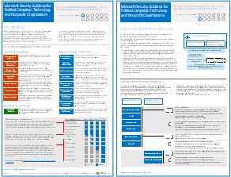

# Microsoft-Sicherheitsleitfaden für politische Kampagnen, gemeinnützigen Organisationen und andere agile OrganisationenMicrosoft Security Guidance for Political Campaigns, Nonprofits, and Other Agile Organizations

[!INCLUDE [Microsoft 365 Defender rebranding](../includes/microsoft-defender-for-office.md)]

**Gilt für****Applies to**
- [Exchange Online ProtectionExchange Online Protection](exchange-online-protection-overview.md)
- [Microsoft Defender für Office 365 Plan 1 und Plan 2Microsoft Defender for Office 365 plan 1 and plan 2](office-365-atp.md)

 **Zusammenfassung:** Planungs- und Implementierungsleitfaden für sich schnell wandelnde Organisationen mit einem erhöhten Bedrohungsprofil.**Summary:** Planning and implementation guidance for fast-moving organizations that have an increased threat profile.

Wenn Ihre Organisation nach Agile-Prinzipien agiert, Sie ein kleines IT-Team haben und Ihr Bedrohungsprofil höher ist als der Durchschnitt, ist dieser Leitfaden für Sie genau richtig. Diese Lösung veranschaulicht, wie Sie schnell eine Umgebung mit grundlegenden Clouddiensten erstellen können, die von Anfang an sichere Kontrollmechanismen umfasst. Dieser Leitfaden umfasst bindende Sicherheitsempfehlungen zum Schutz von Daten, Identitäten, E-Mail und Zugriff über mobile Geräte.If your organization is agile, you have a small IT team, and your threat profile is higher than average, this guidance is designed for you. This solution demonstrates how to quickly build an environment with essential cloud services that include secure controls from the start. This guidance includes prescriptive security recommendations for protecting data, identities, email, and access from mobile devices.

## Anleitungen für SicherheitslösungenSecurity solution guidance

Diese Anleitung beschreibt, wie eine sichere Cloudumgebung implementiert wird. Die Anleitung für die Lösung kann von jeder Organisation verwendet werden. Sie bietet zusätzliche Hilfe für agile Organisationen mit dem BYOD-Zugriff und Gastkonten. Sie können diesen Leitfaden als Startpunkt für den Entwurf Ihrer eigenen Umgebung verwenden. Wir freuen uns über Ihr Feedback unter [CloudAdopt@microsoft.com](mailto:CloudAdopt@microsoft.com).This guidance describes how to implement a secure cloud environment. The solution guidance can be used by any organization. It includes extra help for agile organizations with BYOD access and guest accounts. You can use this guidance as a starting-point for designing your own environment. We welcome your feedback at [CloudAdopt@microsoft.com](mailto:CloudAdopt@microsoft.com).

****

|ElementItem|BeschreibungDescription|
|---|---|
|**Microsoft-Sicherheitsanleitungen von Microsoft für politische Kampagnen****Microsoft Security Guidance for Political Campaigns**      [PDF](https://download.microsoft.com/download/B/4/D/B4D520C3-4D0C-4B4D-BFB9-09F0651C2775/MSFT_Cloud_architecture_security%20for%20political%20campaigns.pdf) \| [Visio](https://download.microsoft.com/download/B/4/D/B4D520C3-4D0C-4B4D-BFB9-09F0651C2775/MSFT_Cloud_architecture_security%20for%20political%20campaigns.vsdx)[PDF](https://download.microsoft.com/download/B/4/D/B4D520C3-4D0C-4B4D-BFB9-09F0651C2775/MSFT_Cloud_architecture_security%20for%20political%20campaigns.pdf) \| [Visio](https://download.microsoft.com/download/B/4/D/B4D520C3-4D0C-4B4D-BFB9-09F0651C2775/MSFT_Cloud_architecture_security%20for%20political%20campaigns.vsdx)|Dieser Leitfaden verwendet eine Organisation für politische Kampagnen als Beispiel. Verwenden Sie diesen Leitfaden als Grundlage für eine beliebige Umgebung.This guidance uses a political campaign organization as an example. Use this guidance as a starting point for any environment.|
|**Sicherheitsanleitungen von Microsoft für gemeinnützige Organisationen****Microsoft Security Guidance for Nonprofits**      [PDF](https://download.microsoft.com/download/9/4/3/94389612-C679-4061-8DF2-D9A15D72B65F/Microsoft_Cloud%20Architecture_Security%20for%20Nonprofits.pdf) \| [Visio](https://download.microsoft.com/download/9/4/3/94389612-C679-4061-8DF2-D9A15D72B65F/Microsoft_Cloud%20Architecture_Security%20for%20Nonprofits.vsdx)[PDF](https://download.microsoft.com/download/9/4/3/94389612-C679-4061-8DF2-D9A15D72B65F/Microsoft_Cloud%20Architecture_Security%20for%20Nonprofits.pdf) \| [Visio](https://download.microsoft.com/download/9/4/3/94389612-C679-4061-8DF2-D9A15D72B65F/Microsoft_Cloud%20Architecture_Security%20for%20Nonprofits.vsdx)|Dieser Leitfaden wurde für gemeinnützige Organisationen geringfügig überarbeitet. Er verweist beispielsweise auf Office 365-Pläne für gemeinnützige Organisation. Die technische Anleitung ist identisch wie im Leitfaden für politische Kampagnen.This guide is slightly revised for nonprofit organizations. For example, it references Office 365 Nonprofit plans. The technical guidance is the same as the political campaign solution guide.|
|

## TestumgebungsanleitungenTest Lab Guides

Um eine Entwicklungs-/Testumgebung für diese Lösung zu erstellen, verwenden Sie die folgenden Testumgebungsanleitungen:To create a dev/test environment for this solution, use the following test lab guides:

- [Konfigurieren von Gruppen und Benutzern für eine politische Kampagne in einer Entwicklungs-/TestumgebungConfigure groups and users for a political campaign dev/test environment](configure-groups-and-users-for-a-political-campaign-dev-test-environment.md)

  Erstellen Sie Testabonnements für Office 365 und EMS, und erstellen Sie Gruppen und Benutzer für eine repräsentative politische Kampagne.Create trial subscriptions for Office 365 and EMS and then create groups and users for a representative political campaign.

- [Erstellen von Teamwebsites in einer Entwicklungs-/Testumgebung für eine politische KampagneCreate team sites in a political campaign dev/test environment](create-team-sites-in-a-political-campaign-dev-test-environment.md)

  Erstellen Sie vier SharePoint Online-Teamwebsites mit den Sicherheitsebenen „Intern“, „Privat“, „Sensibel“ und „Streng vertraulich“.Create four SharePoint Online team sites with Internal, Private, Sensitive, and Highly Confidential levels of security.

Weitere Sicherheitsfunktionen für die Vorführung oder Machbarkeitsstudie finden Sie unter [Office 365-Testumgebungsanleitungen](https://aka.ms/o365tlgs).For additional security features for demonstration or proof of concept, see [Office 365 Test Lab Guides](https://aka.ms/o365tlgs).

## Siehe auchSee Also

[Testumgebungsanleitungen (TLGs) zur CloudakzeptanzCloud adoption Test Lab Guides (TLGs)](../../enterprise/cloud-adoption-test-lab-guides-tlgs.md)

[Ressourcen zur Cloud-IT-Architektur von MicrosoftMicrosoft Cloud IT architecture resources](../../solutions/cloud-architecture-models.md)
