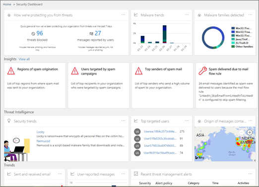

# Untersuchung von und Antwort auf Bedrohungen

[!INCLUDE [Microsoft 365 Defender rebranding](../includes/microsoft-defender-for-office.md)]

Funktionen zur Ermittlung und Reaktion von Bedrohungen in [Microsoft Defender für Office 365](office-365-atp.md) helfen Sicherheitsanalysten und Administratoren, die Microsoft 365 for Business-Benutzer Ihrer Organisation zu schützen, indem Sie:

- Vereinfachen der Identifizierung, Überwachung und Verständlichkeit von Cyberangriffe
- Unterstützung bei der schnellen Adressierung von Bedrohungen in Exchange Online, SharePoint Online, OneDrive für Unternehmen und Microsoft Teams
- Bereitstellen von Einblicken und Wissen zur Unterstützung von Sicherheitsmaßnahmen beim verhindern von Cyberangriffe in Ihrer Organisation
- Einsatz von [automatisierten Untersuchungen und Antworten in Office 365](automated-investigation-response-office.md) für wichtige e-Mail-basierte Bedrohungen

Die Funktionen zur Ermittlung und Reaktion von Bedrohungen bieten Einblicke in Bedrohungen und zugehörige Reaktions Aktionen, die im Security & Compliance Center verfügbar sind. Diese Erkenntnisse können dazu beitragen, dass das Sicherheitsteam Ihrer Organisation Benutzer vor e-Mail-oder dateibasierten Angriffen schützt. Die Funktionen helfen bei der Überwachung von Signalen und Sammeln von Daten aus mehreren Quellen wie Benutzeraktivität, Authentifizierung, e-Mail, kompromittierten PCs und Sicherheitsvorfällen. Geschäfts Entscheidungsträger und Ihr Sicherheits Betriebsteam können diese Informationen verwenden, um Bedrohungen Ihrer Organisation zu verstehen und zu reagieren und Ihr geistiges Eigentum zu schützen.

## Kennenlernen von Bedrohungs Ermittlungs-und-Antwort Tools

Die Funktionen "Bedrohungs Ermittlung und-Reaktion" werden im Security & Compliance Center als eine Reihe von Tools und Antwort Workflows angezeigt, einschließlich der folgenden:

- [Threat-Dashboard](#threat-dashboard)
- [Explorer](#threat-explorer)
- [Vorfälle](#incidents)
- [Angriffssimulator](#attack-simulator)
- [Automatische Untersuchung und Reaktion](automated-investigation-response-office.md)

### Threat-Dashboard

Verwenden Sie das Threat-Dashboard (Dies wird auch als [Sicherheits Dashboard](security-dashboard.md)bezeichnet), um schnell zu sehen, welche Bedrohungen angesprochen wurden, und als visuelle Möglichkeit, um Geschäfts Entscheidungsträgern zu berichten, wie Microsoft 365-Dienste Ihr Unternehmen schützen.

Um dieses Dashboard anzuzeigen und zu verwenden, wechseln Sie im Security & Compliance Center zu **Threat Management** \> **Dashboard**.

### Sicherheitsrisiken-Explorer

Verwenden Sie [Threat Explorer (und Echtzeiterkennung)](threat-explorer.md) , um Bedrohungen zu analysieren, die Anzahl der Angriffe über einen bestimmten Zeitraum zu ermitteln und Daten nach Bedrohungs Familien, Angreifer-Infrastruktur und vielem mehr zu analysieren. Threat Explorer (auch als Explorer bezeichnet) ist der Ausgangspunkt für den unter Such Workflow eines Sicherheitsanalysten.

Um diesen Bericht anzuzeigen und zu verwenden, wechseln Sie im Security & Compliance Center zu **Threat Management** \> **Explorer**.

### Vorfälle

Verwenden Sie die Liste Vorfälle (Dies wird auch Untersuchungen genannt), um eine Liste der in Flight-Sicherheitsvorfälle anzuzeigen. Vorfälle werden verwendet, um Bedrohungen wie verdächtige e-Mail-Nachrichten nachzuverfolgen und weitere Untersuchungen und Korrekturen durchzuführen.

Um die Liste der aktuellen Vorfälle für Ihre Organisation anzuzeigen, wechseln Sie im Security & Compliance Center zu **Threat Management** \> **Review** \> **Incidents**.

### Angriffssimulator

Verwenden Sie den Angriffs Simulator zum Einrichten und ausführen realistischer Cyberangriffe in Ihrer Organisation, und identifizieren Sie gefährdete Personen, bevor sich ein echter Cyberangriff auf Ihr Unternehmen auswirkt. Weitere Informationen finden Sie unter [Attack Simulator in Office 365](attack-simulator.md).

### Automatische Untersuchung und Reaktion

Verwenden Sie automatisierte Ermittlungs-und Antwortfunktionen (Air), um Zeit und Aufwand beim Korrelieren von Inhalten, Geräten und gefährdeten Personen vor Bedrohungen in Ihrer Organisation zu sparen. Air-Prozesse können beginnen, wenn bestimmte Warnungen ausgelöst werden oder wenn Sie von Ihrem Sicherheits Betriebsteam gestartet werden. Weitere Informationen finden Sie unter [Automatische Untersuchung und Antwort in Office 365](automated-investigation-response-office.md).

## Threat Intelligence-Widgets

Im Rahmen des Angebots von Microsoft Defender für Office 365 Plan 2 können Sicherheitsanalysten Details zu einer bekannten Bedrohung überprüfen. Dies ist hilfreich, um zu ermitteln, ob zusätzliche vorbeugende Maßnahmen/Schritte ergriffen werden können, um die Benutzer zu schützen.

## Wie erhalten wir diese Funktionen?

Microsoft 365 Threat Investigation and Response Funktionen sind in Microsoft Defender für Office 365 Plan 2 enthalten, der in Enterprise E5 oder als Add-on für bestimmte Abonnements enthalten ist. Weitere Informationen finden Sie unter [Defender für Office 365 Plan 1 und Plan 2](office-365-atp.md#microsoft-defender-for-office-365-plan-1-and-plan-2).

## Erforderliche Rollen und Berechtigungen

Microsoft Defender für Office 365 verwendet rollenbasierte Zugriffssteuerung. Berechtigungen werden über bestimmte Rollen in Azure Active Directory, dem Microsoft 365 Admin Center oder dem Security & Compliance Center zugewiesen.

> [!TIP]
> Einige Rollen, wie beispielsweise der Sicherheits Administrator, können zwar im Security & Compliance Center zugewiesen werden, aber stattdessen sollten Sie entweder das Microsoft 365 Admin Center oder Azure Active Directory verwenden. Informationen zu Rollen, Rollengruppen und Berechtigungen finden Sie in den folgenden Ressourcen:
>
> - [Berechtigungen im Security & Compliance Center](permissions-in-the-security-and-compliance-center.md)
>
> - [Administratorrollenberechtigungen in Azure Active Directory](https://docs.microsoft.com/azure/active-directory/users-groups-roles/directory-assign-admin-roles)

****

|Aktivität|Rollen und Berechtigungen|
|---|---|
|Verwenden des Threat-Dashboards (oder des neuen [Sicherheits Dashboards](security-dashboard.md))   Anzeigen von Informationen zu aktuellen oder aktuellen Bedrohungen|Eine der folgenden Varianten:  - **Globaler Administrator**    - **Sicherheits Administrator**  - **Sicherheits Leser**    Diese Rollen können entweder in Azure Active Directory ( [https://portal.azure.com](https://portal.azure.com) ) oder im Microsoft 365 Admin Center () zugewiesen werden [https://admin.microsoft.com](https://admin.microsoft.com) .|
|Verwenden von [Threat Explorer (und Echtzeiterkennung)](threat-explorer.md) zum Analysieren von Bedrohungen|Eine der folgenden Varianten:  - **Globaler Administrator**    - **Sicherheits Administrator**  - **Sicherheits Leser**    Diese Rollen können entweder in Azure Active Directory ( [https://portal.azure.com](https://portal.azure.com) ) oder im Microsoft 365 Admin Center () zugewiesen werden [https://admin.microsoft.com](https://admin.microsoft.com) .|
|Anzeigen von Vorfällen (auch Untersuchungen genannt)   Hinzufügen von e-Mail-Nachrichten zu einem Vorfall|Eine der folgenden Varianten:  - **Globaler Administrator**    - **Sicherheits Administrator**  - **Sicherheits Leser**    Diese Rollen können entweder in Azure Active Directory ( [https://portal.azure.com](https://portal.azure.com) ) oder im Microsoft 365 Admin Center () zugewiesen werden [https://admin.microsoft.com](https://admin.microsoft.com) .|
|Auslösen von e-Mail-Aktionen in einem Vorfall     Suchen und Löschen von verdächtigen e-Mail-Nachrichten|Eine der folgenden Varianten:  - **Globaler Administrator**    - **Sicherheits Administrator** plus die **Such-und Lösch** Rolle  Die **globalen Administrator** -und **Sicherheitsadministrator** Rollen können entweder in Azure Active Directory ( [https://portal.azure.com](https://portal.azure.com) ) oder im Microsoft 365 Admin Center () zugewiesen werden [https://admin.microsoft.com](https://admin.microsoft.com) .   Die **Such-und Lösch** Rolle muss im Security & Compliance Center () zugewiesen werden [https://protection.office.com](https://protection.office.com) .|
|Integrieren von Microsoft Defender für Office 365 Plan 2 mit Microsoft Defender für Endpoint     Integrieren von Microsoft Defender für Office 365 Plan 2 mit einem Siem-Server|Entweder der **globale Administrator** oder die **Sicherheitsadministrator** Rolle, die entweder in Azure Active Directory ( [https://portal.azure.com](https://portal.azure.com) ) oder im Microsoft 365 Admin Center () zugewiesen ist [https://admin.microsoft.com](https://admin.microsoft.com) . --- **Plus** --- Eine entsprechende Rolle, die in weiteren Anwendungen zugewiesen ist (beispielsweise [Microsoft Defender Security Center](https://docs.microsoft.com/windows/security/threat-protection/microsoft-defender-atp/user-roles) oder Ihr Siem-Server)|
|

## Nächste Schritte

- [Informationen zu Threat Tracker – neu und bemerkenswert](threat-trackers.md)

- [Suchen und untersuchen schädlicher e-Mails, die zugestellt wurden (Office 365 Untersuchung und Reaktion auf Bedrohungen)](investigate-malicious-email-that-was-delivered.md)

- [Integrieren von Office 365 Bedrohungs Ermittlung und-Antwort mit Microsoft Defender für Endpoint](integrate-office-365-ti-with-wdatp.md)

- [Informationen zum Angriffs Simulator](attack-simulator.md)
