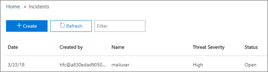

# Untersuchung von und Antwort auf BedrohungenThreat investigation and response

[!INCLUDE [Microsoft 365 Defender rebranding](../includes/microsoft-defender-for-office.md)]

Funktionen zur Untersuchung und Reaktion auf Bedrohungen in [Microsoft Defender für Office 365](office-365-atp.md) helfen Sicherheitsanalysten und Administratoren beim Schutz der Microsoft 365 Business-Benutzer ihrer Organisation durch:Threat investigation and response capabilities in [Microsoft Defender for Office 365](office-365-atp.md) help security analysts and administrators protect their organization's Microsoft 365 for business users by:

- Einfaches Erkennen, Überwachen und Verstehen von CyberangriffenMaking it easy to identify, monitor, and understand cyberattacks
- Schnelles Reagieren auf Bedrohungen in Exchange Online, SharePoint Online, OneDrive for Business und Microsoft TeamsHelping to quickly address threats in Exchange Online, SharePoint Online, OneDrive for Business and Microsoft Teams
- Bereitstellen von Einblicken und Wissen, um Sicherheitsvorgängen zu helfen, Cyberangriffe gegen ihre Organisation zu verhindernProviding insights and knowledge to help security operations prevent cyberattacks against their organization
- Verwenden einer [automatisierten Untersuchung und Reaktion in Office 365 auf](automated-investigation-response-office.md) kritische E-Mail-basierte BedrohungenEmploying [automated investigation and response in Office 365](automated-investigation-response-office.md) for critical email-based threats

Funktionen zur Untersuchung und Reaktion auf Bedrohungen bieten Einblicke in Bedrohungen und zugehörige Reaktionsaktionen, die im Security & Compliance Center verfügbar sind.Threat investigation and response capabilities provide insights into threats and related response actions that are available in the Security & Compliance Center. Diese Einblicke können dem Sicherheitsteam Ihrer Organisation helfen, Benutzer vor E-Mail- oder dateibasierten Angriffen zu schützen.These insights can help your organization's security team protect users from email- or file-based attacks. Die Funktionen helfen dabei, Signale zu überwachen und Daten aus mehreren Quellen zu sammeln, z. B. Benutzeraktivität, Authentifizierung, E-Mail, gefährdete PCs und Sicherheitsvorfälle.The capabilities help monitor signals and gather data from multiple sources, such as user activity, authentication, email, compromised PCs, and security incidents. Geschäftliche Entscheidungsträger und Ihr Sicherheitsteam können diese Informationen verwenden, um Bedrohungen gegen Ihre Organisation zu verstehen und darauf zu reagieren und Ihr geistiges Eigentum zu schützen.Business decision makers and your security operations team can use this information to understand and respond to threats against your organization and protect your intellectual property.

## Machen Sie sich mit Tools zur Untersuchung und Reaktion auf Bedrohungen vertrautGet acquainted with threat investigation and response tools

Bedrohungsuntersuchungs- und Reaktionsfunktionen werden im Security & Compliance Center als eine Reihe von Tools und Reaktionsworkflows, einschließlich der folgenden, zur Verfügung stehen:Threat investigation and response capabilities surface in the Security & Compliance Center, as a set of tools and response workflows, including the following:

- [BedrohungsdashboardThreat dashboard](#threat-dashboard)
- [ExplorerExplorer](#threat-explorer)
- [VorfälleIncidents](#incidents)
- [AngriffssimulatorAttack Simulator](#attack-simulator)
- [Automatische Untersuchung und ReaktionAutomated investigation and response](automated-investigation-response-office.md)

### BedrohungsdashboardThreat dashboard

Verwenden Sie das Bedrohungsdashboard (dies wird auch als Sicherheitsdashboard bezeichnet), um schnell zu sehen, welche Bedrohungen behoben wurden, und um entscheidungsträgern in Unternehmen zu zeigen, wie Microsoft 365-Dienste Ihr Unternehmen schützen. Use the Threat dashboard (this is also referred to as the [Security dashboard](security-dashboard.md)) to quickly see what threats have been addressed, and as a visual way to report to business decision makers how Microsoft 365 services are securing your business.

Um dieses Dashboard anzuzeigen und zu verwenden, wechseln Sie im Security & Compliance Center zum Dashboard für die **Bedrohungsverwaltung.** \> To view and use this dashboard, in the Security & Compliance Center, go to **Threat management** \> **Dashboard**.

### Sicherheitsrisiken-ExplorerThreat Explorer

Verwenden [Sie den Bedrohungs-Explorer (und](threat-explorer.md) Echtzeiterkennungen), um Bedrohungen zu analysieren, das Volumen der Angriffe im Laufe der Zeit zu sehen und Daten nach Bedrohungsfamilien, Angreiferinfrastrukturen und vielem mehr zu analysieren.Use [Threat Explorer (and real-time detections)](threat-explorer.md) to analyze threats, see the volume of attacks over time, and analyze data by threat families, attacker infrastructure, and more. Der Bedrohungs-Explorer (auch als Explorer bezeichnet) ist der Ausgangspunkt für jeden Untersuchungsworkflow eines Sicherheitsanalysten.Threat Explorer (also referred to as Explorer) is the starting place for any security analyst's investigation workflow.

Wechseln Sie zum Anzeigen und Verwenden dieses Berichts im Security & Compliance Center zum **Threat Management** \> **Explorer**.To view and use this report, in the Security & Compliance Center, go to **Threat management** \> **Explorer**.

### VorfälleIncidents

Verwenden Sie die Liste "Vorfälle" (dies wird auch als "Untersuchungen" bezeichnet), um eine Liste der Sicherheitsvorfälle in Flight zu sehen.Use the Incidents list (this is also called Investigations) to see a list of in flight security incidents. Vorfälle werden verwendet, um Bedrohungen wie verdächtige E-Mail-Nachrichten nachverfolgt und weitere Untersuchungen und Korrekturen durchführen zu können.Incidents are used to track threats such as suspicious email messages, and to conduct further investigation and remediation.

Wenn Sie die Liste der aktuellen Vorfälle für Ihre Organisation anzeigen möchten,  wechseln Sie im Security & Compliance Center zu "Review Incidents" für das \>  \> **Bedrohungsmanagement.**To view the list of current incidents for your organization, in the Security & Compliance Center, go to **Threat management** \> **Review** \> **Incidents**.

### AngriffssimulatorAttack Simulator

Verwenden Sie den Angriffssimulator, um realistische Cyberangriffe in Ihrer Organisation zu einrichten und ausführen und anfällige Personen zu identifizieren, bevor ein realer Cyberangriff Ihr Unternehmen betrifft.Use Attack Simulator to set up and run realistic cyberattacks in your organization, and identify vulnerable people before a real cyberattack affects your business. Weitere Informationen finden Sie unter ["Angriffssimulator" in Office 365.](attack-simulator.md)To learn more, see [Attack Simulator in Office 365](attack-simulator.md).

### Automatische Untersuchung und ReaktionAutomated investigation and response

Verwenden Sie automatisierte Untersuchungs- und Reaktionsfunktionen (AIR), um Zeit und Mühe beim Korrelieren von Inhalten, Geräten und Personen zu sparen, die durch Bedrohungen in Ihrer Organisation gefährdet sind.Use automated investigation and response (AIR) capabilities to save time and effort correlating content, devices, and people at risk from threats in your organization. AIR-Prozesse können beginnen, wenn bestimmte Warnungen ausgelöst werden, oder wenn sie von Ihrem Sicherheitsteam gestartet werden.AIR processes can begin whenever certain alerts are triggered, or when started by your security operations team. Weitere Informationen finden Sie unter [automatisierte Untersuchung und Reaktion in Office 365.](automated-investigation-response-office.md)To learn more, see [automated investigation and response in Office 365](automated-investigation-response-office.md).

## Widgets für die BedrohungsintelligenzThreat intelligence widgets

Im Rahmen des Microsoft Defender für Office 365 Plan 2-Angebots können Sicherheitsanalysten Details zu einer bekannten Bedrohung überprüfen.As part of the Microsoft Defender for Office 365 Plan 2 offering, security analysts can review details about a known threat. Dies ist hilfreich, um festzustellen, ob es zusätzliche vorbeugende Maßnahmen/Schritte gibt, die ergriffen werden können, um die Sicherheit der Benutzer zu gewährleisten.This is useful to determine whether there are additional preventative measures/steps that can be taken to keep users safe.

## Wie erhalten wir diese Funktionen?How do we get these capabilities?

Microsoft 365 Threat Investigation and Response capabilities are included in Microsoft Defender for Office 365 Plan 2, which is included in Enterprise E5 or as an add-on to certain subscriptions.Microsoft 365 threat investigation and response capabilities are included in Microsoft Defender for Office 365 Plan 2, which is included in Enterprise E5 or as an add-on to certain subscriptions. Weitere Informationen finden Sie unter [Defender für Office 365 Plan 1 und Plan 2](office-365-atp.md#microsoft-defender-for-office-365-plan-1-and-plan-2).To learn more, see [Defender for Office 365 Plan 1 and Plan 2](office-365-atp.md#microsoft-defender-for-office-365-plan-1-and-plan-2).

## Erforderliche Rollen und BerechtigungenRequired roles and permissions

Microsoft Defender für Office 365 verwendet die rollenbasierte Zugriffssteuerung.Microsoft Defender for Office 365 uses role-based access control. Berechtigungen werden über bestimmte Rollen in Azure Active Directory, im Microsoft 365 Admin Center oder im Security & Compliance Center zugewiesen.Permissions are assigned through certain roles in Azure Active Directory, the Microsoft 365 admin center, or the Security & Compliance Center.

> [!TIP]
> Obwohl einige Rollen, z. B. Sicherheitsadministrator, im Security & Compliance Center zugewiesen werden können, sollten Sie stattdessen entweder das Microsoft 365 Admin Center oder Azure Active Directory verwenden.Although some roles, such as Security Administrator, can be assigned in the Security & Compliance Center, consider using either the Microsoft 365 admin center or Azure Active Directory instead. Informationen zu Rollen, Rollengruppen und Berechtigungen finden Sie in den folgenden Ressourcen:For information about roles, role groups, and permissions, see the following resources:
>
> - [Berechtigungen im Security & Compliance CenterPermissions in the Security & Compliance Center](permissions-in-the-security-and-compliance-center.md)
>
> - [Administratorrollenberechtigungen in Azure Active DirectoryAdministrator role permissions in Azure Active Directory](https://docs.microsoft.com/azure/active-directory/users-groups-roles/directory-assign-admin-roles)

****

|AktivitätActivity|Rollen und BerechtigungenRoles and permissions|
|---|---|
|Verwenden des Bedrohungsdashboards (oder des neuen [Sicherheitsdashboards)](security-dashboard.md)Use the Threat dashboard (or the new [Security dashboard](security-dashboard.md)) 
 Anzeigen von Informationen zu aktuellen oder aktuellen BedrohungenView information about recent or current threats|Eine der folgenden Varianten:One of the following: <ul><li>**Globaler Administrator****Global Administrator**</li><li>**Sicherheitsadministrator****Security Administrator**</li><li>**Sicherheitsleseprogramm****Security Reader**</li></ul> 
 Diese Rollen können entweder in Azure Active Directory ( <https://portal.azure.com> ) oder im Microsoft 365 Admin Center ( ) zugewiesen <https://admin.microsoft.com> werden.These roles can be assigned in either Azure Active Directory (<https://portal.azure.com>) or the Microsoft 365 admin center (<https://admin.microsoft.com>).|
|Verwenden [des Bedrohungs-Explorers (und Echtzeiterkennungen)](threat-explorer.md) zum Analysieren von BedrohungenUse [Threat Explorer (and real-time detections)](threat-explorer.md) to analyze threats|Eine der folgenden Varianten:One of the following: <ul><li>**Globaler Administrator****Global Administrator**</li><li>**Sicherheitsadministrator****Security Administrator**</li><li>**Sicherheitsleseprogramm****Security Reader**</li></ul> 
 Diese Rollen können entweder in Azure Active Directory ( <https://portal.azure.com> ) oder im Microsoft 365 Admin Center ( ) zugewiesen <https://admin.microsoft.com> werden.These roles can be assigned in either Azure Active Directory (<https://portal.azure.com>) or the Microsoft 365 admin center (<https://admin.microsoft.com>).|
|Anzeigen von Vorfällen (auch als Untersuchungen bezeichnet)View Incidents (also referred to as Investigations) 
 Hinzufügen von E-Mail-Nachrichten zu einem VorfallAdd email messages to an incident|Eine der folgenden Varianten:One of the following: <ul><li>**Globaler Administrator****Global Administrator**</li><li>**Sicherheitsadministrator****Security Administrator**</li><li>**Sicherheitsleseprogramm****Security Reader**</li></ul> 
 Diese Rollen können entweder in Azure Active Directory ( <https://portal.azure.com> ) oder im Microsoft 365 Admin Center ( ) zugewiesen <https://admin.microsoft.com> werden.These roles can be assigned in either Azure Active Directory (<https://portal.azure.com>) or the Microsoft 365 admin center (<https://admin.microsoft.com>).|
|Auslösen von E-Mail-Aktionen in einem VorfallTrigger email actions in an incident 
 Suchen und Löschen verdächtiger E-Mail-NachrichtenFind and delete suspicious email messages|Eine der folgenden Varianten:One of the following: <ul><li>**Globaler Administrator****Global Administrator**</li><li>**Sicherheitsadministrator** plus Rolle **"Suchen und Löschen"****Security Administrator** plus the **Search and Purge** role</li></ul> 
 Die **Rollen "Globaler Administrator"** und **"Sicherheitsadministrator"** können entweder in Azure Active Directory ( ) oder im <https://portal.azure.com> Microsoft 365 Admin Center ( ) zugewiesen <https://admin.microsoft.com> werden.The **Global Administrator** and **Security Administrator** roles can be assigned in either Azure Active Directory (<https://portal.azure.com>) or the Microsoft 365 admin center (<https://admin.microsoft.com>). 
 Die **Rolle "Suchen und Löschen"** muss im Security & Compliance Center ( ) zugewiesen <https://protection.office.com> werden.The **Search and Purge** role must be assigned in the Security & Compliance Center (<https://protection.office.com>).|
|Integrieren von Microsoft Defender für Office 365 Plan 2 in Microsoft Defender for EndpointIntegrate Microsoft Defender for Office 365 Plan 2 with Microsoft Defender for Endpoint  
 Integrieren von Microsoft Defender für Office 365 Plan 2 in einen SIEM-ServerIntegrate Microsoft Defender for Office 365 Plan 2 with a SIEM server|Entweder der **globale Administrator oder** die Rolle **"Sicherheitsadministrator",** die entweder in Azure Active Directory ( ) oder im <https://portal.azure.com> Microsoft 365 Admin Center ( ) zugewiesen <https://admin.microsoft.com> ist.Either the **Global Administrator** or the **Security Administrator** role assigned in either Azure Active Directory (<https://portal.azure.com>) or the Microsoft 365 admin center (<https://admin.microsoft.com>). 
 --- **plus** --- --- **plus** --- 
 Eine geeignete Rolle, die in zusätzlichen Anwendungen (z. B. [Microsoft Defender Security Center](https://docs.microsoft.com/windows/security/threat-protection/microsoft-defender-atp/user-roles) oder Ihrem SIEM-Server) zugewiesen ist.An appropriate role assigned in additional applications (such as [Microsoft Defender Security Center](https://docs.microsoft.com/windows/security/threat-protection/microsoft-defender-atp/user-roles) or your SIEM server).|
|

## Nächste SchritteNext steps

- [Erfahren Sie mehr über Bedrohungsverfolgungen – neu und beachtenswertLearn about Threat Trackers - New and Noteworthy](threat-trackers.md)

- [Suchen und Untersuchen bösartiger E-Mails, die zugestellt wurden (Office 365 Threat Investigation and Response)Find and investigate malicious email that was delivered (Office 365 Threat Investigation and Response)](investigate-malicious-email-that-was-delivered.md)

- [Integrieren von Office 365 Threat Investigation and Response in Microsoft Defender for EndpointIntegrate Office 365 Threat Investigation and Response with Microsoft Defender for Endpoint](integrate-office-365-ti-with-wdatp.md)

- [Informationen zum AngriffssimulatorLearn about Attack Simulator](attack-simulator.md)
