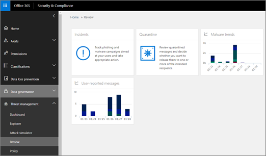

# Untersuchung von und Antwort auf BedrohungenThreat investigation and response

[!INCLUDE [Microsoft 365 Defender rebranding](../includes/microsoft-defender-for-office.md)]

**Gilt für****Applies To**
- [Microsoft Defender für Office 365 – Plan 2Microsoft Defender for Office 365 plan 2](defender-for-office-365.md)

Die Funktionen zur Untersuchung und Reaktion auf Bedrohungen in [Microsoft Defender für Office 365](defender-for-office-365.md) Sicherheitsanalysten und Administratoren dabei helfen, die Microsoft 365 ihrer Organisation für Geschäftsbenutzer zu schützen:Threat investigation and response capabilities in [Microsoft Defender for Office 365](defender-for-office-365.md) help security analysts and administrators protect their organization's Microsoft 365 for business users by:

- Einfaches Erkennen, Überwachen und Verstehen von CyberangriffenMaking it easy to identify, monitor, and understand cyberattacks
- Schnelles Reagieren auf Bedrohungen in Exchange Online, SharePoint Online, OneDrive for Business und Microsoft TeamsHelping to quickly address threats in Exchange Online, SharePoint Online, OneDrive for Business and Microsoft Teams
- Bereitstellen von Einblicken und Wissen, um Sicherheitsvorgängen zu helfen, Cyberangriffe auf ihre Organisation zu verhindernProviding insights and knowledge to help security operations prevent cyberattacks against their organization
- Verwenden [der automatisierten Untersuchung und Reaktion in Office 365](automated-investigation-response-office.md) für kritische E-Mail-basierte BedrohungenEmploying [automated investigation and response in Office 365](automated-investigation-response-office.md) for critical email-based threats

Die Funktionen zur Bedrohungsuntersuchung und -reaktion bieten Einblicke in Bedrohungen und zugehörige Reaktionsaktionen, die im Microsoft 365 Defender Portal verfügbar sind.Threat investigation and response capabilities provide insights into threats and related response actions that are available in the Microsoft 365 Defender portal. Diese Erkenntnisse können dem Sicherheitsteam Ihrer Organisation helfen, Benutzer vor E-Mail- oder dateibasierten Angriffen zu schützen.These insights can help your organization's security team protect users from email- or file-based attacks. Die Funktionen helfen beim Überwachen von Signalen und Sammeln von Daten aus mehreren Quellen, z. B. Benutzeraktivität, Authentifizierung, E-Mail, kompromittierte PCs und Sicherheitsvorfälle.The capabilities help monitor signals and gather data from multiple sources, such as user activity, authentication, email, compromised PCs, and security incidents. Entscheidungsträger in Unternehmen und Ihr Sicherheitsteam können diese Informationen verwenden, um Bedrohungen gegen Ihre Organisation zu verstehen und darauf zu reagieren und Ihr geistiges Eigentum zu schützen.Business decision makers and your security operations team can use this information to understand and respond to threats against your organization and protect your intellectual property.

## Machen Sie sich mit Tools zur Bedrohungsuntersuchung und -reaktion vertrautGet acquainted with threat investigation and response tools

Die Funktionen für die Untersuchung und Reaktion auf Bedrohungen werden im Microsoft 365 Defender Portal als eine Reihe von Tools und Reaktionsworkflows angezeigt, einschließlich der folgenden:Threat investigation and response capabilities surface in the Microsoft 365 Defender portal, as a set of tools and response workflows, including the following:

- [ExplorerExplorer](#explorer)
- [VorfälleIncidents](#incidents)
- [AngriffssimulationstrainingAttack simulation training](attack-simulation-training.md)
- [Automatische Untersuchung und ReaktionAutomated investigation and response](automated-investigation-response-office.md)

### ExplorerExplorer

Verwenden Sie [Explorer (und Echtzeiterkennungen),](threat-explorer.md) um Bedrohungen zu analysieren, das Volumen von Angriffen im Laufe der Zeit anzuzeigen und Daten nach Bedrohungsfamilien, Angreiferinfrastruktur und mehr zu analysieren.Use [Explorer (and real-time detections)](threat-explorer.md) to analyze threats, see the volume of attacks over time, and analyze data by threat families, attacker infrastructure, and more. Der Explorer (auch als Bedrohungs-Explorer bezeichnet) ist der Ausgangspunkt für den Untersuchungsworkflow eines Sicherheitsanalysten.Explorer (also referred to as Threat Explorer) is the starting place for any security analyst's investigation workflow.

Um diesen Bericht anzuzeigen und zu verwenden, wechseln Sie im Microsoft 365 Defender Portal zu **E-Mail & Zusammenarbeits-Explorer.**  >  To view and use this report, in the Microsoft 365 Defender portal, go to **Email & collaboration** > **Explorer**.

### VorfälleIncidents

Verwenden Sie die Liste "Vorfälle" (dies wird auch als "Untersuchungen" bezeichnet), um eine Liste von Sicherheitsvorfällen im Test-Flight anzuzeigen.Use the Incidents list (this is also called Investigations) to see a list of in flight security incidents. Vorfälle werden verwendet, um Bedrohungen wie verdächtige E-Mail-Nachrichten nachzuverfolgen und weitere Untersuchungen und Korrekturen durchzuführen.Incidents are used to track threats such as suspicious email messages, and to conduct further investigation and remediation.

Um die Liste der aktuellen Vorfälle für Ihre Organisation anzuzeigen, wechseln Sie im portal Microsoft 365 Defender zu **Vorfällen &**  >  **Warnungen.**To view the list of current incidents for your organization, in the Microsoft 365 Defender portal, go to **Incidents & alerts** > **Incidents**.

### AngriffssimulationstrainingAttack simulation training

Verwenden Sie Angriffssimulationsschulungen, um realistische Cyberangriffe in Ihrer Organisation einzurichten und auszuführen, und identifizieren Sie anfällige Personen, bevor sich ein tatsächlicher Cyberangriff auf Ihr Unternehmen auswirkt.Use Attack simulation training to set up and run realistic cyberattacks in your organization, and identify vulnerable people before a real cyberattack affects your business. Weitere Informationen finden Sie unter [Simulieren eines Phishingangriffs.](attack-simulation-training.md)To learn more, see [Simulate a phishing attack](attack-simulation-training.md).

Um dieses Feature im Microsoft 365 Defender Portal anzuzeigen und zu verwenden, wechseln Sie zu **E-Mail &**  >  **Angriffssimulationstraining** für die Zusammenarbeit.To view and use this feature in the Microsoft 365 Defender portal, go to **Email & collaboration** > **Attack simulation training**.

### Automatisierte Untersuchung und Antwort (AIR)Automated investigation and response

Verwenden Sie air-Funktionen (Automated Investigation and Response), um Zeit und Mühe bei der Korrelation von Inhalten, Geräten und Personen zu sparen, die durch Bedrohungen in Ihrer Organisation gefährdet sind.Use automated investigation and response (AIR) capabilities to save time and effort correlating content, devices, and people at risk from threats in your organization. AIR-Prozesse können immer dann beginnen, wenn bestimmte Warnungen ausgelöst werden oder wenn sie von Ihrem Sicherheitsteam gestartet werden.AIR processes can begin whenever certain alerts are triggered, or when started by your security operations team. Weitere Informationen finden Sie [in der automatisierten Untersuchung und Reaktion in Office 365.](automated-investigation-response-office.md)To learn more, see [automated investigation and response in Office 365](automated-investigation-response-office.md).

## Widgets für die BedrohungserkennungThreat intelligence widgets

Im Rahmen des Microsoft Defender für Office 365 Plan 2-Angebots können Sicherheitsanalysten Details zu einer bekannten Bedrohung überprüfen.As part of the Microsoft Defender for Office 365 Plan 2 offering, security analysts can review details about a known threat. Dies ist hilfreich, um festzustellen, ob es zusätzliche vorbeugende Maßnahmen/Schritte gibt, die ergriffen werden können, um die Sicherheit der Benutzer zu gewährleisten.This is useful to determine whether there are additional preventative measures/steps that can be taken to keep users safe.

## Wie erhalten wir diese Funktionen?How do we get these capabilities?

Microsoft 365 Funktionen für die Untersuchung und Reaktion auf Bedrohungen sind in Microsoft Defender für Office 365 Plan 2 enthalten, der in Enterprise E5 oder als Add-On für bestimmte Abonnements enthalten ist.Microsoft 365 threat investigation and response capabilities are included in Microsoft Defender for Office 365 Plan 2, which is included in Enterprise E5 or as an add-on to certain subscriptions. Weitere Informationen finden Sie unter [Defender for Office 365 Plan 1 und Plan 2.](defender-for-office-365.md#microsoft-defender-for-office-365-plan-1-and-plan-2)To learn more, see [Defender for Office 365 Plan 1 and Plan 2](defender-for-office-365.md#microsoft-defender-for-office-365-plan-1-and-plan-2).

## Erforderliche Rollen und BerechtigungenRequired roles and permissions

Microsoft Defender für Office 365 verwendet die rollenbasierte Zugriffssteuerung.Microsoft Defender for Office 365 uses role-based access control. Berechtigungen werden über bestimmte Rollen in Azure Active Directory, dem Microsoft 365 Admin Center oder dem Microsoft 365 Defender-Portal zugewiesen.Permissions are assigned through certain roles in Azure Active Directory, the Microsoft 365 admin center, or the Microsoft 365 Defender portal.

> [!TIP]
> Obwohl einige Rollen, z. B. Sicherheitsadministrator, im Microsoft 365 Defender Portal zugewiesen werden können, sollten Sie stattdessen die Microsoft 365 Admin Center oder Azure Active Directory verwenden.Although some roles, such as Security Administrator, can be assigned in the Microsoft 365 Defender portal, consider using either the Microsoft 365 admin center or Azure Active Directory instead. Informationen zu Rollen, Rollengruppen und Berechtigungen finden Sie in den folgenden Ressourcen:For information about roles, role groups, and permissions, see the following resources:
>
> - [Berechtigungen im Microsoft 365 Defender-PortalPermissions in the Microsoft 365 Defender portal](permissions-microsoft-365-security-center.md)
> - [Administratorrollenberechtigungen in Azure Active DirectoryAdministrator role permissions in Azure Active Directory](/azure/active-directory/users-groups-roles/directory-assign-admin-roles)

 

****

|AktivitätActivity|Rollen und BerechtigungenRoles and permissions|
|---|---|
|Verwenden des Dashboards für die Bedrohungs- & -Sicherheitsrisikoverwaltung (oder des neuen [Sicherheitsdashboards)](security-dashboard.md)Use the Threat & Vulnerability Management dashboard (or the new [Security dashboard](security-dashboard.md)) 
 Anzeigen von Informationen zu aktuellen oder aktuellen BedrohungenView information about recent or current threats|Eine der folgenden Varianten:One of the following: <ul><li>**Globaler Administrator****Global Administrator**</li><li>**Sicherheitsadministrator****Security Administrator**</li><li>**Sicherheitsleseberechtigter****Security Reader**</li></ul> 
 Diese Rollen können entweder in Azure Active Directory ( ) oder im Microsoft 365 Admin Center ( ) zugewiesen <https://portal.azure.com> <https://admin.microsoft.com> werden.These roles can be assigned in either Azure Active Directory (<https://portal.azure.com>) or the Microsoft 365 admin center (<https://admin.microsoft.com>).|
|Verwenden von [Explorer (und Echtzeiterkennungen)](threat-explorer.md) zum Analysieren von BedrohungenUse [Explorer (and real-time detections)](threat-explorer.md) to analyze threats|Eine der folgenden Varianten:One of the following: <ul><li>**Globaler Administrator****Global Administrator**</li><li>**Sicherheitsadministrator****Security Administrator**</li><li>**Sicherheitsleseberechtigter****Security Reader**</li></ul> 
 Diese Rollen können entweder in Azure Active Directory ( ) oder im Microsoft 365 Admin Center ( ) zugewiesen <https://portal.azure.com> <https://admin.microsoft.com> werden.These roles can be assigned in either Azure Active Directory (<https://portal.azure.com>) or the Microsoft 365 admin center (<https://admin.microsoft.com>).|
|Anzeigen von Vorfällen (auch als Untersuchungen bezeichnet)View Incidents (also referred to as Investigations) 
 Hinzufügen von E-Mail-Nachrichten zu einem VorfallAdd email messages to an incident|Eine der folgenden Varianten:One of the following: <ul><li>**Globaler Administrator****Global Administrator**</li><li>**Sicherheitsadministrator****Security Administrator**</li><li>**Sicherheitsleseberechtigter****Security Reader**</li></ul> 
 Diese Rollen können entweder in Azure Active Directory ( ) oder im Microsoft 365 Admin Center ( ) zugewiesen <https://portal.azure.com> <https://admin.microsoft.com> werden.These roles can be assigned in either Azure Active Directory (<https://portal.azure.com>) or the Microsoft 365 admin center (<https://admin.microsoft.com>).|
|Auslösen von E-Mail-Aktionen in einem VorfallTrigger email actions in an incident 
 Suchen und Löschen verdächtiger E-Mail-NachrichtenFind and delete suspicious email messages|Eine der folgenden Varianten:One of the following: <ul><li>**Globaler Administrator****Global Administrator**</li><li>**Sicherheitsadministrator** und die Rolle **"Suchen und Löschen"****Security Administrator** plus the **Search and Purge** role</li></ul> 
 Die Rollen **"Globaler Administrator"** und **"Sicherheitsadministrator"** können entweder in Azure Active Directory ( ) oder im Microsoft 365 Admin Center ( ) zugewiesen <https://portal.azure.com> <https://admin.microsoft.com> werden.The **Global Administrator** and **Security Administrator** roles can be assigned in either Azure Active Directory (<https://portal.azure.com>) or the Microsoft 365 admin center (<https://admin.microsoft.com>). 
 Die Rolle **"Suchen und Löschen"** muss in den **Rollen "E-Mail & Zusammenarbeit"** im Microsoft 36 Defender-Portal ( ) zugewiesen <https://security.microsoft.com> werden.The **Search and Purge** role must be assigned in the **Email & collaboration roles** in the Microsoft 36 Defender portal (<https://security.microsoft.com>).|
|Integrieren von Microsoft Defender für Office 365 Plan 2 in Microsoft Defender für EndpunktIntegrate Microsoft Defender for Office 365 Plan 2 with Microsoft Defender for Endpoint 
 Integrieren von Microsoft Defender für Office 365 Plan 2 mit einem SIEM-ServerIntegrate Microsoft Defender for Office 365 Plan 2 with a SIEM server|Entweder der **globale Administrator** oder die **Sicherheitsadministratorrolle,** die entweder in Azure Active Directory ( ) oder im Microsoft 365 Admin Center ( ) zugewiesen <https://portal.azure.com> <https://admin.microsoft.com> ist.Either the **Global Administrator** or the **Security Administrator** role assigned in either Azure Active Directory (<https://portal.azure.com>) or the Microsoft 365 admin center (<https://admin.microsoft.com>). 
 --- **Plus** --- --- **plus** --- 
 Eine geeignete Rolle, die in zusätzlichen Anwendungen (z. [B. Microsoft Defender Security Center](/windows/security/threat-protection/microsoft-defender-atp/user-roles) oder Ihrem SIEM-Server) zugewiesen ist.An appropriate role assigned in additional applications (such as [Microsoft Defender Security Center](/windows/security/threat-protection/microsoft-defender-atp/user-roles) or your SIEM server).|
|

## Nächste SchritteNext steps

- [Erfahren Sie mehr über Bedrohungsverfolgungen – neu und bedrohlichLearn about Threat Trackers - New and Noteworthy](threat-trackers.md)
- [Suchen und Untersuchen bösartiger E-Mails, die übermittelt wurden (Office 365 Untersuchung und Reaktion auf Bedrohungen)Find and investigate malicious email that was delivered (Office 365 Threat Investigation and Response)](investigate-malicious-email-that-was-delivered.md)
- [Integrieren Office 365 Untersuchung und Reaktion auf Bedrohungen in Microsoft Defender für EndpunktIntegrate Office 365 Threat Investigation and Response with Microsoft Defender for Endpoint](integrate-office-365-ti-with-mde.md)
- [Simulieren eines PhishingangriffsSimulate a phishing attack](attack-simulation-training.md)
