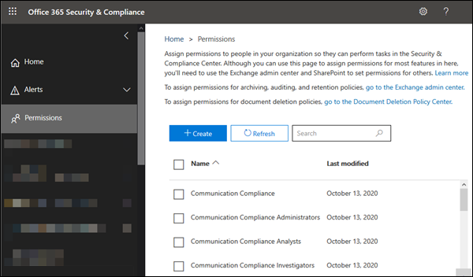
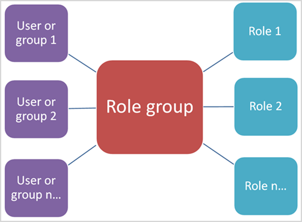

# Berechtigungen im Security & Compliance Center

[!INCLUDE [Microsoft 365 Defender rebranding](../includes/microsoft-defender-for-office.md)]

**Gilt für**
- [Exchange Online Protection](exchange-online-protection-overview.md)
- [Microsoft Defender für Office 365 Plan 1 und Plan 2](defender-for-office-365.md)
- [Microsoft 365 Defender](../defender/microsoft-365-defender.md)

Mit dem Security & Compliance Center können Sie Personen, die Complianceaufgaben wie Geräteverwaltung, Verhinderung von Datenverlust, eDiscovery, Aufbewahrung und so weiter ausführen, Berechtigungen erteilen. Diese Personen können nur die Aufgaben ausführen, auf die Sie ihnen explizit Zugriff gewähren. Um auf das Security & Compliance Center zu zugreifen, müssen Benutzer ein globaler Administrator oder Mitglied einer oder mehreren Rollengruppen des Security & Compliance Center sein.

Berechtigungen im Security & Compliance Center basieren auf dem rollenbasierten Zugriffssteuerungsmodell (RBAC). RbAC ist das gleiche Berechtigungsmodell, das von Exchange verwendet wird. Wenn Sie also mit Exchange vertraut sind, ist das Erteilen von Berechtigungen im Security & Compliance Center sehr ähnlich. Beachten Sie jedoch, dass Exchange-Rollengruppen und Sicherheitsgruppen & Compliance Center keine Mitgliedschaften oder Berechtigungen gemeinsam verwenden. Zwar verfügen beide über eine Rollengruppe "Organisationsverwaltung", sie sind jedoch nicht identisch. Die erteilten Berechtigungen und die Mitglieder der Rollengruppen sind verschieden. Unten finden Sie eine Liste der & Compliance Center-Rollengruppen.

## Beziehung zwischen Mitgliedern, Rollen und Rollengruppen

Eine **Rolle** gewährt Berechtigungen zum Ausführen einer Reihe von Aufgaben. Beispielsweise berechtigt die Rolle "Fallmanagement" Personen zum Arbeiten mit eDiscovery-Fällen.

Eine **Rollengruppe ist** eine Reihe von Rollen, mit derEnt nen Personen ihre Aufgaben im Security & Compliance Center übernehmen können. Die Rollengruppe "Complianceadministrator" umfasst beispielsweise (unter anderem) die Rollen für die Fallverwaltung, die Inhaltssuche und die Organisationskonfiguration (sowie andere), da jemand, der ein Complianceadministrator ist, die Berechtigungen für diese Aufgaben benötigt, um seine Aufgabe ausführen zu können.

Das Security & Compliance Center enthält Standardrollegruppen für die gängigsten Aufgaben und Funktionen, die Sie zum Zuweisen von Personen benötigen. Es wird empfohlen, einzelne Benutzer einfach als **Mitglieder zu** den Standardrollegruppen zu hinzufügen.

## Berechtigungen zum Verwenden von Features im Security & Compliance Center

In der folgenden Tabelle sind die Standardrollengruppen aufgeführt, die im Security & Compliance Center verfügbar sind, sowie die Rollen, die den Rollengruppen standardmäßig zugewiesen sind. Wenn Sie einem Benutzer Berechtigungen zum Ausführen einer Complianceaufgabe erteilen möchten, fügen Sie sie der entsprechenden Rollengruppe Security & Compliance Center hinzu.

Durch die Verwaltung von Berechtigungen im Security & Compliance Center erhalten Benutzer nur Zugriff auf die Compliancefeatures, die im Security & Compliance Center selbst verfügbar sind. Wenn Sie Berechtigungen für andere Compliancefeatures erteilen möchten, die sich nicht im Security & Compliance Center befinden, z. B. Exchange-Nachrichtenflussregeln (auch als Transportregeln bezeichnet), müssen Sie das Exchange Admin Center verwenden.

Informationen zum Gewähren des Zugriffs auf das Security & Compliance Center finden Sie unter Gewähren von Benutzern [auf Microsoft 365 Compliance Admin Center](grant-access-to-the-security-and-compliance-center.md).

> [!NOTE]
> Um die Registerkarte **Berechtigungen** im Security & Compliance Center anzeigen zu können, müssen Sie Administrator sein. Insbesondere muss Ihnen die  Rolle "Rollenverwaltung" zugewiesen werden,  und diese Rolle wird standardmäßig nur der Rollengruppe "Organisationsverwaltung" im Security & Compliance Center zugewiesen. Darüber hinaus ermöglicht die **Rolle Rollenverwaltung** Benutzern das Anzeigen, Erstellen und Ändern von Rollengruppen.

  

****

|Rollengruppe|Beschreibung|Zugewiesene Standardrollen|
|---|---|---|
|**Kommunikationskonformität**|Bietet Berechtigungen für alle Kommunikationskonformitätsrollen: Administrator, Analytiker, Ermittler und Viewer.|Fallverwaltung 
 Kommunikations-Compliance-Administrator 
 Analyse der Kommunikationskonformität 
 Kommunikations-Compliance-Fallverwaltung 
 Untersuchung der Kommunikationskonformität 
 Communication Compliance Viewer 
 Datenklassifizierungsfeedbackanbieter 
 View-Only Fall|
|**Kommunikationskonformitätsadministratoren**|Administratoren der Kommunikationskonformität, die Richtlinien erstellen/bearbeiten und globale Einstellungen definieren kann.|Kommunikations-Compliance-Administrator 
 Kommunikations-Compliance-Fallverwaltung|
|**Kommunikations-Compliance-Analysten**|Analysten der Kommunikationskonformität, die Richtlinien übereinstimmungen untersuchen, Nachrichtenmetadaten anzeigen und Korrekturmaßnahmen ergreifen können.|Analyse der Kommunikationskonformität 
 Kommunikations-Compliance-Fallverwaltung|
|**Kommunikations-Compliance-Ermittler**|Analysten der Kommunikationskonformität, die Richtlinien übereinstimmungen untersuchen, Nachrichteninhalte anzeigen und Abhilfemaßnahmen ergreifen können.|Fallverwaltung 
 Analyse der Kommunikationskonformität 
 Kommunikations-Compliance-Fallverwaltung 
 Untersuchung der Kommunikationskonformität 
 Datenklassifizierungsfeedbackanbieter 
 View-Only Fall|
|**Viewer für kommunikationskonformität**|Anzeige der Kommunikationskonformität, die auf die verfügbaren Berichte und Widgets zugreifen kann.|Kommunikations-Compliance-Fallverwaltung 
 Communication Compliance Viewer|
|**Complianceadministrator**1|Mitglieder können Einstellungen für geräteverwaltung, Verhinderung von Datenverlust, Berichte und Aufbewahrung verwalten.|Fallverwaltung 
 Complianceadministrator 
 Compliance-Suche 
 Datenklassifizierungsfeedbackanbieter 
 Datenklassifizierungsfeedback-Prüfer 
 Geräteverwaltung 
 Dispositionsverwaltung 
 DLP-Complianceverwaltung 
 Hold 
 IB-Compliance-Management 
 Benachrichtigungen verwalten 
 Organisationskonfiguration 
 RecordManagement 
 Aufbewahrungsverwaltung 
 Überwachungsprotokolle nur anzeigen 
 View-Only Fall 
 View-Only Geräteverwaltung 
 View-Only DLP Compliance Management 
 View-Only von IB Compliance Management 
 View-Only Verwalten von Warnungen 
 Schreibgeschützte Empfänger 
 View-Only Datensatzverwaltung 
 View-Only Aufbewahrungsverwaltung|
|**Compliancedatenadministrator**|Mitglieder können Einstellungen für Geräteverwaltung, Datenschutz, Verhinderung von Datenverlust, Berichte und Aufbewahrung verwalten.|Complianceadministrator 
 Compliance-Suche 
 Geräteverwaltung 
 DLP-Complianceverwaltung 
 Dispositionsverwaltung 
 IB-Compliance-Management 
 Benachrichtigungen verwalten 
 Organisationskonfiguration 
 RecordManagement 
 Aufbewahrungsverwaltung 
 Vertraulichkeitsbezeichnungsadministrator 
 Überwachungsprotokolle nur anzeigen 
 View-Only Geräteverwaltung 
 View-Only DLP Compliance Management 
 View-Only von IB Compliance Management 
 View-Only Verwalten von Warnungen 
 Schreibgeschützte Empfänger 
 View-Only Datensatzverwaltung 
 View-Only Aufbewahrungsverwaltung|
|**Compliance-Manager-Administratoren**|Verwalten der Erstellung und Änderung von Vorlagen.|Verwaltung des Compliance-Managers 
 Compliance-Manager-Bewertung 
 Compliance-Manager-Beitrag 
 Compliance-Manager-Leser|
|**Compliance-Manager-Assessors**|Erstellen Sie Bewertungen, implementieren Sie Verbesserungsmaßnahmen, und aktualisieren Sie den Teststatus für Verbesserungsmaßnahmen.|Compliance-Manager-Bewertung 
 Compliance-Manager-Beitrag 
 Compliance-Manager-Leser|
|**Mitwirkende des Compliance-Managers**|Erstellen Sie Bewertungen, und führen Sie Arbeit zur Implementierung von Verbesserungsmaßnahmen durch.|Compliance-Manager-Beitrag 
 Compliance-Manager-Leser|
|**Compliance-Manager-Leser**|Anzeigen aller Compliance -Manager-Inhalte mit Ausnahme von Administratorfunktionen.|Compliance-Manager-Leser|
|**Inhalts-Explorer-Inhaltsanzeige**|Anzeigen der Inhaltsdateien im Inhalts-Explorer.|Inhaltsanzeige für die Datenklassifizierung|
|**Inhalts-Explorer-Listenanzeige**|Alle Elemente im Inhalts-Explorer nur im Listenformat anzeigen.|Datenklassifizierungslistenanzeige|
|**eDiscovery-Manager**|Mitglieder können Suchvorgänge durchführen und Postfächer, SharePoint Online-Websites und OneDrive for Business-Orte im In-Situ-Speicher platzieren. Mitglieder können auch eDiscovery-Fälle erstellen und verwalten, Einem Fall Mitglieder hinzufügen und entfernen, Inhaltssuchen erstellen und bearbeiten, die einem Fall zugeordnet sind, und auf Falldaten in Advanced eDiscovery zugreifen. 
 Ein eDiscovery-Administrator ist Mitglied der Rollengruppe "eDiscovery-Manager", der zusätzliche Berechtigungen zugewiesen wurden. Zusätzlich zu den Aufgaben, die ein eDiscovery-Manager ausführen kann, kann ein eDiscovery-Administrator die folgenden Aufgaben ausführen:<ul><li>Alle eDiscovery-Fälle in der Organisation anzeigen.</li><li>Verwalten von eDiscovery-Fällen, nachdem sie sich selbst als Fallmitglied hinzugefügt haben.</li></ul> 
 Der Hauptunterschied zwischen einem eDiscovery-Manager und einem eDiscovery-Administrator besteht in dem, dass ein eDiscovery-Administrator auf alle Fälle zugreifen kann, die auf der **Seite eDiscovery-Fälle** im Security & Compliance Center aufgeführt sind. Ein eDiscovery-Manager kann nur auf die fälle zugreifen, in denen er erstellt wurde, oder auf Fälle, in denen er Mitglied ist. Weitere Informationen zum Erstellen eines eDiscovery-Administrators finden Sie unter [Assign eDiscovery permissions in](../../compliance/assign-ediscovery-permissions.md)the Security & Compliance Center .|Fallverwaltung 
 Kommunikation 
 Compliance-Suche 
 Verwahrer 
 Exportieren 
 Hold 
 Vorschau 
 Überprüfung 
 RMS-Entschlüsselung|
|**Globaler Leser**|Mitglieder haben schreibgeschützten Zugriff auf Berichte, Warnungen und können alle Konfigurationen und Einstellungen anzeigen.
 Der Hauptunterschied zwischen Global Reader und Security Reader ist, dass ein globaler Leser auf Konfiguration **und Einstellungen zugreifen kann.**|Sicherheitsleseberechtigter 
 Vertraulichkeitsbezeichnungsleser 
 Service Assurance-Ansicht 
 Überwachungsprotokolle nur anzeigen 
 View-Only Geräteverwaltung 
 View-Only DLP Compliance Management 
 View-Only von IB Compliance Management 
 View-Only Verwalten von Warnungen 
 Schreibgeschützte Empfänger 
 View-Only Datensatzverwaltung 
 View-Only Aufbewahrungsverwaltung|
|**Insider Risk Management**|Verwenden Sie diese Rollengruppe zum Verwalten des Risikomanagements für Ihr Unternehmen in einer einzigen Gruppe. Wenn Sie alle Benutzerkonten für designierte Administratoren, Analytiker und Prüfer hinzufügen, können Sie Berechtigungen für das Insider-Risikomanagement in einer einzigen Gruppe konfigurieren. Diese Rollengruppe enthält alle Berechtigungsrollen für Insider-Risikomanagement. Dies ist die einfachste Möglichkeit, den Einstieg in das Insider-Risikomanagement schnell zu finden und eignet sich gut für Unternehmen, die keine separaten Berechtigungen benötigen, die für getrennte Benutzergruppen definiert sind.|Fallverwaltung 
 Insider Risk Management Admin 
 Insider Risk Management Analysis 
 Untersuchung des Insider-Risikomanagements 
 View-Only Fall|
|**Insider Risk Management Admins**|Verwenden Sie diese Rollengruppe, um zunächst das Insiderrisikomanagement zu konfigurieren und später Insiderrisikoadministratoren in eine definierte Gruppe zu trennen. Benutzer in dieser Rollengruppe können Verwaltungsrichtlinien, globale Einstellungen und Rollengruppenzuweisungen für Insiderrisiken erstellen, lesen, aktualisieren und löschen.|Fallverwaltung 
 Insider Risk Management Admin 
 View-Only Fall|
|**Insider-Risikomanagement-Analysten**|Verwenden Sie diese Gruppe, um Benutzern Berechtigungen zuzuweisen, die als Analysten im Falle eines Insiderrisikos fungieren. Benutzer in dieser Rollengruppe können auf alle Warnungs-, Falll- und Benachrichtigungsvorlagen für Insiderrisiken zugreifen. Sie könne nicht auf den Inhalts-Explorer für Insider-Risiken zugreifen.|Fallverwaltung 
 Insider Risk Management Analysis 
 View-Only Fall|
|**Insider Risk Management Auditoren**|Verwenden Sie diese Gruppe, um Benutzern Berechtigungen zu erteilen, die Insider-Risikomanagementaktivitäten überwachen. Benutzer in dieser Rollengruppe können auf das Überwachungsprotokoll für Insiderrisiken zugreifen.|Insider Risk Management Audit|
|**Insider-Risikomanagement-Prüfer**|Verwenden Sie diese Gruppe, um Benutzern Berechtigungen zuzuweisen, die als Datenprüfer für Insiderrisiken fungieren. Benutzer in dieser Rollengruppe können auf alle Warnungs-, Falll- und Benachrichtigungsvorlagen für Insiderrisiken sowie auf den Inhalts-Explorer für alle Fälle zugreifen.|Fallverwaltung 
 Untersuchung des Insider-Risikomanagements 
 View-Only Fall|
|**IRM-Mitwirkende**|Diese Rollengruppe ist sichtbar, wird jedoch nur von Hintergrunddiensten verwendet.|Permanenter Beitrag zum Insider Risk Management 
 Temporärer Beitrag zum Insider Risk Management|
|**MailFlow-Administrator**|Mitglieder können Einblicke und Berichte zum Nachrichtenfluss im Security & Compliance Center überwachen und anzeigen. Globale Administratoren können dieser Gruppe normale Benutzer hinzufügen, aber wenn der Benutzer kein Mitglied der Exchange Admin-Gruppe ist, hat der Benutzer keinen Zugriff auf Exchange-Administratoraufgaben.|Schreibgeschützte Empfänger|
|**Organisationsverwaltung**1|Mitglieder können Berechtigungen für den Zugriff auf Features im Security & Compliance Center steuern und auch Einstellungen für geräteverwaltung, Verhinderung von Datenverlust, Berichte und Aufbewahrung verwalten. 
 Benutzer, die keine globalen Administratoren sind, müssen Exchange-Administratoren sein, um Geräte, die von Basic Mobility and Security für Microsoft 365 (früher als Mobile Device Management oder MDM bekannt) verwaltet werden, sehen und Maßnahmen ergreifen zu können. 
 Globale Administratoren werden automatisch als Mitglieder dieser Rollengruppe hinzugefügt.|Überwachungsprotokolle 
 Fallverwaltung 
 Complianceadministrator 
 Compliance-Suche 
 Geräteverwaltung 
 DLP-Complianceverwaltung 
 Hold 
 IB-Compliance-Management 
 Benachrichtigungen verwalten 
 Organisationskonfiguration 
 Quarantäne 
 RecordManagement 
 Aufbewahrungsverwaltung 
 Rollenverwaltung 
 Suchen und Löschen 
 Sicherheitsadministrator 
 Sicherheitsleseberechtigter 
 Vertraulichkeitsbezeichnungsadministrator 
 Vertraulichkeitsbezeichnungsleser 
 Service Assurance-Ansicht 
 Tag-Mitwirkender 
 Tag-Manager 
 Tag Reader 
 Überwachungsprotokolle nur anzeigen 
 View-Only Geräteverwaltung 
 View-Only DLP Compliance Management 
 View-Only von IB Compliance Management 
 View-Only Fall 
 View-Only Verwalten von Warnungen 
 Schreibgeschützte Empfänger 
 View-Only Datensatzverwaltung 
 View-Only Aufbewahrungsverwaltung|
|**Quarantäneadministrator**|Mitglieder können auf alle Quarantäneaktionen zugreifen. Weitere Informationen finden Sie unter [Manage quarantined messages and files as an admin in EOP](manage-quarantined-messages-and-files.md)|Quarantäne|
|**Datensatzverwaltung**|Mitglieder können alle Aspekte der Datensatzverwaltung konfigurieren, einschließlich Aufbewahrungsbezeichnungen und Dispositionsüberprüfungen.|Dispositionsverwaltung 
 RecordManagement 
 Aufbewahrungsverwaltung|
|**Reviewer**|Mitglieder können in Advanced [eDiscovery-Fällen auf Überprüfungssätze](../../compliance/overview-ediscovery-20.md) zugreifen. Mitglieder dieser Rollengruppe können die Liste der Fälle auf der **Seite eDiscovery > Advanced** im Microsoft 365 Compliance Center, in dem sie Mitglied sind, anzeigen und öffnen. Nachdem der Benutzer auf einen Advanced eDiscovery-Fall zugegriffen hat, kann er **Sätze überprüfen** auswählen, um auf Falldaten zu zugreifen. Diese Rolle ermöglicht es dem Benutzer nicht, eine Vorschau der Ergebnisse einer Sammlungssuche anzuzeigen, die dem Fall zugeordnet ist, oder andere Such- oder Fallverwaltungsaufgaben auszuführen. Mitglieder dieser Rollengruppe können nur auf die Daten in einem Überprüfungssatz zugreifen.|Überprüfung|
|**Sicherheitsadministrator**|Mitglieder haben Zugriff auf eine Reihe von Sicherheitsfeatures wie Identity Protection Center, Privileged Identity Management, Monitor Microsoft 365 Service Health und Security & Compliance Center. 
 Standardmäßig scheint diese Rollengruppe keine Mitglieder zu haben. Dieser Rollengruppe wird jedoch die Rolle "Sicherheitsadministrator" aus Azure Active Directory zugewiesen. Daher erbt diese Rollengruppe die Funktionen und die Mitgliedschaft der Sicherheitsadministratorrolle von Azure Active Directory. 
 Um Berechtigungen zentral zu verwalten, fügen Sie Gruppenmitglieder im Azure Active Directory Admin Center hinzu und entfernen sie. Weitere Informationen finden Sie unter [Administrator role permissions in Azure Active Directory](/azure/active-directory/users-groups-roles/directory-assign-admin-roles). Wenn Sie diese Rollengruppe im Security & Compliance Center (Mitgliedschaft oder Rollen) bearbeiten, gelten diese Änderungen nur für das Security & Compliance Center und nicht für andere Dienste. 
 Diese Rollengruppe umfasst alle schreibgeschützten Berechtigungen der Rolle "Sicherheitsleser" sowie eine Reihe zusätzlicher Administratorberechtigungen für dieselben Dienste: Azure Information Protection, Identity Protection Center, Privileged Identity Management, Monitor Microsoft 365 Service Health und Security & Compliance Center.|Überwachungsprotokolle 
 Geräteverwaltung 
 DLP-Complianceverwaltung 
 IB-Compliance-Management 
 Benachrichtigungen verwalten 
 Quarantäne 
 Sicherheitsadministrator 
 Vertraulichkeitsbezeichnungsadministrator 
 Tag-Mitwirkender 
 Tag-Manager 
 Tag Reader 
 Überwachungsprotokolle nur anzeigen 
 View-Only Geräteverwaltung 
 View-Only DLP Compliance Management 
 View-Only von IB Compliance Management 
 View-Only Verwalten von Warnungen|
|**Sicherheitsoperator**|Mitglieder können Sicherheitswarnungen verwalten und auch Berichte und Einstellungen von Sicherheitsfeatures anzeigen.|Compliance-Suche 
 Benachrichtigungen verwalten 
 Sicherheitsleseberechtigter 
 Tag-Mitwirkender 
 Tag Reader 
 Überwachungsprotokolle nur anzeigen 
 View-Only Geräteverwaltung 
 View-Only DLP Compliance Management 
 View-Only von IB Compliance Management 
 View-Only Verwalten von Warnungen|
|**Security Reader**|Mitglieder haben schreibgeschützten Zugriff auf eine Reihe von Sicherheitsfeatures wie Identity Protection Center, Privileged Identity Management, Monitor Microsoft 365 Service Health und Security & Compliance Center. 
 Standardmäßig scheint diese Rollengruppe keine Mitglieder zu haben. Dieser Rollengruppe wird jedoch die Rolle "Security Reader" aus Azure Active Directory zugewiesen. Daher erbt diese Rollengruppe die Funktionen und die Mitgliedschaft der Rolle "Security Reader" von Azure Active Directory. 
 Um Berechtigungen zentral zu verwalten, fügen Sie Gruppenmitglieder im Azure Active Directory Admin Center hinzu und entfernen sie. Weitere Informationen finden Sie unter [Administrator role permissions in Azure Active Directory](/azure/active-directory/users-groups-roles/directory-assign-admin-roles). Wenn Sie diese Rollengruppe im Security & Compliance Center (Mitgliedschaft oder Rollen) bearbeiten, gelten diese Änderungen nur für das Security & Compliance Center und nicht für andere Dienste.|Sicherheitsleseberechtigter 
 Vertraulichkeitsbezeichnungsleser 
 Tag Reader 
 View-Only Geräteverwaltung 
 View-Only DLP Compliance Management 
 View-Only von IB Compliance Management 
 View-Only Verwalten von Warnungen|
|**Dienstüberprüfungsbenutzer**|Mitglieder können auf den Abschnitt Service Assurance im Security & Compliance Center zugreifen. Die Dienstsicherung stellt Berichte und Dokumente zur Verfügung, in denen die Sicherheitspraktiken von Microsoft für Kundendaten beschrieben werden, die in Microsoft 365 gespeichert sind. Außerdem werden unabhängige Überwachungsberichte von Drittanbietern zu Microsoft 365 erstellt. Weitere Informationen finden Sie unter [Service Assurance im Security & Compliance Center](../../compliance/service-assurance.md).|Service Assurance-Ansicht|
|**Aufsichtsüberprüfung**|Mitglieder können die Richtlinien erstellen und verwalten, die definieren, welche Kommunikation in einer Organisation einer Überprüfung unterliegt. Weitere Informationen finden Sie unter [Configure communication compliance policies for your organization](../../compliance/communication-compliance-configure.md).|Aufsichtsüberprüfungsadministrator|
|

> [!NOTE]
> 1 Diese Rollengruppe weist Mitgliedern nicht die erforderlichen Berechtigungen zum Durchsuchen des Überwachungsprotokolls oder zum Verwenden von Berichten zu, die Möglicherweise Exchange-Daten enthalten, z. B. DLP- oder Defender for Office 365-Berichte. Zum Durchsuchen des Überwachungsprotokolls oder zum Anzeigen aller Berichte müssen einem Benutzer berechtigungen in Exchange Online zugewiesen werden. Der Grund dafür ist, dass es sich bei dem zugrundeliegenden Cmdlet, das für die Durchsuchung des Überwachungsprotokolls verwendet wird, um ein Exchange Online-Cmdlet handelt. Globale Administratoren können das Überwachungsprotokoll durchsuchen und alle Berichte anzeigen, da sie automatisch als Mitglieder der Rollengruppe Organisationsverwaltung in Exchange Online hinzugefügt werden. Weitere Informationen finden Sie unter [Durchsuchen des Überwachungsprotokolls im Security & Compliance Center](../../compliance/search-the-audit-log-in-security-and-compliance.md).

## Rollen im Security & Compliance Center

In der folgenden Tabelle sind die verfügbaren Rollen und rollengruppen aufgeführt, denen sie standardmäßig zugewiesen sind.

Beachten Sie, dass die folgenden Rollen standardmäßig nicht der Rollengruppe Organisationsverwaltung zugewiesen sind:

- Attack Simulator Admin
- Autor der Nutzlast des Angriffssimulators
- Kommunikation
- Kommunikations-Compliance-Administrator
- Analyse der Kommunikationskonformität
- Kommunikations-Compliance-Fallverwaltung
- Untersuchung der Kommunikationskonformität
- Communication Compliance Viewer
- Verwaltung des Compliance-Managers
- Compliance-Manager-Bewertung
- Compliance-Manager-Beitrag
- Compliance-Manager-Leser
- Verwahrer
- Inhaltsanzeige für die Datenklassifizierung
- Datenklassifizierungsfeedbackanbieter
- Datenklassifizierungsfeedback-Prüfer
- Datenklassifizierungslistenanzeige
- Dispositionsverwaltung
- Exportieren
- Insider Risk Management Admin
- Insider Risk Management Analysis
- Insider Risk Management Audit
- Untersuchung des Insider-Risikomanagements
- Permanenter Beitrag zum Insider Risk Management
- Temporärer Beitrag zum Insider Risk Management
- Vorschau
- Überprüfung
- RMS-Entschlüsselung
- Aufsichtsüberprüfungsadministrator

  

****

|Rolle|Beschreibung|Standardzuweisungen für Rollengruppen|
|---|---|---|
|**Attack Simulator Admin**|Wird zum Erstellen und Verwalten aller Aspekte von Angriffssimulationskampagnen verwendet.||
|**Autor der Nutzlast des Angriffssimulators**|Wird verwendet, um Angriffsnutzlasten zu erstellen und zu verwalten, die vom Administrator des Angriffssimulators bereitgestellt werden können.||
|**Überwachungsprotokolle**|Aktivieren und konfigurieren Sie die Überwachung für die Organisation, zeigen Sie die Überwachungsberichte der Organisation an, und exportieren Sie diese Berichte dann in eine Datei.|Organisationsverwaltung 
 Sicherheitsadministrator|
|**Fallverwaltung**|Erstellen, Bearbeiten, Löschen und Steuern des Zugriffs auf eDiscovery-Fälle.|Kommunikationscompliance 
 Kommunikations-Compliance-Ermittler 
 Complianceadministrator 
eDiscovery-Manager 
 Insider-Risikomanagement 
 Insider Risk Management Admins 
 Insider-Risikomanagement-Analysten 
 Insider-Risikomanagement-Prüfer 
 Organisationsverwaltung|
|**Kommunikation**|Verwalten Sie die gesamte Kommunikation mit den in einem Advanced eDiscovery-Fall identifizierten Verwahrern.  Erstellen von Haltebenachrichtigungen, Halten von Erinnerungen und Eskalationen für die Verwaltung. Verfolgen Sie die Bestätigung von Haltebenachrichtigungen durch den Verwahrer, und verwalten Sie den Zugriff auf das Verwahrportal, das von jedem Verwahrer in einem Fall zum Nachverfolgen der Kommunikation für fälle verwendet wird, in denen sie als Verwahrer identifiziert wurden.|eDiscovery-Manager|
|**Kommunikations-Compliance-Administrator**|Wird zum Verwalten von Richtlinien im Feature "Kommunikationskonformität" verwendet.|Kommunikationscompliance 
 Kommunikationskonformitätsadministratoren|
|**Analyse der Kommunikationskonformität**|Wird zum Durchführen der Untersuchung, Behebung der Nachrichtenverstöße im Feature "Kommunikationskonformität" verwendet. Kann nur Nachrichtenmetadaten anzeigen.|Kommunikationscompliance 
 Kommunikations-Compliance-Analysten 
 Kommunikations-Compliance-Ermittler|
|**Kommunikations-Compliance-Fallverwaltung**|Wird für den Zugriff auf Kommunikationskonformitätsfälle verwendet.|Kommunikationscompliance 
 Kommunikationskonformitätsadministratoren 
 Kommunikations-Compliance-Analysten 
 Kommunikations-Compliance-Ermittler 
 Viewer für kommunikationskonformität|
|**Untersuchung der Kommunikationskonformität**|Wird zum Durchführen von Untersuchungen, Korrekturen und Überprüfen von Nachrichtenverstößen im Feature "Kommunikationskonformität" verwendet. Kann Nachrichtenmetadaten und -nachrichten anzeigen.|Kommunikationscompliance 
 Kommunikations-Compliance-Ermittler|
|**Communication Compliance Viewer**|Wird für den Zugriff auf Berichte und Widgets im Feature "Kommunikationskonformität" verwendet.|Kommunikationscompliance 
 Viewer für kommunikationskonformität|
|**Complianceadministrator**|Anzeigen und Bearbeiten von Einstellungen und Berichten für Compliancefeatures.|Complianceadministrator 
 Compliancedatenadministrator 
 Organisationsverwaltung|
|**Verwaltung des Compliance-Managers**|Verwalten der Erstellung und Änderung von Vorlagen.|Compliance-Manager-Administratoren|
|**Compliance-Manager-Bewertung**|Erstellen Sie Bewertungen, implementieren Sie Verbesserungsmaßnahmen, und aktualisieren Sie den Teststatus für Verbesserungsmaßnahmen.|Compliance-Manager-Administratoren 
 Compliance-Manager-Assessors|
|**Compliance-Manager-Beitrag**|Erstellen Sie Bewertungen, und führen Sie Arbeit zur Implementierung von Verbesserungsmaßnahmen durch.|Compliance-Manager-Administratoren 
 Compliance-Manager-Assessors 
 Mitwirkende des Compliance-Managers|
|**Compliance Manager Reader**|Anzeigen aller Compliance -Manager-Inhalte mit Ausnahme von Administratorfunktionen.|Compliance-Manager-Administratoren 
 Compliance-Manager-Assessors 
 Mitwirkende des Compliance-Managers 
 Compliance-Manager-Leser|
|**Compliance-Suche**|Führen Sie Durchsuchungen in postfächern durch, und erhalten Sie eine Schätzung der Ergebnisse.|Complianceadministrator 
 Compliancedatenadministrator 
eDiscovery-Manager 
 Organisationsverwaltung 
 Sicherheitsoperator|
|**Custodian**|Identifizieren und verwalten Sie Verwahrer für Advanced eDiscovery-Fälle, und verwenden Sie die Informationen aus Azure Active Directory und anderen Quellen, um Datenquellen zu finden, die Custodians zugeordnet sind. Ordnen Sie anderen Datenquellen wie Postfächern, SharePoint-Websites und Teams in einem Fall Custodians zu.  Legen Sie für die Datenquellen, die Custodians zugeordnet sind, einen rechtlichen Halteraum ein, um Inhalte im Kontext eines Falls zu erhalten.|eDiscovery-Manager|
|**Inhaltsanzeige für die Datenklassifizierung**|Anzeigen des in-place-Renderings von Dateien im Inhalts-Explorer.|Inhalts-Explorer-Inhaltsanzeige|
|**Datenklassifizierungsfeedbackanbieter**|Ermöglicht das Bereitstellen von Feedback an Klassifikatoren im Inhalts-Explorer.|Kommunikationscompliance 
 Kommunikations-Compliance-Ermittler 
 Complianceadministrator|
|**Datenklassifizierungsfeedback-Prüfer**|Ermöglicht das Überprüfen von Feedback von Klassifikatoren im Feedback-Explorer.|Complianceadministrator|
|**Datenklassifizierungslistenanzeige**|Zeigen Sie die Liste der Dateien im Inhalts-Explorer an.|Inhalts-Explorer-Listenanzeige|
|**Geräteverwaltung**|Anzeigen und Bearbeiten von Einstellungen und Berichten für Geräteverwaltungsfeatures.|Complianceadministrator 
 Compliancedatenadministrator 
 Organisationsverwaltung 
 Sicherheitsadministrator|
|**Dispositionsverwaltung**|Steuern von Berechtigungen für den Zugriff auf manuelle Disposition im Security & Compliance Center.|Complianceadministrator 
 Compliancedatenadministrator 
 Datensatzverwaltung|
|**DLP-Complianceverwaltung**|Anzeigen und Bearbeiten von Einstellungen und Berichten für Richtlinien zur Verhinderung von Datenverlust (Data Loss Prevention, DLP).|Complianceadministrator 
 Compliancedatenadministrator 
 Organisationsverwaltung 
 Sicherheitsadministrator|
|**Export**|Exportieren von Postfach- und Websiteinhalten, die von suchten zurückgegeben werden.|eDiscovery-Manager|
|**Hold**|Speichern von Inhalten in Postfächern, Websites und öffentlichen Ordnern Bei einem Halteschutz wird eine Kopie des Inhalts an einem sicheren Ort gespeichert. Inhaltsbesitzer können den ursprünglichen Inhalt weiterhin ändern oder löschen.|Complianceadministrator 
eDiscovery-Manager 
 Organisationsverwaltung|
|**IB-Compliance-Management**|Anzeigen, Erstellen, Entfernen, Ändern und Testen von Richtlinien für Informationsbarrieren.|Complianceadministrator 
 Compliancedatenadministrator 
 Organisationsverwaltung 
 Sicherheitsadministrator|
|**Insider Risk Management Admin**|Erstellen, Bearbeiten, Löschen und Steuern des Zugriffs auf das Insider Risk Management-Feature.|Insider-Risikomanagement 
 Insider Risk Management Admins|
|**Insider Risk Management Analysis**|Greifen Sie auf alle Vorlagen für Insider-Risikomanagementwarnungen, Fälle und Hinweise zu.|Insider-Risikomanagement 
 Insider-Risikomanagement-Analysten|
|**Insider Risk Management Audit**|Anzeigen von Überwachungsprotokollen für Insider-Risiken zulassen.|Insider Risk Management Auditoren|
|**Untersuchung des Insider-Risikomanagements**|Greifen Sie auf alle Insider-Risikomanagementwarnungen, Fälle, Benachrichtigungsvorlagen und den Inhalts-Explorer für alle Fälle zu.|Insider-Risikomanagement 
 Insider-Risikomanagement-Prüfer|
|**Permanenter Beitrag zum Insider Risk Management**|Diese Rollengruppe ist sichtbar, wird jedoch nur von Hintergrunddiensten verwendet.|IRM-Mitwirkende|
|**Temporärer Beitrag zum Insider Risk Management**|Diese Rollengruppe ist sichtbar, wird jedoch nur von Hintergrunddiensten verwendet.|IRM-Mitwirkende|
|**Verwalten von Warnungen**|Anzeigen und Bearbeiten von Einstellungen und Berichten für Warnungen.|Complianceadministrator 
 Compliancedatenadministrator 
 Organisationsverwaltung 
 Sicherheitsadministrator 
 Sicherheitsoperator|
|**Organisationskonfiguration**|Ausführen, Anzeigen und Exportieren von Überwachungsberichten und Verwalten von Compliancerichtlinien für DLP, Geräte und Aufbewahrung.|Complianceadministrator 
 Compliancedatenadministrator 
 Organisationsverwaltung|
|**Preview**|Zeigen Sie eine Liste der Elemente an, die von Inhaltssuchen zurückgegeben werden, und öffnen Sie jedes Element aus der Liste, um dessen Inhalt anzuzeigen.|eDiscovery-Manager|
|**Quarantäne**|Ermöglicht das Anzeigen und Freigeben von isolierten E-Mails.|Quarantäneadministrator 
 Sicherheitsadministrator 
 Organisationsverwaltung|
|**RecordManagement**|Anzeigen und Bearbeiten der Konfiguration des Datensatzverwaltungsfeatures.|Complianceadministrator 
 Compliancedatenadministrator 
 Organisationsverwaltung 
 Datensatzverwaltung|
|**Aufbewahrungsverwaltung**|Verwalten von Aufbewahrungsrichtlinien, Aufbewahrungsbezeichnungen und Aufbewahrungsbezeichnungsrichtlinien.|Complianceadministrator 
 Compliancedatenadministrator 
 Organisationsverwaltung 
 Datensatzverwaltung|
|**Überprüfung**|Mit dieser Rolle können Benutzer auf Überprüfungssätze in Advanced eDiscovery-Fällen zugreifen. Benutzer, denen diese Rolle zugewiesen ist, können die Liste der Fälle auf der **Seite eDiscovery > Advanced** im Microsoft 365 Compliance Center, in dem sie Mitglied sind, anzeigen und öffnen. Nachdem der Benutzer auf einen Advanced eDiscovery-Fall zugegriffen hat, kann er **Sätze überprüfen** auswählen, um auf Falldaten zu zugreifen. Diese Rolle ermöglicht es dem Benutzer nicht, eine Vorschau der Ergebnisse einer Sammlungssuche anzuzeigen, die dem Fall zugeordnet ist, oder andere Such- oder Fallverwaltungsaufgaben auszuführen. Benutzer mit dieser Rolle können nur auf die Daten in einem Überprüfungssatz zugreifen.|eDiscovery-Manager 
 Reviewer|
|**RMS-Entschlüsselung**|Entschlüsseln von RMS-geschützten Inhalten beim Exportieren von Suchergebnissen.|eDiscovery-Manager|
|**Rollenverwaltung**|Verwalten Sie die Mitgliedschaft in Rollengruppen, und erstellen oder löschen Sie benutzerdefinierte Rollengruppen.|Organisationsverwaltung|
|**Suchen und Löschen**|Ermöglicht Personen das Massenentfernen von Daten, die den Kriterien einer Inhaltssuche entsprechen.|Organisationsverwaltung|
|**Sicherheitsadministrator**|Anzeigen und Bearbeiten der Konfiguration und Berichte für Sicherheitsfeatures.|Organisationsverwaltung 
 Sicherheitsadministrator|
|**Security Reader**|Zeigen Sie die Konfiguration und Berichte für Sicherheitsfeatures an.|Globaler Leser 
 Organisationsverwaltung 
 Sicherheitsoperator 
 Sicherheitsleseberechtigter|
|**Vertraulichkeitsbezeichnungsadministrator**|Anzeigen, Erstellen, Ändern und Entfernen von Vertraulichkeitsbezeichnungen.|Compliancedatenadministrator 
 Organisationsverwaltung 
 Sicherheitsadministrator|
|**Vertraulichkeitsbezeichnungsleser**|Zeigen Sie die Konfiguration und Verwendung von Vertraulichkeitsbezeichnungen an.|Globaler Leser 
 Organisationsverwaltung 
 Sicherheitsleseberechtigter|
|**Service Assurance-Ansicht**|Laden Sie die verfügbaren Dokumente aus dem Abschnitt Service Assurance herunter. Inhalt umfasst unabhängige Überwachung, Compliancedokumentation und vertrauensbezogene Anleitungen für die Verwendung von Microsoft 365-Features zum Verwalten gesetzlicher Compliance- und Sicherheitsrisiken.|Globaler Leser 
 Organisationsverwaltung 
 Dienstüberprüfungsbenutzer|
|**Aufsichtsüberprüfungsadministrator**|Verwalten von Aufsichtsüberprüfungsrichtlinien, einschließlich der zu überprüfende Kommunikation und der Personen, die die Überprüfung führen sollten.|Aufsichtsüberprüfung|
|**Tag-Mitwirkender**|Anzeigen und Aktualisieren der Mitgliedschaft vorhandener Benutzertags.|Organisationsverwaltung 
 Sicherheitsadministrator 
 Sicherheitsoperator|
|**Tag-Manager**|Anzeigen, Aktualisieren, Erstellen und Löschen von Benutzertags.|Organisationsverwaltung 
 Sicherheitsadministrator|
|**Tag Reader**|Schreibgeschützter Zugriff auf vorhandene Benutzertags.|Sicherheitsleseberechtigter|
|**Überwachungsprotokolle nur anzeigen**|Anzeigen und Exportieren von Überwachungsberichten. Da diese Berichte möglicherweise vertrauliche Informationen enthalten, sollten Sie diese Rolle nur Personen zuweisen, die diese Informationen explizit anzeigen müssen.|Complianceadministrator 
 Compliancedatenadministrator 
 Globaler Leser 
 Organisationsverwaltung 
 Sicherheitsadministrator 
 Sicherheitsoperator|
|**Nur-Ansichts-Fall**||Kommunikationscompliance 
 Kommunikations-Compliance-Ermittler 
 Complianceadministrator 
 Insider-Risikomanagement 
 Insider Risk Management Admins 
 Insider-Risikomanagement-Analysten 
 Insider RiskManagement Investigators 
 Organisationsverwaltung|
|**Nur-Ansichtsgeräteverwaltung**|Zeigen Sie die Konfiguration und Berichte für die Geräteverwaltungsfunktion an.|Complianceadministrator 
 Compliancedatenadministrator 
 Globaler Leser 
 Organisationsverwaltung 
 Sicherheitsadministrator 
 Sicherheitsoperator 
 Sicherheitsleseberechtigter|
|**View-Only DLP Compliance Management**|Anzeigen der Einstellungen und Berichte für Richtlinien zur Verhinderung von Datenverlust (Data Loss Prevention, DLP).|Complianceadministrator 
 Compliancedatenadministrator 
 Globaler Leser 
 Organisationsverwaltung 
 Sicherheitsadministrator 
 Sicherheitsoperator 
 Sicherheitsleseberechtigter|
|**Nur-Ansichts-IB-Compliance-Verwaltung**|Zeigen Sie die Konfiguration und Berichte für das Feature Informationsbarrieren an.|Complianceadministrator 
 Compliancedatenadministrator 
 Globaler Leser 
 Organisationsverwaltung 
 Sicherheitsadministrator 
 Sicherheitsoperator 
 Sicherheitsleseberechtigter|
|**Nur-Ansichtsverwaltung von Warnungen**|Zeigen Sie die Konfiguration und Berichte für das Feature Benachrichtigungen verwalten an.|Complianceadministrator 
 Compliancedatenadministrator 
 Globaler Leser 
 Organisationsverwaltung 
 Sicherheitsadministrator 
 Sicherheitsoperator 
 Sicherheitsleseberechtigter|
|**Schreibgeschützte Empfänger**|Anzeigen von Informationen zu Benutzern und Gruppen.|Complianceadministrator 
 Compliancedatenadministrator 
 Globaler Leser 
 MailFlow-Administrator 
 Organisationsverwaltung|
|**Nur-Ansichtsdatensatzverwaltung**|Zeigen Sie die Konfiguration des Datensatzverwaltungsfeatures an.|Complianceadministrator 
 Compliancedatenadministrator 
 
 Globaler Leser 
 Organisationsverwaltung|
|**Nur-Ansichtsaufbewahrungsverwaltung**|Anzeigen der Konfiguration von Aufbewahrungsrichtlinien, Aufbewahrungsbezeichnungen und Aufbewahrungsbezeichnungsrichtlinien.|Complianceadministrator 
 Compliancedatenadministrator 
 Globaler Administrator 
 Organisationsverwaltung|
|
