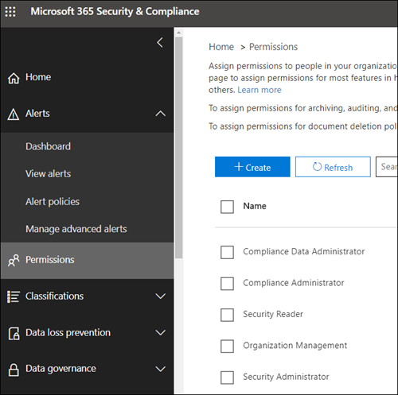

# Berechtigungen im neuen Microsoft 365 Compliance Center und Microsoft 365 Security CenterPermissions in the Microsoft 365 compliance center and Microsoft 365 security center

Ihre Organisation muss Sicherheits- und Complianceszenarios verwalten, die alle Microsoft 365-Dienste umfassen.Your organization needs to manage security and compliance scenarios that span all the Microsoft 365 services. Und Sie benötigen die Flexibilität, die richtigen Administratorberechtigungen für die richtigen Personen in der IT-Gruppe Ihrer Organisation bereitzustellen.And you need the flexibility to give the right admin permissions to the right people in your organization's IT group. Mithilfe des Microsoft 365 Security Centers oder des Microsoft 365 Compliance Centers können Sie Berechtigungen zentral für alle Aufgaben im Zusammenhang mit Sicherheit und Compliance verwalten.By using the Microsoft 365 security center or Microsoft 365 compliance center, you can manage permissions centrally for all tasks related to security or compliance.

Nachdem der globale Administrator diese Administratorrollen zugewiesen hat, haben die Administratoren Zugriff auf Features und Daten, die alle Dienste in Microsoft 365 umfassen, z. B. das Microsoft 365 Security Center, das Microsoft 365 Compliance Center, Azure, Office 365 und Enterprise Mobility +.Security.After the global administrator assigns these admin roles, the admins have access to features and data that span all services in Microsoft 365, such as the Microsoft 365 security center, Microsoft 365 compliance center, Azure, Office 365, and Enterprise Mobility + Security.

## Was die Microsoft 365-Rollen sindWhat the Microsoft 365 roles are

Die Rollen, die im Microsoft 365 Compliance Center und im Microsoft 365 Security Center angezeigt werden, sind Azure Active Directory-Rollen.The roles that appear in the Microsoft 365 compliance center and Microsoft 365 security center are Azure Active Directory roles. Diese Rollen sind so konzipiert, dass Sie den Aufgaben in der IT-Gruppe Ihrer Organisation entsprechen, sodass einer Person ganz einfach alle Berechtigungen gewährt werden können, die sie für ihre Arbeit benötigt.These roles are designed to align with job functions in your organization's IT group, making it easy to give a person all the permissions necessary to get their job done.

|**Rolle****Role**|**Beschreibung****Description**|
|:-----|:-----|
|**Globaler Administrator****Global administrator**|Benutzer mit dieser Rolle haben Zugriff auf alle Verwaltungsfunktionen in allen Microsoft 365-Diensten.Users with this role have access to all administrative features in all Microsoft 365 services. Nur globale Administratoren können weitere Administratorrollen zuweisen.Only global administrators can assign other administrator roles.|
|**Compliancedatenadministrator****Compliance data administrator**|Benutzer mit dieser Rolle können die Daten Ihrer Organisation in Microsoft 365 nachverfolgen, sicherstellen, dass sie geschützt sind, und Einblicke in alle Probleme erhalten, um Risiken zu minimieren.Users with this role can keep track of your organization's data across Microsoft 365, make sure it's protected, and get insights into any issues to help mitigate risks.|
|**Complianceadministrator****Compliance administrator**|Benutzer mit dieser Rolle können dazu beitragen, dass Ihre Organisation alle behördlichen Bestimmungen einhält und eDiscovery-Fälle verwalten und Richtlinien zur Datengovernance über Microsoft 365-Standorte, -Identitäten und -Apps hinweg aufrechterhalten kann.Users with this role can help your organization stay compliant with any regulatory requirements, manage eDiscovery cases, and maintain data governance policies across Microsoft 365 locations, identities, and apps.|
|**Sicherheitsoperator****Security operator**|Benutzer mit dieser Rolle können aktive Bedrohungen für Ihre Microsoft 365-Benutzer, -Geräte und -Inhalte anzeigen, untersuchen und auf Sie reagieren.Users with this role can view, investigate, and respond to active threats to your Microsoft 365 users, devices, and content.|
|**Benutzer mit Leseberechtigung für Sicherheitsfunktionen****Security reader**|Benutzer mit dieser Rolle können aktive Bedrohungen für Ihre Microsoft 365-Benutzer, -Geräte und -Inhalte anzeigen und untersuchen, besitzen aber (im Gegensatz zum Sicherheitsoperator) keine Berechtigungen zum Reagieren, indem sie Maßnahmen ergreifen.Users with this role can view and investigate active threats to your Microsoft 365 users, devices, and content, but (unlike the Security operator) they do not have permissions to respond by taking action.|
|**Sicherheitsadministrator****Security administrator**|Benutzer mit dieser Rolle können die Gesamtsicherheit Ihres Unternehmens steuern, indem sie Sicherheitsrichtlinien verwalten, Sicherheitsanalysen und Berichte in Microsoft 365-Produkten überprüfen und im Zusammenhang mit Bedrohungen immer auf dem neuesten Stand bleiben.Users with this role can control your organization's overall security by managing security policies, reviewing security analytics and reports across Microsoft 365 products, and staying up-to-speed on the threat landscape.|

## Worauf die Microsoft 365-Rollen Zugriff habenWhat the Microsoft 365 roles have access to

Nachfolgend sind die verfügbaren Rollen und die Aufgaben aufgelistet, die von den Benutzern ausgeführt werden können, denen diese zugewiesen sind.Here are the available roles and what people assigned to them can do.

### Globaler AdministratorGlobal administrator

Benutzer mit dieser Rolle besitzen Zugriff auf alle administrativen Features in Azure Active Directory sowie Dienste, die Azure Active Directory-Identitäten nutzen, z.B. Microsoft 365 Security Center, Microsoft 365 Compliance Center, Exchange Online, SharePoint Online oder Skype for Business Online.Users with this role have access to all administrative features in Azure Active Directory, as well as services that use Azure Active Directory identities like Microsoft 365 security center, Microsoft 365 compliance center, Exchange Online, SharePoint Online, and Skype for Business Online. Die Person, die die Anmeldung für den Azure Active Directory-Mandanten vornimmt, wird ein globaler Administrator.The person who signs up for the Azure Active Directory tenant becomes a global administrator. Nur globale Administratoren können weitere Administratorrollen zuweisen.Only global administrators can assign other administrator roles. In Ihrem Unternehmen können mehrere globale Administratoren vorhanden sein.There can be more than one global administrator at your company. Globale Administratoren können das Kennwort für alle Benutzer und alle anderen Administratoren zurücksetzen.Global admins can reset the password for any user and all other administrators.

### ComplianceadministratorCompliance administrator

Benutzer mit dieser Rolle verfügen über Berechtigungen zum Verwalten von Compliancefeatures im Microsoft 365 Compliance Center, Microsoft 365 Admin Center, Azure, und Office 365 Security & Compliance Center.Users with this role have permissions to manage compliance-related features in the Microsoft 365 compliance center, Microsoft 365 admin center, Azure, and Office 365 Security & Compliance Center. Die Benutzer können auch alle Features im Exchange Admin Center sowie im Teams und Skype for Business Admin Center verwalten und Supporttickets für Azure und Microsoft 365 erstellen.Users can also manage all features within the Exchange admin center and Teams & Skype for Business admin center and create support tickets for Azure and Microsoft 365.

|**In diesem Dienst...****In this service...**|**Kann der Complianceadministrator Folgendes...****The compliance administrator can...**|
|:-----|:-----|
|[**Microsoft 365 Compliance Center****Microsoft 365 compliance center**](https://compliance.microsoft.com/)|Schützen und Verwalten Ihrer Organisationsdaten für Microsoft 365-DiensteProtect and manage your organization's data across Microsoft 365 services.    Verwalten von KonformitätwarnungenManage compliance alerts.|
|[**Compliancebewertung****Compliance Score**](https://docs.microsoft.com/office365/securitycompliance/meet-data-protection-and-regulatory-reqs-using-microsoft-cloud)|Nachverfolgen, Zuweisen und Überprüfen der Einhaltung gesetzlicher Vorschriften durch Ihre OrganisationTrack, assign, and verify your organization's regulatory compliance activities.|
|[**Office 365 Security & Compliance Center****Office 365 Security & Compliance Center**](https://docs.microsoft.com/office365/admin/add-users/about-admin-roles)|Verwalten der DatengovernanceManage data governance.    Durchführen von Untersuchungen zu rechtlichen Aspekten und DatenPerform legal and data investigation.    Verwalten von DRS-Anforderungen.Manage Data Subject Request.|
|[**Intune****Intune**](https://docs.microsoft.com/intune/role-based-access-control)|Anzeigen aller Intune-ÜberwachungsdatenView all Intune audit data.|
|[**Cloud-App-Sicherheit****Cloud App Security**](https://docs.microsoft.com/cloud-app-security/manage-admins)|Verfügt über schreibgeschützten Zugriff und kann Warnungen verwaltenHas read-only permissions and can manage alerts.    Kann Dateirichtlinien erstellen und ändern und Dateigovernanceaktionen zulassenCan create and modify file policies and allow file governance actions.    Kann alle unter „Datenverwaltung“ integrierten Berichte anzeigenCan view all the built-in reports under Data Management.|

### CompliancedatenadministratorCompliance data administrator

Benutzer mit dieser Rolle verfügen über Berechtigungen zum Schützen und Nachverfolgen von Daten im Microsoft 365 Compliance Center, Microsoft 365 Admin Center und in Azure.Users with this role have permissions to protect and track data in the Microsoft 365 compliance center, Microsoft 365 admin center, and Azure. Die Benutzer können auch alle Features im Exchange Admin Center, in Compliancebewertung sowie im Teams und Skype for Business Admin Center verwalten und Supporttickets für Azure und Microsoft 365 erstellen.Users can also manage all features within the Exchange admin center, Compliance Score, and Teams & Skype for Business admin center and create support tickets for Azure and Microsoft 365.

|**In diesem Dienst...****In this service...**|**kann der Compliancedatenadministrator folgende Aufgaben ausführen...****The compliance data administrator can...**|
|:-----|:-----|
|[**Microsoft 365 Compliance Center****Microsoft 365 compliance center**](https://compliance.microsoft.com/)|Schützen und Verwalten Ihrer Organisationsdaten für Microsoft 365-DiensteProtect and manage your organization's data across Microsoft 365 services.    Verwalten von KonformitätwarnungenManage compliance alerts.    Verwalten von VertraulichkeitsbezeichnungenManage sensitivity labels|
|[**Compliancebewertung****Compliance Score**](https://docs.microsoft.com/office365/securitycompliance/meet-data-protection-and-regulatory-reqs-using-microsoft-cloud)|Nachverfolgen, Zuweisen und Überprüfen der Einhaltung gesetzlicher Vorschriften durch Ihre OrganisationTrack, assign, and verify your organization's regulatory compliance activities.|
|[**Office 365 Security & Compliance Center****Office 365 Security & Compliance Center**](https://docs.microsoft.com/office365/admin/add-users/about-admin-roles)|Verwalten der DatengovernanceManage data governance.    Durchführen von Untersuchungen zu rechtlichen Aspekten und DatenPerform legal and data investigation.    Verwalten von DRS-Anforderungen.Manage Data Subject Request.    Verwalten von VertraulichkeitsbezeichnungenManage sensitivity labels|
|[**Intune**](https://docs.microsoft.com/intune/role-based-access-control) (in Kürze verfügbar)[**Intune**](https://docs.microsoft.com/intune/role-based-access-control) (coming soon)|Anzeigen aller Intune-ÜberwachungsdatenView all Intune audit data.|
|[**Cloud-App-Sicherheit****Cloud App Security**](https://docs.microsoft.com/cloud-app-security/manage-admins)|Verwenden von schreibgeschützten Berechtigungen zum Anzeigen von InformationenUse read-only permissions to view information.  Verwalten von BenachrichtigungenManage alerts.    Erstellen und Ändern von Dateirichtlinien und Zulassen von DateigovernanceaktionenCreate and modify file policies and allow file governance actions.    Anzeigen aller unter „Datenverwaltung“ integrierten BerichteView all the built-in reports under Data Management.|

### SicherheitsadministratorSecurity administrator

Benutzer mit dieser Rolle haben Berechtigungen zur Verwaltung sicherheitsrelevanter Funktionen im Microsoft 365 Security Center, Azure Active Directory Identity Protection, Azure Information Protection und Office 365 Security & Compliance Center.Users with this role have permissions to manage security-related features in the Microsoft 365 security center, Azure Active Directory Identity Protection, Azure Information Protection, and Office 365 Security & Compliance Center.

|**In diesem Dienst...****In this service...**|**Der Sicherheitsadministrator kann...****The security administrator can...**|
|:-----|:-----|
|[**Microsoft 365 Security Center****Microsoft 365 security center**](https://security.microsoft.com/)|Überwachen von sicherheitsrelevanten Richtlinien in Microsoft 365-DienstenMonitor security-related policies across Microsoft 365 services.     Verwalten von Sicherheitsbedrohungen und WarnungenManage security threats and alerts.    Anzeigen von BerichtenView reports.    Verwalten von VertraulichkeitsbezeichnungenManage sensitivity labels.|
|**Identity Protection Center****Identity Protection Center**|Alle Berechtigungen des Benutzers mit Leseberechtigung für Sicherheitsfunktionen plus Durchführung aller  Identity Protection Center-Vorgänge, mit Ausnahme des Zurücksetzens von Kennwörtern.Do everything the Security Reader role can, plus  perform all Identity Protection Center operations, except for reset passwords.|
|[**Privileged Identity Management****Privileged Identity Management**](https://docs.microsoft.com/azure/active-directory/privileged-identity-management/pim-configure)|Alle Berechtigungen des Benutzers mit Leseberechtigung für SicherheitsfunktionenDo everything the Security Reader role can.    **Kann keine** Azure AD-Rollenzuweisungen oder -einstellungen verwalten.**Cannot** manage Azure AD role assignments or settings.|
|[**Office 365 Security & Compliance Center****Office 365 Security & Compliance Center**](https://docs.microsoft.com/office365/admin/add-users/about-admin-roles)|Verwalten von SicherheitsrichtlinienManage security policies.    Anzeigen, Untersuchen und Reagieren auf SicherheitsbedrohungenView, investigate, and respond to security threats    Anzeigen von BerichtenView reports.    Verwalten von VertraulichkeitsbezeichnungenManage sensitivity labels.|
|**Azure Advanced Threat Protection****Azure Advanced Threat Protection**|Überwachen und Reagieren auf verdächtige SicherheitsaktivitätenMonitor and respond to suspicious security activity.|
|**Windows Defender ATP und EDR****Windows Defender ATP and EDR**|Zuweisen von RollenAssign roles.    Verwalten von ComputergruppenManage machine groups.    Konfigurieren der Endpunkt-Bedrohungserkennung und der automatisierten KorrekturConfigure endpoint threat detection and automated remediation.    Anzeigen, Untersuchen und Reagieren auf WarnungenView, investigate, and respond to alerts.|
|[**Intune****Intune**](https://docs.microsoft.com/intune/role-based-access-control)|Anzeigen von Benutzern, Geräten, Registrierung, Konfiguration und AnwendungsinformationenViews user, device, enrollment, configuration, and application information.    Kann **keine** Änderungen an Intune vornehmen**Cannot** make changes to Intune.|
|[**Cloud-App-Sicherheit****Cloud App Security**](https://docs.microsoft.com/cloud-app-security/manage-admins)|Hinzufügen von Administratoren, Richtlinien und Einstellungen, Hochladen von Protokollen und Ausführen von GovernanceaktionenAdd admins, add policies and settings, upload logs and perform governance actions.|
|[**Azure Security Center**](https://docs.microsoft.com/azure/role-based-access-control/built-in-roles) (in Kürze verfügbar)[**Azure Security Center**](https://docs.microsoft.com/azure/role-based-access-control/built-in-roles) (coming soon)|Anzeigen von Sicherheitsrichtlinien und -zuständen, Bearbeiten von Sicherheitsrichtlinien sowie Anzeigen und Verwerfen von Warnungen und Empfehlungen.View security policies, view security states, edit security policies, view alerts and recommendations, dismiss alerts and recommendations.|
|[**Office 365-Dienstintegrität****Office 365 service health**](https://docs.microsoft.com/office365/enterprise/view-service-health)|Anzeigen der Integrität von Office 365-DienstenView the health of Office 365 services.|

### SicherheitsoperatorSecurity operator

Benutzer mit dieser Rolle können Warnungen verwalten und besitzen globalen schreibgeschützten Zugriff auf sicherheitsbezogene Features, einschließlich alle Informationen in Microsoft 365 Security Center, Azure Active Directory, Identity Protection, und Privileged Identity Management, sowie die Möglichkeit zum Lesen von Azure Active Directory-Anmeldeberichten und Überwachungsprotokollen und für das Office 365 Security & Compliance Center.Users with this role can manage alerts and have global read-only access on security-related feature, including all information in the Microsoft 365 security center, Azure Active Directory, Identity Protection, Privileged Identity Management, as well as the ability to read Azure Active Directory sign-in reports and audit logs, and in Office 365 Security & Compliance Center.

|**In diesem Dienst...****In this service...**|**Der Sicherheitsoperator kann...****The security operator can...**|
|:-----|:-----|
|[**Microsoft 365 Security Center****Microsoft 365 security center**](https://security.microsoft.com/)|Alle Berechtigungen des Benutzers mit Leseberechtigung für SicherheitsfunktionenDo everything the Security Reader role can.    Anzeigen, Untersuchen und Reagieren auf SicherheitswarnungenView, investigate, and respond to security alerts.|
|**Identity Protection Center** (in Kürze verfügbar)**Identity Protection Center** (coming soon)|Alle Berechtigungen des Benutzers mit Leseberechtigung für SicherheitsfunktionenDo everything the Security Reader role can.|
|[**Privileged Identity Management****Privileged Identity Management**](https://docs.microsoft.com/azure/active-directory/privileged-identity-management/pim-configure)|Alle Berechtigungen des Benutzers mit Leseberechtigung für SicherheitsfunktionenDo everything the Security Reader role can.|
|[**Office 365 Security & Compliance Center****Office 365 Security & Compliance Center**](https://docs.microsoft.com/office365/admin/add-users/about-admin-roles)|Alle Berechtigungen des Benutzers mit Leseberechtigung für SicherheitsfunktionenDo everything the Security Reader role can.    Anzeigen, Untersuchen und Reagieren auf SicherheitsbedrohungenView, investigate, and respond to security threats|
|**Windows Defender ATP und EDR****Windows Defender ATP and EDR**|Alle Berechtigungen des Benutzers mit Leseberechtigung für SicherheitsfunktionenDo everything the Security Reader role can.    Anzeigen, Untersuchen und Reagieren auf WarnungenView, investigate, and respond to alerts.|
|[**Intune****Intune**](https://docs.microsoft.com/intune/role-based-access-control)|Anzeigen von Benutzern, Geräten, Registrierung, Konfiguration und AnwendungsinformationenViews user, device, enrollment, configuration, and application information.    Kann **keine** Änderungen an Intune vornehmen**Cannot** make changes to Intune.|
|[**Cloud-App-Sicherheit****Cloud App Security**](https://docs.microsoft.com/cloud-app-security/manage-admins)|Alle Berechtigungen des Benutzers mit Leseberechtigung für Sicherheitsfunktionen plus Anzeigen und Schließen von WarnungenDo everything the Security Reader role can, plus view and dismiss alerts.|
|[**Office 365-Dienstintegrität****Office 365 service health**](https://docs.microsoft.com/office365/enterprise/view-service-health)|Anzeigen der Integrität von Office 365-DienstenView the health of Office 365 services.|

### SicherheitsleseberechtigterSecurity reader

Benutzer mit dieser Rolle besitzen globalen schreibgeschützten Zugriff auf sicherheitsbezogene Features, einschließlich alle Informationen in Microsoft 365 Security Center, Azure Active Directory, Identity Protection, und Privileged Identity Management, sowie die Möglichkeit zum Lesen von Azure Active Directory-Anmeldeberichten und Überwachungsprotokollen und für das Office 365 Security & Compliance Center.Users with this role have global read-only access on security-related feature, including all information in the Microsoft 365 security center, Azure Active Directory, Identity Protection, Privileged Identity Management, as well as the ability to read Azure Active Directory sign-in reports and audit logs, and in Office 365 Security & Compliance Center.

|**In diesem Dienst...****In this service...**|**Ein Benutzer mit Leseberechtigung für Sicherheitsfunktionen kann...****The security reader can...**|
|:-----|:-----|
|[**Microsoft 365 Security Center****Microsoft 365 security center**](https://security.microsoft.com/)|Anzeigen von sicherheitsrelevanten Richtlinien in Microsoft 365-DienstenView security-related policies across Microsoft 365 services.    Anzeigen von Sicherheitsbedrohungen und WarnungenView security threats and alerts.    Anzeigen von BerichtenView reports.|
|**Identity Protection Center****Identity Protection Center**|Lesen Sie alle Sicherheitsberichte und Einstellungsinformationen für Sicherheitsfeatures: Antispam, Verschlüsselung, Verhinderung von Datenverlust (DLP), Antimalware, Advanced Threat Protection (ATP), Anti-Phishing-und Nachrichtenflussregeln (auch als Transportregeln bezeichnet).Read all security reports and settings information for security features: anti-spam, encryption, data loss prevention (DLP), anti-malware, Advanced Threat Protection (ATP), anti-phishing, and mail flow rules (also known as transport rules).|
|[**Privileged Identity Management****Privileged Identity Management**](https://docs.microsoft.com/azure/active-directory/privileged-identity-management/pim-configure)|Verwenden Sie schreibgeschützten Zugriff, um alle eingeblendeten Informationen in Azure AD PIM anzuzeigen: Richtlinien und Berichte für Azure AD-Rollenzuweisungen, Sicherheitsüberprüfungen und ( in Zukunft) Richtliniendaten und Berichte für andere Szenarien als die Azure AD-Rollenzuweisung.Use read-only access to view all information surfaced in Azure AD PIM: Policies and reports for Azure AD role assignments, security reviews, and (in the future) policy data and reports for scenarios other than Azure AD role assignment.    **Kann sich nicht** für Azure AD PIM registrieren oder Änderungen durchführen.**Cannot** sign up for Azure AD PIM or make any changes to it. Im PIM-Portal oder über PowerShell können Personen mit dieser Rolle zusätzliche Rollen (z.B. globaler Administrator oder Administrator für privilegierte Rollen) aktivieren, wenn der Benutzer für sie geeignet ist.In the PIM portal or via PowerShell, someone in this role can activate additional roles (for example, Global Admin or Privileged Role Administrator), if the user is a eligible for them.|
|[**Office 365 Security & Compliance Center****Office 365 Security & Compliance Center**](https://docs.microsoft.com/office365/admin/add-users/about-admin-roles)|Anzeigen von SicherheitsrichtlinienView security policies.    Anzeigen und Untersuchen von SicherheitsbedrohungenView and investigate security threats.    Anzeigen von BerichtenView reports.|
|**Windows Defender ATP und EDR****Windows Defender ATP and EDR**|Anzeigen und Untersuchen von WarnungenView and investigate alerts.|
|[**Intune****Intune**](https://docs.microsoft.com/intune/role-based-access-control)|Anzeigen von Benutzern, Geräten, Registrierung, Konfiguration und AnwendungsinformationenViews user, device, enrollment, configuration, and application information.    Kann **keine** Änderungen an Intune vornehmen**Cannot** make changes to Intune.|
|[**Cloud-App-Sicherheit****Cloud App Security**](https://docs.microsoft.com/cloud-app-security/manage-admins)|Verwenden von schreibgeschützten Berechtigungen zum Anzeigen von InformationenUse read-only permissions to view information.    Verwalten von BenachrichtigungenManage alerts.|
|[**Azure Security Center****Azure Security Center**](https://docs.microsoft.com/azure/role-based-access-control/built-in-roles)|Anzeigen von Empfehlungen und BenachrichtigungenView recommendations and alerts.    Anzeigen von SicherheitsrichtlinienView security policies.    Kann Sicherheitsstatus anzeigen, aber keine Änderungen vornehmen.View security states, but cannot make changes.|
|[**Office 365-Dienstintegrität****Office 365 service health**](https://docs.microsoft.com/office365/enterprise/view-service-health)|Anzeigen der Integrität von Office 365-DienstenView the health of Office 365 services.|

## Globale Administratoren können Rollen in Azure Active Directory verwaltenGlobal administrators can manage roles in Azure Active Directory

Wenn Sie im Microsoft 365 Compliance Center und im Microsoft 365 Security Center eine auswählen, können Sie deren Zuweisungen anzeigen.In the Microsoft 365 compliance center and Microsoft 365 security center, when you select a role, you can view its assignments. Um diese Zuweisungen verwalten zu können, müssen Sie aber zum Azure Active Directory wechseln.But to manage those assignments, you need to go to the Azure Active Directory.

Weitere Informationen finden Sie unter [Anzeigen und Zuweisen von Administratorrollen in Azure Active Directory](https://docs.microsoft.com/azure/active-directory/users-groups-roles/directory-manage-roles-portal).For more information, see [View and assign administrator roles in Azure Active Directory](https://docs.microsoft.com/azure/active-directory/users-groups-roles/directory-manage-roles-portal).

## Verwalten von Rollen in einem Dienst anstelle von Azure Active DirectoryManaging roles in a service instead of Azure Active Directory

Die Rollen, die im Microsoft 365 Compliance Center und im Microsoft 365 Security Center angezeigt werden, werden auch in den Diensten angezeigt, in denen sie über Berechtigungen verfügen.The roles that appear in the Microsoft 365 compliance center and Microsoft 365 security center also appear in the services where they have permissions. Sie können Sie diese Rollen beispielsweise im Office 365 Security & Compliance Center anzeigen.For example, you can see these roles in the Office 365 Security & Compliance Center.

### Unterbrechen der VererbungBreaking inheritance

Es ist wichtig, dass Sie verstehen die Verwaltung dieser Rollen in Azure Active Directory zentral für **alle** Microsoft 365-Dienste erfolgt.It's important to understand that you when you manage these roles in Azure Active Directory, you're doing so centrally for **all** Microsoft 365 services. Wenn Sie jedoch eine Rolle in einem bestimmten Dienst verwalten, z. B:. das Office 365 Security & Compliance Center, so verwalten Sie die Rolle **nur** für diesen spezifischen Dienst.However, when you manage a role in a specific service, such as the Office 365 Security & Compliance Center, you're managing the role for **only** that specific service. Die Zuweisungen und Berechtigungen für eine Rolle in einem Dienst setzen alle Berechtigungen außer Kraft, die der Azure Active Directory-Rolle erteilt wurden.The assignments and permissions for a role in a service override any permissions granted to the Azure Active Directory role.

Dies kann hilfreich sein – wenn eine Person beispielsweise der Rolle „Sicherheitsadministrator“ zugewiesen ist, verfügt sie nicht über die Berechtigung zum Verwalten von Vorfällen.This can be useful – for example, if a person is assigned to the Security administrator role, they don't have permissions to manage incidents. Sie können die Berechtigungen in Windows Defender Advanced Threat Protection jedoch verwenden, um ihnen die spezifische Berechtigung für die Vorfallsverwaltung in diesem Dienst zu erteilen.But you can use the permissions in Windows Defender Advanced Threat Protection to give them the specific permission for incident management in that service.

## Wo Sie Rolleninformationen zu den einzelnen Microsoft 365-Diensten findenWhere to find role information for each Microsoft 365 service

Indem Sie einen Benutzer einer der Microsoft 365 Compliance- oder Sicherheitsrollen zuweisen, erteilen Sie diesem Benutzer die Berechtigung für eine Vielzahl von Microsoft 365-Diensten.By assigning a user to one of the Microsoft 365 compliance or security admin roles, you give that user permissions to a range of Microsoft 365 services. Verwenden Sie die nachstehenden Links, um weitere Informationen zu den spezifischen Berechtigungen für eine Rolle in den einzelnen Diensten zu erhalten.Use the links below to find more information about the specific permissions for a role in each service.

|**Microsoft 365-Dienst****Microsoft 365 service**|**Informationen zur Rolle****Role info**|
|:-----|:-----|
|Administratorrollen in Office 365- und Microsoft 365-BusinessplänenAdmin roles in Office 365 and Microsoft 365 business plans|[Office 365-AdministratorrollenOffice 365 admin roles](https://docs.microsoft.com/office365/admin/add-users/about-admin-roles?view=o365-worldwide)|
|Azure Active Directory (Azure AD) und Azure AD Identity ProtectionAzure Active Directory (Azure AD) and Azure AD Identity Protection|[Azure AD-AdministratorrollenAzure AD admin roles](https://docs.microsoft.com/azure/active-directory/users-groups-roles/directory-assign-admin-roles)|
|Azure Advanced Threat ProtectionAzure Advanced Threat Protection|[Azure ATP-RollengruppenAzure ATP role groups](https://docs.microsoft.com/azure-advanced-threat-protection/atp-role-groups)|
|Azure Information ProtectionAzure Information Protection|[Azure AD-AdministratorrollenAzure AD admin roles](https://docs.microsoft.com/azure/active-directory/users-groups-roles/directory-assign-admin-roles)|
|CompliancebewertungCompliance Score|[Rollen er CompliancebewertungCompliance Score roles](https://docs.microsoft.com/microsoft-365/compliance/compliance-score-setup#set-user-permissions-and-assign-roles)|
|Exchange OnlineExchange Online|[Rollenbasierte Zugriffssteuerung in ExchangeExchange role-based access control](https://docs.microsoft.com/exchange/understanding-role-based-access-control-exchange-2013-help)|
|IntuneIntune|[Rollenbasierte Zugriffssteuerung von IntuneIntune role-based access control](https://docs.microsoft.com/intune/role-based-access-control)|
|Managed DesktopManaged Desktop|[Azure AD-AdministratorrollenAzure AD admin roles](https://docs.microsoft.com/azure/active-directory/users-groups-roles/directory-assign-admin-roles)|
|Microsoft Cloud App SecurityMicrosoft Cloud App Security|[Rollenbasierte ZugriffssteuerungRole-based access control](https://docs.microsoft.com/cloud-app-security/manage-admins)|
|Office 365 Security & Compliance CenterOffice 365 Security & Compliance Center|[Office 365-AdministratorrollenOffice 365 admin roles](https://docs.microsoft.com/office365/SecurityCompliance/permissions-in-the-security-and-compliance-center)|
|Privileged Identity ManagementPrivileged Identity Management|[Azure AD-AdministratorrollenAzure AD admin roles](https://docs.microsoft.com/azure/active-directory/users-groups-roles/directory-assign-admin-roles)|
|SicherheitsbewertungSecure Score|[Azure AD-AdministratorrollenAzure AD admin roles](https://docs.microsoft.com/azure/active-directory/users-groups-roles/directory-assign-admin-roles)|
|SharePoint OnlineSharePoint Online|[Azure AD-AdministratorrollenAzure AD admin roles](https://docs.microsoft.com/azure/active-directory/users-groups-roles/directory-assign-admin-roles)    [Informationen zur SharePoint-Administratorrolle in Office 365About the SharePoint admin role in Office 365](https://docs.microsoft.com/sharepoint/sharepoint-admin-role)|
|Teams/Skype for BusinessTeams/Skype for Business|[Azure AD-AdministratorrollenAzure AD admin roles](https://docs.microsoft.com/azure/active-directory/users-groups-roles/directory-assign-admin-roles)|
|Windows Defender Advanced Threat ProtectionWindows Defender Advanced Threat Protection|[Rollenbasierte Zugriffssteuerung von Windows Defender ATPWindows Defender ATP role-based access control](https://docs.microsoft.com/windows/security/threat-protection/windows-defender-atp/rbac-windows-defender-advanced-threat-protection)|

## Was in Kürze verfügbar sein wirdWhat is coming soon

Wir arbeiten noch an den Berechtigungen im neuen Microsoft 365 Compliance Center und Microsoft 365 Security CenterWe're still working on permissions in the Microsoft 365 compliance center and Microsoft 365 security center. Wir arbeiten derzeit beispielsweise an der Unterstützung für Folgendes:For example, we're currently working on support for the ability to:

- Verwalten der Rollen im Microsoft 365 Compliance Center und im Microsoft 365 Security Center und nicht in Azure Active Directory.Manage roles in the Microsoft 365 compliance center and Microsoft 365 security center, instead of going to Azure Active Directory.

- Anpassen von Rollen durch Hinzufügen oder Entfernen bestimmter Berechtigungen.Customize roles by adding or removing specific permissions.

- Erstellen benutzerdefinierter Rollen mit von Ihnen ausgewählten Berechtigungen.Create custom roles with permissions that you choose.
