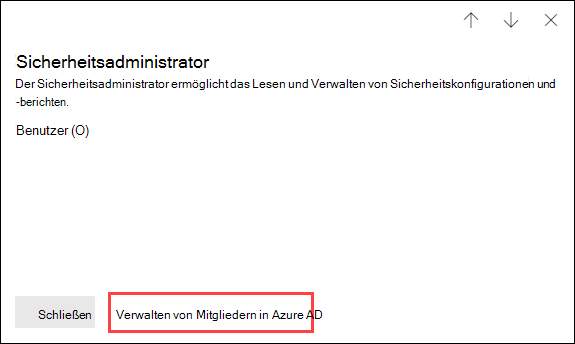

# Berechtigungen im neuen Microsoft 365 Compliance Center und Microsoft 365 Security CenterPermissions in the Microsoft 365 compliance center and Microsoft 365 security center

[!INCLUDE [Microsoft 365 Defender rebranding](../includes/microsoft-defender-for-office.md)]

Ihre Organisation muss Sicherheits- und Complianceszenarios verwalten, die alle Microsoft 365-Dienste umfassen.Your organization needs to manage security and compliance scenarios that span all the Microsoft 365 services. Und Sie benötigen die Flexibilität, die richtigen Administratorberechtigungen für die richtigen Personen in der IT-Gruppe Ihrer Organisation bereitzustellen.And you need the flexibility to give the right admin permissions to the right people in your organization's IT group. Mithilfe des Microsoft 365 Security Centers oder des Microsoft 365 Compliance Centers können Sie Berechtigungen zentral für alle Aufgaben im Zusammenhang mit Sicherheit und Compliance verwalten.By using the Microsoft 365 security center or Microsoft 365 compliance center, you can manage permissions centrally for all tasks related to security or compliance.

Nachdem ein globaler Administrator Benutzer zu diesen Administratorrollen hinzugefügt hat, haben diese Administratoren Zugriff auf Features und Daten, die alle Dienste in Microsoft 365 umfassen, z. B. das Microsoft 365 Security Center, das Microsoft 365 Compliance Center, Azure, Office 365 und Enterprise Mobility + Security.After a global administrator adds users to these admin roles, these admin will have access to features and data that span all services in Microsoft 365, such as the Microsoft 365 security center, Microsoft 365 compliance center, Azure, Office 365, and Enterprise Mobility + Security.

## Was die Microsoft 365-Rollen sindWhat the Microsoft 365 roles are

Die Rollen, die im Microsoft 365 Compliance Center und im Microsoft 365 Security Center angezeigt werden, sind Azure Active Directory-Rollen.The roles that appear in the Microsoft 365 compliance center and Microsoft 365 security center are Azure Active Directory roles. Diese Rollen sind so konzipiert, dass Sie den Aufgaben in der IT-Gruppe Ihrer Organisation entsprechen, sodass einer Person ganz einfach alle Berechtigungen gewährt werden können, die sie für ihre Arbeit benötigt.These roles are designed to align with job functions in your organization's IT group, making it easy to give a person all the permissions necessary to get their job done.

****

|RolleRole|BeschreibungDescription|
|---|---|
|**Globaler Administrator****Global administrator**|Zugriff auf alle Verwaltungsfunktionen in allen Microsoft 365-Diensten.Access to all administrative features in all Microsoft 365 services. Nur globale Administratoren können weitere Administratorrollen zuweisen.Only global administrators can assign other administrator roles. Weitere Informationen finden Sie unter [Globaler Administrator/Unternehmensadministrator](https://docs.microsoft.com/azure/active-directory/roles/permissions-reference#global-administrator--company-administrator).For more information, see [Global Administrator / Company Administrator](https://docs.microsoft.com/azure/active-directory/roles/permissions-reference#global-administrator--company-administrator).|
|**Compliancedatenadministrator****Compliance data administrator**|Verfolgen Sie die Daten Ihrer Organisation in Microsoft 365 nach, stellen Sie sicher, dass sie geschützt sind, und erhalten Sie Einblicke in alle Probleme, um Risiken zu minimieren.Keep track of your organization's data across Microsoft 365, make sure it's protected, and get insights into any issues to help mitigate risks. Weitere Informationen finden Sie unter [Compliancedatenadministrator](https://docs.microsoft.com/azure/active-directory/roles/permissions-reference#compliance-data-administrator).For more information, see [Compliance Data Administrator](https://docs.microsoft.com/azure/active-directory/roles/permissions-reference#compliance-data-administrator).|
|**Complianceadministrator****Compliance administrator**|Tragen Sie dazu bei, dass Ihre Organisation alle behördlichen Bestimmungen einhält und eDiscovery-Fälle verwalten sowie Richtlinien zur Datengovernance über Microsoft 365-Standorte, -Identitäten und -Apps hinweg aufrechterhalten kann.Help your organization stay compliant with any regulatory requirements, manage eDiscovery cases, and maintain data governance policies across Microsoft 365 locations, identities, and apps. Weitere Informationen finden Sie unter [Complianceadministrator](https://docs.microsoft.com/azure/active-directory/roles/permissions-reference#compliance-administrator).For more information, see [Compliance Administrator](https://docs.microsoft.com/azure/active-directory/roles/permissions-reference#compliance-administrator).|
|**Sicherheitsoperator****Security operator**|Zeigen Sie aktive Bedrohungen für Ihre Microsoft 365-Benutzer, -Geräte und -Inhalte an und untersuchen und reagieren Sie auf sie.View, investigate, and respond to active threats to your Microsoft 365 users, devices, and content. Weitere Informationen finden Sie unter [Sicherheitsoperator](https://docs.microsoft.com/azure/active-directory/roles/permissions-reference#security-operator).For more information, see [Security Operator](https://docs.microsoft.com/azure/active-directory/roles/permissions-reference#security-operator).|
|**Benutzer mit Leseberechtigung für Sicherheitsfunktionen****Security reader**|Zeigen Sie aktive Bedrohungen für Ihre Microsoft 365-Benutzer, -Geräte und -Inhalte an und untersuchen Sie diese; Sie besitzen jedoch (im Gegensatz zum Sicherheitsoperator) keine Berechtigung dazu, dagegen Maßnahmen zu ergreifen.View and investigate active threats to your Microsoft 365 users, devices, and content, but (unlike the Security operator) they do not have permissions to respond by taking action. Weitere Informationen finden Sie unter [Benutzer mit Leseberechtigung für Sicherheitsfunktionen](https://docs.microsoft.com/azure/active-directory/roles/permissions-reference#security-reader).For more information, see [Security Reader](https://docs.microsoft.com/azure/active-directory/roles/permissions-reference#security-reader).|
|**Sicherheitsadministrator****Security administrator**|Steuern Sie die Gesamtsicherheit Ihres Unternehmens, indem Sie Sicherheitsrichtlinien verwalten, Sicherheitsanalysen und Berichte zu Microsoft 365-Produkten überprüfen und im Hinblick auf Bedrohungen immer auf dem neuesten Stand bleiben.Control your organization's overall security by managing security policies, reviewing security analytics and reports across Microsoft 365 products, and staying up-to-speed on the threat landscape. Weitere Informationen finden Sie unter [Sicherheitsadministrator](https://docs.microsoft.com/azure/active-directory/roles/permissions-reference#security-administrator).For more information, see [Security Administrator](https://docs.microsoft.com/azure/active-directory/roles/permissions-reference#security-administrator).|
|**Globaler Leser****Global reader**|Die Version mit reiner Leseberechtigung der Rolle **globaler Administrator**.The read-only version of the **Global administrator** role. Zeigen Sie alle Einstellungen und Verwaltungsinformationen in Microsoft 365 an.View all settings and administrative information across Microsoft 365. Weitere Informationen finden Sie unter [Globaler Leser](https://docs.microsoft.com/azure/active-directory/roles/permissions-reference#global-reader).For more information, see [Global Reader](https://docs.microsoft.com/azure/active-directory/roles/permissions-reference#global-reader).|
|

## Globale Administratoren können Rollen in Azure Active Directory verwaltenGlobal administrators can manage roles in Azure Active Directory

Wenn Sie im Microsoft 365 Compliance Center und im Microsoft 365 Security Center eine auswählen, können Sie deren Zuweisungen anzeigen.In the Microsoft 365 compliance center and Microsoft 365 security center, when you select a role, you can view its assignments. Um diese Zuweisungen verwalten zu können, müssen Sie aber zum Azure Active Directory wechseln.But to manage those assignments, you need to go to the Azure Active Directory.

Weitere Informationen finden Sie unter [Anzeigen und Zuweisen von Administratorrollen in Azure Active Directory](https://docs.microsoft.com/azure/active-directory/users-groups-roles/directory-manage-roles-portal).For more information, see [View and assign administrator roles in Azure Active Directory](https://docs.microsoft.com/azure/active-directory/users-groups-roles/directory-manage-roles-portal).

## Verwalten von Rollen in einem Dienst anstelle von Azure Active DirectoryManaging roles in a service instead of Azure Active Directory

Die Rollen, die im Microsoft 365 Compliance Center und im Microsoft 365 Security Center angezeigt werden, werden auch in den Diensten angezeigt, in denen sie über Berechtigungen verfügen.The roles that appear in the Microsoft 365 compliance center and Microsoft 365 security center also appear in the services where they have permissions. Sie können diese Rollen beispielsweise im Security & Compliance Center anzeigen.For example, you can see these roles in the Security & Compliance Center.

Informationen zur Verwendung dieser Rollen im Security & Compliance Center finden Sie unter [Berechtigungen im Security & Compliance Center](permissions-in-the-security-and-compliance-center.md).For information about how these roles are used in the Security & Compliance Center, see [Permissions in the Security & Compliance Center](permissions-in-the-security-and-compliance-center.md).

### Unterbrechen der VererbungBreaking inheritance

Es ist wichtig, dass Sie verstehen die Verwaltung dieser Rollen in Azure Active Directory zentral für **alle** Microsoft 365-Dienste erfolgt.It's important to understand that you when you manage these roles in Azure Active Directory, you're doing so centrally for **all** Microsoft 365 services. Wenn Sie jedoch eine Rolle in einem bestimmten Dienst verwalten, wie z. B. dem Security & Compliance Center, so verwalten Sie die Rolle **nur** für diesen spezifischen Dienst.However, when you manage a role in a specific service, such as the Security & Compliance Center, you're managing the role for **only** that specific service. Die Zuweisungen und Berechtigungen für eine Rolle in einem Dienst setzen alle Berechtigungen außer Kraft, die der Azure Active Directory-Rolle erteilt wurden.The assignments and permissions for a role in a service override any permissions granted to the Azure Active Directory role.

Dies kann äußerst nützlich sein.This can be useful. Wenn eine Person beispielsweise der Rolle „Sicherheitsadministrator“ zugewiesen ist, verfügt sie nicht über die Berechtigung zum Verwalten von Vorfällen.For example, if a person is assigned to the Security administrator role, they don't have permissions to manage incidents. Sie können die Berechtigungen in Microsoft Defender für Endpunkt jedoch verwenden, um ihr die spezifische Berechtigung für die Vorfallsverwaltung in diesem Dienst zu erteilen.But you can use the permissions in Microsoft Defender for Endpoint to give them the specific permission for incident management in that service.

## Wo Sie Rolleninformationen zu den einzelnen Microsoft 365-Diensten findenWhere to find role information for each Microsoft 365 service

Indem Sie einen Benutzer einer der Microsoft 365 Compliance- oder Sicherheitsrollen zuweisen, erteilen Sie diesem Benutzer die Berechtigung für eine Vielzahl von Microsoft 365-Diensten.By assigning a user to one of the Microsoft 365 compliance or security admin roles, you give that user permissions to a range of Microsoft 365 services. Verwenden Sie die nachstehenden Links, um weitere Informationen zu den spezifischen Berechtigungen für eine Rolle in den einzelnen Diensten zu erhalten.Use the links below to find more information about the specific permissions for a role in each service.

****

|Microsoft 365-DienstMicrosoft 365 service|RolleninformationRole info|
|---|---|
|Administratorrollen in Office 365 und Microsoft 365 Business-PlänenAdmin roles in Office 365 and Microsoft 365 for business plans|[Microsoft 365-AdministratorrollenMicrosoft 365 admin roles](https://docs.microsoft.com/microsoft-365/admin/add-users/about-admin-roles)|
|Azure Active Directory (Azure AD) und Azure AD Identity ProtectionAzure Active Directory (Azure AD) and Azure AD Identity Protection|[Azure AD-AdministratorrollenAzure AD admin roles](https://docs.microsoft.com/azure/active-directory/users-groups-roles/directory-assign-admin-roles)|
|Microsoft Defender for IdentityMicrosoft Defender for Identity|[Microsoft Defender for Identity-RollengruppenMicrosoft Defender for Identity role groups](https://docs.microsoft.com/azure-advanced-threat-protection/atp-role-groups)|
|Azure Information ProtectionAzure Information Protection|[Azure AD-AdministratorrollenAzure AD admin roles](https://docs.microsoft.com/azure/active-directory/users-groups-roles/directory-assign-admin-roles)|
|Compliance-ManagerCompliance Manager|[Compliance-ManagerCompliance Manager](https://docs.microsoft.com/microsoft-365/compliance/compliance-manager-setup#set-user-permissions-and-assign-roles)|
|Exchange OnlineExchange Online|[Rollenbasierte Zugriffssteuerung in ExchangeExchange role-based access control](https://docs.microsoft.com/exchange/permissions-exo/permissions-exo)|
|IntuneIntune|[Rollenbasierte Zugriffssteuerung von IntuneIntune role-based access control](https://docs.microsoft.com/intune/role-based-access-control)|
|Managed DesktopManaged Desktop|[Azure AD-AdministratorrollenAzure AD admin roles](https://docs.microsoft.com/azure/active-directory/users-groups-roles/directory-assign-admin-roles)|
|Microsoft Cloud App SecurityMicrosoft Cloud App Security|[Rollenbasierte ZugriffssteuerungRole-based access control](https://docs.microsoft.com/cloud-app-security/manage-admins)|
|Security & Compliance CenterSecurity & Compliance Center|[Microsoft 365-AdministratorrollenMicrosoft 365 admin roles](permissions-in-the-security-and-compliance-center.md)|
|Privileged Identity ManagementPrivileged Identity Management|[Azure AD-AdministratorrollenAzure AD admin roles](https://docs.microsoft.com/azure/active-directory/users-groups-roles/directory-assign-admin-roles)|
|SicherheitsbewertungSecure Score|[Azure AD-AdministratorrollenAzure AD admin roles](https://docs.microsoft.com/azure/active-directory/users-groups-roles/directory-assign-admin-roles)|
|SharePoint OnlineSharePoint Online|[Azure AD-AdministratorrollenAzure AD admin roles](https://docs.microsoft.com/azure/active-directory/users-groups-roles/directory-assign-admin-roles) 
 [Informationen zur SharePoint-Administratorrolle in Office 365About the SharePoint admin role in Office 365](https://docs.microsoft.com/sharepoint/sharepoint-admin-role)|
|Teams/Skype for BusinessTeams/Skype for Business|[Azure AD-AdministratorrollenAzure AD admin roles](https://docs.microsoft.com/azure/active-directory/users-groups-roles/directory-assign-admin-roles)|
|Microsoft Defender für EndpunktMicrosoft Defender for Endpoint|[Microsoft Defender für Endpunkt – rollenbasierte ZugriffssteuerungMicrosoft Defender for Endpoint role-based access control](https://docs.microsoft.com/windows/security/threat-protection/windows-defender-atp/rbac-windows-defender-advanced-threat-protection)|
|

## In Kürze verfügbarComing soon

Wir arbeiten noch an den Berechtigungen im neuen Microsoft 365 Compliance Center und Microsoft 365 Security CenterWe're still working on permissions in the Microsoft 365 compliance center and Microsoft 365 security center. Wir arbeiten derzeit beispielsweise an der Unterstützung für Folgendes:For example, we're currently working on support for the ability to:

- Verwalten der Rollen im Microsoft 365 Compliance Center und im Microsoft 365 Security Center und nicht in Azure Active Directory.Manage roles in the Microsoft 365 compliance center and Microsoft 365 security center, instead of going to Azure Active Directory.
- Anpassen von Rollen durch Hinzufügen oder Entfernen bestimmter Berechtigungen.Customize roles by adding or removing specific permissions.
- Erstellen benutzerdefinierter Rollen mit von Ihnen ausgewählten Berechtigungen.Create custom roles with permissions that you choose.
