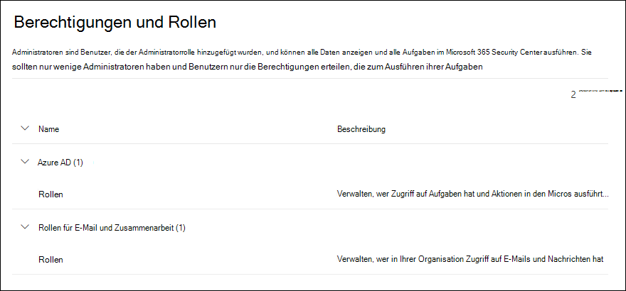

# Berechtigungen im Microsoft 365 Defender-PortalPermissions in the Microsoft 365 Defender portal

[!INCLUDE [Microsoft 365 Defender rebranding](../includes/microsoft-defender-for-office.md)]

**Gilt für****Applies to**
- [Exchange Online ProtectionExchange Online Protection](exchange-online-protection-overview.md)
- [Microsoft Defender für Office 365 Plan 1 und Plan 2Microsoft Defender for Office 365 plan 1 and plan 2](defender-for-office-365.md)
- [Microsoft 365 DefenderMicrosoft 365 Defender](../defender/microsoft-365-defender.md)

Ihre Organisation muss Sicherheitsszenarien verwalten, die alle Microsoft 365-Dienste umfassen.You need to manage security scenarios that span all the Microsoft 365 services. Und Sie benötigen die Flexibilität, die richtigen Administratorberechtigungen für die richtigen Personen in Ihrer Organisation bereitzustellen.And you need the flexibility to give the right admin permissions to the right people in your organization.

Das Microsoft 365 Defender-Portal in <https://security.microsoft.com> unterstützt das direkte Verwalten von Berechtigungen für Benutzer, die Sicherheitsaufgaben in Microsoft 365 ausführen.The Microsoft 365 Defender portal at <https://security.microsoft.com> supports directly managing permissions for users who perform security tasks in Microsoft 365. Mithilfe des Microsoft 365 Defender-Portal können Sie Berechtigungen zentral für alle Aufgaben im Zusammenhang mit Sicherheit verwalten.By using the Microsoft 365 Defender portal to manage permissions, you can manage permissions centrally for all tasks related to security.

Zum Verwalten von Berechtigungen wechseln Sie im Microsoft 365 Defender-Portal zu **Berechtigungen und Rollen** oder <https://security.microsoft.com/securitypermissions>.To manage permissions in the Microsoft 365 Defender portal, go to **Permissions & roles** or <https://security.microsoft.com/securitypermissions>. Sie müssen ein **globaler Administrator** oder ein Mitglied der Rollengruppe **Organisationsverwaltung** im Microsoft 365 Defender-Portal sein.You need to be a **global administrator** or a member of the **Organization Management** role group in the Microsoft 365 Defender portal. Insbesondere ermöglicht die Rolle **Rollenverwaltung** Benutzern das Anzeigen, Erstellen und Ändern von Rollengruppen im Microsoft 365 Defender-Portal. Standardmäßig wird diese Rolle nur der Rollengruppe **Organisationsverwaltung** zugewiesen.Specifically, the **Role Management** role allows users to view, create, and modify role groups in the Microsoft 365 Defender portal, and by default, that role is assigned only to the **Organization Management** role group.

> [!NOTE]
> Informationen zu Berechtigungen im Microsoft 365 Compliance Center finden Sie unter [Berechtigungen im Microsoft 365 Compliance Center](../../compliance/microsoft-365-compliance-center-permissions.md).For information about permissions in the Microsoft 365 compliance center, see [Permissions in the Microsoft 365 compliance center](../../compliance/microsoft-365-compliance-center-permissions.md).

## Beziehung zwischen Mitgliedern, Rollen und RollengruppenRelationship of members, roles, and role groups

Die Berechtigungen im Microsoft 365 Defender-Portal basieren auf dem Berechtigungsmodell der rollenbasierten Zugriffssteuerung (Role Based Access Control, RBAC).Permissions in the Microsoft 365 Defender portal are based on the role-based access control (RBAC) permissions model. Das RBAC ist das gleiche Berechtigungsmodell, das von den meisten Microsoft 365-Diensten verwendet wird. Wenn Sie sich also mit der Berechtigungsstruktur in diesen Diensten auskennen, wird Ihnen das Erteilen von Berechtigungen im Microsoft 365 Defender-Portal sehr vertraut sein.RBAC is the same permissions model that's used by most Microsoft 365 services, so if you're familiar with the permission structure in these services, granting permissions in the Microsoft 365 Defender portal will be very familiar.

Eine **Rolle** erteilt ihnen die Berechtigungen zum Ausführen einer Reihe von Aufgaben.A **role** grants the permissions to do a set of tasks.

Eine **Rollengruppe** besteht aus einer Reihe von Rollen, mit denen Personen ihre Aufgaben im Microsoft 365 Defender-Portal erfüllen können.A **role group** is a set of roles that lets people do their jobs in the Microsoft 365 Defender portal. Die Rollengruppe „Angriffssimulatoradministratoren“ umfasst z. B. die Rolle des Angriffssimulatoradministrators, zum Erstellen und Verwalten aller Aspekte der Schulung zur Angriffssimulation.For example, the Attack Simulator Administrators role group includes the Attack Simulator Admin role to create and manage all aspects of attack simulation training.

Das Microsoft 365 Defender-Portal enthält Standardrollengruppen für die gängigsten Aufgaben und am häufigsten verwendeten Funktionen, die Sie zuweisen müssen.The Microsoft 365 Defender portal includes default role groups for the most common tasks and functions that you'll need to assign. Allgemein empfiehlt es sich, den Standardrollengruppen einzelne Benutzer einfach als **Mitglieder** hinzuzufügen.Generally, we recommend simply adding individual users as **members** to the default role groups.

## Rollen und Rollengruppen im Microsoft 365 Defender-PortalRoles and role groups in the Microsoft 365 Defender portal

Die folgenden Arten von Rollen und Rollengruppen sind im Microsoft 365 Defender-Portal unter **Berechtigungen und Rollen** verfügbar:The following types of roles and role groups are available in **Permissions & roles** in the Microsoft 365 Defender portal:

- **Azure AD-Rollen**: Sie können die Rollen und zugewiesenen Benutzer anzeigen, sie aber nicht direkt im Microsoft 365 Defender-Portal verwalten.**Azure AD roles**: You can view the roles and assigned users, but you can't manage them directly in the Microsoft 365 Defender portal. Azure AD-Rollen sind zentrale Rollen, die Berechtigungen für **alle** Microsoft 365-Dienste zuweisen.Azure AD roles are central roles that assign permissions for **all** Microsoft 365 services.

- **Rollen für E-Mails und Zusammenarbeit**: Hierbei handelt es sich um dieselben Rollengruppen, die im Security & Compliance Center zur Verfügung stehen, Sie können sie aber direkt im Microsoft 365 Defender-Portal verwalten.**Email & collaboration roles**: These are the same role groups that are available in the Security & Compliance Center, but you can manage them directly in the Microsoft 365 Defender portal. Die hier zugewiesenen Berechtigungen gelten speziell für das Microsoft 365 Defender-Portal, das Microsoft 365 Compliance Center sowie das Security & Compliance Center und umfassen nicht alle Berechtigungen, die in anderen Microsoft 365-Workloads erforderlich sind.The permissions that you assign here are specific to the Microsoft 365 Defender portal, the Microsoft 365 compliance center, and the Security & Compliance Center, and don't cover all of the permissions that are needed in other Microsoft 365 workloads.

### Azure AD-Rollen im Microsoft 365 Defender-PortalAzure AD roles in the Microsoft 365 Defender portal

Wenn Sie zu **Rollen für E-Mails und Zusammenarbeit** \> **Berechtigungen und Rollen** \> **Azure AD-Rollen** \> **Rollen** (oder direkt zu <https://security.microsoft.com/aadpermissions>) wechseln, werden die Azure AD-Rollen angezeigt, die in diesem Abschnitt beschrieben werden.When you go **Email & collaboration roles** \> **Permissions & roles** \> **Azure AD roles** \> **Roles** (or directly to <https://security.microsoft.com/aadpermissions>) you'll see the Azure AD roles that are described in this section.

Wenn Sie eine Rolle auswählen, wird ein Detailflyout mit der Beschreibung der Rolle und den Benutzerzuweisungen angezeigt.When you select a role, a details flyout that contains the description of the role and the user assignments appears. Um diese Zuweisungen aber zu verwalten, müssen Sie im Detailflyout auf **Mitglieder in Azure AD verwalten** klicken.But to manage those assignments, you need to click **Manage members in Azure AD** in the details flyout.

Weitere Informationen finden Sie unter [Anzeigen und Zuweisen von Administratorrollen in Azure Active Directory](/azure/active-directory/users-groups-roles/directory-manage-roles-portal).For more information, see [View and assign administrator roles in Azure Active Directory](/azure/active-directory/users-groups-roles/directory-manage-roles-portal).

 

****

|RolleRole|BeschreibungDescription|
|---|---|
|**Globaler Administrator****Global administrator**|Zugriff auf alle Verwaltungsfunktionen in allen Microsoft 365-Diensten.Access to all administrative features in all Microsoft 365 services. Nur globale Administratoren können weitere Administratorrollen zuweisen.Only global administrators can assign other administrator roles. Weitere Informationen finden Sie unter [Globaler Administrator/Unternehmensadministrator](/azure/active-directory/roles/permissions-reference#global-administrator--company-administrator).For more information, see [Global Administrator / Company Administrator](/azure/active-directory/roles/permissions-reference#global-administrator--company-administrator).|
|**Compliancedatenadministrator****Compliance data administrator**|Verfolgen Sie die Daten Ihrer Organisation in Microsoft 365 nach, stellen Sie sicher, dass sie geschützt sind, und erhalten Sie Einblicke in alle Probleme, um Risiken zu minimieren.Keep track of your organization's data across Microsoft 365, make sure it's protected, and get insights into any issues to help mitigate risks. Weitere Informationen finden Sie unter [Compliancedatenadministrator](/azure/active-directory/roles/permissions-reference#compliance-data-administrator).For more information, see [Compliance Data Administrator](/azure/active-directory/roles/permissions-reference#compliance-data-administrator).|
|**Complianceadministrator****Compliance administrator**|Tragen Sie dazu bei, dass Ihre Organisation alle behördlichen Bestimmungen einhält und eDiscovery-Fälle verwalten sowie Richtlinien zur Datengovernance über Microsoft 365-Standorte, -Identitäten und -Apps hinweg aufrechterhalten kann.Help your organization stay compliant with any regulatory requirements, manage eDiscovery cases, and maintain data governance policies across Microsoft 365 locations, identities, and apps. Weitere Informationen finden Sie unter [Complianceadministrator](/azure/active-directory/roles/permissions-reference#compliance-administrator).For more information, see [Compliance Administrator](/azure/active-directory/roles/permissions-reference#compliance-administrator).|
|**Sicherheitsoperator****Security operator**|Zeigen Sie aktive Bedrohungen für Ihre Microsoft 365-Benutzer, -Geräte und -Inhalte an und untersuchen und reagieren Sie auf sie.View, investigate, and respond to active threats to your Microsoft 365 users, devices, and content. Weitere Informationen finden Sie unter [Sicherheitsoperator](/azure/active-directory/roles/permissions-reference#security-operator).For more information, see [Security Operator](/azure/active-directory/roles/permissions-reference#security-operator).|
|**Benutzer mit Leseberechtigung für Sicherheitsfunktionen****Security reader**|Zeigen Sie aktive Bedrohungen für Ihre Microsoft 365-Benutzer, -Geräte und -Inhalte an und untersuchen Sie diese; Sie besitzen jedoch (im Gegensatz zum Sicherheitsoperator) keine Berechtigung dazu, dagegen Maßnahmen zu ergreifen.View and investigate active threats to your Microsoft 365 users, devices, and content, but (unlike the Security operator) they do not have permissions to respond by taking action. Weitere Informationen finden Sie unter [Benutzer mit Leseberechtigung für Sicherheitsfunktionen](/azure/active-directory/roles/permissions-reference#security-reader).For more information, see [Security Reader](/azure/active-directory/roles/permissions-reference#security-reader).|
|**Sicherheitsadministrator****Security administrator**|Steuern Sie die Gesamtsicherheit Ihres Unternehmens, indem Sie Sicherheitsrichtlinien verwalten, Sicherheitsanalysen und Berichte zu Microsoft 365-Produkten überprüfen und im Hinblick auf Bedrohungen immer auf dem neuesten Stand bleiben.Control your organization's overall security by managing security policies, reviewing security analytics and reports across Microsoft 365 products, and staying up-to-speed on the threat landscape. Weitere Informationen finden Sie unter [Sicherheitsadministrator](/azure/active-directory/roles/permissions-reference#security-administrator).For more information, see [Security Administrator](/azure/active-directory/roles/permissions-reference#security-administrator).|
|**Globaler Leser****Global reader**|Die Version mit reiner Leseberechtigung der Rolle **globaler Administrator**.The read-only version of the **Global administrator** role. Zeigen Sie alle Einstellungen und Verwaltungsinformationen in Microsoft 365 an.View all settings and administrative information across Microsoft 365. Weitere Informationen finden Sie unter [Globaler Leser](/azure/active-directory/roles/permissions-reference#global-reader).For more information, see [Global Reader](/azure/active-directory/roles/permissions-reference#global-reader).|
|**Angriffssimulationsadministrator****Attack simulation administrator**|Erstellen und verwalten Sie alle Aspekte einer [Angriffssimulation](attack-simulation-training.md): Erstellung und Einführung/Planung einer Simulation sowie Überprüfung der Ergebnisse von Simulationen.Create and manage all aspects of [attack simulation](attack-simulation-training.md) creation, launch/scheduling of a simulation, and the review of simulation results. Weitere Informationen finden Sie unter [Angriffssimulationsadministrator](/azure/active-directory/roles/permissions-reference#attack-simulation-administrator).For more information, see [Attack Simulation Administrator](/azure/active-directory/roles/permissions-reference#attack-simulation-administrator).|
|**Angriffsnutzlastautor****Attack payload author**|Erstellen Sie Angriffsnutzlasten, ohne sie tatsächlich zu starten oder zu planen.Create attack payloads but not actually launch or schedule them. Weitere Informationen finden Sie unter [Angriffsnutzlastautor](/azure/active-directory/roles/permissions-reference#attack-payload-author).For more information, see [Attack Payload Author](/azure/active-directory/roles/permissions-reference#attack-payload-author).|
|

### E-Mail- und Zusammenarbeitsrollen im Microsoft 365 Defender-PortalEmail & collaboration roles in the Microsoft 365 Defender portal

Wenn Sie zu **Rollen für E-Mails und Zusammenarbeit** \> **Berechtigungen und Rollen** \> **Rollen für E-Mails und Zusammenarbeit** \> **Rollen** (oder direkt zu <https://security.microsoft.com/emailandcollabpermissions>) wechseln, werden die gleichen Rollengruppen wie im Security & Compliance Center angezeigt.When you go to **Email & collaboration roles** \> **Permissions & roles** \> **Email & collaboration roles** \> **Roles** (or directly to <https://security.microsoft.com/emailandcollabpermissions>) you'll see the same role groups that are available in the Security & Compliance Center.

Vollständige Informationen zu diesen Rollengruppen finden Sie unter [Berechtigungen im Security & Compliance Center](permissions-in-the-security-and-compliance-center.md).For complete information about these role groups, see [Permissions in the Security & Compliance Center](permissions-in-the-security-and-compliance-center.md)

#### E-Mail- und Zusammenarbeitsrollen-Mitgliedschaft im Microsoft 365 Defender-Portal ändernModify Email & collaboration role membership in the Microsoft 365 Defender portal

1. Wechseln Sie im Microsoft 365 Defender-Portal zu **Rollen für E-Mails und Zusammenarbeit** \> **Berechtigungen und Rollen** \> **Rollen für E-Mails und Zusammenarbeit** \> **Rollen**.In the Microsoft 365 Defender portal, go to **Email & collaboration roles** \> **Permissions & roles** \> **Email & collaboration roles** \> **Roles**.

2. Wählen Sie auf der sich öffnenden Seite **Berechtigungen** die Rollengruppe, die Sie ändern möchten, aus der Liste aus.In the **Permissions** page that opens, select the role group that you want to modify from the list. Sie können auf die Spaltenüberschrift **Name** klicken, um die Liste nach Namen zu sortieren, oder Sie können auf **Suchen**  klicken, um die Rollengruppe zu suchen.You can click on the **Name** column header to sort the list by name, or you can click **Search**  to find the role group.

3. Klicken Sie im angezeigten Flyout der Rollengruppendetails im Abschnitt **Mitglieder** auf **Bearbeiten**.In the role group details flyout that appears, click **Edit** in the **Members** section.

4. Führen Sie in der angezeigten Seite **Mitglieder auswählen/bearbeiten** einen der folgenden Schritte aus:In the **Editing choose members** page that appears, do one of the following steps:
   - Wenn keine Rollengruppenmitglieder vorhanden sind, klicken Sie auf **Mitglieder auswählen**.If there are no role group members, click **Choose members**.
   - Wenn Rollengruppenmitglieder vorhanden sind, klicken Sie auf **Bearbeiten**.If there are existing role group members, click **Edit**

5. Führen Sie im angezeigten Flyout **Mitglieder auswählen** einen der folgenden Schritte aus:In the **Choose members** flyout that appears, do one of the following steps:

   - Klicken Sie auf **Hinzufügen**.Click **Add**. Wählen Sie in der nun angezeigten Liste der Benutzer einen oder mehrere Benutzer aus.In the list of users that appears, select one or more users. Sie können auch auf **Suchen**  klicken, um Benutzer zu suchen und auszuwählen.Or, you can click **Search**  to find and select users.

     Wenn Sie die Benutzer ausgewählt haben, die hinzugefügt werden sollen, klicken Sie auf **Hinzufügen**.When you've selected the users that you want to add, click **Add**.

   - Klicken Sie auf **Entfernen**.Click **Remove**. Aktivieren Sie eines oder mehrere der vorhandenen Mitglieder.Select one or more of the existing members. Sie können auch auf **Suchen**  klicken, um Mitglieder zu suchen und auszuwählen.Or, you can click **Search**  to find and select members.

     Wenn Sie die Benutzer ausgewählt haben, die entfernt werden sollen, klicken Sie auf **Entfernen**.When you've selected the users that you want to remove, click **Remove**.

6. Zurück im Flyout **Mitglieder auswählen** klicken Sie auf **Fertig**.Back on the **Choose members** flyout, click **Done**.

7. Zurück auf der Seite **Mitglieder bearbeiten/auswählen**, klicken Sie auf **Speichern**.Back on the **Editing choose members** page, click **Save**.

8. Zurück auf dem Flyout für Rollengruppendetails klicken Sie auf **Fertig**.Back on the role group details flyout, click **Done**.
