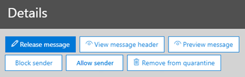

# <a name="quarantine-tags"></a>Quarantäne-Tags

> [!NOTE]
> Die in diesem Artikel beschriebenen Features sind derzeit in der Vorschau, stehen nicht für alle zur Verfügung und können geändert werden.

Mit Quarantine Tags in Exchange Online Protection (EoP) können Administratoren steuern, welche Benutzer in der Lage sind, Ihre Nachrichten in Quarantäne zu übernehmen, je nachdem, wie die Nachricht in Quarantäne eingetroffen ist.

EoP hat traditionell bestimmte Ebenen der Interaktivität für Nachrichten in [Quarantäne](find-and-release-quarantined-messages-as-a-user.md) und in [Spambenachrichtigungen für Endbenutzer](use-spam-notifications-to-release-and-report-quarantined-messages.md)zugelassen oder verhindert. Endbenutzer können beispielsweise Nachrichten anzeigen und freigeben, die von der antispambehandlung als Spam oder Massen isoliert wurden, aber Sie können Nachrichten, die als vertrauenswürdiges Phishing für hohe Zuverlässigkeit isoliert wurden, nicht anzeigen oder freigeben.

Für [unterstützte Schutzfunktionen](#step-2-assign-a-quarantine-tag-to-supported-features)geben Quarantine-Tags an, welche Benutzer in Spambenachrichtigungen für Endbenutzer und in ihren isolierten Nachrichten in Quarantäne (Nachrichten, bei denen der Benutzer ein Empfänger ist) zulässig sind. Standardmäßige Quarantäne Tags werden automatisch zugewiesen, um die Verlaufsfunktionen für Endbenutzer in unter Quarantäne gestellten Nachrichten zu erzwingen. Sie können auch benutzerdefinierte Quarantäne Tags erstellen und zuweisen, um Endbenutzern das Ausführen bestimmter Aktionen für isolierte Nachrichten zu ermöglichen oder zu verhindern.

Die einzelnen Berechtigungen werden in den folgenden vordefinierten Berechtigungsgruppen zusammengefasst:

- Kein Zugriff
- Eingeschränkter Zugriff
- Vollzugriff

In der folgenden Tabelle werden die verfügbaren einzelnen Berechtigungen und die in den vordefinierten Berechtigungsgruppen enthaltenen oder nicht enthaltenen Elemente beschrieben:

|Berechtigung|Kein Zugriff|Eingeschränkter Zugriff|Vollzugriff|
|---|:---:|:---:|:---:|
|**Absender zulassen** (_PermissionToAllowSender_)||||
|**Absender blockieren** (_PermissionToBlockSender_)||||
|**Delete** (_PermissionToDelete_)||||
|**Vorschau** (_PermissionToPreview_)||||
|**Zulassen, dass Empfänger eine Nachricht aus der Quarantäne freigeben** (_PermissionToRelease_)||||
|**Zulassen, dass Empfänger eine Nachricht anfordern, die aus der Quarantäne freigegeben wird** (_PermissionToRequestRelease_)||||
|

Wenn Ihnen die Standardberechtigungen in den vordefinierten Berechtigungsgruppen nicht gefällt, können Sie benutzerdefinierte Berechtigungen verwenden, wenn Sie benutzerdefinierte Quarantäne Tags erstellen oder ändern. Weitere Informationen zu den einzelnen Berechtigungen finden Sie im Abschnitt [Quarantine Tag Permission Details](#quarantine-tag-permission-details) weiter unten in diesem Artikel.

Sie erstellen und Zuweisen von Quarantäne Tags im Security & Compliance Center oder in PowerShell (Exchange Online PowerShell für Microsoft 365-Organisationen mit Exchange Online Postfächern; eigenständige EoP PowerShell in EoP-Organisationen ohne Exchange Online Postfächer).

## <a name="what-do-you-need-to-know-before-you-begin"></a>Was sollten Sie wissen, bevor Sie beginnen?

- Sie öffnen das Security & Compliance Center unter <https://protection.office.com/>. Um direkt zur Seite **Quarantine Tags** zu wechseln, öffnen Sie <https://protection.office.com/quarantineTags> .

- Wie Sie eine Verbindung mit Exchange Online PowerShell herstellen, finden Sie unter [Herstellen einer Verbindung mit Exchange Online PowerShell](https://docs.microsoft.com/powershell/exchange/connect-to-exchange-online-powershell). Informationen zum Herstellen einer Verbindung mit dem eigenständigen Exchange Online Protection PowerShell finden Sie unter [Verbinden mit PowerShell in Exchange Online Protection](https://docs.microsoft.com/powershell/exchange/connect-to-exchange-online-protection-powershell).

- Zum Anzeigen, erstellen, ändern oder Entfernen von Quarantäne Tags müssen Sie Mitglied der Rolle " **Organisationsverwaltung** " oder " **Sicherheits Administrator** " im [Security & Compliance Center](permissions-in-the-security-and-compliance-center.md)sein.

## <a name="step-1-create-quarantine-tags-in-the-security--compliance-center"></a>Schritt 1: Erstellen von Quarantäne Tags im Security & Compliance Center

1. Wechseln Sie im Security & Compliance Center zu **Threat Management** \> **Policy** , und wählen Sie dann **Quarantine Tags** aus.

2. Wählen Sie auf der Seite **Tags isolieren** die Option **benutzerdefiniertes Tag hinzufügen** aus.

3. Der Assistent für **neue Tags** wird geöffnet. Geben Sie auf der Seite **Tagname** einen kurzen, aber eindeutigen Namen in das Feld **Tag Name** ein. In den nächsten Schritten müssen Sie das Tag anhand des Namens identifizieren und auswählen. Klicken Sie nach Abschluss des Vorgangs auf **Weiter**.

4. Wählen Sie auf der Seite **Empfänger Nachrichtenzugriff** einen der folgenden Werte aus:
   - **Kein Zugriff**
   - **Limitierter Zugriff**
   - **Vollzugriff**

   Die einzelnen Berechtigungen, die in diesen Berechtigungsgruppen enthalten sind, werden weiter oben in diesem Artikel beschrieben.

   Um benutzerdefinierte Berechtigungen anzugeben, wählen Sie **bestimmten Zugriff festlegen (erweitert)** aus, und konfigurieren Sie die folgenden Einstellungen:

     - **Wählen Sie die Option "Freigabe Aktion**" aus: Wählen Sie einen der folgenden Werte aus:
       - **Keine Release-Aktion**: Dies ist der Standardwert.
       - **Zulassen, dass Empfänger eine Nachricht aus der Quarantäne freigeben**
       - **Zulassen, dass Empfänger eine Nachricht für die Freigabe aus der Quarantäne anfordern**

     - **Auswählen weiterer Aktionen, die Empfänger in unter Quarantäne gestellten Nachrichten annehmen können**: Wählen Sie einige, alle oder keine der folgenden Werte aus:
       - **Delete**
       - **Preview**
       - **Absender zulassen**
       - **Absender blockieren**

   Diese Berechtigungen und deren Auswirkungen auf isolierte Nachrichten und Spambenachrichtigungen für Endbenutzer werden im Abschnitt [Berechtigungen für Quarantäne-Tag-Details](#quarantine-tag-permission-details) weiter unten in diesem Artikel beschrieben.

   Klicken Sie nach Abschluss des Vorgangs auf **Weiter**.

5. Überprüfen Sie auf der angezeigten **Zusammenfassungs** Seite Ihre Einstellungen. Sie können auf jeder Einstellung auf **Bearbeiten** klicken, um Sie zu ändern.

   Wenn Sie fertig sind, klicken Sie auf über **Mitteln**.

6. Klicken Sie auf der angezeigten Bestätigungsseite auf **Fertig** .

Jetzt können Sie das Quarantäne-Tag einer Quarantänefunktion zuweisen, wie im Abschnitt [Schritt 2](#step-2-assign-a-quarantine-tag-to-supported-features) beschrieben.

### <a name="create-quarantine-tags-in-powershell"></a>Erstellen von Quarantäne Tags in PowerShell

Wenn Sie lieber PowerShell zum Erstellen von Quarantäne-Tags verwenden möchten, stellen Sie eine Verbindung mit Exchange Online PowerShell oder Exchange Online Protection PowerShell her, und verwenden Sie das **New-QuarantineTag-** Cmdlet. Sie haben zwei verschiedene Methoden zur Auswahl:

- Verwenden Sie den _EndUserQuarantinePermissionsValue_ -Parameter.
- Verwenden Sie den _EndUserQuarantinePermissions_ -Parameter.

Diese Methoden werden in den folgenden Abschnitten beschrieben.

#### <a name="use-the-enduserquarantinepermissionsvalue-parameter"></a>Verwenden des EndUserQuarantinePermissionsValue-Parameters

Verwenden Sie die folgende Syntax, um ein Quarantine-Tag mithilfe des _EndUserQuarantinePermissionsValue_ -Parameters zu erstellen:

```powershell
New-QuarantineTag -Name "<UniqueName>" -EndUserQuarantinePermissionsValue <0 to 236>
```

Der _EndUserQuarantinePermissionsValue_ -Parameter verwendet einen Dezimalwert, der aus einem Binärwert konvertiert wird. Der Binärwert entspricht den verfügbaren Benutzerquarantäne Berechtigungen in einer bestimmten Reihenfolge. Für jede Berechtigung ist der Wert 1 gleich true und der Wert 0 gleich false.

Die erforderliche Reihenfolge und die Werte für jede einzelne Berechtigung in vordefinierten Berechtigungsgruppen werden in der folgenden Tabelle beschrieben:

****

|Berechtigung|Kein Zugriff|Eingeschränkter Zugriff|Vollzugriff|
|---|:---:|:---:|:---:|
|PermissionToAllowSender|0|0|1 |
|PermissionToBlockSender|0|1 |1 |
|PermissionToDelete|0|1 |1 |
|PermissionToDownload<sup>\*</sup>|0|0|0|
|PermissionToPreview|0|1 |1 |
|PermissionToRelease<sup>\*\*</sup>|0|0|1 |
|PermissionToRequestRelease<sup>\*\*</sup>|0|1 |0|
|PermissionToViewHeader<sup>\*</sup>|0|0|0|
|Binärer Wert|00000000|01101010|11101100|
|Zu verwendender Dezimalwert|0|106|236|

<sup>\*</sup> Derzeit ist dieser Wert immer 0. Bei PermissionToViewHeader wird der Wert 0 nicht ausgeblendet die Schaltfläche **Nachrichtenkopfzeile anzeigen** in den Details der isolierten Nachricht (die Schaltfläche ist immer verfügbar).

<sup>\*\*</sup> Legen Sie beide Werte nicht auf 1 fest. Legen Sie eine auf 1 und die andere auf 0 fest, oder legen Sie beide auf 0 fest.

In diesem Beispiel wird ein neuer Quarantine Tag-Name NoAccess erstellt, der die in der vorherigen Tabelle beschriebenen Berechtigungen ohne Zugriff zuweist.

```powershell
New-QuarantineTag -Name NoAccess -EndUserQuarantinePermissionsValue 0
```

Verwenden Sie für beschränkte Zugriffsberechtigungen den Wert 106. Verwenden Sie für Vollzugriff Berechtigungen den Wert 236.

Verwenden Sie für benutzerdefinierte Berechtigungen die vorherige Tabelle, um den Binärwert abzurufen, der den gewünschten Berechtigungen entspricht. Konvertieren Sie den Binärwert in einen Dezimalwert, und verwenden Sie den Decimal-Wert für den _EndUserQuarantinePermissionsValue_ -Parameter.

Ausführliche Informationen zu Syntax und Parametern finden Sie unter [New-QuarantineTag](https://docs.microsoft.com/powershell/module/exchange/new-quarantinetag).

#### <a name="use-the-enduserquarantinepermissions-parameter"></a>Verwenden des EndUserQuarantinePermissions-Parameters

Führen Sie die folgenden Schritte aus, um ein Quarantine-Tag mithilfe des _EndUserQuarantinePermissionsValue_ -Parameters zu erstellen:

A. Speichern Sie ein Quarantäne Berechtigungsobjekt in einer Variablen mithilfe des **New-QuarantinePermissions-** Cmdlets.

<p>

B. Verwenden Sie die Variable als _EndUserQuarantinePermissions_ -Wert im **New-QuarantineTag-** Befehl.

##### <a name="step-a-store-a-quarantine-permissions-object-in-a-variable"></a>Schritt a: Speichern eines Quarantäne Berechtigungsobjekts in einer Variablen

Verwenden Sie die folgende Syntax:

```powershell
$<VariableName> = New-QuarantinePermissions [-PermissionToAllowSender <$true | $False>] [-PermissionToBlockSender <$true | $False>] [-PermissionToDelete <$true | $False>] [-PermissionToPreview <$true | $False>] [-PermissionToRelease <$true | $False>] [-PermissionToRequestRelease <$true | $False>]
```

Der Standardwert für alle nicht verwendeten Parameter ist `$false` , sodass Sie nur die Parameter verwenden müssen, für die Sie den Wert festlegen möchten `$true` .

In den folgenden Beispielen wird gezeigt, wie Berechtigungsobjekte erstellt werden, die den vordefinierten Berechtigungsgruppen entsprechen:

- **Kein Zugriff**:

  ```powershell
  $NoAccess = New-QuarantinePermissions
  ```

- **Limitierter Zugriff**:

  ```powershell
  $LimitedAccess = New-QuarantinePermissions -PermissionToBlockSender $true -PermissionToDelete $true -PermissionToPreview $true -PermissionToRequestRelease $true
  ```

- **Vollzugriff**:

  ```powershell
  $FullAccess = New-QuarantinePermissions -PermissionToAllowSender $true -PermissionToBlockSender $true -PermissionToDelete $true -PermissionToPreview $true -PermissionToRelease $true
  ```

Um die Werte anzuzeigen, die Sie festgelegt haben, führen Sie den Variablennamen als Befehl aus (führen Sie beispielsweise den Befehl aus `$NoAccess` ).

Legen Sie für benutzerdefinierte Berechtigungen nicht die Parameter _PermissionToRelease_ und _PermissionToRequestRelease_ auf fest `$true` . Legen Sie eine auf fest, `$true` und lassen Sie die andere als `$false` , oder belassen Sie beide als `$false` .

Sie können eine vorhandene Berechtigungsobjekt Variable auch ändern, nachdem Sie Sie erstellt haben, jedoch bevor Sie Sie mithilfe des Cmdlets "Cmdlet **festlegen-QuarantinePermissions** " verwenden.

Ausführliche Informationen zu Syntax und Parametern finden Sie unter [New-QuarantinePermissions](https://docs.microsoft.com/powershell/module/exchange/new-quarantinepermissions) und [Festlegen von QuarantinePermissions](https://docs.microsoft.com/powershell/module/exchange/set-quarantinepermissions).

##### <a name="step-b-use-the-variable-in-the-new-quarantinetag-command"></a>Schritt B: Verwenden der Variablen im New-QuarantineTag-Befehl

Nachdem Sie das Permissions-Objekt in einer Variablen erstellt und gespeichert haben, verwenden Sie die Variable für den Wert des _EndUserQuarantinePermission_ -Parameters im folgenden **New-QuarantineTag-** Befehl:

```powershell
New-QuarantineTag -Name "<UniqueName>" -EndUserQuarantinePermissions $<VariableName>
```

In diesem Beispiel wird mithilfe des `$LimitedAccess` Permissions-Objekts, das im vorherigen Schritt beschrieben und erstellt wurde, ein neues Quarantine-Tag mit dem Namen LimitedAccess erstellt.

```powershell
New-QuarantineTag -Name LimitedAccess -EndUserQuarantinePermissions $LimitedAccess
```

Ausführliche Informationen zu Syntax und Parametern finden Sie unter [New-QuarantineTag](https://docs.microsoft.com/powershell/module/exchange/new-quarantinetag).

## <a name="step-2-assign-a-quarantine-tag-to-supported-features"></a>Schritt 2: Zuweisen eines Quarantäne Tags zu unterstützten Features

In _unterstützten_ Schutzfunktionen, die Nachrichten oder Dateien isolieren (automatisch oder als konfigurierbare Aktion), können Sie die verfügbaren Quarantäneaktionen mit einem quarantänetag versehen. In der folgenden Tabelle werden Features zum Isolieren von Nachrichten und zur Verfügbarkeit von Quarantäne Tags beschrieben:

****

|Feature|Unterstützte Quarantäne-Tags?|Verwendete standardmäßige Quarantäne Tags|
|---|:---:|---|
|[Anti-Spam-Richtlinien](configure-your-spam-filter-policies.md): <ul><li>**Spam** (_Spam_)</li><li>**Spam mit hoher Zuverlässigkeit** (_: highconfidencespamaction_)</li><li>**Phishing-e-Mails** (_PhishSpamAction_)</li><li>**Phishing-e-Mails mit hoher Zuverlässigkeit** (_HighConfidencePhishAction_)</li><li>**Massen-e-Mails** (_BulkSpamAction_)</li></ul>|Ja|<ul><li>DefaultSpamTag (Vollzugriff)</li><li>DefaultHighConfSpamTag (Vollzugriff)</li><li>DefaultPhishTag (Vollzugriff)</li><li>DefaultHighConfPhishTag (kein Zugriff)</li><li>DefaultBulkTag (Vollzugriff)</li></ul>
|Anti-Phishing-Richtlinien: <ul><li>[Spoof Intelligence Protection](set-up-anti-phishing-policies.md#spoof-settings) (_AuthenticationFailAction_)</li><li>[Identitätswechsel Schutz](set-up-anti-phishing-policies.md#impersonation-settings-in-anti-phishing-policies-in-microsoft-defender-for-office-365):<sup>\*</sup> <ul><li>**Wenn e-Mail von einem imitierten Benutzer gesendet wird** (_TargetedUserProtectionAction_)</li><li>**Wenn e-Mail von einer imitierten Domäne gesendet wird** (_TargetedDomainProtectionAction_)</li><li>**Post Fach Intelligenz** \> **Wenn e-Mail von einem imitierten Benutzer gesendet wird** (_MailboxIntelligenceProtectionAction_)</li></ul></li></ul></ul>|Nein|n/v|
|[Anti-Malware-Richtlinien](configure-anti-malware-policies.md): alle erkannten Nachrichten werden immer isoliert.|Nein|n/v|
|[ATP für SharePoint, OneDrive und Microsoft Teams](atp-for-spo-odb-and-teams.md)|Nein|n/v|
|[Nachrichtenfluss Regeln](https://docs.microsoft.com/exchange/security-and-compliance/mail-flow-rules/mail-flow-rules) (auch als Transportregeln bezeichnet) mit der Aktion: **Zustellung der Nachricht an die gehostete Quarantäne** (_Quarantäne_).|Nein|n/v|
|

<sup>\*</sup> Einstellungen für den Identitätswechsel Schutz stehen nur in Anti-Phishing-Richtlinien in Microsoft Defender für Office 365 zur Verfügung.

Wenn Sie mit den Endbenutzerberechtigungen zufrieden sind, die von den standardmäßigen Quarantäne-Tags bereitgestellt werden, müssen Sie nichts tun. Wenn Sie die Endbenutzerfunktionen (verfügbare Schaltflächen) in Spambenachrichtigungen für Endbenutzer oder in isolierten Nachrichtendetails anpassen möchten, können Sie ein benutzerdefiniertes Quarantäne-Tag zuweisen.

### <a name="assign-quarantine-tags-in-anti-spam-policies-in-the-security--compliance-center"></a>Zuweisen von Quarantäne Tags in Anti-Spam-Richtlinien im Security & Compliance Center

Ausführliche Anweisungen zum Erstellen und Ändern von Anti-Spam-Richtlinien finden Sie unter [configure Anti-Spam Policies in EoP](configure-your-spam-filter-policies.md).

1. Wechseln Sie im Security & Compliance Center zu **Threat Management** \> **Policy** , \> und wählen Sie dann **Anti-Spam** aus. Oder öffnen Sie <https://protection.office.com/antispam> .

2. Suchen und Auswählen einer vorhandenen Antispam-Richtlinie zum Bearbeiten oder Erstellen einer neuen Antispampolitik.

3. Erweitern Sie im Flyout Richtlinie Details den Abschnitt **Spam-und Massenaktionen** .

4. Wenn Sie die Option **Quarantäne Nachricht** für die Aktion eines verfügbaren Spam Filterungs Urteils ausgewählt haben, steht das Feld **Quarantäne-richtlinientag anwenden** zur Verfügung, um das Quarantäne-Tag für das Urteil auszuwählen.

   **Hinweis**: Wenn Sie eine neue Richtlinie erstellen, wird durch einen leeren Quarantäne-Tag-Wert für ein Spamfilter Urteil angegeben, dass das standardmäßige quarantänetag für dieses Urteil verwendet wird. Wenn Sie die Richtlinie später bearbeiten, werden die leeren Werte durch die tatsächlichen Standardnamen der Quarantäne Tags ersetzt, wie in der vorherigen Tabelle beschrieben.

   

5. Klicken Sie nach Abschluss des Vorgangs auf **Speichern**.

#### <a name="assign-quarantine-tags-in-anti-spam-policies-in-powershell"></a>Zuweisen von Quarantäne Tags in Anti-Spam-Richtlinien in PowerShell

Wenn Sie lieber PowerShell zum Zuweisen von Quarantäne Tags in Anti-Spam-Richtlinien verwenden möchten, stellen Sie eine Verbindung mit Exchange Online PowerShell oder Exchange Online Protection PowerShell her, und verwenden Sie die folgende Syntax:

```powershell
<New-HostedContentFilterPolicy -Name "<Unique name>" | Set-HostedContentFilterPolicy -Identity "<Policy name>">  [-SpamAction Quarantine] [-SpamQuarantineTag <QuarantineTagName>] [-HighConfidenceSpamAction Quarantine] [-HighConfidenceSpamQuarantineTag <QuarantineTagName>] [-PhishSpamAction Quarantine] [-PhishQuarantineTag <QuarantineTagName>] [-HighConfidencePhishQuarantineTag <QuarantineTagName>] [-BulkSpamAction Quarantine] [-BulkQuarantineTag <QuarantineTagName>] ...
```

**Hinweise**:

- Der Standardwert für den Parameter _HighConfidencePhishAction_ ist Quarantine, sodass Sie die Quarantäneaktion für hohe vertrauenswürdige Phishing-Erkennungen in neuen Anti-Spam-Richtlinien nicht festlegen müssen. Bei allen anderen Spamfilter Urteilen in neuen oder vorhandenen Anti-Spam-Richtlinien ist das quarantänetag nur wirksam, wenn der Aktionswert Quarantine lautet. Führen Sie den folgenden Befehl aus, um die Aktionswerte in vorhandenen Anti-Spam-Richtlinien anzuzeigen:

  ```powershell
  Get-HostedContentFilterPolicy | Format-Table Name,*SpamAction,HighConfidencePhishAction
  ```

  Informationen zu den Standard Aktionswerten und den empfohlenen Aktionswerten für Standard und Strict finden Sie unter [EoP Anti-Spam Policy Settings](recommended-settings-for-eop-and-office365-atp.md#eop-anti-spam-policy-settings).

- Ein Spam Filterungs Urteil ohne einen entsprechenden Parameter für die Quarantäne Kennzeichnung bedeutet, dass das [standardmäßige quarantänetag](#step-2-assign-a-quarantine-tag-to-supported-features) für dieses Urteil verwendet wird.

  Sie müssen nur ein Standardmäßiges Quarantine-Tag durch ein benutzerdefiniertes Quarantine-Tag ersetzen, wenn Sie die standardmäßigen Endbenutzerfunktionen für isolierte Nachrichten ändern möchten.

- Eine neue Anti-Spam-Richtlinie in PowerShell erfordert eine Spamfilter Richtlinie (Einstellungen) mithilfe des **New-hostedcontentfilterpolicy dient zum-** Cmdlets und einer neuen Spamfilter Regel (Empfängerfilter) mithilfe des **New-HostedContentFilterRule-** Cmdlets. Anweisungen finden Sie unter [Verwenden von PowerShell zum Erstellen von Anti-Spam-Richtlinien](configure-your-spam-filter-policies.md#use-powershell-to-create-anti-spam-policies).

In diesem Beispiel wird eine neue Spamfilter Richtlinie mit dem Namen "Research Department" mit den folgenden Einstellungen erstellt:

- Die Aktion für alle Spamfilter-Urteile wird auf Quarantäne festgelegt.
- Das benutzerdefinierte Quarantäne-Tag mit dem Namen NoAccess, das **keine Zugriffs** Berechtigungen zuweist, ersetzt alle standardmäßigen Quarantäne Tags, die nicht bereits standardmäßig **keine Zugriffs** Berechtigungen zuweisen.

```powershell
New-HostedContentFilterPolicy -Name Research Department -SpamAction Quarantine -SpamQuarantineTag NoAccess -HighConfidenceSpamAction Quarantine -HighConfidenceSpamQuarantineTag NoAction -PhishSpamAction Quarantine -PhishQuarantineTag NoAction -BulkSpamAction Quarantine -BulkQuarantineTag NoAccess
```

Ausführliche Informationen zu Syntax und Parametern finden Sie unter [New-HostedContentFilterPolicy](https://docs.microsoft.com/powershell/module/exchange/new-hostedcontentfilterpolicy).

In diesem Beispiel wird die vorhandene Spamfilter Richtlinie namens "Human Resources" geändert. Die Aktion für das Spamquarantäne Urteil wird auf Quarantäne festgelegt, und das benutzerdefinierte Quarantäne-Tag mit dem Namen NoAccess wird zugewiesen.

```powershell
Set-HostedContentFilterPolicy -Identity "Human Resources" -SpamAction Quarantine -SpamQuarantineTag NoAccess
```

Ausführliche Informationen zu Syntax und Parametern finden Sie unter [Set-HostedContentFilterPolicy](https://docs.microsoft.com/powershell/module/exchange/set-hostedcontentfilterpolicy).

## <a name="configure-global-quarantine-notification-settings-in-the-security--compliance-center"></a>Konfigurieren globaler Quarantäne Benachrichtigungseinstellungen im Security & Compliance Center

Mit den globalen Einstellungen für Quarantäne-Tags können Sie die Endbenutzer-Spambenachrichtigungen anpassen, die an Empfänger von Nachrichten gesendet werden, die isoliert wurden. Weitere Informationen zu diesen Benachrichtigungen finden Sie unter [End-User Spam Notifications](use-spam-notifications-to-release-and-report-quarantined-messages.md).

1. Wechseln Sie im Security & Compliance Center zu **Threat Management** \> **Policy** , und wählen Sie dann **Quarantine Tags** aus.

2. Wählen Sie auf der Seite **Tags isolieren** die Option **globale Einstellungen** aus.

3. Konfigurieren Sie im Flyout " **Quarantäne Benachrichtigungseinstellungen** ", das geöffnet wird, einige oder alle der folgenden Einstellungen:

   - **Mein Firmen Logo verwenden**: Wählen Sie diese Option aus, um das standardmäßige Microsoft-Logo zu ersetzen, das oben in Spambenachrichtigungen für Endbenutzer verwendet wird. Bevor Sie dies tun, müssen Sie den Anweisungen unter [Anpassen des Microsoft 365-Designs für Ihre Organisation](https://docs.microsoft.com/microsoft-365/admin/setup/customize-your-organization-theme) folgen, um Ihr benutzerdefiniertes Logo hochzuladen.

     Der folgende Screenshot zeigt ein benutzerdefiniertes Logo in einer spambenachrichtigung für Endbenutzer:

     

   - **Sprache auswählen**: Spambenachrichtigungen für Endbenutzer werden basierend auf den Spracheinstellungen des Empfängers bereits lokalisiert. Sie können benutzerdefinierten Text in unterschiedlichen Sprachen für den **Anzeigenamen** und die **Haftungsausschluss** Werte angeben.

     Wählen Sie mindestens eine Sprache aus dem Feld erste Sprache aus, und klicken Sie dann auf **Hinzufügen**. Sie können mehrere Sprachen auswählen, indem Sie nacheinander auf **Hinzufügen** klicken. Ein Feld für Abschnitts Sprachen zeigt alle Sprachen an, die Sie ausgewählt haben:

     

   - **Anzeigename**: passen Sie den Anzeigenamen des Absenders an, der in Spambenachrichtigungen für Endbenutzer verwendet wird.

     Wählen Sie für jede Sprache, die Sie hinzugefügt haben, im Feld zweite Sprache die Sprache aus (Klicken Sie nicht auf das X), und geben Sie den gewünschten Textwert in das Feld **Anzeigename** ein.

     Der folgende Screenshot zeigt den benutzerdefinierten Anzeigenamen in einer spambenachrichtigung für Endbenutzer:

     

   - **Haftungsausschluss**: Fügen Sie am Ende der Spambenachrichtigungen für Endbenutzer einen benutzerdefinierten Haftungsausschluss hinzu. Der lokalisierte Text, **ein Haftungsausschluss aus Ihrer Organisation:** ist immer zuerst enthalten, gefolgt von dem von Ihnen angegebenen Text.

     Wählen Sie für jede Sprache, die Sie hinzugefügt haben, im Feld zweite Sprache die Sprache aus (Klicken Sie nicht auf das X), und geben Sie den gewünschten Textwert in das Feld **Disclaimer** ein.

     Der folgende Screenshot zeigt den benutzerdefinierten Haftungsausschluss in einer spambenachrichtigung für Endbenutzer:

     

## <a name="view-quarantine-tags-in-the-security--compliance-center"></a>Anzeigen von Quarantäne Tags im Security & Compliance Center

1. Wechseln Sie im Security & Compliance Center zu **Threat Management** \> **Policy** , und wählen Sie dann **Quarantine Tags** aus.

- Wenn Sie die Einstellungen integrierter oder benutzerdefinierter Quarantäne Tags anzeigen möchten, wählen Sie das Quarantäne-Tag aus der Liste aus (aktivieren Sie das Kontrollkästchen nicht).

- Um die globalen Einstellungen anzuzeigen, wählen Sie **globale Einstellungen** aus.

### <a name="view-quarantine-tags-in-powershell"></a>Anzeigen von Quarantäne Tags in PowerShell

Wenn Sie lieber PowerShell zum Anzeigen von Quarantäne Tags verwenden möchten, führen Sie einen der folgenden Schritte aus:

- Um eine Zusammenfassungsliste aller integrierten oder benutzerdefinierten Tags anzuzeigen, führen Sie den folgenden Befehl aus:

  ```powershell
  Get-QuarantineTag | Format-Table Name
  ```

- Um die Einstellungen integrierter oder benutzerdefinierter Quarantäne Tags anzuzeigen, ersetzen Sie \<TagName\> durch den Namen des Quarantäne Tags, und führen Sie den folgenden Befehl aus:

  ```powershell
  Get-QuarantineTag -Identity "<TagName>"
  ```

- Führen Sie den folgenden Befehl aus, um die globalen Einstellungen anzuzeigen:

  ```powershell
  Get-QuarantineTag -QuarantineTagType GlobalQuarantineTag
  ```

Ausführliche Informationen zu Syntax und Parametern finden Sie unter [Get-HostedContentFilterPolicy](https://docs.microsoft.com/powershell/module/exchange/get-hostedcontentfilterpolicy).

## <a name="remove-quarantine-tags-in-the-security--compliance-center"></a>Entfernen von Quarantäne Tags im Security & Compliance Center

**Hinweise**:

- Integrierte Quarantäne Tags können nicht entfernt werden.

- Vergewissern Sie sich vor dem Entfernen eines benutzerdefinierten Quarantäne Tags, dass es nicht verwendet wird. Führen Sie beispielsweise den folgenden Befehl in PowerShell aus:

  ```powershell
  Get-HostedContentFilterPolicy | Format-List Name,*QuarantineTag
  ```

  Wenn das Quarantäne-Tag verwendet wird, [Ersetzen Sie das zugewiesene Quarantäne-Tag](#step-2-assign-a-quarantine-tag-to-supported-features) , bevor Sie es entfernen.

1. Wechseln Sie im Security & Compliance Center zu **Threat Management** \> **Policy** , und wählen Sie dann **Quarantine Tags** aus.

2. Wählen Sie auf der Seite **Tags isolieren** das benutzerdefinierte Quarantäne-Tag aus, das Sie entfernen möchten, und klicken Sie dann auf **Delete Tag**.

3. Klicken Sie im Bestätigungsdialogfeld, das angezeigt wird, auf **Tag entfernen** .

### <a name="remove-quarantine-tags-in-powershell"></a>Entfernen von Quarantäne Tags in PowerShell

Wenn Sie lieber PowerShell zum Entfernen eines benutzerdefinierten Quarantäne Tags verwenden möchten, ersetzen Sie \<TagName\> durch den Namen des Quarantine-Tags, und führen Sie den folgenden Befehl aus:

```powershell
Remove-QuarantineTag -Identity "<TagName>"
```

Ausführliche Informationen zu Syntax und Parametern finden Sie unter [Remove-QuarantineTag](https://docs.microsoft.com/powershell/module/exchange/remove-quarantinetag).

## <a name="quarantine-tag-permission-details"></a>Details zu Quarantäne-Tag-Berechtigungen

In den folgenden Abschnitten werden die Auswirkungen von vordefinierten Berechtigungsgruppen und einzelnen Berechtigungen in den Details von isolierten Nachrichten und Spambenachrichtigungen für Endbenutzer beschrieben.

### <a name="preset-permissions-groups"></a>Voreingestellte Berechtigungsgruppen

Die einzelnen Berechtigungen, die in vordefinierten Berechtigungsgruppen enthalten sind, werden in der Tabelle am Anfang dieses Artikels aufgeführt.

#### <a name="no-access"></a>Kein Zugriff

Wenn das Quarantine-Tag **keine Zugriffs** Berechtigungen (keine Berechtigungen) zuweist, erhalten Benutzer weiterhin einige grundlegende Funktionen:

- **Details zur isolierten Nachricht**: die Schaltfläche **Nachrichtenkopfzeile anzeigen** ist immer verfügbar.

  

- **Spambenachrichtigungen für Endbenutzer**: die Schaltfläche **überprüfen** , mit der der Benutzer zur Nachricht in Quarantäne gelangen kann, ist immer verfügbar.

  

#### <a name="limited-access"></a>Eingeschränkter Zugriff

Wenn das Quarantine-Tag die **begrenzten Zugriffs** Berechtigungen zuweist, erhalten Benutzer die folgenden Funktionen:

- **Details zur isolierten Nachricht**: die folgenden Schaltflächen stehen zur Verfügung:
  - **Anforderungs Version**
  - **Nachrichtenkopfzeile anzeigen**
  - **Vorschau Nachricht**
  - **Absender blockieren**
  - **Aus Quarantäne entfernen**

  

- **Spambenachrichtigungen für Endbenutzer**: die folgenden Schaltflächen stehen zur Verfügung:
  - **Absender blockieren**
  - **Überprüfung**

  

#### <a name="full-access"></a>Vollzugriff

Wenn das Quarantine-Tag die **vollständigen Zugriffs** Berechtigungen (alle verfügbaren Berechtigungen) zuweist, erhalten Benutzer die folgenden Funktionen:

- **Details zur isolierten Nachricht**: die folgenden Schaltflächen stehen zur Verfügung:
  - **Nachricht freigeben**
  - **Nachrichtenkopfzeile anzeigen**
  - **Vorschau Nachricht**
  - **Absender blockieren**
  - **Absender zulassen**
  - **Aus Quarantäne entfernen**

  

- **Spambenachrichtigungen für Endbenutzer**: die folgenden Schaltflächen stehen zur Verfügung:
  - **Absender blockieren**
  - **Freigabe**
  - **Überprüfung**

  

### <a name="individual-permissions"></a>Einzelne Berechtigungen

> [!NOTE]
> Beachten Sie, dass Benutzer immer die im Abschnitt [kein Zugriff](#no-access) beschriebenen Schaltflächen erhalten. Diese Schaltflächen sind nicht in den einzelnen Berechtigungs Beschreibungen enthalten.

#### <a name="allow-sender-permission"></a>Absender Berechtigung zulassen

Die Berechtigung " **Absender zulassen** " (_PermissionToAllowSender_) steuert den Zugriff auf die Schaltfläche, mit der Benutzer den isolierten Nachrichtenabsender bequem zu Ihrer Liste sicherer Absender hinzufügen können.

- **Details zur isolierten Nachricht**:
  - **Absender Berechtigung zulassen** aktiviert: die Schaltfläche **Absender zulassen** ist verfügbar.
  - **Absender** Berechtigung deaktiviert zulassen: die Schaltfläche **Absender zulassen** ist nicht verfügbar.

- **Spambenachrichtigungen für Endbenutzer**: keine Auswirkung.

Weitere Informationen zur Liste sicherer Absender finden Sie unter verhindern, [dass vertrauenswürdige Absender blockiert werden](https://support.microsoft.com/office/274ae301-5db2-4aad-be21-25413cede077#__toc304379666) , und [verwenden Sie Exchange Online PowerShell, um die Sammlung von Listen sicherer Adressen für ein Postfach zu konfigurieren](configure-junk-email-settings-on-exo-mailboxes.md#use-exchange-online-powershell-to-configure-the-safelist-collection-on-a-mailbox).

#### <a name="block-sender-permission"></a>Absender Berechtigung blockieren

Die **Block Sender** Permission (_PermissionToBlockSender_) steuert den Zugriff auf die Schaltfläche, mit der Benutzer den isolierten Nachrichtenabsender bequem zu Ihrer Liste blockierter Absender hinzufügen können.

- **Details zur isolierten Nachricht**:
  - Berechtigung " **Absender blockieren** " aktiviert: die Schaltfläche " **Absender blockieren** " ist verfügbar.
  - **Absender Berechtigung blockieren** deaktiviert: die Schaltfläche " **Absender blockieren** " ist nicht verfügbar.

- **Spambenachrichtigungen für Endbenutzer**:
  - **Absender Berechtigung blockieren** deaktiviert: die Schaltfläche " **Absender blockieren** " ist nicht verfügbar.
  - Berechtigung " **Absender blockieren** " aktiviert: die Schaltfläche " **Absender blockieren** " ist verfügbar.

Weitere Informationen zur Liste blockierter Absender finden Sie unter [Blockieren von Nachrichten von einem Benutzer](https://support.microsoft.com/office/274ae301-5db2-4aad-be21-25413cede077#__toc304379667) und [verwenden Exchange Online PowerShell zum Konfigurieren der Sammlung von Listen sicherer Adressen für ein Postfach](configure-junk-email-settings-on-exo-mailboxes.md#use-exchange-online-powershell-to-configure-the-safelist-collection-on-a-mailbox).

#### <a name="delete-permission"></a>Berechtigung löschen

Die Berechtigung " **Löschen** " (_PermissionToDelete_) steuert die Möglichkeit der Benutzer, Ihre Nachrichten (Nachrichten, bei denen der Benutzer ein Empfänger ist) aus der Quarantäne zu löschen.

- **Details zur isolierten Nachricht**:
  - Berechtigung **Löschen** aktiviert: die Schaltfläche **aus Quarantäne entfernen** ist verfügbar.
  - **Lösch** Berechtigung deaktiviert: die Schaltfläche **aus Quarantäne entfernen** ist nicht verfügbar.

- **Spambenachrichtigungen für Endbenutzer**: keine Auswirkung.

#### <a name="preview-permission"></a>Vorschau Berechtigung

Die **Preview** -Berechtigung (_PermissionToPreview_) steuert die Möglichkeit der Benutzer, Ihre Nachrichten in der Quarantäne anzuzeigen.

- **Details zur isolierten Nachricht**:
  - **Vorschau** Berechtigung aktiviert: die Schaltfläche **Vorschau Nachricht** steht zur Verfügung.
  - **Vorschau** Berechtigung deaktiviert: die Schaltfläche **Vorschau Nachricht** ist nicht verfügbar.

- **Spambenachrichtigungen für Endbenutzer**: keine Auswirkung.

#### <a name="allow-recipients-to-release-a-message-from-quarantine-permission"></a>Zulassen, dass Empfänger eine Nachricht aus der Quarantäne Berechtigung freigeben

Das **zulassen, dass Empfänger eine Nachricht aus Quarantine** Permission (_PermissionToRelease_) freigeben, steuert, dass Benutzer Ihre isolierten Nachrichten direkt und ohne Genehmigung eines Administrators freigeben können.

- **Details zur isolierten Nachricht**:
  - Berechtigung aktiviert: die Schaltfläche **Nachricht freigeben** steht zur Verfügung.
  - Berechtigung deaktiviert: die Schaltfläche " **Nachricht freigeben** " ist nicht verfügbar.

- **Spambenachrichtigungen für Endbenutzer**:
  - Berechtigung aktiviert: die Schaltfläche **Version** ist verfügbar.
  - Berechtigung deaktiviert: die Schaltfläche " **Version** " ist nicht verfügbar.

#### <a name="allow-recipients-to-request-a-message-to-be-released-from-quarantine-permission"></a>Zulassen, dass Empfänger eine Nachricht für die Freigabe aus der Quarantäne Berechtigung anfordern

Das **zulassen, dass Empfänger eine Nachricht aus der Quarantäne** Berechtigung (Quarantine Permission,_PermissionToRequestRelease_) freigegeben werden, steuert, ob Benutzer die Freigabe ihrer isolierten Nachrichten _anfordern_ können. Die Nachricht wird nur freigegeben, nachdem ein Administrator die Anforderung genehmigt hat.

- **Details zur isolierten Nachricht**:
  - Berechtigung aktiviert: die Schaltfläche **Version anfordern** ist verfügbar.
  - Berechtigung deaktiviert: die Schaltfläche " **Anforderungs Version** " ist nicht verfügbar.

- **Spambenachrichtigungen für Endbenutzer**: die Schaltfläche " **Version** " ist nicht verfügbar.
