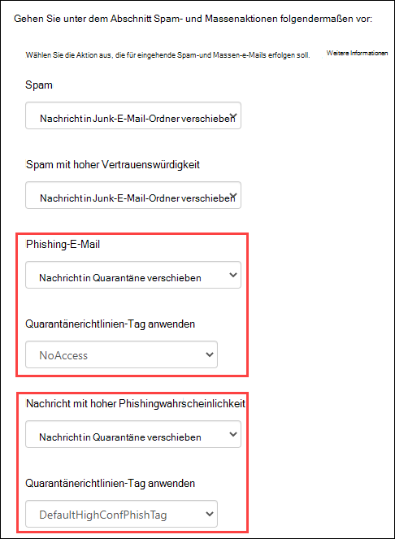
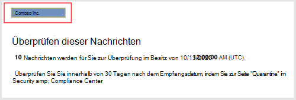
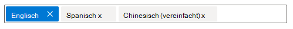
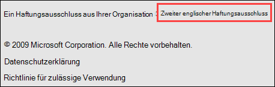
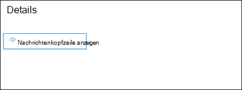
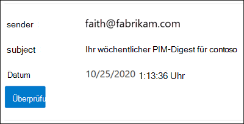
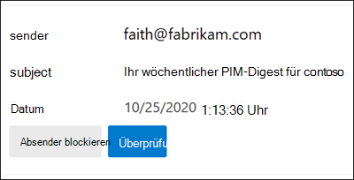
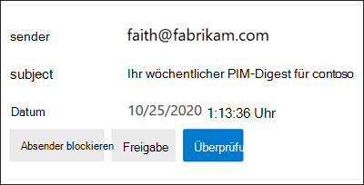

# <a name="quarantine-tags"></a>Quarantänetags

> [!NOTE]
> Die in diesem Artikel beschriebenen Features befinden sich derzeit in Der Vorschau, sind nicht für alle verfügbar und können geändert werden.

Quarantänetags in Exchange Online Protection (EOP) ermöglichen Es Administratoren, zu steuern, was Benutzer mit ihren isolierten Nachrichten tun können, basierend darauf, wie die Nachricht in Quarantäne eingetroffen ist.

EOP hat traditionell bestimmte Interaktivitätsstufen für Nachrichten [in](find-and-release-quarantined-messages-as-a-user.md) Quarantäne und in [Spambenachrichtigungen](use-spam-notifications-to-release-and-report-quarantined-messages.md)von Endbenutzern zugelassen oder verhindert. Endbenutzer können z. B. Nachrichten anzeigen und veröffentlichen, die von der Antispamfilterung als Spam oder Massenfilter isoliert wurden, aber sie können keine Nachrichten anzeigen oder veröffentlichen, die als Phishing mit hoher Sicherheit isoliert wurden.

Für [unterstützte Schutzfunktionen](#step-2-assign-a-quarantine-tag-to-supported-features)geben Quarantänetags an, was Benutzer in Spambenachrichtigungen von Endbenutzern und in ihren isolierten Nachrichten in Quarantäne (Nachrichten, bei denen der Benutzer ein Empfänger ist) tun dürfen. Standardmäßige Quarantänetags werden automatisch zugewiesen, um die historischen Funktionen für Endbenutzer in isolierten Nachrichten zu erzwingen. Sie können auch benutzerdefinierte Quarantänetags erstellen und zuweisen, um Endbenutzern das Ausführen bestimmter Aktionen für isolierte Nachrichten zu ermöglichen oder zu verhindern.

Die einzelnen Berechtigungen werden in den folgenden vordefinierten Berechtigungsgruppen kombiniert:

- Kein Zugriff
- Eingeschränkter Zugriff
- Vollzugriff

Die verfügbaren individuellen Berechtigungen und was in den vordefinierten Berechtigungsgruppen enthalten ist oder nicht, werden in der folgenden Tabelle beschrieben:

<br>

****

|Berechtigung|Kein Zugriff|Eingeschränkter Zugriff|Vollzugriff|
|---|:---:|:---:|:---:|
|**Absender zulassen** (_PermissionToAllowSender_)||||
|**Absender blockieren** (_PermissionToBlockSender_)||||
|**Delete** (_PermissionToDelete_)||||
|**Vorschau** (_PermissionToPreview_)||||
|**Zulassen, dass Empfänger eine Nachricht aus der Quarantäne frei lassen** (_PermissionToRelease_)||||
|**Empfänger dürfen anfordern, dass eine Nachricht aus der Quarantäne** freigegeben wird (_PermissionToRequestRelease_)||||
|

Wenn Ihnen die Standardberechtigungen in den vordefinierten Berechtigungsgruppen nicht gefällt, können Sie benutzerdefinierte Berechtigungen verwenden, wenn Sie benutzerdefinierte Quarantänetags erstellen oder ändern. Weitere Informationen zu den einzelnen Berechtigungen finden Sie im Abschnitt [Quarantänetagberechtigungsdetails](#quarantine-tag-permission-details) weiter unten in diesem Artikel.

Sie erstellen und weisen Quarantänetags im Security & Compliance Center oder in PowerShell (Exchange Online PowerShell für Microsoft 365-Organisationen mit Exchange Online-Postfächern; eigenständige EOP PowerShell in & ohne Exchange Online Postfächer) zu.

## <a name="what-do-you-need-to-know-before-you-begin"></a>Was sollten Sie wissen, bevor Sie beginnen?

- Sie öffnen das Security & Compliance Center unter <https://protection.office.com/>. Öffnen Sie , um direkt zur **Seite Quarantänetags zu** <https://protection.office.com/quarantineTags> wechseln.

- Wie Sie eine Verbindung mit Exchange Online PowerShell herstellen, finden Sie unter [Herstellen einer Verbindung mit Exchange Online PowerShell](/powershell/exchange/connect-to-exchange-online-powershell). Informationen zum Herstellen einer Verbindung mit dem eigenständigen Exchange Online Protection PowerShell finden Sie unter [Verbinden mit PowerShell in Exchange Online Protection](/powershell/exchange/connect-to-exchange-online-protection-powershell).

- Zum Anzeigen, Erstellen, Ändern oder Entfernen von Quarantänetags müssen  Sie  Mitglied der Rollen Organisationsverwaltung oder Sicherheitsadministrator im [Security & Compliance Center sein.](permissions-in-the-security-and-compliance-center.md)

## <a name="step-1-create-quarantine-tags-in-the-security--compliance-center"></a>Schritt 1: Erstellen von Quarantänetags im Security & Compliance Center

1. Wechseln Sie im Security & Compliance Center **zu** Richtlinie für die Bedrohungsverwaltung, und wählen Sie dann \>  **Quarantänetags aus.**

2. Wählen Sie **auf der Seite Quarantänetags** die Option **Benutzerdefiniertes Tag hinzufügen aus.**

3. Der **Assistent für neue Tags** wird geöffnet. Geben Sie auf der Seite **Tagname** einen kurzen, aber eindeutigen Namen in das **Feld Tagname** ein. Sie müssen das Tag in den nächsten Schritten nach Namen identifizieren und auswählen. Klicken Sie nach Abschluss des Vorgangs auf **Weiter**.

4. Wählen Sie **auf der** Seite Empfängernachrichtenzugriff einen der folgenden Werte aus:
   - **Kein Zugriff**
   - **Eingeschränkter Zugriff**
   - **Vollzugriff**

   Die einzelnen Berechtigungen, die in diesen Berechtigungsgruppen enthalten sind, werden weiter oben in diesem Artikel beschrieben.

   Um benutzerdefinierte Berechtigungen anzugeben, wählen **Sie Bestimmten Zugriff festlegen (Erweitert)** aus, und konfigurieren Sie die folgenden Einstellungen:

     - **Einstellung für Freigabeaktion auswählen:** Wählen Sie einen der folgenden Werte aus:
       - **Keine Veröffentlichungsaktion:** Dies ist der Standardwert.
       - **Zulassen, dass Empfänger eine Nachricht aus der Quarantäne frei lassen**
       - **Zulassen, dass Empfänger die Isolierung einer Nachricht anfordern**

     - **Select additional actions recipients can take on quarantined messages**: Select some, all, or none of the following values:
       - **Löschen**
       - **Preview**
       - **Absender zulassen**
       - **Absender blockieren**

   Diese Berechtigungen und ihre Auswirkungen auf isolierte Nachrichten und Spambenachrichtigungen für Endbenutzer werden weiter unten in diesem Artikel im Abschnitt Quarantänetagberechtigungsdetails beschrieben. [](#quarantine-tag-permission-details)

   Klicken Sie nach Abschluss des Vorgangs auf **Weiter**.

5. Überprüfen Sie **auf** der angezeigten Seite Zusammenfassung Ihre Einstellungen. Sie können **für** jede Einstellung auf Bearbeiten klicken, um sie zu ändern.

   Klicken Sie nach Abschluss des Abschlusses auf **Absenden**.

6. Klicken **Sie auf** der angezeigten Bestätigungsseite auf Fertig.

Jetzt können Sie das Quarantänetag einem Quarantänefeature zuweisen, wie im [Abschnitt Schritt 2](#step-2-assign-a-quarantine-tag-to-supported-features) beschrieben.

### <a name="create-quarantine-tags-in-powershell"></a>Erstellen von Quarantänetags in PowerShell

Wenn Sie lieber PowerShell zum Erstellen von Quarantänetags verwenden möchten, stellen Sie eine Verbindung mit Exchange Online PowerShell oder Exchange Online Protection PowerShell ein, und verwenden Sie das **Cmdlet New-QuarantineTag.** Sie haben zwei verschiedene Methoden zur Auswahl:

- Verwenden Sie _den Parameter EndUserQuarantinePermissionsValue._
- Verwenden Sie _den Parameter EndUserQuarantinePermissions._

Diese Methoden werden in den folgenden Abschnitten beschrieben.

#### <a name="use-the-enduserquarantinepermissionsvalue-parameter"></a>Verwenden des Parameters EndUserQuarantinePermissionsValue

Verwenden Sie die folgende Syntax, um ein Quarantänetag mit dem _Parameter EndUserQuarantinePermissionsValue_ zu erstellen:

```powershell
New-QuarantineTag -Name "<UniqueName>" -EndUserQuarantinePermissionsValue <0 to 236>
```

Der _Parameter EndUserQuarantinePermissionsValue_ verwendet einen Dezimalwert, der aus einem binären Wert konvertiert wird. Der binäre Wert entspricht den verfügbaren Endbenutzerquarantäneberechtigungen in einer bestimmten Reihenfolge. Für jede Berechtigung ist der Wert 1 true und der Wert 0 gleich False.

Die erforderliche Reihenfolge und werte für jede einzelne Berechtigung in vordefinierten Berechtigungsgruppen werden in der folgenden Tabelle beschrieben:

<br>

****

|Berechtigung|Kein Zugriff|Eingeschränkter Zugriff|Vollzugriff|
|---|:---:|:---:|:---:|
|PermissionToAllowSender|0|0|1|
|PermissionToBlockSender|0|1|1|
|PermissionToDelete|0|1|1|
|PermissionToDownload<sup>\*</sup>|0|0|0|
|PermissionToPreview|0|1|1|
|PermissionToRelease<sup>\*\*</sup>|0|0|1|
|PermissionToRequestRelease<sup>\*\*</sup>|0|1|0|
|PermissionToViewHeader<sup>\*</sup>|0|0|0|
|Binärwert|00000000|01101010|11101100|
|Zu verwendende Dezimalwert|0|106|236|
|

<sup>\*</sup> Derzeit ist dieser Wert immer 0. Für PermissionToViewHeader blendet der Wert 0 die Schaltfläche Nachrichtenkopf anzeigen nicht in den Details der isolierten Nachricht aus (die Schaltfläche ist immer verfügbar). 

<sup>\*\*</sup> Legen Sie beide Werte nicht auf 1. Legen Sie einen auf 1 und den anderen auf 0 oder beide auf 0.

In diesem Beispiel wird ein neuer Quarantänetagname NoAccess erstellt, der die Berechtigungen "Kein Zugriff" wie in der vorherigen Tabelle beschrieben zu weist.

```powershell
New-QuarantineTag -Name NoAccess -EndUserQuarantinePermissionsValue 0
```

Verwenden Sie für Eingeschränkte Zugriffsberechtigungen den Wert 106. Verwenden Sie für Vollzugriffsberechtigungen den Wert 236.

Verwenden Sie für benutzerdefinierte Berechtigungen die vorherige Tabelle, um den binären Wert zu erhalten, der den von Ihnen benötigten Berechtigungen entspricht. Konvertieren Sie den binären Wert in einen Dezimalwert, und verwenden Sie den Dezimalwert für den _Parameter EndUserQuarantinePermissionsValue._

Ausführliche Informationen zu Syntax und Parametern finden Sie unter [New-QuarantineTag](/powershell/module/exchange/new-quarantinetag).

#### <a name="use-the-enduserquarantinepermissions-parameter"></a>Verwenden des Parameters EndUserQuarantinePermissions

Gehen Sie wie folgt vor, um ein Quarantänetag mit dem _Parameter EndUserQuarantinePermissionsValue_ zu erstellen:

A. Store ein Quarantäneberechtigungsobjekt in einer Variablen mithilfe des **Cmdlets New-QuarantinePermissions.**

<p>

B. Verwenden Sie die Variable als _EndUserQuarantinePermissions-Wert_ im **Befehl New-QuarantineTag.**

##### <a name="step-a-store-a-quarantine-permissions-object-in-a-variable"></a>Schritt A: Store eines Quarantäneberechtigungsobjekts in einer Variablen

Verwenden Sie die folgende Syntax:

```powershell
$<VariableName> = New-QuarantinePermissions [-PermissionToAllowSender <$true | $False>] [-PermissionToBlockSender <$true | $False>] [-PermissionToDelete <$true | $False>] [-PermissionToPreview <$true | $False>] [-PermissionToRelease <$true | $False>] [-PermissionToRequestRelease <$true | $False>]
```

Der Standardwert für alle nicht verwendeten Parameter ist , daher müssen Sie nur die Parameter verwenden, für die Sie den Wert `$false` auf festlegen `$true` möchten.

Die folgenden Beispiele zeigen, wie Sie Berechtigungsobjekte erstellen, die den vordefinierten Berechtigungsgruppen entsprechen:

- **Kein Zugriff**:

  ```powershell
  $NoAccess = New-QuarantinePermissions
  ```

- **Eingeschränkter Zugriff:**

  ```powershell
  $LimitedAccess = New-QuarantinePermissions -PermissionToBlockSender $true -PermissionToDelete $true -PermissionToPreview $true -PermissionToRequestRelease $true
  ```

- **Vollzugriff**:

  ```powershell
  $FullAccess = New-QuarantinePermissions -PermissionToAllowSender $true -PermissionToBlockSender $true -PermissionToDelete $true -PermissionToPreview $true -PermissionToRelease $true
  ```

Um die festgelegten Werte zu sehen, führen Sie den Variablennamen als Befehl aus (führen Sie z. B. den Befehl `$NoAccess` aus).

Legen Sie für benutzerdefinierte Berechtigungen die Parameter _PermissionToRelease_ und _PermissionToRequestRelease nicht_ auf `$true` fest. Legen Sie eins auf und lassen Sie das andere als `$true` , oder lassen Sie beide als `$false` `$false` .

Sie können auch eine vorhandene Berechtigungsobjektvariable ändern, nachdem Sie sie erstellt haben, aber bevor Sie sie verwenden, indem Sie das **Cmdlet Set-QuarantinePermissions** verwenden.

Ausführliche Informationen zu Syntax und Parametern finden Sie unter [New-QuarantinePermissions](/powershell/module/exchange/new-quarantinepermissions) und [Set-QuarantinePermissions](/powershell/module/exchange/set-quarantinepermissions).

##### <a name="step-b-use-the-variable-in-the-new-quarantinetag-command"></a>Schritt B: Verwenden der Variablen im befehl New-QuarantineTag

Nachdem Sie das Permissions-Objekt in einer Variablen erstellt und gespeichert haben, verwenden Sie die Variable für den _EndUserQuarantinePermission-Parameterwert_ im folgenden **New-QuarantineTag-Befehl:**

```powershell
New-QuarantineTag -Name "<UniqueName>" -EndUserQuarantinePermissions $<VariableName>
```

In diesem Beispiel wird ein neues Quarantänetag namens LimitedAccess mit dem berechtigungsobjekt erstellt, das im vorherigen Schritt `$LimitedAccess` beschrieben und erstellt wurde.

```powershell
New-QuarantineTag -Name LimitedAccess -EndUserQuarantinePermissions $LimitedAccess
```

Ausführliche Informationen zu Syntax und Parametern finden Sie unter [New-QuarantineTag](/powershell/module/exchange/new-quarantinetag).

## <a name="step-2-assign-a-quarantine-tag-to-supported-features"></a>Schritt 2: Zuweisen eines Quarantänetags zu unterstützten Features

In _unterstützten_ Schutzfunktionen, die Nachrichten oder Dateien unter Quarantäne stellen (automatisch oder als konfigurierbare Aktion), können Sie den verfügbaren Quarantäneaktionen ein Quarantänetag zuweisen. Features zum Isolieren von Nachrichten und zur Verfügbarkeit von Quarantänetags werden in der folgenden Tabelle beschrieben:

<br>

****

|Feature|Quarantänetags unterstützt?|Verwendete Standardquarantänetags|
|---|:---:|---|
|[Antispamrichtlinien:](configure-your-spam-filter-policies.md) <ul><li>**Spam** (_SpamAction_)</li><li>**Spam mit hoher Konfidenz** (_HighConfidenceSpamAction_)</li><li>**Phishing-E-Mails** (_PhishSpamAction_)</li><li>**Phishing-E-Mails mit** hoher Vertrauenssicherheit (_HighConfidencePhishAction_)</li><li>**Massen-E-Mail** (_BulkSpamAction_)</li></ul>|Ja|<ul><li>DefaultSpamTag (Vollzugriff)</li><li>DefaultHighConfSpamTag (Vollzugriff)</li><li>DefaultPhishTag (Vollzugriff)</li><li>DefaultHighConfPhishTag (Kein Zugriff)</li><li>DefaultBulkTag (Vollzugriff)</li></ul>
|Antiphishingrichtlinien: <ul><li>[Spoof Intelligence Protection](set-up-anti-phishing-policies.md#spoof-settings) (_AuthenticationFailAction_)</li><li>[Identitätswechselschutz](set-up-anti-phishing-policies.md#impersonation-settings-in-anti-phishing-policies-in-microsoft-defender-for-office-365):<sup>\*</sup> <ul><li>**Wenn E-Mails von einem imitierten Benutzer** gesendet werden (_TargetedUserProtectionAction_)</li><li>**Wenn E-Mails von einer imitierten Domäne** gesendet werden (_TargetedDomainProtectionAction_)</li><li>**Postfachintelligenz** \> **Wenn E-Mails von einem identitätswechselten** Benutzer gesendet werden (_MailboxIntelligenceProtectionAction_)</li></ul></li></ul></ul>|Nein|n/v|
|[An malware-Richtlinien:](configure-anti-malware-policies.md)Alle erkannten Nachrichten werden immer unter Quarantäne gestellt.|Nein|n/v|
|[Sichere Anlagen für SharePoint, OneDrive und Microsoft Teams](mdo-for-spo-odb-and-teams.md)|Nein|n/v|
|[Nachrichtenflussregeln](/exchange/security-and-compliance/mail-flow-rules/mail-flow-rules) (auch als Transportregeln bekannt) mit der Aktion: Senden der Nachricht an die **gehostete Quarantäne** (_Quarantäne_).|Nein|n/v|
|

<sup>\*</sup>Identitätswechselschutzeinstellungen sind nur in Antiphishingrichtlinien in Microsoft Defender für Office 365.

Wenn Sie mit den Endbenutzerberechtigungen zufrieden sind, die von den Standardquarantänetags bereitgestellt werden, müssen Sie nichts tun. Wenn Sie die Endbenutzerfunktionen (verfügbare Schaltflächen) in Spambenachrichtigungen für Endbenutzer oder in Quarantänenachrichtendetails anpassen möchten, können Sie ein benutzerdefiniertes Quarantänetag zuweisen.

### <a name="assign-quarantine-tags-in-anti-spam-policies-in-the-security--compliance-center"></a>Zuweisen von Quarantänetags in Antispamrichtlinien im Security & Compliance Center

Vollständige Anweisungen zum Erstellen und Ändern von Antispamrichtlinien finden Sie unter [Configure anti-spam policies in EOP](configure-your-spam-filter-policies.md).

1. Wechseln Sie im Security & Compliance Center **zu** Richtlinie für die Bedrohungsverwaltung, und wählen Sie dann \>  \> **Antispam aus.** Oder öffnen Sie <https://protection.office.com/antispam> .

2. Suchen Und wählen Sie eine vorhandene Antispamrichtlinie aus, die bearbeitet werden soll, oder erstellen Sie eine neue Antispamrichtlinie.

3. Erweitern Sie im Flyout für Richtliniendetails den Abschnitt **Spam- und Massenaktionen.**

4. Wenn Sie quarantäne  nachricht für die Aktion eines verfügbaren Spamfilter-Urteils ausgewählt haben, ist das Feld Quarantänerichtlinientag anwenden verfügbar, damit Sie das Quarantänetag für dieses Urteil auswählen können. 

   **Hinweis**: Wenn Sie eine neue Richtlinie erstellen, gibt ein leerer Quarantänetagwert für ein Spamfilter-Urteil an, dass das Standardquarantänetag für dieses Urteil verwendet wird. Wenn Sie die Richtlinie später bearbeiten, werden die leeren Werte durch die tatsächlichen Standardquarantänetagnamen ersetzt, wie in der vorherigen Tabelle beschrieben.

   

5. Klicken Sie nach Abschluss des Vorgangs auf **Speichern**.

#### <a name="assign-quarantine-tags-in-anti-spam-policies-in-powershell"></a>Zuweisen von Quarantänetags in Antispamrichtlinien in PowerShell

Wenn Sie Lieber PowerShell verwenden möchten, um Quarantänetags in Antispamrichtlinien zuzuordnen, stellen Sie eine Verbindung mit Exchange Online PowerShell oder Exchange Online Protection PowerShell ein, und verwenden Sie die folgende Syntax:

```powershell
<New-HostedContentFilterPolicy -Name "<Unique name>" | Set-HostedContentFilterPolicy -Identity "<Policy name>">  [-SpamAction Quarantine] [-SpamQuarantineTag <QuarantineTagName>] [-HighConfidenceSpamAction Quarantine] [-HighConfidenceSpamQuarantineTag <QuarantineTagName>] [-PhishSpamAction Quarantine] [-PhishQuarantineTag <QuarantineTagName>] [-HighConfidencePhishQuarantineTag <QuarantineTagName>] [-BulkSpamAction Quarantine] [-BulkQuarantineTag <QuarantineTagName>] ...
```

**Hinweise**:

- Der Standardwert für den _Parameter HighConfidencePhishAction_ ist Quarantine, daher müssen Sie die Quarantäneaktion für Phishingerkennungen mit hoher Vertrauen in neuen Antispamrichtlinien nicht festlegen. Bei allen anderen Spamfilterungen in neuen oder vorhandenen Antispamrichtlinien ist das Quarantänetag nur dann wirksam, wenn der Aktionswert Quarantine lautet. Führen Sie den folgenden Befehl aus, um die Aktionswerte in vorhandenen Antispamrichtlinien zu sehen:

  ```powershell
  Get-HostedContentFilterPolicy | Format-Table Name,*SpamAction,HighConfidencePhishAction
  ```

  Informationen zu den Standardaktionswerten und den empfohlenen Aktionswerten für Standard und Strict finden Sie unter [EOP Antispamrichtlinieneinstellungen](recommended-settings-for-eop-and-office365.md#eop-anti-spam-policy-settings).

- Ein Spamfilter-Urteil ohne einen entsprechenden Quarantänetag-Parameter bedeutet, dass das [Standardquarantänetag](#step-2-assign-a-quarantine-tag-to-supported-features) für dieses Urteil verwendet wird.

  Sie müssen nur ein Standardquarantänetag durch ein benutzerdefiniertes Quarantänetag ersetzen, wenn Sie die Standardfunktionen des Endbenutzers für isolierte Nachrichten ändern möchten.

- Eine neue Antispamrichtlinie in PowerShell erfordert eine Spamfilterrichtlinie (Einstellungen) mit dem **Cmdlet New-HostedContentFilterPolicy** und eine neue Spamfilterregel (Empfängerfilter) mithilfe des **Cmdlets New-HostedContentFilterRule.** Anweisungen finden Sie unter [Verwenden von PowerShell zum Erstellen von Antispamrichtlinien](configure-your-spam-filter-policies.md#use-powershell-to-create-anti-spam-policies).

In diesem Beispiel wird eine neue Spamfilterrichtlinie namens "Research Department" mit den folgenden Einstellungen erstellt:

- Die Aktion für alle Spamfilterungs-Urteile ist auf Quarantäne festgelegt.
- Das benutzerdefinierte Quarantänetag NoAccess, das Keine Zugriffsberechtigungen zu weist,  ersetzt standardmäßige Quarantänetags, die noch keine Zugriffsberechtigungen standardmäßig zuweisen. 

```powershell
New-HostedContentFilterPolicy -Name Research Department -SpamAction Quarantine -SpamQuarantineTag NoAccess -HighConfidenceSpamAction Quarantine -HighConfidenceSpamQuarantineTag NoAction -PhishSpamAction Quarantine -PhishQuarantineTag NoAction -BulkSpamAction Quarantine -BulkQuarantineTag NoAccess
```

Ausführliche Informationen zu Syntax und Parametern finden Sie unter [New-HostedContentFilterPolicy](/powershell/module/exchange/new-hostedcontentfilterpolicy).

In diesem Beispiel wird die vorhandene Spamfilterrichtlinie "Personalwesen" geändert. Die Aktion für das Spamquarantäne-Urteil ist auf Quarantäne festgelegt, und das benutzerdefinierte Quarantänetag NoAccess wird zugewiesen.

```powershell
Set-HostedContentFilterPolicy -Identity "Human Resources" -SpamAction Quarantine -SpamQuarantineTag NoAccess
```

Ausführliche Informationen zu Syntax und Parametern finden Sie unter [Set-HostedContentFilterPolicy](/powershell/module/exchange/set-hostedcontentfilterpolicy).

## <a name="configure-global-quarantine-notification-settings-in-the-security--compliance-center"></a>Konfigurieren globaler Quarantänebenachrichtigungseinstellungen im Security & Compliance Center

Mit den globalen Einstellungen für Quarantänetags können Sie die Spambenachrichtigungen für Endbenutzer anpassen, die an Empfänger von Nachrichten gesendet werden, die isoliert wurden. Weitere Informationen zu diesen Benachrichtigungen finden Sie unter [Endbenutzerspambenachrichtigungen](use-spam-notifications-to-release-and-report-quarantined-messages.md).

1. Wechseln Sie im Security & Compliance Center **zu** Richtlinie für die Bedrohungsverwaltung, und wählen Sie dann \>  **Quarantänetags aus.**

2. Wählen Sie auf der Seite **Quarantänetags** die Option **Globale Einstellungen aus.**

3. Konfigurieren Sie **im geöffneten** Flyout Quarantänebenachrichtigungseinstellungen einige oder alle der folgenden Einstellungen:

   - **Verwenden Sie mein Firmenlogo:** Wählen Sie diese Option aus, um das standardmäßige Microsoft-Logo zu ersetzen, das am Anfang von Spambenachrichtigungen für Endbenutzer verwendet wird. Bevor Sie dies tun, müssen Sie die Anweisungen unter [Customize the Microsoft 365 theme for your organization](../../admin/setup/customize-your-organization-theme.md) to upload your custom logo folgen.

     Der folgende Screenshot zeigt ein benutzerdefiniertes Logo in einer Spambenachrichtigung für Endbenutzer:

     

   - **Sprache auswählen:** Spambenachrichtigungen für Endbenutzer werden bereits basierend auf den Spracheinstellungen des Empfängers lokalisiert. Sie können benutzerdefinierten Text für den Anzeigenamen und **haftungsausschluss** in **verschiedenen** Sprachen angeben.

     Wählen Sie im ersten Sprachfeld mindestens eine Sprache aus, und klicken Sie dann auf **Hinzufügen**. Sie können mehrere Sprachen auswählen, indem **Sie** nach jeder Sprache auf Hinzufügen klicken. In einem Abschnittssprachenfeld werden alle von Ihnen ausgewählten Sprachen angezeigt:

     

   - **Anzeigename**: Passen Sie den Anzeigenamen des Absenders an, der in Spambenachrichtigungen für Endbenutzer verwendet wird.

     Wählen Sie für jede hinzugefügte Sprache die Sprache im zweiten Sprachfeld aus (klicken Sie nicht auf das X), und geben Sie den text-Wert in das Feld **Anzeigename** ein.

     Der folgende Screenshot zeigt den angepassten Anzeigenamen in einer Spambenachrichtigung für Endbenutzer:

     

   - **Haftungsausschluss**: Fügen Sie am Ende von Spambenachrichtigungen für Endbenutzer einen benutzerdefinierten Haftungsausschluss hinzu. Der lokalisierte Text, **Ein Haftungsausschluss aus Ihrer Organisation:** ist immer zuerst enthalten, gefolgt von dem angegebenen Text.

     Wählen Sie für jede hinzugefügte Sprache die Sprache im zweiten Sprachfeld aus (klicken Sie nicht auf das X), und geben Sie den textwert ein, den Sie im Feld **Haftungsausschluss** verwenden möchten.

     Der folgende Screenshot zeigt den angepassten Haftungsausschluss in einer Spambenachrichtigung für Endbenutzer:

     

## <a name="view-quarantine-tags-in-the-security--compliance-center"></a>Anzeigen von Quarantänetags im Security & Compliance Center

1. Wechseln Sie im Security & Compliance Center **zu** Richtlinie für die Bedrohungsverwaltung, und wählen Sie dann \>  **Quarantänetags aus.**

- Wenn Sie die Einstellungen von integrierten oder benutzerdefinierten Quarantänetags anzeigen möchten, aktivieren Sie das Quarantänetag in der Liste (aktivieren Sie das Kontrollkästchen nicht).

- Wenn Sie die globalen Einstellungen anzeigen möchten, wählen Sie **Globale Einstellungen aus.**

### <a name="view-quarantine-tags-in-powershell"></a>Anzeigen von Quarantänetags in PowerShell

Wenn Sie lieber PowerShell zum Anzeigen von Quarantänetags verwenden möchten, gehen Sie wie folgt vor:

- Führen Sie den folgenden Befehl aus, um eine Zusammenfassungsliste aller integrierten oder benutzerdefinierten Tags anzeigen zu können:

  ```powershell
  Get-QuarantineTag | Format-Table Name
  ```

- Ersetzen Sie zum Anzeigen der Einstellungen von integrierten oder benutzerdefinierten Quarantänetags durch den Namen des Quarantänetags, und führen \<TagName\> Sie den folgenden Befehl aus:

  ```powershell
  Get-QuarantineTag -Identity "<TagName>"
  ```

- Führen Sie zum Anzeigen der globalen Einstellungen den folgenden Befehl aus:

  ```powershell
  Get-QuarantineTag -QuarantineTagType GlobalQuarantineTag
  ```

Ausführliche Informationen zu Syntax und Parametern finden Sie unter [Get-HostedContentFilterPolicy](/powershell/module/exchange/get-hostedcontentfilterpolicy).

## <a name="remove-quarantine-tags-in-the-security--compliance-center"></a>Entfernen von Quarantänetags im Security & Compliance Center

**Hinweise**:

- Integrierte Quarantänetags können nicht entfernt werden.

- Vergewissern Sie sich vor dem Entfernen eines benutzerdefinierten Quarantänetags, dass es nicht verwendet wird. Führen Sie beispielsweise den folgenden Befehl in PowerShell aus:

  ```powershell
  Get-HostedContentFilterPolicy | Format-List Name,*QuarantineTag
  ```

  Wenn das Quarantänetag verwendet wird, ersetzen Sie das [zugewiesene Quarantänetag,](#step-2-assign-a-quarantine-tag-to-supported-features) bevor Sie es entfernen.

1. Wechseln Sie im Security & Compliance Center **zu** Richtlinie für die Bedrohungsverwaltung, und wählen Sie dann \>  **Quarantänetags aus.**

2. Wählen Sie **auf** der Seite Quarantänetags das benutzerdefinierte Quarantänetag aus, das Sie entfernen möchten, und klicken Sie auf **Tag löschen**.

3. Klicken **Sie im angezeigten** Bestätigungsdialogfeld auf Tag entfernen.

### <a name="remove-quarantine-tags-in-powershell"></a>Entfernen von Quarantänetags in PowerShell

Wenn Sie lieber PowerShell verwenden möchten, um ein benutzerdefiniertes Quarantänetag zu entfernen, ersetzen Sie durch den Namen des Quarantänetags, und führen Sie \<TagName\> den folgenden Befehl aus:

```powershell
Remove-QuarantineTag -Identity "<TagName>"
```

Ausführliche Informationen zu Syntax und Parametern finden Sie unter [Remove-QuarantineTag](/powershell/module/exchange/remove-quarantinetag).

## <a name="quarantine-tag-permission-details"></a>Quarantänetag-Berechtigungsdetails

In den folgenden Abschnitten werden die Auswirkungen vordefinierter Berechtigungsgruppen und einzelner Berechtigungen in den Details von isolierten Nachrichten und in Spambenachrichtigungen für Endbenutzer beschrieben.

### <a name="preset-permissions-groups"></a>Voreingestellte Berechtigungsgruppen

Die einzelnen Berechtigungen, die in vordefinierten Berechtigungsgruppen enthalten sind, sind in der Tabelle am Anfang dieses Artikels aufgeführt.

#### <a name="no-access"></a>Kein Zugriff

Wenn das Quarantänetag die Zugriffsberechtigungen **"Kein** Zugriff" (keine Berechtigungen) zu weist, erhalten Benutzer weiterhin einige grundlegende Funktionen:

- **Nachrichtendetails in Quarantäne:** Die Schaltfläche **Nachrichtenkopf anzeigen** ist immer verfügbar.

  

- **Spambenachrichtigungen für Endbenutzer:** Die Schaltfläche **Überprüfen,** die den Benutzer zur Nachricht in Quarantäne führt, ist immer verfügbar.

  

#### <a name="limited-access"></a>Eingeschränkter Zugriff

Wenn das Quarantänetag die **Eingeschränkten** Zugriffsberechtigungen zu weist, erhalten Benutzer die folgenden Funktionen:

- **Details zu isolierten Nachrichten:** Die folgenden Schaltflächen sind verfügbar:
  - **Anforderungsversion**
  - **Nachrichtenkopfzeile anzeigen**
  - **Vorschaumeldung**
  - **Absender blockieren**
  - **Entfernen aus der Quarantäne**

  

- **Spambenachrichtigungen für Endbenutzer:** Die folgenden Schaltflächen sind verfügbar:
  - **Absender blockieren**
  - **Überprüfung**

  

#### <a name="full-access"></a>Vollzugriff

Wenn das Quarantänetag  die Vollzugriffsberechtigungen (alle verfügbaren Berechtigungen) zu weist, erhalten Benutzer die folgenden Funktionen:

- **Details zu isolierten Nachrichten:** Die folgenden Schaltflächen sind verfügbar:
  - **Veröffentlichungsnachricht**
  - **Nachrichtenkopfzeile anzeigen**
  - **Vorschaumeldung**
  - **Absender blockieren**
  - **Absender zulassen**
  - **Entfernen aus der Quarantäne**

  

- **Spambenachrichtigungen für Endbenutzer:** Die folgenden Schaltflächen sind verfügbar:
  - **Absender blockieren**
  - **Freigabe**
  - **Überprüfung**

  

### <a name="individual-permissions"></a>Individuelle Berechtigungen

> [!NOTE]
> Denken Sie daran, dass Benutzer immer die schaltflächen erhalten, die im [Abschnitt Kein Zugriff beschrieben](#no-access) sind. Diese Schaltflächen sind nicht in den einzelnen Berechtigungsbeschreibungen enthalten.

#### <a name="allow-sender-permission"></a>Absenderberechtigung zulassen

Die **Berechtigung Absender zulassen** (_PermissionToAllowSender_) steuert den Zugriff auf die Schaltfläche, mit der Benutzer den isolierten Nachrichtensender bequem zur Liste sicherer Absender hinzufügen können.

- **Isolierte Nachrichtendetails**:
  - **Absenderberechtigung** zulassen: Die Schaltfläche Absender **zulassen** ist verfügbar.
  - **Absenderberechtigung zulassen** deaktiviert: Die Schaltfläche Absender **zulassen** ist nicht verfügbar.

- **Spambenachrichtigungen für Endbenutzer:** Keine Auswirkung.

Weitere Informationen zur Liste sicherer Absender finden Sie unter Prevent [trusted senders from being blocked](https://support.microsoft.com/office/274ae301-5db2-4aad-be21-25413cede077#__toc304379666) and Use Exchange Online [PowerShell to configure the safelist collection on a mailbox](configure-junk-email-settings-on-exo-mailboxes.md#use-exchange-online-powershell-to-configure-the-safelist-collection-on-a-mailbox).

#### <a name="block-sender-permission"></a>Absenderberechtigung blockieren

Die **Berechtigung Absender blockieren** (_PermissionToBlockSender_) steuert den Zugriff auf die Schaltfläche, mit der Benutzer den isolierten Nachrichtensender bequem zur Liste blockierter Absender hinzufügen können.

- **Isolierte Nachrichtendetails**:
  - **Absenderberechtigung** blockieren aktiviert: Die Schaltfläche **Absender blockieren** ist verfügbar.
  - **Absenderberechtigung blockieren** deaktiviert: Die Schaltfläche **Absender blockieren** ist nicht verfügbar.

- **Spambenachrichtigungen für Endbenutzer:**
  - **Absenderberechtigung blockieren** deaktiviert: Die Schaltfläche **Absender blockieren** ist nicht verfügbar.
  - **Absenderberechtigung** blockieren aktiviert: Die Schaltfläche **Absender blockieren** ist verfügbar.

Weitere Informationen zur Liste blockierter Absender finden Sie unter [Blockieren](https://support.microsoft.com/office/274ae301-5db2-4aad-be21-25413cede077#__toc304379667) von Nachrichten von einer Person und Verwenden von [Exchange Online PowerShell](configure-junk-email-settings-on-exo-mailboxes.md#use-exchange-online-powershell-to-configure-the-safelist-collection-on-a-mailbox)zum Konfigurieren der Sammlung sicherer Listen in einem Postfach.

#### <a name="delete-permission"></a>Löschen

Die **Delete-Berechtigung** (_PermissionToDelete_) steuert die Möglichkeit von Benutzern, ihre Nachrichten (Nachrichten, bei denen der Benutzer ein Empfänger ist) aus der Quarantäne zu löschen.

- **Isolierte Nachrichtendetails**:
  - **Berechtigung** löschen aktiviert: Die **Schaltfläche Aus Quarantäne** entfernen ist verfügbar.
  - **Berechtigung** löschen deaktiviert: Die **Schaltfläche Aus Quarantäne** entfernen ist nicht verfügbar.

- **Spambenachrichtigungen für Endbenutzer:** Keine Auswirkung.

#### <a name="preview-permission"></a>Vorschauberechtigung

Die **Vorschauberechtigung** (_PermissionToPreview_) steuert die Möglichkeit von Benutzern, eine Vorschau ihrer Nachrichten in Quarantäne anzuzeigen.

- **Isolierte Nachrichtendetails**:
  - **Vorschauberechtigung** aktiviert: Die Schaltfläche **Nachrichtenvorschau** ist verfügbar.
  - **Vorschauberechtigung** deaktiviert: Die Schaltfläche **Nachrichtenvorschau** ist nicht verfügbar.

- **Spambenachrichtigungen für Endbenutzer:** Keine Auswirkung.

#### <a name="allow-recipients-to-release-a-message-from-quarantine-permission"></a>Zulassen, dass Empfänger eine Nachricht aus der Quarantäneberechtigung frei lassen

Das **Zulassen,** dass Empfänger eine Nachricht aus der Quarantäneberechtigung (_PermissionToRelease_) frei lassen, steuert die Möglichkeit von Benutzern, ihre isolierten Nachrichten direkt und ohne Genehmigung eines Administrator freizubeauftragen.

- **Isolierte Nachrichtendetails**:
  - Berechtigung aktiviert: Die **Schaltfläche Nachricht veröffentlichen** ist verfügbar.
  - Berechtigung deaktiviert: Die **Schaltfläche Nachricht veröffentlichen** ist nicht verfügbar.

- **Spambenachrichtigungen für Endbenutzer:**
  - Berechtigung aktiviert: Die **Schaltfläche Freigabe** ist verfügbar.
  - Berechtigung deaktiviert: Die **Schaltfläche Freigabe** ist nicht verfügbar.

#### <a name="allow-recipients-to-request-a-message-to-be-released-from-quarantine-permission"></a>Zulassen, dass Empfänger anfordern, dass eine Nachricht aus der Quarantäneberechtigung freigegeben wird

Das **Zulassen,** dass Empfänger eine Nachricht aus der Quarantäneberechtigung (_PermissionToRequestRelease_) anfordern, steuert die Möglichkeit von Benutzern, die Freigabe ihrer isolierten Nachrichten anzu fordern.  Die Nachricht wird erst freigegeben, nachdem ein Administrator die Anforderung genehmigt hat.

- **Isolierte Nachrichtendetails**:
  - Berechtigung aktiviert: Die **Schaltfläche "Freigabe anfordern"** ist verfügbar.
  - Berechtigung deaktiviert: Die **Schaltfläche "Freigabe anfordern"** ist nicht verfügbar.

- **Spambenachrichtigungen für Endbenutzer:** Die **Schaltfläche "Freigabe"** ist nicht verfügbar.