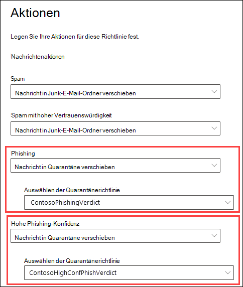

# <a name="quarantine-policies"></a><span data-ttu-id="72676-103">Quarantänerichtlinien</span><span class="sxs-lookup"><span data-stu-id="72676-103">Quarantine policies</span></span>

> [!NOTE]
> <span data-ttu-id="72676-104">Die in diesem Artikel beschriebenen Features befinden sich derzeit in der Vorschau, sind nicht für alle verfügbar und können geändert werden.</span><span class="sxs-lookup"><span data-stu-id="72676-104">The features that are described in this article are currently in Preview, aren't available to everyone, and are subject to change.</span></span>

<span data-ttu-id="72676-105">Quarantänerichtlinien (früher als Quarantänetags bezeichnet) in Exchange Online Protection (EOP) ermöglichen Es Administratoren, zu steuern, was Benutzer mit ihren isolierten Nachrichten tun können, basierend darauf, wie die Nachricht in Quarantäne gelangt ist.</span><span class="sxs-lookup"><span data-stu-id="72676-105">Quarantine policies (formerly known as quarantine tags) in Exchange Online Protection (EOP) allow admins to control what users are able to do to their quarantined messages based on how the message arrived in quarantine.</span></span>

<span data-ttu-id="72676-106">EOP hat traditionell bestimmte Interaktivitätsstufen für Nachrichten in [Quarantäne](find-and-release-quarantined-messages-as-a-user.md) und in [Spambenachrichtigungen](use-spam-notifications-to-release-and-report-quarantined-messages.md)von Endbenutzern zugelassen oder verhindert.</span><span class="sxs-lookup"><span data-stu-id="72676-106">EOP has traditionally allowed or prevented certain levels of interactivity for messages in [quarantine](find-and-release-quarantined-messages-as-a-user.md) and in [end-user spam notifications](use-spam-notifications-to-release-and-report-quarantined-messages.md).</span></span> <span data-ttu-id="72676-107">Beispielsweise können Benutzer Nachrichten anzeigen und freigeben, die durch Antispamfilterung in Quarantäne gestellt wurden, als Spam oder massenweise, aber sie können nachrichten, die als Phishing mit hohem Vertrauen unter Quarantäne gestellt wurden, nicht anzeigen oder freigeben (nur Administratoren können dies tun).</span><span class="sxs-lookup"><span data-stu-id="72676-107">For example, users can view and release messages that were quarantined by anti-spam filtering as spam or bulk, but they can't view or release messages that were quarantined as high confidence phishing (only admins can do that).</span></span>

<span data-ttu-id="72676-108">Für [unterstützte Schutzfeatures](#step-2-assign-a-quarantine-policy-to-supported-features)geben Quarantänerichtlinien an, was Benutzer in Spambenachrichtigungsnachrichten von Endbenutzern und in ihren isolierten Nachrichten in Quarantäne (Nachrichten, in denen der Benutzer ein Empfänger ist) tun dürfen.</span><span class="sxs-lookup"><span data-stu-id="72676-108">For [supported protection features](#step-2-assign-a-quarantine-policy-to-supported-features), quarantine policies specify what users are allowed to do in end-user spam notification messages and in their quarantined messages in quarantine (messages where the user is a recipient).</span></span> <span data-ttu-id="72676-109">Standardmäßige Quarantänerichtlinien werden automatisch zugewiesen, um die verlaufsbezogenen Funktionen für Benutzer für isolierte Nachrichten zu erzwingen.</span><span class="sxs-lookup"><span data-stu-id="72676-109">Default quarantine policies are automatically assigned to enforce the historical capabilities for users on quarantined messages.</span></span> <span data-ttu-id="72676-110">Sie können auch benutzerdefinierte Quarantänerichtlinien erstellen und zuweisen, um Endbenutzern das Ausführen bestimmter Aktionen für isolierte Nachrichten zu erlauben oder zu verhindern.</span><span class="sxs-lookup"><span data-stu-id="72676-110">Or, you can create and assign custom quarantine policies to allow or prevent end users from performing specific actions on quarantined messages.</span></span>

<span data-ttu-id="72676-111">Die einzelnen Berechtigungen werden in den folgenden vordefinierten Berechtigungsgruppen kombiniert:</span><span class="sxs-lookup"><span data-stu-id="72676-111">The individual permissions are combined into the following preset permission groups:</span></span>

- <span data-ttu-id="72676-112">Kein Zugriff</span><span class="sxs-lookup"><span data-stu-id="72676-112">No access</span></span>
- <span data-ttu-id="72676-113">Eingeschränkter Zugriff</span><span class="sxs-lookup"><span data-stu-id="72676-113">Limited access</span></span>
- <span data-ttu-id="72676-114">Vollzugriff</span><span class="sxs-lookup"><span data-stu-id="72676-114">Full access</span></span>

<span data-ttu-id="72676-115">Die verfügbaren einzelnen Berechtigungen und was in den voreingestellten Berechtigungsgruppen enthalten ist oder nicht, werden in der folgenden Tabelle beschrieben:</span><span class="sxs-lookup"><span data-stu-id="72676-115">The available individual permissions and what's included or not included in the preset permission groups are described in the following table:</span></span>

<br>

****

|<span data-ttu-id="72676-116">Berechtigung</span><span class="sxs-lookup"><span data-stu-id="72676-116">Permission</span></span>|<span data-ttu-id="72676-117">Kein Zugriff</span><span class="sxs-lookup"><span data-stu-id="72676-117">No access</span></span>|<span data-ttu-id="72676-118">Eingeschränkter Zugriff</span><span class="sxs-lookup"><span data-stu-id="72676-118">Limited access</span></span>|<span data-ttu-id="72676-119">Vollzugriff</span><span class="sxs-lookup"><span data-stu-id="72676-119">Full access</span></span>|
|---|:---:|:---:|:---:|
|<span data-ttu-id="72676-120">**Allow sender** (_PermissionToAllowSender_)</span><span class="sxs-lookup"><span data-stu-id="72676-120">**Allow sender** (_PermissionToAllowSender_)</span></span>||||
|<span data-ttu-id="72676-122">**Absender blockieren** (_PermissionToBlockSender_)</span><span class="sxs-lookup"><span data-stu-id="72676-122">**Block sender** (_PermissionToBlockSender_)</span></span>||||
|<span data-ttu-id="72676-125">**Delete** (_PermissionToDelete_)</span><span class="sxs-lookup"><span data-stu-id="72676-125">**Delete** (_PermissionToDelete_)</span></span>||||
|<span data-ttu-id="72676-128">**Vorschau** (_PermissionToPreview_)</span><span class="sxs-lookup"><span data-stu-id="72676-128">**Preview** (_PermissionToPreview_)</span></span>||||
|<span data-ttu-id="72676-131">**Zulassen, dass Empfänger eine Nachricht aus der Quarantäne freigeben** (_PermissionToRelease_)</span><span class="sxs-lookup"><span data-stu-id="72676-131">**Allow recipients to release a message from quarantine** (_PermissionToRelease_)</span></span>||||
|<span data-ttu-id="72676-133">**Zulassen, dass Empfänger anfordern, dass eine Nachricht aus der Quarantäne freigegeben wird** (_PermissionToRequestRelease_)</span><span class="sxs-lookup"><span data-stu-id="72676-133">**Allow recipients to request a message to be released from quarantine** (_PermissionToRequestRelease_)</span></span>||||
|

<span data-ttu-id="72676-135">Wenn Ihnen die Standardberechtigungen in den voreingestellten Berechtigungsgruppen nicht gefallen, können Sie benutzerdefinierte Berechtigungen verwenden, wenn Sie benutzerdefinierte Quarantänerichtlinien erstellen oder ändern.</span><span class="sxs-lookup"><span data-stu-id="72676-135">If you don't like the default permissions in the preset permission groups, you can use custom permissions when you create or modify custom quarantine policies.</span></span> <span data-ttu-id="72676-136">Weitere Informationen zur Funktionsweise der einzelnen Berechtigungen finden Sie im Abschnitt mit den Details zu den [Quarantänerichtlinienberechtigungen](#quarantine-policy-permission-details) weiter unten in diesem Artikel.</span><span class="sxs-lookup"><span data-stu-id="72676-136">For more information about what each permission does, see the [Quarantine policy permission details](#quarantine-policy-permission-details) section later in this article.</span></span>

<span data-ttu-id="72676-137">Sie erstellen und weisen Quarantänerichtlinien im Microsoft 365 Defender Portal oder in PowerShell (Exchange Online PowerShell für Microsoft 365 Organisationen mit Exchange Online Postfächern; eigenständige EOP PowerShell in EOP-Organisationen ohne Exchange Online Postfächer) zu.</span><span class="sxs-lookup"><span data-stu-id="72676-137">You create and assign quarantine policies in the Microsoft 365 Defender portal or in PowerShell (Exchange Online PowerShell for Microsoft 365 organizations with Exchange Online Mailboxes; standalone EOP PowerShell in EOP organizations without Exchange Online mailboxes).</span></span>

## <a name="what-do-you-need-to-know-before-you-begin"></a><span data-ttu-id="72676-138">Was sollten Sie wissen, bevor Sie beginnen?</span><span class="sxs-lookup"><span data-stu-id="72676-138">What do you need to know before you begin?</span></span>

- <span data-ttu-id="72676-139">Sie öffnen das Microsoft 365 Defender-Portal unter <https://security.microsoft.com>.</span><span class="sxs-lookup"><span data-stu-id="72676-139">You open the Microsoft 365 Defender portal at <https://security.microsoft.com>.</span></span> <span data-ttu-id="72676-140">Oder um direkt zur Seite **"Quarantänerichtlinien"** zu wechseln, öffnen Sie <https://security.microsoft.com/quarantineTags> .</span><span class="sxs-lookup"><span data-stu-id="72676-140">Or to go directly to the **Quarantine policies** page, open <https://security.microsoft.com/quarantineTags>.</span></span>

- <span data-ttu-id="72676-141">Wie Sie eine Verbindung mit Exchange Online PowerShell herstellen, finden Sie unter [Herstellen einer Verbindung mit Exchange Online PowerShell](/powershell/exchange/connect-to-exchange-online-powershell).</span><span class="sxs-lookup"><span data-stu-id="72676-141">To connect to Exchange Online PowerShell, see [Connect to Exchange Online PowerShell](/powershell/exchange/connect-to-exchange-online-powershell).</span></span> <span data-ttu-id="72676-142">Informationen zum Herstellen einer Verbindung mit dem eigenständigen Exchange Online Protection PowerShell finden Sie unter [Verbinden mit PowerShell in Exchange Online Protection](/powershell/exchange/connect-to-exchange-online-protection-powershell).</span><span class="sxs-lookup"><span data-stu-id="72676-142">To connect to standalone EOP PowerShell, see [Connect to Exchange Online Protection PowerShell](/powershell/exchange/connect-to-exchange-online-protection-powershell).</span></span>

- <span data-ttu-id="72676-143">Um Quarantänerichtlinien anzuzeigen, zu erstellen, zu ändern oder zu entfernen, müssen Sie Mitglied der Rollen **"Organisationsverwaltung"** oder **"Sicherheitsadministrator"** im Microsoft 365 Defender Portal sein.</span><span class="sxs-lookup"><span data-stu-id="72676-143">To view, create, modify, or remove quarantine policies, you need to be a member of the **Organization Management** or **Security Administrator** roles in the Microsoft 365 Defender portal.</span></span> <span data-ttu-id="72676-144">Weitere Informationen finden Sie unter [Berechtigungen im Microsoft 365 Defender-Portal](permissions-microsoft-365-security-center.md).</span><span class="sxs-lookup"><span data-stu-id="72676-144">For more information, see [Permissions in the Microsoft 365 Defender portal](permissions-microsoft-365-security-center.md).</span></span>

## <a name="step-1-create-quarantine-policies-in-the-microsoft-365-defender-portal"></a><span data-ttu-id="72676-145">Schritt 1: Erstellen von Quarantänerichtlinien im Microsoft 365 Defender-Portal</span><span class="sxs-lookup"><span data-stu-id="72676-145">Step 1: Create quarantine policies in the Microsoft 365 Defender portal</span></span>

1. <span data-ttu-id="72676-146">Wechseln Sie im Microsoft 365 Defender Portal zu **E-Mail &** \> Abschnitt "Richtlinien für **Bedrohungsrichtlinien** \> **für** die Zusammenarbeit", und wählen Sie dann \>  **"Quarantänerichtlinien"** aus.</span><span class="sxs-lookup"><span data-stu-id="72676-146">In the Microsoft 365 Defender portal, go to **Email & collaboration** \>**Threat policies** \> **Rules** section \> **Quarantine policies** and then select **Quarantine policies**.</span></span>

2. <span data-ttu-id="72676-147">Klicken Sie auf der Seite **"Quarantänerichtlinie"** auf  **"Benutzerdefinierte Richtlinie hinzufügen".**</span><span class="sxs-lookup"><span data-stu-id="72676-147">On the **Quarantine policy** page, click  **Add custom policy**.</span></span>

3. <span data-ttu-id="72676-148">Der Assistent **für neue Richtlinien** wird geöffnet.</span><span class="sxs-lookup"><span data-stu-id="72676-148">The **New policy** wizard opens.</span></span> <span data-ttu-id="72676-149">Geben Sie auf der Seite **"Richtlinienname"** einen kurzen, aber eindeutigen Namen in das **Feld "Richtlinienname"** ein.</span><span class="sxs-lookup"><span data-stu-id="72676-149">On the **Policy name** page, enter a brief but unique name in the **Policy name** box.</span></span> <span data-ttu-id="72676-150">In den nächsten Schritten müssen Sie die Quarantänerichtlinie anhand des Namens identifizieren und auswählen.</span><span class="sxs-lookup"><span data-stu-id="72676-150">You'll need to identify and select the quarantine policy by name in upcoming steps.</span></span> <span data-ttu-id="72676-151">Wenn Sie fertig sind, klicken Sie auf **Weiter**.</span><span class="sxs-lookup"><span data-stu-id="72676-151">When you're finished, click **Next**.</span></span>

4. <span data-ttu-id="72676-152">Wählen Sie auf der Seite **"Empfängernachrichtzugriff"** einen der folgenden Werte aus:</span><span class="sxs-lookup"><span data-stu-id="72676-152">On the **Recipient message access** page, select one of the following values:</span></span>
   - <span data-ttu-id="72676-153">**Kein Zugriff**</span><span class="sxs-lookup"><span data-stu-id="72676-153">**No access**</span></span>
   - <span data-ttu-id="72676-154">**Beschränkter Zugriff**</span><span class="sxs-lookup"><span data-stu-id="72676-154">**Limited access**</span></span>
   - <span data-ttu-id="72676-155">**Vollzugriff**</span><span class="sxs-lookup"><span data-stu-id="72676-155">**Full access**</span></span>

   <span data-ttu-id="72676-156">Die einzelnen Berechtigungen, die in diesen Berechtigungsgruppen enthalten sind, werden weiter oben in diesem Artikel beschrieben.</span><span class="sxs-lookup"><span data-stu-id="72676-156">The individual permissions that are included in these permission groups are described earlier in this article.</span></span>

   <span data-ttu-id="72676-157">Um benutzerdefinierte Berechtigungen anzugeben, wählen Sie **"Bestimmten Zugriff festlegen" (Erweitert)** aus, und konfigurieren Sie die folgenden angezeigten Einstellungen:</span><span class="sxs-lookup"><span data-stu-id="72676-157">To specify custom permissions, select **Set specific access (Advanced)** and the configure the following settings that appear:</span></span>

     - <span data-ttu-id="72676-158">Auswählen der **Einstellung für Veröffentlichungsaktionen:** Wählen Sie einen der folgenden Werte aus:</span><span class="sxs-lookup"><span data-stu-id="72676-158">**Select release action preference**: Select one of the following values:</span></span>
       - <span data-ttu-id="72676-159">**Keine Freigabeaktion:** Dies ist der Standardwert.</span><span class="sxs-lookup"><span data-stu-id="72676-159">**No release action**: This is the default value.</span></span>
       - <span data-ttu-id="72676-160">**Zulassen, dass Empfänger eine Nachricht aus der Quarantäne freigeben**</span><span class="sxs-lookup"><span data-stu-id="72676-160">**Allow recipients to release a message from quarantine**</span></span>
       - <span data-ttu-id="72676-161">**Zulassen, dass Empfänger anfordern, dass eine Nachricht aus der Quarantäne freigegeben wird**</span><span class="sxs-lookup"><span data-stu-id="72676-161">**Allow recipients to request a message to be released from quarantine**</span></span>
     - <span data-ttu-id="72676-162">Wählen Sie zusätzliche Aktionen aus, **die Empfänger für isolierte Nachrichten ausführen können:** Wählen Sie einige, alle oder keinen der folgenden Werte aus:</span><span class="sxs-lookup"><span data-stu-id="72676-162">**Select additional actions recipients can take on quarantined messages**: Select some, all, or none of the following values:</span></span>
       - <span data-ttu-id="72676-163">**Delete**</span><span class="sxs-lookup"><span data-stu-id="72676-163">**Delete**</span></span>
       - <span data-ttu-id="72676-164">**Preview**</span><span class="sxs-lookup"><span data-stu-id="72676-164">**Preview**</span></span>
       - <span data-ttu-id="72676-165">**Absender blockieren**</span><span class="sxs-lookup"><span data-stu-id="72676-165">**Block sender**</span></span>

   <span data-ttu-id="72676-166">Diese Berechtigungen und ihre Auswirkungen auf isolierte Nachrichten und in Spambenachrichtigungen von Endbenutzern werden im Abschnitt mit den [Berechtigungsdetails](#quarantine-policy-permission-details) für Quarantänerichtlinien weiter unten in diesem Artikel beschrieben.</span><span class="sxs-lookup"><span data-stu-id="72676-166">These permissions and their effect on quarantined messages and in end-user spam notifications are described in the [Quarantine policy permission details](#quarantine-policy-permission-details) section later in this article.</span></span>

   <span data-ttu-id="72676-167">Wenn Sie fertig sind, klicken Sie auf **Weiter**.</span><span class="sxs-lookup"><span data-stu-id="72676-167">When you're finished, click **Next**.</span></span>

5. <span data-ttu-id="72676-168">Überprüfen Sie auf der daraufhin angezeigten Seite **"Richtlinie überprüfen"** Ihre Einstellungen.</span><span class="sxs-lookup"><span data-stu-id="72676-168">On the **Review policy** page that appears, review your settings.</span></span> <span data-ttu-id="72676-169">Sie können in jedem Abschnitt **Bearbeiten** auswählen, um die Einstellungen in diesem Abschnitt zu ändern.</span><span class="sxs-lookup"><span data-stu-id="72676-169">You can select **Edit** in each section to modify the settings within the section.</span></span> <span data-ttu-id="72676-170">Alternativ können Sie auf **Zurück** klicken oder die entsprechende Seite im Assistenten auswählen.</span><span class="sxs-lookup"><span data-stu-id="72676-170">Or you can click **Back** or select the specific page in the wizard.</span></span>

   <span data-ttu-id="72676-171">Wenn Sie fertig sind, klicken Sie auf **"Absenden".**</span><span class="sxs-lookup"><span data-stu-id="72676-171">When you're finished, click **Submit**.</span></span>

6. <span data-ttu-id="72676-172">Klicken Sie in der angezeigten Bestätigungsseite auf **Fertig**.</span><span class="sxs-lookup"><span data-stu-id="72676-172">On the confirmation page that appears, click **Done**.</span></span>

<span data-ttu-id="72676-173">Jetzt können Sie die Quarantänerichtlinie einem Quarantänefeature zuweisen, wie im Abschnitt ["Schritt 2"](#step-2-assign-a-quarantine-policy-to-supported-features) beschrieben.</span><span class="sxs-lookup"><span data-stu-id="72676-173">Now you're ready to assign the quarantine policy to a quarantine feature as described in the [Step 2](#step-2-assign-a-quarantine-policy-to-supported-features) section.</span></span>

### <a name="create-quarantine-policies-in-powershell"></a><span data-ttu-id="72676-174">Erstellen von Quarantänerichtlinien in PowerShell</span><span class="sxs-lookup"><span data-stu-id="72676-174">Create quarantine policies in PowerShell</span></span>

<span data-ttu-id="72676-175">Wenn Sie stattdessen PowerShell zum Erstellen von Quarantänerichtlinien verwenden möchten, stellen Sie eine Verbindung mit Exchange Online PowerShell oder Exchange Online Protection PowerShell her, und verwenden Sie das Cmdlet **"New-QuarantineTag".**</span><span class="sxs-lookup"><span data-stu-id="72676-175">If you'd rather use PowerShell to create quarantine policies, connect to Exchange Online PowerShell or Exchange Online Protection PowerShell and use the **New-QuarantineTag** cmdlet.</span></span> <span data-ttu-id="72676-176">Sie haben zwei verschiedene Methoden zur Auswahl:</span><span class="sxs-lookup"><span data-stu-id="72676-176">You have two different methods to choose from:</span></span>

- <span data-ttu-id="72676-177">Verwenden Sie den _Parameter "EndUserQuarantinePermissionsValue"._</span><span class="sxs-lookup"><span data-stu-id="72676-177">Use the _EndUserQuarantinePermissionsValue_ parameter.</span></span>
- <span data-ttu-id="72676-178">Verwenden Sie den _EndUserQuarantinePermissions-Parameter._</span><span class="sxs-lookup"><span data-stu-id="72676-178">Use the _EndUserQuarantinePermissions_ parameter.</span></span>

<span data-ttu-id="72676-179">Diese Methoden werden in den folgenden Abschnitten beschrieben.</span><span class="sxs-lookup"><span data-stu-id="72676-179">These methods are described in the following sections.</span></span>

#### <a name="use-the-enduserquarantinepermissionsvalue-parameter"></a><span data-ttu-id="72676-180">Verwenden des Parameters "EndUserQuarantinePermissionsValue"</span><span class="sxs-lookup"><span data-stu-id="72676-180">Use the EndUserQuarantinePermissionsValue parameter</span></span>

<span data-ttu-id="72676-181">Verwenden Sie die folgende Syntax, um eine Quarantänerichtlinie mithilfe des _Parameters "EndUserQuarantinePermissionsValue"_ zu erstellen:</span><span class="sxs-lookup"><span data-stu-id="72676-181">To create a quarantine policy using the _EndUserQuarantinePermissionsValue_ parameter, use the following syntax:</span></span>

```powershell
New-QuarantineTag -Name "<UniqueName>" -EndUserQuarantinePermissionsValue <0 to 236>
```

<span data-ttu-id="72676-182">Der _EndUserQuarantinePermissionsValue-Parameter_ verwendet einen Dezimalwert, der aus einem binären Wert konvertiert wird.</span><span class="sxs-lookup"><span data-stu-id="72676-182">The _EndUserQuarantinePermissionsValue_ parameter uses a decimal value that's converted from a binary value.</span></span> <span data-ttu-id="72676-183">Der binäre Wert entspricht den verfügbaren Quarantäneberechtigungen für Endbenutzer in einer bestimmten Reihenfolge.</span><span class="sxs-lookup"><span data-stu-id="72676-183">The binary value corresponds to the available end-user quarantine permissions in a specific order.</span></span> <span data-ttu-id="72676-184">Für jede Berechtigung entspricht der Wert 1 "True" und der Wert 0 "False".</span><span class="sxs-lookup"><span data-stu-id="72676-184">For each permission, the value 1 equals True and the value 0 equals False.</span></span>

<span data-ttu-id="72676-185">Die erforderliche Reihenfolge und die Werte für jede einzelne Berechtigung in vordefinierten Berechtigungsgruppen werden in der folgenden Tabelle beschrieben:</span><span class="sxs-lookup"><span data-stu-id="72676-185">The required order and values for each individual permission in preset permission groups are described in the following table:</span></span>

<br>

****

|<span data-ttu-id="72676-186">Berechtigung</span><span class="sxs-lookup"><span data-stu-id="72676-186">Permission</span></span>|<span data-ttu-id="72676-187">Kein Zugriff</span><span class="sxs-lookup"><span data-stu-id="72676-187">No access</span></span>|<span data-ttu-id="72676-188">Eingeschränkter Zugriff</span><span class="sxs-lookup"><span data-stu-id="72676-188">Limited access</span></span>|<span data-ttu-id="72676-189">Vollzugriff</span><span class="sxs-lookup"><span data-stu-id="72676-189">Full access</span></span>|
|---|:---:|:---:|:---:|
|<span data-ttu-id="72676-190">PermissionToAllowSender</span><span class="sxs-lookup"><span data-stu-id="72676-190">PermissionToAllowSender</span></span>|<span data-ttu-id="72676-191">0</span><span class="sxs-lookup"><span data-stu-id="72676-191">0</span></span>|<span data-ttu-id="72676-192">0</span><span class="sxs-lookup"><span data-stu-id="72676-192">0</span></span>|<span data-ttu-id="72676-193">1</span><span class="sxs-lookup"><span data-stu-id="72676-193">1</span></span>|
|<span data-ttu-id="72676-194">PermissionToBlockSender</span><span class="sxs-lookup"><span data-stu-id="72676-194">PermissionToBlockSender</span></span>|<span data-ttu-id="72676-195">0</span><span class="sxs-lookup"><span data-stu-id="72676-195">0</span></span>|<span data-ttu-id="72676-196">1</span><span class="sxs-lookup"><span data-stu-id="72676-196">1</span></span>|<span data-ttu-id="72676-197">1</span><span class="sxs-lookup"><span data-stu-id="72676-197">1</span></span>|
|<span data-ttu-id="72676-198">PermissionToDelete</span><span class="sxs-lookup"><span data-stu-id="72676-198">PermissionToDelete</span></span>|<span data-ttu-id="72676-199">0</span><span class="sxs-lookup"><span data-stu-id="72676-199">0</span></span>|<span data-ttu-id="72676-200">1</span><span class="sxs-lookup"><span data-stu-id="72676-200">1</span></span>|<span data-ttu-id="72676-201">1</span><span class="sxs-lookup"><span data-stu-id="72676-201">1</span></span>|
|<span data-ttu-id="72676-202">PermissionToDownload<sup>\*</sup></span><span class="sxs-lookup"><span data-stu-id="72676-202">PermissionToDownload<sup>\*</sup></span></span>|<span data-ttu-id="72676-203">0</span><span class="sxs-lookup"><span data-stu-id="72676-203">0</span></span>|<span data-ttu-id="72676-204">0</span><span class="sxs-lookup"><span data-stu-id="72676-204">0</span></span>|<span data-ttu-id="72676-205">0</span><span class="sxs-lookup"><span data-stu-id="72676-205">0</span></span>|
|<span data-ttu-id="72676-206">PermissionToPreview</span><span class="sxs-lookup"><span data-stu-id="72676-206">PermissionToPreview</span></span>|<span data-ttu-id="72676-207">0</span><span class="sxs-lookup"><span data-stu-id="72676-207">0</span></span>|<span data-ttu-id="72676-208">1</span><span class="sxs-lookup"><span data-stu-id="72676-208">1</span></span>|<span data-ttu-id="72676-209">1</span><span class="sxs-lookup"><span data-stu-id="72676-209">1</span></span>|
|<span data-ttu-id="72676-210">PermissionToRelease<sup>\*\*</sup></span><span class="sxs-lookup"><span data-stu-id="72676-210">PermissionToRelease<sup>\*\*</sup></span></span>|<span data-ttu-id="72676-211">0</span><span class="sxs-lookup"><span data-stu-id="72676-211">0</span></span>|<span data-ttu-id="72676-212">0</span><span class="sxs-lookup"><span data-stu-id="72676-212">0</span></span>|<span data-ttu-id="72676-213">1</span><span class="sxs-lookup"><span data-stu-id="72676-213">1</span></span>|
|<span data-ttu-id="72676-214">PermissionToRequestRelease<sup>\*\*</sup></span><span class="sxs-lookup"><span data-stu-id="72676-214">PermissionToRequestRelease<sup>\*\*</sup></span></span>|<span data-ttu-id="72676-215">0</span><span class="sxs-lookup"><span data-stu-id="72676-215">0</span></span>|<span data-ttu-id="72676-216">1</span><span class="sxs-lookup"><span data-stu-id="72676-216">1</span></span>|<span data-ttu-id="72676-217">0</span><span class="sxs-lookup"><span data-stu-id="72676-217">0</span></span>|
|<span data-ttu-id="72676-218">PermissionToViewHeader<sup>\*</sup></span><span class="sxs-lookup"><span data-stu-id="72676-218">PermissionToViewHeader<sup>\*</sup></span></span>|<span data-ttu-id="72676-219">0</span><span class="sxs-lookup"><span data-stu-id="72676-219">0</span></span>|<span data-ttu-id="72676-220">0</span><span class="sxs-lookup"><span data-stu-id="72676-220">0</span></span>|<span data-ttu-id="72676-221">0</span><span class="sxs-lookup"><span data-stu-id="72676-221">0</span></span>|
|<span data-ttu-id="72676-222">Binärer Wert</span><span class="sxs-lookup"><span data-stu-id="72676-222">Binary value</span></span>|<span data-ttu-id="72676-223">00000000</span><span class="sxs-lookup"><span data-stu-id="72676-223">00000000</span></span>|<span data-ttu-id="72676-224">01101010</span><span class="sxs-lookup"><span data-stu-id="72676-224">01101010</span></span>|<span data-ttu-id="72676-225">11101100</span><span class="sxs-lookup"><span data-stu-id="72676-225">11101100</span></span>|
|<span data-ttu-id="72676-226">Zu verwendende Dezimalwerte</span><span class="sxs-lookup"><span data-stu-id="72676-226">Decimal value to use</span></span>|<span data-ttu-id="72676-227">0</span><span class="sxs-lookup"><span data-stu-id="72676-227">0</span></span>|<span data-ttu-id="72676-228">106</span><span class="sxs-lookup"><span data-stu-id="72676-228">106</span></span>|<span data-ttu-id="72676-229">236</span><span class="sxs-lookup"><span data-stu-id="72676-229">236</span></span>|
|

<span data-ttu-id="72676-230"><sup>\*</sup> Derzeit ist dieser Wert immer 0.</span><span class="sxs-lookup"><span data-stu-id="72676-230"><sup>\*</sup> Currently, this value is always 0.</span></span> <span data-ttu-id="72676-231">Bei PermissionToViewHeader blendet der Wert 0 die Schaltfläche **"Nachrichtenkopf anzeigen"** nicht in den Details der isolierten Nachricht aus (die Schaltfläche ist immer verfügbar).</span><span class="sxs-lookup"><span data-stu-id="72676-231">For PermissionToViewHeader, the value 0 doesn't hide the **View message header** button in the details of the quarantined message (the button is always available).</span></span>

<span data-ttu-id="72676-232"><sup>\*\*</sup> Legen Sie nicht beide Werte auf 1 fest.</span><span class="sxs-lookup"><span data-stu-id="72676-232"><sup>\*\*</sup> Don't set both of these values to 1.</span></span> <span data-ttu-id="72676-233">Legen Sie eins auf 1 und das andere auf 0 oder beide auf 0 fest.</span><span class="sxs-lookup"><span data-stu-id="72676-233">Set one to 1 and the other to 0, or set both to 0.</span></span>

<span data-ttu-id="72676-234">In diesem Beispiel wird ein neuer Quarantänerichtlinienname "NoAccess" erstellt, der die Berechtigungen "Kein Zugriff" wie in der vorherigen Tabelle beschrieben zuweist.</span><span class="sxs-lookup"><span data-stu-id="72676-234">This example creates a new quarantine policy name NoAccess that assigns the No access permissions as described in the previous table.</span></span>

```powershell
New-QuarantineTag -Name NoAccess -EndUserQuarantinePermissionsValue 0
```

<span data-ttu-id="72676-235">Verwenden Sie für eingeschränkte Zugriffsberechtigungen den Wert 106.</span><span class="sxs-lookup"><span data-stu-id="72676-235">For Limited access permissions, use the value 106.</span></span> <span data-ttu-id="72676-236">Verwenden Sie für Vollzugriffsberechtigungen den Wert 236.</span><span class="sxs-lookup"><span data-stu-id="72676-236">For Full access permissions, use the value 236.</span></span>

<span data-ttu-id="72676-237">Verwenden Sie für benutzerdefinierte Berechtigungen die vorherige Tabelle, um den binären Wert abzurufen, der den gewünschten Berechtigungen entspricht.</span><span class="sxs-lookup"><span data-stu-id="72676-237">For custom permissions, use the previous table to get the binary value that corresponds to the permissions you want.</span></span> <span data-ttu-id="72676-238">Konvertieren Sie den binären Wert in einen Dezimalwert, und verwenden Sie den Dezimalwert für den _Parameter "EndUserQuarantinePermissionsValue"._</span><span class="sxs-lookup"><span data-stu-id="72676-238">Convert the binary value to a decimal value and use the decimal value for the _EndUserQuarantinePermissionsValue_ parameter.</span></span>

<span data-ttu-id="72676-239">Ausführliche Informationen zu Syntax und Parametern finden Sie unter [New-QuarantineTag](/powershell/module/exchange/new-quarantinetag).</span><span class="sxs-lookup"><span data-stu-id="72676-239">For detailed syntax and parameter information, see [New-QuarantineTag](/powershell/module/exchange/new-quarantinetag).</span></span>

#### <a name="use-the-enduserquarantinepermissions-parameter"></a><span data-ttu-id="72676-240">Verwenden des EndUserQuarantinePermissions-Parameters</span><span class="sxs-lookup"><span data-stu-id="72676-240">Use the EndUserQuarantinePermissions parameter</span></span>

<span data-ttu-id="72676-241">Führen Sie die folgenden Schritte aus, um eine Quarantänerichtlinie mithilfe des _Parameters "EndUserQuarantinePermissionsValue"_ zu erstellen:</span><span class="sxs-lookup"><span data-stu-id="72676-241">To create a quarantine policy using the _EndUserQuarantinePermissionsValue_ parameter, do the following steps:</span></span>

<span data-ttu-id="72676-242">A:</span><span class="sxs-lookup"><span data-stu-id="72676-242">A.</span></span> <span data-ttu-id="72676-243">Store ein Quarantäneberechtigungsobjekt in einer Variablen mithilfe des **Cmdlets "New-QuarantinePermissions" an.**</span><span class="sxs-lookup"><span data-stu-id="72676-243">Store a quarantine permissions object in a variable using the **New-QuarantinePermissions** cmdlet.</span></span>

<p>

<span data-ttu-id="72676-244">B.</span><span class="sxs-lookup"><span data-stu-id="72676-244">B.</span></span> <span data-ttu-id="72676-245">Verwenden Sie die Variable als _EndUserQuarantinePermissions-Wert_ im Befehl **"New-QuarantineTag".**</span><span class="sxs-lookup"><span data-stu-id="72676-245">Use the variable as the _EndUserQuarantinePermissions_ value in the **New-QuarantineTag** command.</span></span>

##### <a name="step-a-store-a-quarantine-permissions-object-in-a-variable"></a><span data-ttu-id="72676-246">Schritt A: Store eines Quarantäneberechtigungsobjekts in einer Variablen</span><span class="sxs-lookup"><span data-stu-id="72676-246">Step A: Store a quarantine permissions object in a variable</span></span>

<span data-ttu-id="72676-247">Verwenden Sie die folgende Syntax:</span><span class="sxs-lookup"><span data-stu-id="72676-247">Use the following syntax:</span></span>

```powershell
$<VariableName> = New-QuarantinePermissions [-PermissionToAllowSender <$true | $False>] [-PermissionToBlockSender <$true | $False>] [-PermissionToDelete <$true | $False>] [-PermissionToPreview <$true | $False>] [-PermissionToRelease <$true | $False>] [-PermissionToRequestRelease <$true | $False>]
```

<span data-ttu-id="72676-248">Der Standardwert für alle nicht verwendeten Parameter ist `$false` , daher müssen Sie nur die Parameter verwenden, für die Sie den Wert festlegen `$true` möchten.</span><span class="sxs-lookup"><span data-stu-id="72676-248">The default value for any unused parameters is `$false`, so you only need to use the parameters where you want to set value to `$true`.</span></span>

<span data-ttu-id="72676-249">Die folgenden Beispiele zeigen, wie Berechtigungsobjekte erstellt werden, die den vordefinierten Berechtigungsgruppen entsprechen:</span><span class="sxs-lookup"><span data-stu-id="72676-249">The following examples show how to create permission objects that correspond to the preset permissions groups:</span></span>

- <span data-ttu-id="72676-250">**Kein Zugriff:**</span><span class="sxs-lookup"><span data-stu-id="72676-250">**No access**:</span></span>

  ```powershell
  $NoAccess = New-QuarantinePermissions
  ```

- <span data-ttu-id="72676-251">**Beschränkter Zugriff:**</span><span class="sxs-lookup"><span data-stu-id="72676-251">**Limited access**:</span></span>

  ```powershell
  $LimitedAccess = New-QuarantinePermissions -PermissionToBlockSender $true -PermissionToDelete $true -PermissionToPreview $true -PermissionToRequestRelease $true
  ```

- <span data-ttu-id="72676-252">**Vollzugriff:**</span><span class="sxs-lookup"><span data-stu-id="72676-252">**Full access**:</span></span>

  ```powershell
  $FullAccess = New-QuarantinePermissions -PermissionToAllowSender $true -PermissionToBlockSender $true -PermissionToDelete $true -PermissionToPreview $true -PermissionToRelease $true
  ```

<span data-ttu-id="72676-253">Um die von Ihnen festgelegten Werte anzuzeigen, führen Sie den Variablennamen als Befehl aus (führen Sie z. B. den Befehl `$NoAccess` aus).</span><span class="sxs-lookup"><span data-stu-id="72676-253">To see the values that you've set, run the variable name as a command (for example, run the command `$NoAccess`).</span></span>

<span data-ttu-id="72676-254">Legen Sie für benutzerdefinierte Berechtigungen nicht sowohl die _Parameter PermissionToRelease_ als auch _PermissionToRequestRelease_ auf `$true` .</span><span class="sxs-lookup"><span data-stu-id="72676-254">For custom permissions, don't set both the _PermissionToRelease_ and _PermissionToRequestRelease_ parameters to `$true`.</span></span> <span data-ttu-id="72676-255">Legen Sie eine `$true` fest, und lassen Sie die andere als `$false` , oder lassen Sie beide als `$false` .</span><span class="sxs-lookup"><span data-stu-id="72676-255">Set one to `$true` and leave the other as `$false`, or leave both as `$false`.</span></span>

<span data-ttu-id="72676-256">Sie können auch eine vorhandene Berechtigungsobjektvariable ändern, nachdem Sie sie erstellt haben, aber bevor Sie sie verwenden, indem Sie das Cmdlet **"Set-QuarantinePermissions"** verwenden.</span><span class="sxs-lookup"><span data-stu-id="72676-256">You can also modify an existing permissions object variable after you create but before you use it by using the **Set-QuarantinePermissions** cmdlet.</span></span>

<span data-ttu-id="72676-257">Ausführliche Informationen zu Syntax und Parametern finden Sie unter ["New-QuarantinePermissions"](/powershell/module/exchange/new-quarantinepermissions) und ["Set-QuarantinePermissions".](/powershell/module/exchange/set-quarantinepermissions)</span><span class="sxs-lookup"><span data-stu-id="72676-257">For detailed syntax and parameter information, see [New-QuarantinePermissions](/powershell/module/exchange/new-quarantinepermissions) and [Set-QuarantinePermissions](/powershell/module/exchange/set-quarantinepermissions).</span></span>

##### <a name="step-b-use-the-variable-in-the-new-quarantinetag-command"></a><span data-ttu-id="72676-258">Schritt B: Verwenden der Variablen im Befehl New-QuarantineTag</span><span class="sxs-lookup"><span data-stu-id="72676-258">Step B: Use the variable in the New-QuarantineTag command</span></span>

<span data-ttu-id="72676-259">Nachdem Sie das Berechtigungsobjekt in einer Variablen erstellt und gespeichert haben, verwenden Sie die Variable für den _EndUserQuarantinePermission-Parameterwert_ im folgenden **New-QuarantineTag-Befehl:**</span><span class="sxs-lookup"><span data-stu-id="72676-259">After you've created and stored the permissions object in a variable, use the variable for the _EndUserQuarantinePermission_ parameter value in the following **New-QuarantineTag** command:</span></span>

```powershell
New-QuarantineTag -Name "<UniqueName>" -EndUserQuarantinePermissions $<VariableName>
```

<span data-ttu-id="72676-260">In diesem Beispiel wird eine neue Quarantänerichtlinie namens LimitedAccess mithilfe des `$LimitedAccess` Berechtigungsobjekts erstellt, das im vorherigen Schritt beschrieben und erstellt wurde.</span><span class="sxs-lookup"><span data-stu-id="72676-260">This example creates a new quarantine policy named LimitedAccess using the `$LimitedAccess` permissions object that was described and created in the previous step.</span></span>

```powershell
New-QuarantineTag -Name LimitedAccess -EndUserQuarantinePermissions $LimitedAccess
```

<span data-ttu-id="72676-261">Ausführliche Informationen zu Syntax und Parametern finden Sie unter [New-QuarantineTag](/powershell/module/exchange/new-quarantinetag).</span><span class="sxs-lookup"><span data-stu-id="72676-261">For detailed syntax and parameter information, see [New-QuarantineTag](/powershell/module/exchange/new-quarantinetag).</span></span>

## <a name="step-2-assign-a-quarantine-policy-to-supported-features"></a><span data-ttu-id="72676-262">Schritt 2: Zuweisen einer Quarantänerichtlinie zu unterstützten Features</span><span class="sxs-lookup"><span data-stu-id="72676-262">Step 2: Assign a quarantine policy to supported features</span></span>

<span data-ttu-id="72676-263">In _unterstützten_ Schutzfeatures, die Nachrichten oder Dateien unter Quarantäne stellen (automatisch oder als konfigurierbare Aktion), können Sie den verfügbaren Quarantäneaktionen eine Quarantänerichtlinie zuweisen.</span><span class="sxs-lookup"><span data-stu-id="72676-263">In _supported_ protection features that quarantine messages or files (automatically or as a configurable action), you can assign a quarantine policy to the available quarantine actions.</span></span> <span data-ttu-id="72676-264">Features, die Nachrichten unter Quarantäne stellen, und die Verfügbarkeit von Quarantänerichtlinien werden in der folgenden Tabelle beschrieben:</span><span class="sxs-lookup"><span data-stu-id="72676-264">Features that quarantine messages and the availability of quarantine policies are described in the following table:</span></span>

<br>

****

|<span data-ttu-id="72676-265">Feature</span><span class="sxs-lookup"><span data-stu-id="72676-265">Feature</span></span>|<span data-ttu-id="72676-266">Unterstützte Quarantänerichtlinien?</span><span class="sxs-lookup"><span data-stu-id="72676-266">Quarantine policies supported?</span></span>|<span data-ttu-id="72676-267">Verwendete Standardquarantänerichtlinien</span><span class="sxs-lookup"><span data-stu-id="72676-267">Default quarantine policies used</span></span>|
|---|:---:|---|
|<span data-ttu-id="72676-268">[Antispamrichtlinien:](configure-your-spam-filter-policies.md)</span><span class="sxs-lookup"><span data-stu-id="72676-268">[Anti-spam policies](configure-your-spam-filter-policies.md):</span></span> <ul><li><span data-ttu-id="72676-269">**Spam** (_SpamAction_)</span><span class="sxs-lookup"><span data-stu-id="72676-269">**Spam** (_SpamAction_)</span></span></li><li><span data-ttu-id="72676-270">**Spam mit hoher Konfidenz** (_HighConfidenceSpamAction_)</span><span class="sxs-lookup"><span data-stu-id="72676-270">**High confidence spam** (_HighConfidenceSpamAction_)</span></span></li><li><span data-ttu-id="72676-271">**Phishing** (_PhishSpamAction_)</span><span class="sxs-lookup"><span data-stu-id="72676-271">**Phishing** (_PhishSpamAction_)</span></span></li><li><span data-ttu-id="72676-272">Phishing mit **hoher Konfidenz** (_HighConfidencePhishAction_)</span><span class="sxs-lookup"><span data-stu-id="72676-272">**High confidence phishing** (_HighConfidencePhishAction_)</span></span></li><li><span data-ttu-id="72676-273">**Bulk** (_BulkSpamAction_)</span><span class="sxs-lookup"><span data-stu-id="72676-273">**Bulk** (_BulkSpamAction_)</span></span></li></ul>|<span data-ttu-id="72676-274">Ja</span><span class="sxs-lookup"><span data-stu-id="72676-274">Yes</span></span>|<ul><li><span data-ttu-id="72676-275">DefaultSpamTag (Vollzugriff)</span><span class="sxs-lookup"><span data-stu-id="72676-275">DefaultSpamTag (Full access)</span></span></li><li><span data-ttu-id="72676-276">DefaultHighConfSpamTag (Vollzugriff)</span><span class="sxs-lookup"><span data-stu-id="72676-276">DefaultHighConfSpamTag (Full access)</span></span></li><li><span data-ttu-id="72676-277">DefaultPhishTag (Vollzugriff)</span><span class="sxs-lookup"><span data-stu-id="72676-277">DefaultPhishTag (Full access)</span></span></li><li><span data-ttu-id="72676-278">DefaultHighConfPhishTag (Kein Zugriff)</span><span class="sxs-lookup"><span data-stu-id="72676-278">DefaultHighConfPhishTag (No access)</span></span></li><li><span data-ttu-id="72676-279">DefaultBulkTag (Vollzugriff)</span><span class="sxs-lookup"><span data-stu-id="72676-279">DefaultBulkTag (Full access)</span></span></li></ul>
|<span data-ttu-id="72676-280">Antiphishingrichtlinien:</span><span class="sxs-lookup"><span data-stu-id="72676-280">Anti-phishing policies:</span></span> <ul><li><span data-ttu-id="72676-281">[Schutz vor Spoofintelligenz](set-up-anti-phishing-policies.md#spoof-settings) (_AuthenticationFailAction_)</span><span class="sxs-lookup"><span data-stu-id="72676-281">[Spoof intelligence protection](set-up-anti-phishing-policies.md#spoof-settings) (_AuthenticationFailAction_)</span></span></li><li><span data-ttu-id="72676-282">[Identitätswechselschutz:](set-up-anti-phishing-policies.md#impersonation-settings-in-anti-phishing-policies-in-microsoft-defender-for-office-365)<sup>\*</sup></span><span class="sxs-lookup"><span data-stu-id="72676-282">[Impersonation protection](set-up-anti-phishing-policies.md#impersonation-settings-in-anti-phishing-policies-in-microsoft-defender-for-office-365):<sup>\*</sup></span></span> <ul><li><span data-ttu-id="72676-283">**Wenn eine Nachricht als angenommener Benutzer erkannt wird** (_TargetedUserProtectionAction_)</span><span class="sxs-lookup"><span data-stu-id="72676-283">**If message is detected as an impersonated user** (_TargetedUserProtectionAction_)</span></span></li><li><span data-ttu-id="72676-284">**Wenn eine Nachricht als imitierte Domäne erkannt wird** (_TargetedDomainProtectionAction_)</span><span class="sxs-lookup"><span data-stu-id="72676-284">**If message is detected as an impersonated domain** (_TargetedDomainProtectionAction_)</span></span></li><li><span data-ttu-id="72676-285">**Wenn die Postfachintelligenz einen Benutzer erkennt und imitiert** (_MailboxIntelligenceProtectionAction_)</span><span class="sxs-lookup"><span data-stu-id="72676-285">**If mailbox intelligence detects and impersonated user** (_MailboxIntelligenceProtectionAction_)</span></span></li></ul></li></ul></ul>|<span data-ttu-id="72676-286">Nein</span><span class="sxs-lookup"><span data-stu-id="72676-286">No</span></span>|<span data-ttu-id="72676-287">n/v</span><span class="sxs-lookup"><span data-stu-id="72676-287">n/a</span></span>|
|<span data-ttu-id="72676-288">[Antischadsoftwarerichtlinien:](configure-anti-malware-policies.md)Alle erkannten Nachrichten werden immer unter Quarantäne gestellt.</span><span class="sxs-lookup"><span data-stu-id="72676-288">[Anti-malware policies](configure-anti-malware-policies.md): All detected messages are always quarantined.</span></span>|<span data-ttu-id="72676-289">Nein</span><span class="sxs-lookup"><span data-stu-id="72676-289">No</span></span>|<span data-ttu-id="72676-290">n/v</span><span class="sxs-lookup"><span data-stu-id="72676-290">n/a</span></span>|
|[<span data-ttu-id="72676-291">Sichere Anlagen für SharePoint, OneDrive und Microsoft Teams</span><span class="sxs-lookup"><span data-stu-id="72676-291">Safe Attachments for SharePoint, OneDrive, and Microsoft Teams</span></span>](mdo-for-spo-odb-and-teams.md)|<span data-ttu-id="72676-292">Nein</span><span class="sxs-lookup"><span data-stu-id="72676-292">No</span></span>|<span data-ttu-id="72676-293">n/v</span><span class="sxs-lookup"><span data-stu-id="72676-293">n/a</span></span>|
|<span data-ttu-id="72676-294">[Nachrichtenflussregeln](/exchange/security-and-compliance/mail-flow-rules/mail-flow-rules) (auch als Transportregeln bezeichnet) mit der Aktion: **Übermitteln der Nachricht an die gehostete Quarantäne** (_Quarantäne_).</span><span class="sxs-lookup"><span data-stu-id="72676-294">[Mail flow rules](/exchange/security-and-compliance/mail-flow-rules/mail-flow-rules) (also known as transport rules) with the action: **Deliver the message to the hosted quarantine** (_Quarantine_).</span></span>|<span data-ttu-id="72676-295">Nein</span><span class="sxs-lookup"><span data-stu-id="72676-295">No</span></span>|<span data-ttu-id="72676-296">n/v</span><span class="sxs-lookup"><span data-stu-id="72676-296">n/a</span></span>|
|

<span data-ttu-id="72676-297"><sup>\*</sup>Einstellungen für den Identitätswechselschutz sind nur in Antiphishingrichtlinien in Microsoft Defender für Office 365 verfügbar.</span><span class="sxs-lookup"><span data-stu-id="72676-297"><sup>\*</sup> Impersonation protection settings are available only in anti-phishing policies in Microsoft Defender for Office 365.</span></span>

<span data-ttu-id="72676-298">Wenn Sie mit den Endbenutzerberechtigungen zufrieden sind, die von den Standardquarantänerichtlinien bereitgestellt werden, müssen Sie nichts unternehmen.</span><span class="sxs-lookup"><span data-stu-id="72676-298">If you're happy with the end-user permissions that are provided by the default quarantine policies, you don't need to do anything.</span></span> <span data-ttu-id="72676-299">Wenn Sie die Endbenutzerfunktionen (verfügbare Schaltflächen) in Spambenachrichtigungen von Endbenutzern oder In-Quarantäne-Nachrichtendetails anpassen möchten, können Sie eine benutzerdefinierte Quarantänerichtlinie zuweisen.</span><span class="sxs-lookup"><span data-stu-id="72676-299">If you want to customize the end-user capabilities (available buttons) in end-user spam notifications or in quarantined message details, you can assign a custom quarantine policy.</span></span>

### <a name="assign-quarantine-policies-in-anti-spam-policies-in-the-microsoft-365-defender-portal"></a><span data-ttu-id="72676-300">Zuweisen von Quarantänerichtlinien in Antispamrichtlinien im Microsoft 365 Defender Portal</span><span class="sxs-lookup"><span data-stu-id="72676-300">Assign quarantine policies in anti-spam policies in the Microsoft 365 Defender portal</span></span>

<span data-ttu-id="72676-301">Vollständige Anweisungen zum Erstellen und Ändern von Antispamrichtlinien werden unter [Konfigurieren von Antispamrichtlinien in EOP](configure-your-spam-filter-policies.md)beschrieben.</span><span class="sxs-lookup"><span data-stu-id="72676-301">Full instructions for creating and modifying anti-spam policies are described in [Configure anti-spam policies in EOP](configure-your-spam-filter-policies.md).</span></span>

1. <span data-ttu-id="72676-302">Wechseln Sie im portal Microsoft 365 Defender zu **E-Mail-& Richtlinien** für die Zusammenarbeit \> **&** \> **Regelrichtlinien** Abschnitt \> **Antispam**.</span><span class="sxs-lookup"><span data-stu-id="72676-302">In the Microsoft 365 Defender portal, go to **Email & collaboration** \> **Policies & rules** \> **Policies** section \> **Anti-spam**.</span></span> <span data-ttu-id="72676-303">Oder öffnen <https://security.microsoft.com/antispam> Sie .</span><span class="sxs-lookup"><span data-stu-id="72676-303">Or, open <https://security.microsoft.com/antispam>.</span></span>

2. <span data-ttu-id="72676-304">Führen Sie auf der Seite **"Antispamrichtlinien"** einen der folgenden Schritte aus:</span><span class="sxs-lookup"><span data-stu-id="72676-304">On the **Anti-spam policies** page, do one of the following steps:</span></span>
   - <span data-ttu-id="72676-305">Suchen und Auswählen einer vorhandenen **eingehenden** Antispamrichtlinie.</span><span class="sxs-lookup"><span data-stu-id="72676-305">Find and select an existing **inbound** anti-spam policy.</span></span>
   - <span data-ttu-id="72676-306">Erstellen Sie eine neue **Eingehende Antispamrichtlinie.**</span><span class="sxs-lookup"><span data-stu-id="72676-306">Create a new **inbound** anti-spam policy.</span></span>

3. <span data-ttu-id="72676-307">Führen Sie einen der folgenden Schritte aus:</span><span class="sxs-lookup"><span data-stu-id="72676-307">Do one of the following steps:</span></span>
   - <span data-ttu-id="72676-308">**Vorhandene Antispamrichtlinie bearbeiten:** Wechseln Sie im Richtliniendetails-Flyout zum Abschnitt **"Aktionen",** und klicken Sie dann auf **"Aktionen bearbeiten".**</span><span class="sxs-lookup"><span data-stu-id="72676-308">**Edit existing anti-spam policy**: In the policy details flyout, go to the **Actions** section and then click **Edit actions**.</span></span>
   - <span data-ttu-id="72676-309">**Erstellen Sie eine neue Antispamrichtlinie:** Wechseln Sie im Assistenten für neue Richtlinien zur Seite **"Aktionen".**</span><span class="sxs-lookup"><span data-stu-id="72676-309">**Create new anti-spam policy**: In the new policy wizard, go to the **Actions** page.</span></span>

4. <span data-ttu-id="72676-310">Auf der Seite **"Aktionen".**</span><span class="sxs-lookup"><span data-stu-id="72676-310">On the **Actions** page.</span></span> <span data-ttu-id="72676-311">Für jedes Diktat mit der **Quarantäne-Nachrichtenaktion** wird auch das **Feld "Quarantänerichtlinie** auswählen" angezeigt, in dem Sie eine entsprechende Quarantänerichtlinie auswählen können.</span><span class="sxs-lookup"><span data-stu-id="72676-311">every verdict that has the **Quarantine message** action will also have the **Select quarantine policy** box for you to select a corresponding quarantine policy.</span></span>

   <span data-ttu-id="72676-312">**Hinweis:** Wenn Sie eine neue Richtlinie erstellen, gibt ein leerer **Select-Quarantänerichtlinienwert** die Standardquarantänerichtlinie für diese Bewertung an.</span><span class="sxs-lookup"><span data-stu-id="72676-312">**Note**: When you create a new policy, a blank **Select quarantine policy** value indicates the default quarantine policy for that verdict is used.</span></span> <span data-ttu-id="72676-313">Wenn Sie die Richtlinie später bearbeiten, werden die leeren Werte durch die tatsächlichen Standardmäßige Quarantänerichtliniennamen ersetzt, wie in der vorherigen Tabelle beschrieben.</span><span class="sxs-lookup"><span data-stu-id="72676-313">When you later edit the policy, the blank values are replaced by the actual default quarantine policy names as described in the previous table.</span></span>

   

5. <span data-ttu-id="72676-315">Klicken Sie nach Abschluss des Vorgangs auf **Speichern**.</span><span class="sxs-lookup"><span data-stu-id="72676-315">When you're finished, click **Save**.</span></span>

#### <a name="assign-quarantine-policies-in-anti-spam-policies-in-powershell"></a><span data-ttu-id="72676-316">Zuweisen von Quarantänerichtlinien in Antispamrichtlinien in PowerShell</span><span class="sxs-lookup"><span data-stu-id="72676-316">Assign quarantine policies in anti-spam policies in PowerShell</span></span>

<span data-ttu-id="72676-317">Wenn Sie PowerShell lieber zum Zuweisen von Quarantänerichtlinien in Antispamrichtlinien verwenden möchten, stellen Sie eine Verbindung mit Exchange Online PowerShell her oder Exchange Online Protection PowerShell, und verwenden Sie die folgende Syntax:</span><span class="sxs-lookup"><span data-stu-id="72676-317">If you'd rather use PowerShell to assign quarantine policies in anti-spam policies, connect to Exchange Online PowerShell or Exchange Online Protection PowerShell and use the following syntax:</span></span>

```powershell
<New-HostedContentFilterPolicy -Name "<Unique name>" | Set-HostedContentFilterPolicy -Identity "<Policy name>">  [-SpamAction Quarantine] [-SpamQuarantineTag <QuarantineTagName>] [-HighConfidenceSpamAction Quarantine] [-HighConfidenceSpamQuarantineTag <QuarantineTagName>] [-PhishSpamAction Quarantine] [-PhishQuarantineTag <QuarantineTagName>] [-HighConfidencePhishQuarantineTag <QuarantineTagName>] [-BulkSpamAction Quarantine] [-BulkQuarantineTag <QuarantineTagName>] ...
```

<span data-ttu-id="72676-318">**Hinweise**:</span><span class="sxs-lookup"><span data-stu-id="72676-318">**Notes**:</span></span>

- <span data-ttu-id="72676-319">Der Standardwert für den _Parameter "HighConfidencePhishAction"_ lautet "Quarantine", sodass Sie die Quarantäneaktion für Phishing-Erkennungen mit hohem Vertrauen in neuen Antispamrichtlinien nicht festlegen müssen.</span><span class="sxs-lookup"><span data-stu-id="72676-319">The default value for the _HighConfidencePhishAction_ parameter is Quarantine, so you don't need to set the Quarantine action for high confidence phishing detections in new anti-spam policies.</span></span> <span data-ttu-id="72676-320">Für alle anderen Spamfilterbewertungen in neuen oder vorhandenen Antispamrichtlinien ist die Quarantänerichtlinie nur wirksam, wenn der Aktionswert "Quarantäne" lautet.</span><span class="sxs-lookup"><span data-stu-id="72676-320">For all other spam filtering verdicts in new or existing anti-spam policies, the quarantine policy is only effective if the action value is Quarantine.</span></span> <span data-ttu-id="72676-321">Führen Sie den folgenden Befehl aus, um die Aktionswerte in vorhandenen Antispamrichtlinien anzuzeigen:</span><span class="sxs-lookup"><span data-stu-id="72676-321">To see the action values in existing anti-spam policies, run the following command:</span></span>

  ```powershell
  Get-HostedContentFilterPolicy | Format-Table Name,*SpamAction,HighConfidencePhishAction
  ```

  <span data-ttu-id="72676-322">Informationen zu den Standardaktionswerten und den empfohlenen Aktionswerten für Standard und Strict finden Sie unter [EOP Antispamrichtlinieneinstellungen.](recommended-settings-for-eop-and-office365.md#eop-anti-spam-policy-settings)</span><span class="sxs-lookup"><span data-stu-id="72676-322">For information about the default action values and the recommended action values for Standard and Strict, see [EOP anti-spam policy settings](recommended-settings-for-eop-and-office365.md#eop-anti-spam-policy-settings).</span></span>

- <span data-ttu-id="72676-323">Ein Spamfilter-Bewertung ohne entsprechenden Quarantänerichtlinienparameter bedeutet, dass die [Standardquarantänerichtlinie](#step-2-assign-a-quarantine-policy-to-supported-features) für dieses Diktat verwendet wird.</span><span class="sxs-lookup"><span data-stu-id="72676-323">A spam filtering verdict without a corresponding quarantine policy parameter means the [default quarantine policy](#step-2-assign-a-quarantine-policy-to-supported-features) for that verdict is used.</span></span>

  <span data-ttu-id="72676-324">Sie müssen eine Standardquarantänerichtlinie nur durch eine benutzerdefinierte Quarantänerichtlinie ersetzen, wenn Sie die Standardmäßigen Endbenutzerfunktionen für isolierte Nachrichten ändern möchten.</span><span class="sxs-lookup"><span data-stu-id="72676-324">You only need to replace a default quarantine policy with a custom quarantine policy if you want to change the default end-user capabilities on quarantined messages.</span></span>

- <span data-ttu-id="72676-325">Eine neue Antispamrichtlinie in PowerShell erfordert eine Spamfilterrichtlinie (Einstellungen) mit dem Cmdlet **"New-HostedContentFilterPolicy"** und eine neue Spamfilterregel (Empfängerfilter) mit dem Cmdlet **"New-HostedContentFilterRule".**</span><span class="sxs-lookup"><span data-stu-id="72676-325">A new anti-spam policy in PowerShell requires a spam filter policy (settings) using the **New-HostedContentFilterPolicy** cmdlet and a new spam filter rule (recipient filters) using the **New-HostedContentFilterRule** cmdlet.</span></span> <span data-ttu-id="72676-326">Anweisungen finden Sie unter [Verwenden von PowerShell zum Erstellen von Antispamrichtlinien.](configure-your-spam-filter-policies.md#use-powershell-to-create-anti-spam-policies)</span><span class="sxs-lookup"><span data-stu-id="72676-326">For instructions, see [Use PowerShell to create anti-spam policies](configure-your-spam-filter-policies.md#use-powershell-to-create-anti-spam-policies).</span></span>

<span data-ttu-id="72676-327">In diesem Beispiel wird eine neue Spamfilterrichtlinie namens Research Department mit den folgenden Einstellungen erstellt:</span><span class="sxs-lookup"><span data-stu-id="72676-327">This example creates a new spam filter policy named Research Department with the following settings:</span></span>

- <span data-ttu-id="72676-328">Die Aktion für alle Spamfilterbewertungen ist auf "Quarantäne" festgelegt.</span><span class="sxs-lookup"><span data-stu-id="72676-328">The action for all spam filtering verdicts is set to Quarantine.</span></span>
- <span data-ttu-id="72676-329">Die benutzerdefinierte Quarantänerichtlinie mit dem Namen "NoAccess", die **Keine Zugriffsberechtigungen** zuweist, ersetzt standardmäßige Quarantänerichtlinien, denen standardmäßig noch keine **Zugriffsberechtigungen** zugewiesen wurden.</span><span class="sxs-lookup"><span data-stu-id="72676-329">The custom quarantine policy named NoAccess that assigns **No access** permissions replaces any default quarantine policies that don't already assign **No access** permissions by default.</span></span>

```powershell
New-HostedContentFilterPolicy -Name Research Department -SpamAction Quarantine -SpamQuarantineTag NoAccess -HighConfidenceSpamAction Quarantine -HighConfidenceSpamQuarantineTag NoAction -PhishSpamAction Quarantine -PhishQuarantineTag NoAction -BulkSpamAction Quarantine -BulkQuarantineTag NoAccess
```

<span data-ttu-id="72676-330">Ausführliche Informationen zu Syntax und Parametern finden Sie unter [New-HostedContentFilterPolicy](/powershell/module/exchange/new-hostedcontentfilterpolicy).</span><span class="sxs-lookup"><span data-stu-id="72676-330">For detailed syntax and parameter information, see [New-HostedContentFilterPolicy](/powershell/module/exchange/new-hostedcontentfilterpolicy).</span></span>

<span data-ttu-id="72676-331">In diesem Beispiel wird die vorhandene Spamfilterrichtlinie mit dem Namen "Personalwesen" geändert.</span><span class="sxs-lookup"><span data-stu-id="72676-331">This example modifies the existing spam filter policy named Human Resources.</span></span> <span data-ttu-id="72676-332">Die Aktion für die Spamquarantänebewertung ist auf "Quarantäne" festgelegt, und die benutzerdefinierte Quarantänerichtlinie "NoAccess" wird zugewiesen.</span><span class="sxs-lookup"><span data-stu-id="72676-332">The action for the spam quarantine verdict is set to Quarantine, and the custom quarantine policy named NoAccess is assigned.</span></span>

```powershell
Set-HostedContentFilterPolicy -Identity "Human Resources" -SpamAction Quarantine -SpamQuarantineTag NoAccess
```

<span data-ttu-id="72676-333">Ausführliche Informationen zu Syntax und Parametern finden Sie unter [Set-HostedContentFilterPolicy](/powershell/module/exchange/set-hostedcontentfilterpolicy).</span><span class="sxs-lookup"><span data-stu-id="72676-333">For detailed syntax and parameter information, see [Set-HostedContentFilterPolicy](/powershell/module/exchange/set-hostedcontentfilterpolicy).</span></span>

## <a name="configure-global-quarantine-notification-settings-in-the-microsoft-365-defender-portal"></a><span data-ttu-id="72676-334">Konfigurieren der Einstellungen für globale Quarantänebenachrichtigungen im Microsoft 365 Defender Portal</span><span class="sxs-lookup"><span data-stu-id="72676-334">Configure global quarantine notification settings in the Microsoft 365 Defender portal</span></span>

<span data-ttu-id="72676-335">Mit den globalen Einstellungen für Quarantänerichtlinien können Sie die Spambenachrichtigungen der Endbenutzer anpassen, die an Empfänger von Nachrichten gesendet werden, die in Quarantäne gestellt wurden.</span><span class="sxs-lookup"><span data-stu-id="72676-335">The global settings for quarantine policies allow you to customize the end-user spam notifications that are sent to recipients of messages that were quarantined.</span></span> <span data-ttu-id="72676-336">Weitere Informationen zu diesen Benachrichtigungen finden Sie unter [Spambenachrichtigungen für Endbenutzer.](use-spam-notifications-to-release-and-report-quarantined-messages.md)</span><span class="sxs-lookup"><span data-stu-id="72676-336">For more information about these notifications, see [End-user spam notifications](use-spam-notifications-to-release-and-report-quarantined-messages.md).</span></span>

1. <span data-ttu-id="72676-337">Wechseln Sie im portal Microsoft 365 Defender zu **E-Mail &** \> Abschnitt "Richtlinien für **Bedrohungsrichtlinien** \> **für** die Zusammenarbeit" im Abschnitt \> **"Quarantänerichtlinien",** und wählen Sie dann **"Quarantänerichtlinien"** aus.</span><span class="sxs-lookup"><span data-stu-id="72676-337">In the Microsoft 365 Defender portal, go to **Email & collaboration** \>**Threat policies** \> **Rules** section \> **Quarantine policies** and then select **Quarantine policies**.</span></span>

2. <span data-ttu-id="72676-338">Wählen Sie auf der Seite **"Quarantänerichtlinie"** die Option **"Globale Einstellungen" aus.**</span><span class="sxs-lookup"><span data-stu-id="72676-338">On the **Quarantine policy** page, select **Global settings**.</span></span>

3. <span data-ttu-id="72676-339">Konfigurieren Sie im flyout **"Quarantänebenachrichtigungseinstellungen",** das geöffnet wird, einige oder alle der folgenden Einstellungen:</span><span class="sxs-lookup"><span data-stu-id="72676-339">In the **Quarantine notification settings** flyout that opens, configure some or all of the following settings:</span></span>

   - <span data-ttu-id="72676-340">**Anzeigename:** Passen Sie den Anzeigenamen des Absenders an, der in Spambenachrichtigungen für Endbenutzer verwendet wird.</span><span class="sxs-lookup"><span data-stu-id="72676-340">**Display name**: Customize the sender's display name that's used in end-user spam notifications.</span></span>

     <span data-ttu-id="72676-341">Wählen Sie für jede Sprache, die Sie hinzugefügt haben, die Sprache im Feld "Zweite Sprache" aus (klicken Sie nicht auf das X), und geben Sie den gewünschten Textwert in das **Feld "Anzeigename"** ein.</span><span class="sxs-lookup"><span data-stu-id="72676-341">For each language that you've added, select the language in the second language box (don't click on the X) and enter the text value you want in the **Display name** box.</span></span>

     <span data-ttu-id="72676-342">Der folgende Screenshot zeigt den angepassten Anzeigenamen in einer Spambenachrichtigung für Endbenutzer:</span><span class="sxs-lookup"><span data-stu-id="72676-342">The following screenshot shows the customized display name in an end-user spam notification:</span></span>

     

   - <span data-ttu-id="72676-344">**Haftungsausschluss:** Fügen Sie am Ende von Spambenachrichtigungen für Endbenutzer einen benutzerdefinierten Haftungsausschluss hinzu.</span><span class="sxs-lookup"><span data-stu-id="72676-344">**Disclaimer**: Add a custom disclaimer to the bottom of end-user spam notifications.</span></span> <span data-ttu-id="72676-345">Der lokalisierte Text, **ein Haftungsausschluss aus Ihrer Organisation:** wird immer zuerst einbezogen, gefolgt von dem von Ihnen angegebenen Text.</span><span class="sxs-lookup"><span data-stu-id="72676-345">The localized text, **A disclaimer from your organization:** is always included first, followed by the text you specify.</span></span>

     <span data-ttu-id="72676-346">Wählen Sie für jede Sprache, die Sie hinzugefügt haben, die Sprache im feld "Zweite Sprache" aus (klicken Sie nicht auf das X), und geben Sie den gewünschten Textwert in das **Feld "Haftungsausschluss"** ein.</span><span class="sxs-lookup"><span data-stu-id="72676-346">For each language that you've added, select the language in the second language box  (don't click the X) and enter the text value you want in the **Disclaimer** box.</span></span>

     <span data-ttu-id="72676-347">Der folgende Screenshot zeigt den angepassten Haftungsausschluss in einer Spambenachrichtigung für Endbenutzer:</span><span class="sxs-lookup"><span data-stu-id="72676-347">The following screenshot shows the customized disclaimer in an end-user spam notification:</span></span>

     

   - <span data-ttu-id="72676-349">**Sprache auswählen:** Spambenachrichtigungen von Endbenutzern sind bereits basierend auf den Spracheinstellungen des Empfängers lokalisiert.</span><span class="sxs-lookup"><span data-stu-id="72676-349">**Choose language**: End-user spam notifications are already localized based on the recipient's language settings.</span></span> <span data-ttu-id="72676-350">Sie können benutzerdefinierten Text in verschiedenen Sprachen für den **Anzeigenamen** und **den Haftungsausschluss** angeben.</span><span class="sxs-lookup"><span data-stu-id="72676-350">You can specify customized text in different languages for the **Display name** and **Disclaimer** values.</span></span>

     <span data-ttu-id="72676-351">Wählen Sie im Feld "Erste Sprache" mindestens eine Sprache aus, und klicken Sie dann auf **"Hinzufügen".**</span><span class="sxs-lookup"><span data-stu-id="72676-351">Select at least one language from the first language box and then click **Add**.</span></span> <span data-ttu-id="72676-352">Sie können mehrere Sprachen auswählen, indem Sie nacheinander auf **"Hinzufügen"** klicken.</span><span class="sxs-lookup"><span data-stu-id="72676-352">You can select multiple languages by clicking **Add** after each one.</span></span> <span data-ttu-id="72676-353">In einem Abschnittssprachenfeld werden alle sprachen angezeigt, die Sie ausgewählt haben:</span><span class="sxs-lookup"><span data-stu-id="72676-353">A section language box shows all of the languages that you've selected:</span></span>

     

   - <span data-ttu-id="72676-355">**Verwenden Sie mein Firmenlogo:** Wählen Sie diese Option aus, um das standardmäßige Microsoft-Logo zu ersetzen, das oben in Spambenachrichtigungen von Endbenutzern verwendet wird.</span><span class="sxs-lookup"><span data-stu-id="72676-355">**Use my company logo**: Select this option to replace the default Microsoft logo that's use at the top of end-user spam notifications.</span></span> <span data-ttu-id="72676-356">Bevor Sie dies tun, müssen Sie die Anweisungen in ["Anpassen des Microsoft 365 Designs für Ihre Organisation"](../../admin/setup/customize-your-organization-theme.md) befolgen, um Ihr benutzerdefiniertes Logo hochzuladen.</span><span class="sxs-lookup"><span data-stu-id="72676-356">Before you do this, you need to follow the instructions in [Customize the Microsoft 365 theme for your organization](../../admin/setup/customize-your-organization-theme.md) to upload your custom logo.</span></span>

     <span data-ttu-id="72676-357">Der folgende Screenshot zeigt ein benutzerdefiniertes Logo in einer Spambenachrichtigung für Endbenutzer:</span><span class="sxs-lookup"><span data-stu-id="72676-357">The following screenshot shows a custom logo in an end-user spam notification:</span></span>

     

## <a name="view-quarantine-policies-in-the-microsoft-365-defender-portal"></a><span data-ttu-id="72676-359">Anzeigen von Quarantänerichtlinien im Microsoft 365 Defender-Portal</span><span class="sxs-lookup"><span data-stu-id="72676-359">View quarantine policies in the Microsoft 365 Defender portal</span></span>

1. <span data-ttu-id="72676-360">Wechseln Sie im portal Microsoft 365 Defender zu **E-Mail &** \> Abschnitt "Richtlinien für **Bedrohungsrichtlinien** \> **für** die Zusammenarbeit" im Abschnitt \> **"Quarantänerichtlinien",** und wählen Sie dann **"Quarantänerichtlinien"** aus.</span><span class="sxs-lookup"><span data-stu-id="72676-360">In the Microsoft 365 Defender portal, go to **Email & collaboration** \>**Threat policies** \> **Rules** section \> **Quarantine policies** and then select **Quarantine policies**.</span></span>

2. <span data-ttu-id="72676-361">Auf der Seite **"Quarantänerichtlinie"** wird die Liste der Richtlinien nach **Name** und Datum der **letzten Aktualisierung** angezeigt.</span><span class="sxs-lookup"><span data-stu-id="72676-361">The **Quarantine policy** page shows the list of policies by **Name** and **Last updated** date.</span></span>

3. <span data-ttu-id="72676-362">Um die Einstellungen der integrierten oder benutzerdefinierten Quarantänerichtlinien anzuzeigen, wählen Sie die Quarantänerichtlinie aus der Liste aus, indem Sie auf den Namen klicken.</span><span class="sxs-lookup"><span data-stu-id="72676-362">To view the settings of built-in or custom quarantine policies, select the quarantine policy from the list by clicking on the name.</span></span>

4. <span data-ttu-id="72676-363">Klicken Sie auf **"Globale Einstellungen",** um die globalen Einstellungen anzuzeigen.</span><span class="sxs-lookup"><span data-stu-id="72676-363">To view the global settings, click **Global settings**</span></span>

### <a name="view-quarantine-policies-in-powershell"></a><span data-ttu-id="72676-364">Anzeigen von Quarantänerichtlinien in PowerShell</span><span class="sxs-lookup"><span data-stu-id="72676-364">View quarantine policies in PowerShell</span></span>

<span data-ttu-id="72676-365">Wenn Sie PowerShell lieber zum Anzeigen von Quarantänerichtlinien verwenden möchten, führen Sie einen der folgenden Schritte aus:</span><span class="sxs-lookup"><span data-stu-id="72676-365">If you'd rather use PowerShell to view quarantine policies, do any of the following steps:</span></span>

- <span data-ttu-id="72676-366">Führen Sie den folgenden Befehl aus, um eine Zusammenfassungsliste aller integrierten oder benutzerdefinierten Richtlinien anzuzeigen:</span><span class="sxs-lookup"><span data-stu-id="72676-366">To view a summary list of all built-in or custom policies, run the following command:</span></span>

  ```powershell
  Get-QuarantineTag | Format-Table Name
  ```

- <span data-ttu-id="72676-367">Um die Einstellungen der integrierten oder benutzerdefinierten Quarantänerichtlinien anzuzeigen, ersetzen Sie \<QuarantinePolicyName\> durch den Namen der Quarantänerichtlinie, und führen Sie den folgenden Befehl aus:</span><span class="sxs-lookup"><span data-stu-id="72676-367">To view the settings of built-in or custom quarantine policies, replace \<QuarantinePolicyName\> with the name of the quarantine policy, and run the following command:</span></span>

  ```powershell
  Get-QuarantineTag -Identity "<QuarantinePolicyName>"
  ```

- <span data-ttu-id="72676-368">Führen Sie den folgenden Befehl aus, um die globalen Einstellungen anzuzeigen:</span><span class="sxs-lookup"><span data-stu-id="72676-368">To view the global settings, run the following command:</span></span>

  ```powershell
  Get-QuarantineTag -QuarantineTagType GlobalQuarantineTag
  ```

<span data-ttu-id="72676-369">Ausführliche Informationen zu Syntax und Parametern finden Sie unter [Get-HostedContentFilterPolicy](/powershell/module/exchange/get-hostedcontentfilterpolicy).</span><span class="sxs-lookup"><span data-stu-id="72676-369">For detailed syntax and parameter information, see [Get-HostedContentFilterPolicy](/powershell/module/exchange/get-hostedcontentfilterpolicy).</span></span>

## <a name="modify-quarantine-policies-in-the-microsoft-365-defender-portal"></a><span data-ttu-id="72676-370">Ändern von Quarantänerichtlinien im Microsoft 365 Defender-Portal</span><span class="sxs-lookup"><span data-stu-id="72676-370">Modify quarantine policies in the Microsoft 365 Defender portal</span></span>

1. <span data-ttu-id="72676-371">Wechseln Sie im portal Microsoft 365 Defender zu **E-Mail &** \> Abschnitt "Richtlinien für **Bedrohungsrichtlinien** \> **für** die Zusammenarbeit" im Abschnitt \> **"Quarantänerichtlinien",** und wählen Sie dann **"Quarantänerichtlinien"** aus.</span><span class="sxs-lookup"><span data-stu-id="72676-371">In the Microsoft 365 Defender portal, go to **Email & collaboration** \>**Threat policies** \> **Rules** section \> **Quarantine policies** and then select **Quarantine policies**.</span></span>

2. <span data-ttu-id="72676-372">Wählen Sie auf der Seite **"Quarantänerichtlinien"** die Richtlinie aus, indem Sie auf den Namen klicken.</span><span class="sxs-lookup"><span data-stu-id="72676-372">On the **Quarantine policies** page, select the policy by clicking on the name.</span></span>

3. <span data-ttu-id="72676-373">Nachdem Sie die Richtlinie ausgewählt haben, klicken Sie auf das  **"Richtlinie bearbeiten",** das angezeigt wird.</span><span class="sxs-lookup"><span data-stu-id="72676-373">After you select the policy, click the  **Edit policy** icon that appears.</span></span>

4. <span data-ttu-id="72676-374">Der Assistent zum Bearbeiten von **Richtlinien,** der geöffnet wird, ist nahezu identisch mit dem Assistenten für **neue Richtlinien,** wie im Abschnitt "Erstellen von [Quarantänerichtlinien im Abschnitt Microsoft 365 Defender Portal"](#step-1-create-quarantine-policies-in-the-microsoft-365-defender-portal) weiter oben in diesem Artikel beschrieben.</span><span class="sxs-lookup"><span data-stu-id="72676-374">The **Edit policy** wizard that opens is virtually identical to the **New policy** wizard as described in the [Create quarantine policies in the Microsoft 365 Defender portal](#step-1-create-quarantine-policies-in-the-microsoft-365-defender-portal) section earlier in this article.</span></span>

   <span data-ttu-id="72676-375">Der Hauptunterschied besteht darin, dass Sie eine vorhandene Richtlinie nicht umbenennen können.</span><span class="sxs-lookup"><span data-stu-id="72676-375">The main difference is: you can't rename an existing policy.</span></span>

5. <span data-ttu-id="72676-376">Wenn Sie die Richtlinie geändert haben, wechseln Sie zur Seite **"Zusammenfassung",** und klicken Sie auf **"Übermitteln".**</span><span class="sxs-lookup"><span data-stu-id="72676-376">When you're finished modifying the policy, go to the **Summary** page and click **Submit**.</span></span>

### <a name="modify-quarantine-policies-in-powershell"></a><span data-ttu-id="72676-377">Ändern von Quarantänerichtlinien in PowerShell</span><span class="sxs-lookup"><span data-stu-id="72676-377">Modify quarantine policies in PowerShell</span></span>

<span data-ttu-id="72676-378">Wenn Sie PowerShell lieber zum Ändern einer benutzerdefinierten Quarantänerichtlinie verwenden möchten, ersetzen Sie \<QuarantinePolicyName\> diese durch den Namen der Quarantänerichtlinie, und verwenden Sie die folgende Syntax:</span><span class="sxs-lookup"><span data-stu-id="72676-378">If you'd rather use PowerShell to modify a custom quarantine policy, replace \<QuarantinePolicyName\> with the name of the quarantine policy, and use the following syntax:</span></span>

```powershell
Set-QuarantineTag -Identity "<QuarantinePolicyName>" [Settings]
```

<span data-ttu-id="72676-379">Die verfügbaren Einstellungen sind die gleichen wie bei der Erstellung von Quarantänerichtlinien weiter oben in diesem Artikel beschrieben.</span><span class="sxs-lookup"><span data-stu-id="72676-379">The available settings are the same as described for creating quarantine policies earlier in this article.</span></span>

<span data-ttu-id="72676-380">Ausführliche Informationen zu Syntax und Parametern finden Sie unter ["Set-QuarantineTag".](/powershell/module/exchange/set-quarantinetag)</span><span class="sxs-lookup"><span data-stu-id="72676-380">For detailed syntax and parameter information, see [Set-QuarantineTag](/powershell/module/exchange/set-quarantinetag).</span></span>

## <a name="remove-quarantine-policies-in-the-microsoft-365-defender-portal"></a><span data-ttu-id="72676-381">Entfernen von Quarantänerichtlinien im Microsoft 365 Defender-Portal</span><span class="sxs-lookup"><span data-stu-id="72676-381">Remove quarantine policies in the Microsoft 365 Defender portal</span></span>

<span data-ttu-id="72676-382">**Hinweise**:</span><span class="sxs-lookup"><span data-stu-id="72676-382">**Notes**:</span></span>

- <span data-ttu-id="72676-383">Integrierte Quarantänerichtlinien können nicht entfernt werden.</span><span class="sxs-lookup"><span data-stu-id="72676-383">You can't remove built-in quarantine policies.</span></span>
- <span data-ttu-id="72676-384">Bevor Sie eine benutzerdefinierte Quarantänerichtlinie entfernen, stellen Sie sicher, dass sie nicht verwendet wird.</span><span class="sxs-lookup"><span data-stu-id="72676-384">Before you remove a custom quarantine policy, verify that it's not being used.</span></span> <span data-ttu-id="72676-385">Führen Sie beispielsweise den folgenden Befehl in PowerShell aus:</span><span class="sxs-lookup"><span data-stu-id="72676-385">For example, run the following command in PowerShell:</span></span>

  ```powershell
  Get-HostedContentFilterPolicy | Format-List Name,*QuarantineTag
  ```

  <span data-ttu-id="72676-386">Wenn die Quarantänerichtlinie verwendet wird, ersetzen Sie [die zugewiesene Quarantänerichtlinie,](#step-2-assign-a-quarantine-policy-to-supported-features) bevor Sie sie entfernen.</span><span class="sxs-lookup"><span data-stu-id="72676-386">If the quarantine policy is being used, [replace the assigned quarantine policy](#step-2-assign-a-quarantine-policy-to-supported-features) before you remove it.</span></span>

1. <span data-ttu-id="72676-387">Wechseln Sie im portal Microsoft 365 Defender zu **E-Mail &** \> Abschnitt "Richtlinien für **Bedrohungsrichtlinien** \> **für** die Zusammenarbeit" im Abschnitt \> **"Quarantänerichtlinien",** und wählen Sie dann **"Quarantänerichtlinien"** aus.</span><span class="sxs-lookup"><span data-stu-id="72676-387">In the Microsoft 365 Defender portal, go to **Email & collaboration** \>**Threat policies** \> **Rules** section \> **Quarantine policies** and then select **Quarantine policies**.</span></span>

2. <span data-ttu-id="72676-388">Wählen Sie auf der Seite **"Quarantänerichtlinie"** die benutzerdefinierte Quarantänerichtlinie aus, die Sie entfernen möchten, indem Sie auf den Namen klicken.</span><span class="sxs-lookup"><span data-stu-id="72676-388">On the **Quarantine policy** page, select the custom quarantine policy that you want to remove by clicking on the name.</span></span>

3. <span data-ttu-id="72676-389">Nachdem Sie die Richtlinie ausgewählt haben, klicken Sie auf das  **"Richtlinie löschen",** das angezeigt wird.</span><span class="sxs-lookup"><span data-stu-id="72676-389">After you select the policy, click the  **Delete policy** icon that appears.</span></span>

4. <span data-ttu-id="72676-390">Klicken Sie im daraufhin angezeigten Bestätigungsdialogfeld auf **"Richtlinie entfernen".**</span><span class="sxs-lookup"><span data-stu-id="72676-390">Click **Remove policy** in the confirmation dialog that appears.</span></span>

### <a name="remove-quarantine-policies-in-powershell"></a><span data-ttu-id="72676-391">Entfernen von Quarantänerichtlinien in PowerShell</span><span class="sxs-lookup"><span data-stu-id="72676-391">Remove quarantine policies in PowerShell</span></span>

<span data-ttu-id="72676-392">Wenn Sie PowerShell lieber zum Entfernen einer benutzerdefinierten Quarantänerichtlinie verwenden möchten, ersetzen Sie \<QuarantinePolicyName\> diese durch den Namen der Quarantänerichtlinie, und führen Sie den folgenden Befehl aus:</span><span class="sxs-lookup"><span data-stu-id="72676-392">If you'd rather use PowerShell to remove a custom quarantine policy, replace \<QuarantinePolicyName\> with the name of the quarantine policy, and run the following command:</span></span>

```powershell
Remove-QuarantineTag -Identity "<QuarantinePolicyName>"
```

<span data-ttu-id="72676-393">Ausführliche Informationen zu Syntax und Parametern finden Sie unter [Remove-QuarantineTag](/powershell/module/exchange/remove-quarantinetag).</span><span class="sxs-lookup"><span data-stu-id="72676-393">For detailed syntax and parameter information, see [Remove-QuarantineTag](/powershell/module/exchange/remove-quarantinetag).</span></span>

## <a name="quarantine-policy-permission-details"></a><span data-ttu-id="72676-394">Details zu Den Berechtigungen für Quarantänerichtlinien</span><span class="sxs-lookup"><span data-stu-id="72676-394">Quarantine policy permission details</span></span>

<span data-ttu-id="72676-395">In den folgenden Abschnitten werden die Auswirkungen voreingestellter Berechtigungsgruppen und einzelner Berechtigungen in den Details von isolierten Nachrichten und in Spambenachrichtigungen für Endbenutzer beschrieben.</span><span class="sxs-lookup"><span data-stu-id="72676-395">The following sections describe the effects of preset permission groups and individual permissions in the details of quarantined messages and in end-user spam notifications.</span></span>

### <a name="preset-permissions-groups"></a><span data-ttu-id="72676-396">Vordefinierte Berechtigungsgruppen</span><span class="sxs-lookup"><span data-stu-id="72676-396">Preset permissions groups</span></span>

<span data-ttu-id="72676-397">Die einzelnen Berechtigungen, die in vordefinierten Berechtigungsgruppen enthalten sind, sind in der Tabelle am Anfang dieses Artikels aufgeführt.</span><span class="sxs-lookup"><span data-stu-id="72676-397">The individual permissions that are included in preset permission groups are listed in the table at the beginning of this article.</span></span>

#### <a name="no-access"></a><span data-ttu-id="72676-398">Kein Zugriff</span><span class="sxs-lookup"><span data-stu-id="72676-398">No access</span></span>

<span data-ttu-id="72676-399">Wenn die Quarantänerichtlinie die Berechtigungen **"Kein Zugriff"** (keine Berechtigungen) zuweist, erhalten Die Benutzer dennoch einige grundlegende Funktionen:</span><span class="sxs-lookup"><span data-stu-id="72676-399">If the quarantine policy assigns the **No access** permissions (no permissions), users still get some baseline capabilities:</span></span>

- <span data-ttu-id="72676-400">**Details zu isolierten Nachrichten:** Die Schaltfläche **"Nachrichtenkopf anzeigen"** ist immer verfügbar.</span><span class="sxs-lookup"><span data-stu-id="72676-400">**Quarantined message details**: The **View message header** button is always available.</span></span>

  

- <span data-ttu-id="72676-402">**Spambenachrichtigungen** für Endbenutzer: Die Schaltfläche **"Überprüfen",** die den Benutzer zur Nachricht in Quarantäne bringt, ist immer verfügbar.</span><span class="sxs-lookup"><span data-stu-id="72676-402">**End-user spam notifications**: The **Review** button that takes the user to the message in quarantine is always available.</span></span>

  

#### <a name="limited-access"></a><span data-ttu-id="72676-404">Eingeschränkter Zugriff</span><span class="sxs-lookup"><span data-stu-id="72676-404">Limited access</span></span>

<span data-ttu-id="72676-405">Wenn die Quarantänerichtlinie die Berechtigungen für **den eingeschränkten Zugriff** zuweist, erhalten Benutzer die folgenden Funktionen:</span><span class="sxs-lookup"><span data-stu-id="72676-405">If the quarantine policy assigns the **Limited access** permissions, users get the following capabilities:</span></span>

- <span data-ttu-id="72676-406">**Details zu isolierten Nachrichten:** Die folgenden Schaltflächen sind verfügbar:</span><span class="sxs-lookup"><span data-stu-id="72676-406">**Quarantined message details**: The following buttons are available:</span></span>
  - <span data-ttu-id="72676-407">**Anforderungsfreigabe**</span><span class="sxs-lookup"><span data-stu-id="72676-407">**Request release**</span></span>
  - <span data-ttu-id="72676-408">**Nachrichtenkopfzeile anzeigen**</span><span class="sxs-lookup"><span data-stu-id="72676-408">**View message header**</span></span>
  - <span data-ttu-id="72676-409">**Vorschaunachricht**</span><span class="sxs-lookup"><span data-stu-id="72676-409">**Preview message**</span></span>
  - <span data-ttu-id="72676-410">**Absender blockieren**</span><span class="sxs-lookup"><span data-stu-id="72676-410">**Block sender**</span></span>
  - <span data-ttu-id="72676-411">**Aus Quarantäne entfernen**</span><span class="sxs-lookup"><span data-stu-id="72676-411">**Remove from quarantine**</span></span>

  

- <span data-ttu-id="72676-413">**Spambenachrichtigungen für Endbenutzer:** Die folgenden Schaltflächen sind verfügbar:</span><span class="sxs-lookup"><span data-stu-id="72676-413">**End-user spam notifications**: The following buttons are available:</span></span>
  - <span data-ttu-id="72676-414">**Absender blockieren**</span><span class="sxs-lookup"><span data-stu-id="72676-414">**Block sender**</span></span>
  - <span data-ttu-id="72676-415">**Überprüfung**</span><span class="sxs-lookup"><span data-stu-id="72676-415">**Review**</span></span>

  

#### <a name="full-access"></a><span data-ttu-id="72676-417">Vollzugriff</span><span class="sxs-lookup"><span data-stu-id="72676-417">Full access</span></span>

<span data-ttu-id="72676-418">Wenn die Quarantänerichtlinie die **Vollzugriffsberechtigungen** (alle verfügbaren Berechtigungen) zuweist, erhalten Benutzer die folgenden Funktionen:</span><span class="sxs-lookup"><span data-stu-id="72676-418">If the quarantine policy assigns the **Full access** permissions (all available permissions), users get the following capabilities:</span></span>

- <span data-ttu-id="72676-419">**Details zu isolierten Nachrichten:** Die folgenden Schaltflächen sind verfügbar:</span><span class="sxs-lookup"><span data-stu-id="72676-419">**Quarantined message details**: The following buttons are available:</span></span>
  - <span data-ttu-id="72676-420">**Veröffentlichungsnachricht**</span><span class="sxs-lookup"><span data-stu-id="72676-420">**Release message**</span></span>
  - <span data-ttu-id="72676-421">**Nachrichtenkopfzeile anzeigen**</span><span class="sxs-lookup"><span data-stu-id="72676-421">**View message header**</span></span>
  - <span data-ttu-id="72676-422">**Vorschaunachricht**</span><span class="sxs-lookup"><span data-stu-id="72676-422">**Preview message**</span></span>
  - <span data-ttu-id="72676-423">**Absender blockieren**</span><span class="sxs-lookup"><span data-stu-id="72676-423">**Block sender**</span></span>
  - <span data-ttu-id="72676-424">**Absender zulassen**</span><span class="sxs-lookup"><span data-stu-id="72676-424">**Allow sender**</span></span>
  - <span data-ttu-id="72676-425">**Aus Quarantäne entfernen**</span><span class="sxs-lookup"><span data-stu-id="72676-425">**Remove from quarantine**</span></span>

  

- <span data-ttu-id="72676-427">**Spambenachrichtigungen für Endbenutzer:** Die folgenden Schaltflächen sind verfügbar:</span><span class="sxs-lookup"><span data-stu-id="72676-427">**End-user spam notifications**: The following buttons are available:</span></span>
  - <span data-ttu-id="72676-428">**Absender blockieren**</span><span class="sxs-lookup"><span data-stu-id="72676-428">**Block sender**</span></span>
  - <span data-ttu-id="72676-429">**Freigabe**</span><span class="sxs-lookup"><span data-stu-id="72676-429">**Release**</span></span>
  - <span data-ttu-id="72676-430">**Überprüfung**</span><span class="sxs-lookup"><span data-stu-id="72676-430">**Review**</span></span>

  

### <a name="individual-permissions"></a><span data-ttu-id="72676-432">Einzelne Berechtigungen</span><span class="sxs-lookup"><span data-stu-id="72676-432">Individual permissions</span></span>

> [!NOTE]
> <span data-ttu-id="72676-433">Denken Sie daran, dass Benutzer immer die im Abschnitt ["Kein Zugriff"](#no-access) beschriebenen Schaltflächen erhalten.</span><span class="sxs-lookup"><span data-stu-id="72676-433">Remember, users always get the buttons described in the [No access](#no-access) section.</span></span> <span data-ttu-id="72676-434">Diese Schaltflächen sind nicht in den einzelnen Berechtigungsbeschreibungen enthalten.</span><span class="sxs-lookup"><span data-stu-id="72676-434">These buttons are not included in the individual permission descriptions.</span></span>

#### <a name="allow-sender-permission"></a><span data-ttu-id="72676-435">Absenderberechtigung zulassen</span><span class="sxs-lookup"><span data-stu-id="72676-435">Allow sender permission</span></span>

<span data-ttu-id="72676-436">Die Berechtigung **"Absender zulassen"** (_PermissionToAllowSender_) steuert den Zugriff auf die Schaltfläche, mit der Benutzer den in Quarantäne befindlichen Nachrichtensender bequem zur Liste der Tresor Absender hinzufügen können.</span><span class="sxs-lookup"><span data-stu-id="72676-436">The **Allow sender** permission (_PermissionToAllowSender_) controls access to the button that allows users to conveniently add the quarantined message sender to their Safe Senders list.</span></span>

- <span data-ttu-id="72676-437">**Details zu isolierten Nachrichten:**</span><span class="sxs-lookup"><span data-stu-id="72676-437">**Quarantined message details**:</span></span>
  - <span data-ttu-id="72676-438">**Absenderberechtigung** zulassen aktiviert: Die Schaltfläche **"Absender zulassen"** ist verfügbar.</span><span class="sxs-lookup"><span data-stu-id="72676-438">**Allow sender** permission enabled: The **Allow sender** button is available.</span></span>
  - <span data-ttu-id="72676-439">**Absenderberechtigung** zulassen deaktiviert: Die Schaltfläche **"Absender zulassen"** ist nicht verfügbar.</span><span class="sxs-lookup"><span data-stu-id="72676-439">**Allow sender** permission disabled: The **Allow sender** button is not available.</span></span>

- <span data-ttu-id="72676-440">**Spambenachrichtigungen für Endbenutzer:** Keine Auswirkung.</span><span class="sxs-lookup"><span data-stu-id="72676-440">**End-user spam notifications**: No effect.</span></span>

<span data-ttu-id="72676-441">Weitere Informationen zur Liste der Tresor Absender finden Sie unter [Verhindern, dass vertrauenswürdige Absender blockiert werden,](https://support.microsoft.com/office/274ae301-5db2-4aad-be21-25413cede077#__toc304379666) und [verwenden Sie Exchange Online PowerShell, um die Sammlung](configure-junk-email-settings-on-exo-mailboxes.md#use-exchange-online-powershell-to-configure-the-safelist-collection-on-a-mailbox)sicherer Listen in einem Postfach zu konfigurieren.</span><span class="sxs-lookup"><span data-stu-id="72676-441">For more information about the Safe Senders list, see [Prevent trusted senders from being blocked](https://support.microsoft.com/office/274ae301-5db2-4aad-be21-25413cede077#__toc304379666) and [Use Exchange Online PowerShell to configure the safelist collection on a mailbox](configure-junk-email-settings-on-exo-mailboxes.md#use-exchange-online-powershell-to-configure-the-safelist-collection-on-a-mailbox).</span></span>

#### <a name="block-sender-permission"></a><span data-ttu-id="72676-442">Absenderberechtigung blockieren</span><span class="sxs-lookup"><span data-stu-id="72676-442">Block sender permission</span></span>

<span data-ttu-id="72676-443">Die Berechtigung **"Absender blockieren"** (_PermissionToBlockSender_) steuert den Zugriff auf die Schaltfläche, mit der Benutzer den in Quarantäne befindlichen Nachrichtensender bequem zur Liste der blockierten Absender hinzufügen können.</span><span class="sxs-lookup"><span data-stu-id="72676-443">The **Block sender** permission (_PermissionToBlockSender_) controls access to the button that allows users to conveniently add the quarantined message sender to their Blocked Senders list.</span></span>

- <span data-ttu-id="72676-444">**Details zu isolierten Nachrichten:**</span><span class="sxs-lookup"><span data-stu-id="72676-444">**Quarantined message details**:</span></span>
  - <span data-ttu-id="72676-445">**Absenderberechtigung blockieren** aktiviert: Die Schaltfläche **"Absender blockieren"** ist verfügbar.</span><span class="sxs-lookup"><span data-stu-id="72676-445">**Block sender** permission enabled: The **Block sender** button is available.</span></span>
  - <span data-ttu-id="72676-446">**Absenderberechtigung** blockieren deaktiviert: Die Schaltfläche **"Absender blockieren"** ist nicht verfügbar.</span><span class="sxs-lookup"><span data-stu-id="72676-446">**Block sender** permission disabled: The **Block sender** button is not available.</span></span>

- <span data-ttu-id="72676-447">**Spambenachrichtigungen für Endbenutzer:**</span><span class="sxs-lookup"><span data-stu-id="72676-447">**End-user spam notifications**:</span></span>
  - <span data-ttu-id="72676-448">**Absenderberechtigung** blockieren deaktiviert: Die Schaltfläche **"Absender blockieren"** ist nicht verfügbar.</span><span class="sxs-lookup"><span data-stu-id="72676-448">**Block sender** permission disabled: The **Block sender** button is not available.</span></span>
  - <span data-ttu-id="72676-449">**Absenderberechtigung blockieren** aktiviert: Die Schaltfläche **"Absender blockieren"** ist verfügbar.</span><span class="sxs-lookup"><span data-stu-id="72676-449">**Block sender** permission enabled: The **Block sender** button is available.</span></span>

<span data-ttu-id="72676-450">Weitere Informationen zur Liste blockierter Absender finden Sie unter [Blockieren von Nachrichten von einer Person](https://support.microsoft.com/office/274ae301-5db2-4aad-be21-25413cede077#__toc304379667) und Verwenden von Exchange Online [PowerShell zum Konfigurieren der Sammlung sicherer Listen in einem Postfach.](configure-junk-email-settings-on-exo-mailboxes.md#use-exchange-online-powershell-to-configure-the-safelist-collection-on-a-mailbox)</span><span class="sxs-lookup"><span data-stu-id="72676-450">For more information about the Blocked Senders list, see [Block messages from someone](https://support.microsoft.com/office/274ae301-5db2-4aad-be21-25413cede077#__toc304379667) and [Use Exchange Online PowerShell to configure the safelist collection on a mailbox](configure-junk-email-settings-on-exo-mailboxes.md#use-exchange-online-powershell-to-configure-the-safelist-collection-on-a-mailbox).</span></span>

#### <a name="delete-permission"></a><span data-ttu-id="72676-451">Löschen</span><span class="sxs-lookup"><span data-stu-id="72676-451">Delete permission</span></span>

<span data-ttu-id="72676-452">Die **Berechtigung "Löschen"** (_PermissionToDelete_) steuert die Möglichkeit, dass Benutzer ihre Nachrichten (Nachrichten, in denen der Benutzer ein Empfänger ist) aus der Quarantäne löschen können.</span><span class="sxs-lookup"><span data-stu-id="72676-452">The **Delete** permission (_PermissionToDelete_) controls the ability to of users to delete their messages (messages where the user is a recipient) from quarantine.</span></span>

- <span data-ttu-id="72676-453">**Details zu isolierten Nachrichten:**</span><span class="sxs-lookup"><span data-stu-id="72676-453">**Quarantined message details**:</span></span>
  - <span data-ttu-id="72676-454">**Berechtigung löschen** aktiviert: Die Schaltfläche **"Aus Quarantäne entfernen"** ist verfügbar.</span><span class="sxs-lookup"><span data-stu-id="72676-454">**Delete** permission enabled: The **Remove from quarantine** button is available.</span></span>
  - <span data-ttu-id="72676-455">**Berechtigung löschen** deaktiviert: Die Schaltfläche **"Aus Quarantäne entfernen"** ist nicht verfügbar.</span><span class="sxs-lookup"><span data-stu-id="72676-455">**Delete** permission disabled: The **Remove from quarantine** button is not available.</span></span>

- <span data-ttu-id="72676-456">**Spambenachrichtigungen für Endbenutzer:** Keine Auswirkung.</span><span class="sxs-lookup"><span data-stu-id="72676-456">**End-user spam notifications**: No effect.</span></span>

#### <a name="preview-permission"></a><span data-ttu-id="72676-457">Vorschauberechtigung</span><span class="sxs-lookup"><span data-stu-id="72676-457">Preview permission</span></span>

<span data-ttu-id="72676-458">Die **Vorschauberechtigung** (_PermissionToPreview_) steuert die Möglichkeit für Benutzer, eine Vorschau ihrer Nachrichten in Quarantäne anzuzeigen.</span><span class="sxs-lookup"><span data-stu-id="72676-458">The **Preview** permission (_PermissionToPreview_) controls the ability to of users to preview their messages in quarantine.</span></span>

- <span data-ttu-id="72676-459">**Details zu isolierten Nachrichten:**</span><span class="sxs-lookup"><span data-stu-id="72676-459">**Quarantined message details**:</span></span>
  - <span data-ttu-id="72676-460">**Vorschauberechtigung** aktiviert: Die Schaltfläche **"Vorschaunachricht"** ist verfügbar.</span><span class="sxs-lookup"><span data-stu-id="72676-460">**Preview** permission enabled: The **Preview message** button is available.</span></span>
  - <span data-ttu-id="72676-461">**Vorschauberechtigung** deaktiviert: Die Schaltfläche **"Vorschaunachricht"** ist nicht verfügbar.</span><span class="sxs-lookup"><span data-stu-id="72676-461">**Preview** permission disabled: The **Preview message** button is not available.</span></span>

- <span data-ttu-id="72676-462">**Spambenachrichtigungen für Endbenutzer:** Keine Auswirkung.</span><span class="sxs-lookup"><span data-stu-id="72676-462">**End-user spam notifications**: No effect.</span></span>

#### <a name="allow-recipients-to-release-a-message-from-quarantine-permission"></a><span data-ttu-id="72676-463">Zulassen, dass Empfänger eine Nachricht aus der Quarantäneberechtigung freigeben</span><span class="sxs-lookup"><span data-stu-id="72676-463">Allow recipients to release a message from quarantine permission</span></span>

<span data-ttu-id="72676-464">Die **Berechtigung "Empfängern** das Freigeben einer Nachricht aus der Quarantäneberechtigung (_PermissionToRelease_) erlauben" steuert die Möglichkeit, dass Benutzer ihre isolierten Nachrichten direkt und ohne Genehmigung eines Administrators freigeben können.</span><span class="sxs-lookup"><span data-stu-id="72676-464">The **Allow recipients to release a message from quarantine** permission (_PermissionToRelease_) controls the ability of users to release their quarantined messages directly and without the approval of an admin.</span></span>

- <span data-ttu-id="72676-465">**Details zu isolierten Nachrichten:**</span><span class="sxs-lookup"><span data-stu-id="72676-465">**Quarantined message details**:</span></span>
  - <span data-ttu-id="72676-466">Berechtigung aktiviert: Die Schaltfläche **"Nachricht freigeben"** ist verfügbar.</span><span class="sxs-lookup"><span data-stu-id="72676-466">Permission enabled: The **Release message** button is available.</span></span>
  - <span data-ttu-id="72676-467">Berechtigung deaktiviert: Die Schaltfläche **"Nachricht freigeben"** ist nicht verfügbar.</span><span class="sxs-lookup"><span data-stu-id="72676-467">Permission disabled: The **Release message** button is not available.</span></span>

- <span data-ttu-id="72676-468">**Spambenachrichtigungen für Endbenutzer:**</span><span class="sxs-lookup"><span data-stu-id="72676-468">**End-user spam notifications**:</span></span>
  - <span data-ttu-id="72676-469">Berechtigung aktiviert: Die Schaltfläche **"Freigeben"** ist verfügbar.</span><span class="sxs-lookup"><span data-stu-id="72676-469">Permission enabled: The **Release** button is available.</span></span>
  - <span data-ttu-id="72676-470">Berechtigung deaktiviert: Die Schaltfläche **"Freigeben"** ist nicht verfügbar.</span><span class="sxs-lookup"><span data-stu-id="72676-470">Permission disabled: The **Release** button is not available.</span></span>

#### <a name="allow-recipients-to-request-a-message-to-be-released-from-quarantine-permission"></a><span data-ttu-id="72676-471">Zulassen, dass Empfänger anfordern, dass eine Nachricht aus der Quarantäneberechtigung freigegeben wird</span><span class="sxs-lookup"><span data-stu-id="72676-471">Allow recipients to request a message to be released from quarantine permission</span></span>

<span data-ttu-id="72676-472">Die **Einstellung "Empfängern** das Anfordern der Freigabe einer Nachricht aus der Quarantäneberechtigung "_PermissionToRequestRelease_" erlaubt die Möglichkeit von Benutzern, die Freigabe ihrer isolierten Nachrichten _anzufordern._</span><span class="sxs-lookup"><span data-stu-id="72676-472">The **Allow recipients to request a message to be released from quarantine** permission (_PermissionToRequestRelease_) controls the ability of users to _request_ the release of their quarantined messages.</span></span> <span data-ttu-id="72676-473">Die Nachricht wird erst freigegeben, nachdem ein Administrator die Anforderung genehmigt hat.</span><span class="sxs-lookup"><span data-stu-id="72676-473">The message is only released after an admin approves the request.</span></span>

- <span data-ttu-id="72676-474">**Details zu isolierten Nachrichten:**</span><span class="sxs-lookup"><span data-stu-id="72676-474">**Quarantined message details**:</span></span>
  - <span data-ttu-id="72676-475">Berechtigung aktiviert: Die Schaltfläche **"Freigabe anfordern"** ist verfügbar.</span><span class="sxs-lookup"><span data-stu-id="72676-475">Permission enabled: The **Request release** button is available.</span></span>
  - <span data-ttu-id="72676-476">Berechtigung deaktiviert: Die Schaltfläche **"Freigabe anfordern"** ist nicht verfügbar.</span><span class="sxs-lookup"><span data-stu-id="72676-476">Permission disabled: The **Request release** button is not available.</span></span>

- <span data-ttu-id="72676-477">**Spambenachrichtigungen für Endbenutzer:** Die Schaltfläche **"Freigeben"** ist nicht verfügbar.</span><span class="sxs-lookup"><span data-stu-id="72676-477">**End-user spam notifications**: The **Release** button is not available.</span></span>
