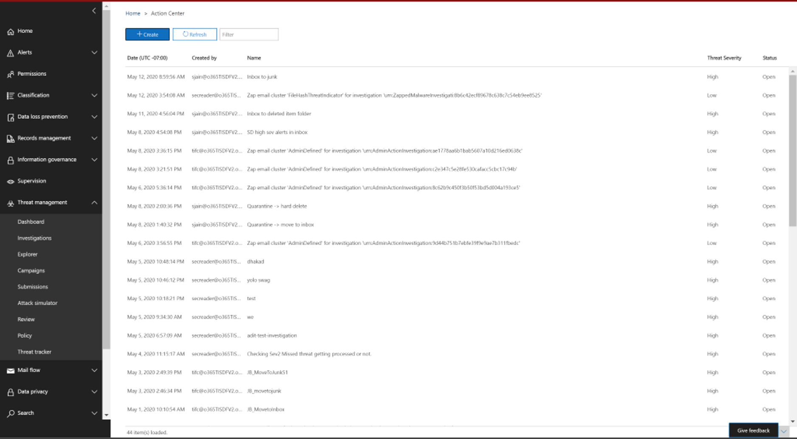

# Beheben bösartiger E-Mails, die in Office 365 zugestellt wurden

[!INCLUDE [Microsoft 365 Defender rebranding](../includes/microsoft-defender-for-office.md)]

**Gilt für**
- [Microsoft Defender für Office 365 – Plan 2](defender-for-office-365.md)

Wiederherstellung bedeutet, dass eine vorgeschriebene Maßnahme gegen eine Bedrohung ergriffen wird. Schädliche E-Mails, die an Ihre Organisation gesendet werden, können entweder vom System, durch automatische Bereinigung zur Nullstunde (ZAP) oder durch Sicherheitsteams durch Korrekturaktionen wie *verschieben in den Posteingang,* *Verschieben in Junk,* *Verschieben zu gelöschten Elementen, vorläufiges* *Löschen* oder *endgültiges Löschen* bereinigt werden. Microsoft Defender für Office 365 Plan 2/E5 ermöglicht Es Sicherheitsteams, Bedrohungen in E-Mail- und Zusammenarbeitsfunktionen durch manuelle und automatisierte Untersuchung zu beheben.

> [!NOTE]
> Um schädliche E-Mails zu beheben, benötigen Sicherheitsteams die Ihnen zugewiesene *Rolle "Suchen und Löschen".* Die Rollenzuweisung erfolgt über [Berechtigungen im Microsoft 365 Defender Portal.](permissions-microsoft-365-security-center.md)

## Was Sie wissen müssen, bevor Sie beginnen

Administratoren können erforderliche Maßnahmen für E-Mails ergreifen, aber um diese Aktionen genehmigt zu erhalten, müssen sie die *Rolle "Suchen und Löschen"* in der **E-Mail-&** Berechtigungen für die Zusammenarbeit im Microsoft 365 Defender-Portal zugewiesen haben. Ohne die Rolle *"Suchen und Löschen"* zu einer der Rollengruppen hinzugefügt, können sie die Aktion nicht ausführen.

## Manuelle und automatisierte Wartung

*Die manuelle Suche* erfolgt, wenn Sicherheitsteams Bedrohungen manuell mithilfe der Such- und Filterfunktionen im Explorer erkennen. Die manuelle E-Mail-Korrektur kann über jede E-Mail-Ansicht *(Schadsoftware,* *Phishing* oder *alle E-Mails)* ausgelöst werden, nachdem Sie eine Reihe von E-Mails identifiziert haben, die korrigiert werden müssen.

> [!div class="mx-imgBorder"]
> 

Sicherheitsteams können Den Explorer verwenden, um E-Mails auf verschiedene Arten auszuwählen:

- Wählen Sie E-Mails von Hand aus: Verwenden Sie Filter in verschiedenen Ansichten. Wählen Sie bis zu 100 E-Mails aus, die Sie korrigieren möchten.

- Abfrageauswahl: Wählen Sie eine vollständige Abfrage aus, indem Sie die Schaltfläche **"Alle auswählen"** oben verwenden. Dieselbe Abfrage wird auch in den Details der E-Mail-Übermittlung im Info-Center angezeigt.

- Abfrageauswahl mit Ausschluss: Manchmal möchten Sicherheitsteams möglicherweise E-Mails korrigieren, indem sie eine gesamte Abfrage auswählen und bestimmte E-Mails manuell aus der Abfrage ausschließen. Dazu kann ein Administrator das Kontrollkästchen **"Alle auswählen"** verwenden und nach unten scrollen, um E-Mails manuell auszuschließen. Die Abfrage kann maximal 1.000 E-Mails enthalten. Die maximale Anzahl von Ausschlüssen beträgt 100.

Sobald E-Mails über Explorer ausgewählt wurden, können Sie mit der Behebung beginnen, indem Sie direkte Maßnahmen ergreifen oder E-Mails für eine Aktion in die Warteschlange stellen:

- Direkte Genehmigung: Wenn Aktionen wie *"Posteingang verschieben",* *"Zu Junk" wechseln,* *zu gelöschten Elementen wechseln,* *"Vorläufiges Löschen"* oder *"Endgültig löschen"* von Sicherheitsmitarbeitern ausgewählt werden, die über entsprechende Berechtigungen verfügen, und die nächsten Schritte bei der Wartung befolgt werden, beginnt der Korrekturprozess mit der Ausführung der ausgewählten Aktion. Ein temporäres Flyout zeigt die wartung in Bearbeitung an.

- Genehmigung in zwei Schritten: Administratoren, die nicht über die entsprechenden Berechtigungen verfügen oder auf die Ausführung der Aktion warten müssen, können eine Aktion "Zur Korrektur hinzufügen" ausführen. In diesem Fall werden die gezielten E-Mails einem Wartungscontainer hinzugefügt. Bevor die Korrektur ausgeführt wird, ist eine Genehmigung erforderlich.

**Automatisierte Untersuchungs- und Reaktionsaktionen** werden durch Warnungen oder sicherheitsbezogene Teams im Explorer ausgelöst. Dazu können empfohlene Korrekturmaßnahmen gehören, die von einem Sicherheitsteam genehmigt werden müssen. Diese Aktionen sind in der automatischen Untersuchung auf der Registerkarte **"Aktion"** enthalten.

> [!div class="mx-imgBorder"]
> 

Alle Korrekturmaßnahmen (entweder direkte Genehmigung oder Genehmigung in zwei Schritten), die im Explorer erstellt wurden, sowie genehmigte Aktionen, die aus automatisierten Untersuchungen stammen, werden im Info-Center angezeigt. Greifen Sie über den  linken Navigationsbereich im \> **Info-Center "Überprüfen" darauf** zu.

> [!div class="mx-imgBorder"]
> 

Das Info-Center zeigt alle Abhilfemaßnahmen für die letzten 30 Tage an. Aktionen, die über den Explorer ausgeführt werden, werden anhand des Namens aufgelistet, den das Sicherheitsteam beim Erstellen der Korrektur bereitgestellt hat. Aktionen, die durch automatisierte Untersuchungen durchgeführt werden, weisen Titel auf, die mit der zugehörigen Warnung beginnen, die die Untersuchung ausgelöst hat, z. B. "Zap-E-Mail-Cluster... ."

Öffnen Sie alle Korrekturelemente, um Details dazu anzuzeigen, einschließlich Name, Erstellungsdatum, Beschreibung, Schweregrad und Status der Bedrohung. Außerdem werden die folgenden beiden Registerkarten angezeigt.

- Registerkarte **"E-Mail-Übermittlung":** Zeigt die Anzahl der E-Mails an, die über den Bedrohungs-Explorer oder automatisierte Untersuchungen übermittelt wurden, die behoben werden sollen. Diese E-Mails können aktionen erfordern oder nicht umsetzbar sein.

  > [!div class="mx-imgBorder"]
  > 

  - **Aktionen erfordernd:** E-Mails an den folgenden Speicherorten des Cloudpostfachs können bearbeitet und verschoben werden:
    - Posteingang
    - Junk-E-Mail
    - Ordner gelöscht
    - Vorläufig gelöschter Ordner

      > [!NOTE]
      > Derzeit kann nur ein Benutzer mit Zugriff auf das Postfach Elemente aus einem vorläufig gelöschten Ordner wiederherstellen.

  - **Nicht umsetzbar:** E-Mails an den folgenden Speicherorten können nicht bearbeitet oder in Korrekturaktionen verschoben werden:
    - Quarantäne
    - Endgültig gelöschter Ordner
    - Lokal/extern
    - Fehlgeschlagen/verworfen

  Verdächtige Nachrichten werden entweder als bereinigt oder nicht behebbar kategorisiert. In den meisten Fällen entsprechen bereinigte und nicht behebbare Nachrichten der Gesamtzahl der übermittelten Nachrichten. In seltenen Fällen ist dies jedoch möglicherweise nicht der Fall. Dies kann aufgrund von Systemverzögerungen, Timeouts oder abgelaufenen Nachrichten geschehen. Nachrichten laufen basierend auf dem Explorer-Aufbewahrungszeitraum für Ihre Organisation ab.

  Es sei denn, Sie korrigieren alte Nachrichten nach dem Explorer-Aufbewahrungszeitraum Ihrer Organisation, es ist ratsam, die Korrektur von Elementen zu wiederholen, wenn Nummerninkonsistenzen angezeigt werden. Bei Systemverzögerungen werden Wartungsupdates in der Regel innerhalb weniger Stunden aktualisiert.

  Wenn der Aufbewahrungszeitraum Ihrer Organisation für E-Mails im Explorer 30 Tage beträgt und Sie E-Mails innerhalb von 29 bis 30 Tagen korrigieren, werden die Anzahl der E-Mail-Übermittlungen möglicherweise nicht immer addiert. Möglicherweise haben die E-Mails bereits begonnen, den Aufbewahrungszeitraum zu abgelaufen zu sein.

  Wenn Korrekturen für eine Weile im Status "In Bearbeitung" hängen bleiben, ist dies wahrscheinlich auf Systemverzögerungen zurückzuführen. Es kann bis zu ein paar Stunden dauern, bis die Korrektur erfolgt ist. Möglicherweise werden Abweichungen bei der Anzahl der E-Mail-Übermittlungen angezeigt, da einige der E-Mails möglicherweise zu Beginn der Korrektur aufgrund von Systemverzögerungen nicht in die Abfrage einbezogen wurden. Es empfiehlt sich, die Korrektur in solchen Fällen zu wiederholen.

  > [!NOTE]
  > Um optimale Ergebnisse zu erzielen, sollte die Korrektur in Batches von 50.000 oder weniger erfolgen.

  Nur bereinigte E-Mails werden während der Wartung bearbeitet. Nicht behebbare E-Mails können vom Office 365 E-Mail-System nicht behoben werden, da sie nicht in Cloudpostfächern gespeichert sind.

  Administratoren können bei Bedarf Maßnahmen für E-Mails ergreifen, die sich in Quarantäne befinden, aber diese E-Mails laufen nicht mehr unter Quarantäne, wenn sie nicht manuell gelöscht werden. E-Mails, die aufgrund bösartiger Inhalte isoliert wurden, sind für Benutzer nicht zugänglich, daher müssen Sicherheitsmitarbeiter keine Maßnahmen ergreifen, um Bedrohungen in Quarantäne zu beseitigen. Wenn die E-Mails lokal oder extern sind, kann der Benutzer kontaktiert werden, um die verdächtige E-Mail zu adressieren. Oder die Administratoren können separate E-Mail-Server-/Sicherheitstools zum Entfernen verwenden. Diese E-Mails können identifiziert werden, indem der *Übermittlungsort = der lokale* externe Filter im Explorer angewendet wird. Für fehlgeschlagene oder verworfene E-Mails oder E-Mails, auf die Benutzer nicht zugegriffen werden können, gibt es keine E-Mails, die abgemildert werden müssen, da diese E-Mails das Postfach nicht erreichen.

  Die folgende Abbildung zeigt, wie eine Übermittlung im Info-Center aussieht. Eine Korrektur kann mehrere Übermittlungen enthalten. Wenn mehrere Aktionen durch eine automatisierte Untersuchung genehmigt werden, wird jede E-Mail- oder E-Mail-Clusteraktion in derselben Korrektur wie eine andere Übermittlung angezeigt.

  > [!div class="mx-imgBorder"]
  > 

  Wählen Sie ein E-Mail-Übermittlungselement aus, um die Details dieser Problembehebung anzuzeigen, z. B. die Abfrage (wenn die Korrektur durch automatisierte Untersuchungen oder explorer durch Auswahl einer Abfrage ausgelöst wird) und die Anfangs- und Endzeiten der Korrektur. Außerdem wird eine Liste der Nachrichten angezeigt, die zur Behebung übermittelt wurden. Wenn Nachrichten aus dem Explorer-Aufbewahrungszeitraum verschoben werden, werden die Nachrichten aus dieser Liste ausgeblendet. Die Liste enthält auch einzelne Nachrichten, die behoben werden können.

- **Aktionsprotokolle:** Auf dieser Registerkarte werden die bereinigten Nachrichten angezeigt, einschließlich des Genehmigten Datums, des Administrators, der die Aktion genehmigt hat, der Aktion, des Status und der Anzahl.

  Der Status kann folgendermaßen sein:

  - **Gestartet:** Die Problembehebung wird ausgelöst.
    - **In die Warteschlange eingereiht:** Die Korrektur wird zur Minderung von E-Mails in die Warteschlange eingereiht.
    - **In Bearbeitung:** Der Ausgleich wird ausgeführt.
    - **Abgeschlossen:** Abhilfemaßnahmen für alle bereinigten E-Mails wurden entweder erfolgreich oder mit einigen Fehlern abgeschlossen.
    - **Fehlgeschlagen:** Es wurden keine Korrekturen erfolgreich ausgeführt.

  Da nur bereinigte E-Mails bearbeitet werden können, wird die Bereinigung jeder E-Mail als erfolgreich oder fehlgeschlagen angezeigt. Aus den gesamten bereinigten E-Mails werden erfolgreiche und fehlgeschlagene Gegenmaßnahmen gemeldet.

  - **Erfolg:** Die gewünschte Aktion für bereinigte E-Mails wurde ausgeführt. Beispiel: Ein Administrator möchte E-Mails aus Postfächern entfernen, sodass der Administrator die Aktion des vorläufigen Löschens von E-Mails ausführt. Wenn eine bereinigte E-Mail im ursprünglichen Ordner nicht gefunden wird, nachdem die Aktion ausgeführt wurde, wird der Status als erfolgreich angezeigt.

  - **Fehler:** Die gewünschte Aktion bei bereinigten E-Mails ist fehlgeschlagen. Beispiel: Ein Administrator möchte E-Mails aus Postfächern entfernen, sodass der Administrator die Aktion des vorläufigen Löschens von E-Mails ausführt. Wenn eine bereinigte E-Mail weiterhin im Postfach gefunden wird, nachdem die Aktion ausgeführt wurde, wird der Status als fehlgeschlagen angezeigt.
  
  - **Bereits im Ziel:** Die gewünschte Aktion wurde bereits für die E-Mail ausgeführt, ODER die E-Mail war bereits am Zielspeicherort vorhanden. Beispiel: Eine E-Mail wurde vom Administrator über Explorer am ersten Tag vorläufig gelöscht. Dann werden ähnliche E-Mails an Tag 2 angezeigt, die wiederum vorläufig vom Administrator gelöscht werden. Während der Auswahl dieser E-Mails wird der Administrator einige E-Mails vom ersten Tag auswählen, die bereits vorläufig gelöscht wurden. Jetzt werden diese E-Mails nicht erneut behandelt, sie werden nur als "bereits im Ziel" angezeigt, da keine Aktion für sie ausgeführt wurde, wie sie am Zielspeicherort vorhanden waren.

  Wählen Sie ein beliebiges Element im Aktionsprotokoll aus, um Korrekturdetails anzuzeigen. Wenn die Details "erfolgreich" oder "im Postfach nicht gefunden" sagen, wurde dieses Element bereits aus dem Postfach entfernt. Manchmal tritt während der Wartung ein fehlerbehebungsfehler auf. In diesen Fällen empfiehlt es sich, die Korrektur erneut zu versuchen.

  Wenn Sie große Batches beheben, können Sie auch die Nachrichten exportieren, die zur Behebung über die E-Mail-Übermittlung gesendet werden, und Nachrichten, die über Aktionsprotokolle behoben wurden. Das Exportlimit wird auf 100.000 Datensätze erhöht.

Das Sicherheitsteam kann bis zu 50 gleichzeitige manuelle Korrekturen durchführen. Für automatisierte Untersuchungs- und Reaktionsaktionen ist jedoch kein Grenzwert festgelegt.

  Die Problembehebung ist ein leistungsstarkes Tool, um Bedrohungen zu mindern und verdächtige E-Mails zu beheben. Dies trägt dazu bei, die Sicherheit einer Organisation zu gewährleisten.
