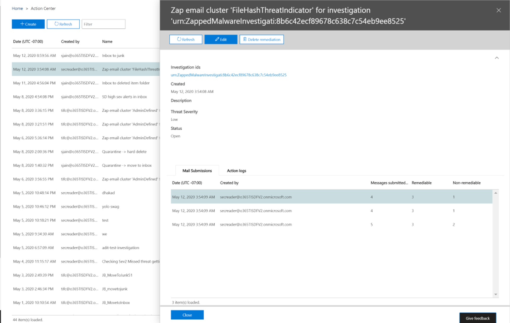

# Beheben von in Office 365 zugestellten böswilligen e-Mails

[!INCLUDE [Microsoft 365 Defender rebranding](../includes/microsoft-defender-for-office.md)]

Die Wiederherstellung bedeutet, dass eine vorgeschriebene Aktion gegen eine Bedrohung erfolgt. Böswillige e-Mails, die an Ihre Organisation gesendet werden, können durch das System, durch eine automatische Bereinigung (Zero-Hour Auto-Purge) oder durch Sicherheitsteams durch Korrekturaktionen wie *Verschieben in den Posteingang* , verschieben in *Junk* , *verschieben zu gelöschten Elementen* , *Soft Delete* oder *Hard Delete* bereinigt werden. Mit Office Advanced Threat Protection (Office ATP) P2/E5 können Sicherheitsteams Bedrohungen in e-Mail-und Collaboration-Funktionen durch manuelle und automatisierte Untersuchung beheben.

> [!NOTE]
> Um böswillige e-Mails zu beheben, benötigen Sicherheitsteams die *Such-und Säuberungs* Rolle, die Ihnen zugewiesen ist. Die Rollenzuweisung erfolgt über Berechtigungen im Security and Compliance Center.

## Was Sie wissen müssen, bevor Sie beginnen

Um beispielsweise Nachrichtenkopfzeilen anzeigen oder e-Mail-Inhalte herunterladen zu können, muss eine neue Rolle mit dem Namen *Preview* zu einer anderen entsprechenden Rollengruppe hinzugefügt werden. In der folgenden Tabelle sind die erforderlichen Rollen und Berechtigungen aufgeführt.

****

|Aktivität|Rollengruppe|*Vorschau* -Rolle erforderlich?|
|---|---|---|
|Verwenden von Threat Explorer (und Echtzeiterkennung) zum Analysieren von Bedrohungen |Globaler Administrator   Sicherheitsadministrator   Sicherheitsleseberechtigter|Nein|
|Verwenden von Threat Explorer (und Echtzeiterkennung) zum Anzeigen von Kopfzeilen für e-Mail-Nachrichten und zum Herunterladen von isolierten e-Mail-Nachrichten in der Vorschau|Globaler Administrator   Sicherheitsadministrator  Sicherheitsleseberechtigter|Nein|
|Verwenden von Threat Explorer zum Anzeigen von Kopfzeilen und Herunterladen von an Postfächern zugestellten e-Mails|Globaler Administrator  Sicherheitsadministrator   Sicherheitsleseberechtigter   Vorschau|Ja|

> [!NOTE]
> Vorschau ist eine *Rolle* , keine *Rollengruppe* . Die Vorschau Rolle muss einer vorhandenen Rollengruppe für Office 365 hinzugefügt werden. Die *globale Administrator Rolle* wird im [Microsoft 365 Admin Center](https://admin.microsoft.com)zugewiesen. Die Rollen "Sicherheits Administrator" und "Sicherheits Leser" werden in den [Sicherheits-und Compliance Centern](https://protection.office.com)zugewiesen. Weitere Informationen zu Rollen und Berechtigungen finden Sie unter [Permissions in the Security and Compliance Centers](permissions-in-the-security-and-compliance-center.md).

> [!NOTE]
> Administratoren können erforderliche Aktionen für e-Mails durchführen, aber um diese Aktionen genehmigt zu erhalten, muss Ihnen die *Such-und Säuberungs* Rolle über die Berechtigungen des **Security and Compliance Center** zugewiesen sein  >  **Permissions** .

## Manuelle und automatische Korrektur

*Manuelle* Suche erfolgt, wenn Sicherheitsteams Bedrohungen manuell mithilfe der Such-und Filterfunktionen in Threat Explorer identifizieren. Manuelle e-Mail-Korrektur kann durch jede e-Mail-Ansicht ( *Schadsoftware* , *Phishing* oder *alle e-Mail* -Nachrichten) ausgelöst werden, nachdem Sie eine Gruppe von e-Mails identifiziert haben, die behoben werden müssen.

Sicherheitsteams können mit dem Threat-Explorer auf verschiedene Weise e-Mails auswählen:

- E-Mails per Hand auswählen: Verwenden Sie Filter in verschiedenen Ansichten. Wählen Sie bis zu 100 e-Mails aus, die Sie korrigieren möchten.

- Abfrageauswahl: Wählen Sie eine gesamte Abfrage aus, indem Sie die obere Schaltfläche " **Alle auswählen** " verwenden. Dieselbe Abfrage wird auch in den Details zur Mailübermittlung von Action Center angezeigt.

- Abfrageauswahl mit Ausschluss: Manchmal möchten Sicherheitsteams e-Mail-Nachrichten beheben, indem Sie eine gesamte Abfrage auswählen und bestimmte e-Mails manuell aus der Abfrage ausschließen. Dazu kann ein Administrator das Kontrollkästchen **Alle auswählen** verwenden und nach unten scrollen, um e-Mails manuell auszuschließen. Die Abfrage kann maximal 1.000 e-Mails enthalten. Die maximale Anzahl von Ausschlüssen ist 100.

Sobald e-Mails über den Threat Explorer ausgewählt wurden, können Sie die Wiederherstellung starten, indem Sie eine direkte Aktion durchführen oder e-Mails für eine Aktion anschlangen:

- Direkte Genehmigung: Wenn Aktionen wie *Verschieben in den Posteingang* , in *Junk* verschieben, *zu gelöschten Elementen* verschieben, *Soft Delete* oder *Hard Delete* von Sicherheitspersonal ausgewählt werden, das über entsprechende Berechtigungen verfügt, und die nächsten korrekturschritte befolgt werden, wird mit dem Korrekturprozess begonnen, die ausgewählte Aktion auszuführen. Ein temporäres Flyout zeigt eine laufende Wiederherstellung an.

- Genehmigung in zwei Schritten: eine Aktion "zur Korrektur hinzufügen" kann von Administratoren vorgenommen werden, die nicht über die entsprechenden Berechtigungen verfügen oder die auf die Ausführung der Aktion warten müssen. In diesem Fall werden die Ziel-e-Mails einem Behebungs Container hinzugefügt. Die Genehmigung ist erforderlich, bevor die Wiederherstellung ausgeführt wird.

**Automatisierte Ermittlungs-und Antwort** Aktionen werden durch Warnungen oder durch Sicherheits Operations Teams aus dem Threat Explorer ausgelöst. Hierzu gehören möglicherweise Empfohlene Korrekturaktionen, die von einem Sicherheits Betriebsteam genehmigt werden müssen. Diese Aktionen sind auf der Registerkarte **Aktion** in der automatischen Untersuchung enthalten.

Im Action Center werden alle Korrekturen (entweder direkte Genehmigung oder Genehmigung in zwei Schritten), die im Threat Explorer erstellt wurden, sowie genehmigte Aktionen, die aus automatischen Untersuchungen stammen, angezeigt. Greifen Sie über den linken Navigationsbereich unter **Review**  >  - **Wartungs Center** auf diese zu.

Das Wartungs Center zeigt alle Korrekturaktionen für die letzten 30 Tage an. Durch Threat Explorer ausgeführte Aktionen werden nach dem Namen aufgelistet, den das Sicherheits Betriebsteam beim Erstellen der Korrektur bereitgestellt hat. Durch automatisierte Untersuchungen ausgeführte Aktionen haben Titel, die mit der zugehörigen Warnung beginnen, die die Untersuchung ausgelöst hat, beispielsweise "zap e-Mail-Cluster... ."

Öffnen Sie ein beliebiges Behebungs Element, um Details dazu anzuzeigen, einschließlich Name, Erstellungsdatum, Beschreibung, Bedrohungs Schweregrad und Status. Außerdem werden die folgenden zwei Registerkarten angezeigt.

- Registerkarte **e-Mail-Übermittlung** : zeigt die Anzahl der e-Mails an, die über den Threat Explorer oder automatisierte Untersuchungen zur Korrektur übermittelt wurden. Diese e-Mail-Nachrichten können Aktionen unterliegen.  

   - **Aktionable** : e-Mails an den folgenden Cloud-Postfachspeicher Orten können verarbeitet und verschoben werden:

     - Posteingang
     - Junk-E-Mail
     - Ordner gelöscht
     - Ordner "vorläufig gelöscht"

     > [!NOTE]
     > Derzeit kann nur ein Benutzer mit Zugriff auf das Postfach Elemente aus einem vorläufig gelöschten Ordner wiederherstellen.

   - **Keine Aktion** möglich: e-Mails an den folgenden Speicherorten können in Korrekturaktionen nicht bearbeitet oder verschoben werden:

     - Quarantäne
     - Hart gelöschter Ordner
     - Lokal/extern
     - Fehlgeschlagen/gelöscht

   Verdächtige Nachrichten werden entweder als behebbar oder nicht behebbar kategorisiert. In den meisten Fällen kombinieren behebbare und nicht behebbare Nachrichten gleich insgesamt gesendete Nachrichten. In seltenen Fällen ist dies jedoch nicht der Fall. Dies kann aufgrund von System Verzögerungen, Timeouts oder abgelaufenen Nachrichten passieren. Nachrichten laufen basierend auf dem Aufbewahrungszeitraum für Threat Explorer für Ihre Organisation ab.

   Wenn Sie alte Nachrichten nicht nach dem Aufbewahrungszeitraum für den Threat-Explorer Ihrer Organisation remediationieren, empfiehlt es sich, die Remediation von Elementen erneut zu versuchen, wenn Zahl Inkonsistenzen angezeigt werden. Bei System Verzögerungen werden Korrektur Aktualisierungen in der Regel innerhalb weniger Stunden aktualisiert.

   Wenn der Aufbewahrungszeitraum Ihrer Organisation für e-Mails im Threat-Explorer 30 Tage beträgt und Sie e-Mails wiederholen, die 29-30 Tage zurückgehen, kann die Anzahl der e-Mail-Übermittlungs Zahlen möglicherweise nicht immer addiert werden. Die e-Mails haben möglicherweise bereits begonnen, den Aufbewahrungszeitraum zu verschieben.

   Wenn die Korrekturen für eine Weile im Status "in Bearbeitung" stecken, liegt dies wahrscheinlich an System Verzögerungen. Es kann bis zu ein paar Stunden dauern, bis es behoben wurde. Möglicherweise werden Variationen bei der Anzahl der e-Mail-Übermittlungen angezeigt, da einige der e-Mails möglicherweise nicht zu Beginn der Wiederherstellung aufgrund von System Verzögerungen in die Abfrage aufgenommen wurden. Es empfiehlt sich, in diesen Fällen erneut zu remediationieren.

  >[!Note]
  >Um optimale Ergebnisse zu erzielen, sollte die Korrektur in Batches von 50.000 oder weniger erfolgen.

   Bei der Wiederherstellung werden nur behebbare e-Mails verarbeitet. Nicht behebbare e-Mails können vom Office 365-e-Mail-System nicht wiederhergestellt werden, da Sie nicht in Cloud-Postfächern gespeichert sind.

   Administratoren können bei Bedarf Aktionen für e-Mails in Quarantäne durchführen, aber diese e-Mails laufen aus der Quarantäne, wenn Sie nicht manuell gelöscht werden. E-Mails, die aufgrund schädlicher Inhalte isoliert wurden, sind von Benutzern nicht zugänglich, sodass Sicherheitsmitarbeiter keine Maßnahmen ergreifen müssen, um Bedrohungen in der Quarantäne loszuwerden. Wenn die e-Mails lokal oder extern sind, kann der Benutzer kontaktiert werden, um die Verdächtigen e-Mails zu adressieren. Oder die Administratoren können separate e-Mail-Server/Sicherheitstools zum Entfernen verwenden. Diese e-Mails können identifiziert werden, indem der externe Filter " *Delivery Location = on-Prem* " im Threat Explorer angewendet wird. Bei fehlgeschlagenen oder gelöschten e-Mails oder e-Mails, für die Benutzer nicht zugänglich sind, gibt es keine e-Mail zur Minderung, da diese Mails das Postfach nicht erreichen.

   In der folgenden Abbildung wird gezeigt, wie eine Übermittlung im Wartungs Center aussieht. Eine Korrektur kann mehrere Übermittlungen enthalten. Wenn mehrere Aktionen durch eine automatisierte Untersuchung genehmigt werden, wird jede e-Mail-oder e-Mail-Cluster Aktion in derselben Korrektur wie eine andere Übermittlung angezeigt.

   

   Wählen Sie ein e-Mail-Übermittlungs Element aus, um die Details dieser Korrektur anzuzeigen, beispielsweise die Abfrage (wenn die Korrektur durch automatische Untersuchungen oder Bedrohungs-Explorer durch Auswählen einer Abfrage ausgelöst wird) sowie die Start-und Endzeit der Korrektur. Außerdem wird eine Liste der Nachrichten angezeigt, die zur Behebung übermittelt wurden. Wenn Nachrichten aus dem Aufbewahrungszeitraum für Threat Explorer entfernt werden, verschwinden die Nachrichten aus dieser Liste. In der Liste werden auch einzelne Nachrichten angezeigt, die behoben werden können.

- **Aktionsprotokolle** : auf dieser Registerkarte werden die vermittelten Nachrichten angezeigt, einschließlich des genehmigten Datums, des Administrators, der die Aktion, die Aktion, den Status und die Anzahl genehmigt hat.

   Status kann wie folgt lauten:

     - **Gestartet** : die Korrektur wird ausgelöst.
     - In der **Warteschlange** : die Korrektur wird zur Minderung von e-Mails in die Warteschlange eingereiht.
     - **In Bearbeitung** : Minderung wird ausgeführt.
     - **Abgeschlossen** : Minderung auf alle behebbaren e-Mails, die entweder erfolgreich oder mit einigen Fehlern abgeschlossen wurden.
     - **Fehler** : Es wurden keine Korrekturen erfolgreich ausgeführt.

   Da nur behebbare e-Mails bearbeitet werden können, wird die Bereinigung jeder e-Mail als erfolgreich oder fehlgeschlagen angezeigt. Aus den insgesamt behebbaren e-Mails werden erfolgreiche und fehlgeschlagene Schadensbegrenzende Maßnahmen gemeldet.

   - **Erfolg** : die gewünschte Aktion bei behebbaren e-Mails wurde durchgeführt. Beispiel: ein Administrator möchte e-Mails aus Postfächern entfernen, sodass der Administrator die Aktion von e-Mails mit weichen Löschaktionen ausführt. Wenn im ursprünglichen Ordner keine behebbare e-Mail gefunden wird, nachdem die Aktion ausgeführt wurde, wird der Status als erfolgreich angezeigt.

   - **Fehler** : die gewünschte Aktion bei behebbaren e-Mails ist fehlgeschlagen. Beispiel: ein Administrator möchte e-Mails aus Postfächern entfernen, sodass der Administrator die Aktion von e-Mails mit weichen Löschaktionen ausführt. Wenn nach dem Ausführen der Aktion noch eine behebbare e-Mail im Postfach gefunden wird, wird der Status als Fehler angezeigt.

   Wählen Sie im Aktionsprotokoll ein beliebiges Element aus, um Korrektur Details anzuzeigen. Wenn die Details "erfolgreich" oder "nicht im Postfach gefunden" sagen, wurde das Element bereits aus dem Postfach entfernt. Bei der Wiederherstellung ist manchmal ein systemischer Fehler aufgetreten. In diesen Fällen empfiehlt es sich, die Wiederherstellung erneut zu versuchen.

 Die Wiederherstellung ist ein leistungsfähiges Tool zum Abwehren von Bedrohungen und zum Adressieren verdächtiger e-Mails. Es hilft, eine Organisation sicher zu halten.

