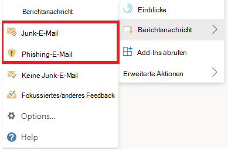
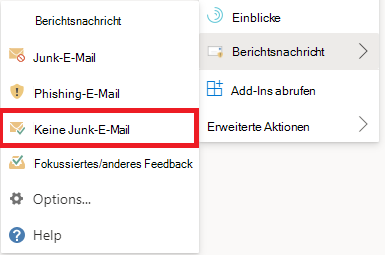

# Melden falsch positiver und falsch negativer Ergebnisse in OutlookReport false positives and false negatives in Outlook

[!INCLUDE [Microsoft 365 Defender rebranding](../includes/microsoft-defender-for-office.md)]

**Gilt für****Applies to**
- [Exchange Online ProtectionExchange Online Protection](exchange-online-protection-overview.md)
- [Microsoft Defender für Office 365 Plan 1 und Plan 2Microsoft Defender for Office 365 plan 1 and plan 2](defender-for-office-365.md)
- [Microsoft 365 DefenderMicrosoft 365 Defender](../defender/microsoft-365-defender.md)

> [!NOTE]
> Wenn Sie ein Administrator in einer Microsoft 365 mit Exchange Online Postfächern sind, wird empfohlen, das Übermittlungsportal im Security & Compliance Center zu verwenden.If you're an admin in a Microsoft 365 organization with Exchange Online mailboxes, we recommend that you use the Submissions portal in the Security & Compliance Center. Weitere Informationen finden Sie unter [Use Admin Submission to submit suspected spam, phish, URLs, and files to Microsoft](admin-submission.md).For more information, see [Use Admin Submission to submit suspected spam, phish, URLs, and files to Microsoft](admin-submission.md).

In Microsoft 365 Organisationen mit Postfächern in Exchange Online oder lokalen Postfächern mit moderner Hybridauthentifizierung können Sie falsch positive Ergebnisse (gute E-Mails, die blockiert oder an Junkordner gesendet wurden) und falsch negative (unerwünschte E-Mails oder Phishing, die an den Posteingang übermittelt wurden) an Exchange Online Protection (EOP) übermitteln.In Microsoft 365 organizations with mailboxes in Exchange Online or on-premises mailboxes using hybrid modern authentication, you can submit false positives (good email that was blocked or sent to junk folder) and false negatives (unwanted email or phish that was delivered to the inbox) to Exchange Online Protection (EOP).

## Was sollten Sie wissen, bevor Sie beginnen?What do you need to know before you begin?

- Verwenden Sie das Add-In Nachricht melden oder das Phishing-Add-In melden, um eine optimale Benutzerübermittlung zu ermöglichen.For the best user submission experience, use the Report Message add-in or the Report Phishing add-in.

- Beachten Sie, dass dieses Add-In für Outlook Plattformen funktioniert – im Web, iOS, Android und Desktop.Note that this add-in works for Outlook in all platforms—on the web, iOS, Android, and Desktop.

- Wenn Sie ein Administrator in einer Organisation mit Exchange Online sind, verwenden Sie das Übermittlungsportal im Security & Compliance Center.If you're an admin in an organization with Exchange Online mailboxes, use the Submissions portal in the Security & Compliance Center. Weitere Informationen finden Sie unter [Use Admin Submission to submit suspected spam, phish, URLs, and files to Microsoft](admin-submission.md).For more information, see [Use Admin Submission to submit suspected spam, phish, URLs, and files to Microsoft](admin-submission.md).

- Sie können konfigurieren, dass Nachrichten direkt an Microsoft, ein von Ihnen festgelegtes Postfach oder beides gesendet werden.You can configure to send messages directly to Microsoft, a mailbox you specify, or both. Weitere Informationen finden Sie unter [Benutzerübermittlungsrichtlinien](user-submission.md).For more information, see [User submissions policies](user-submission.md).

- Weitere Informationen zum Erhalten und Aktivieren der Berichtsnachricht oder der Phishing-Add-Ins melden finden Sie unter [Enable the Report Message or the Report Phishing add-ins](enable-the-report-message-add-in.md).For more information on how to get and enable the Report Message or the Report Phishing add-ins, see [Enable the Report Message or the Report Phishing add-ins](enable-the-report-message-add-in.md).

- Weitere Informationen zum Melden von Nachrichten an Microsoft finden Sie unter [Melden von Nachrichten und Dateien an Microsoft](report-junk-email-messages-to-microsoft.md).For more information about reporting messages to Microsoft, see [Report messages and files to Microsoft](report-junk-email-messages-to-microsoft.md).

## Verwenden des BerichtsnachrichtenfeaturesUse the Report Message feature

### Melden von Junk- und PhishingnachrichtenReport junk and phishing messages

Verwenden Sie für Nachrichten im Posteingang oder in einem anderen E-Mail-Ordner mit Ausnahme von Junk-E-Mails die folgende Methode, um Spam- und Phishingnachrichten zu melden:For messages in the Inbox or any other email folder except Junk Email, use the following method to report spam and phishing messages:

1. Klicken Sie **in der** oberen rechten Ecke der ausgewählten  Nachricht auf die Ellipsen Weitere Aktionen, klicken Sie im Dropdownmenü auf Nachricht melden, und wählen Sie **dann Junk** oder **Phishing aus.**Click the **More actions** ellipses on the top-right corner of the selected message, click **Report message** from the dropdown menu, and then select **Junk** or **Phishing**.
  
   > [!div class="mx-imgBorder"]
   > 

   > [!div class="mx-imgBorder"]
   > 

2. Die ausgewählten Nachrichten werden zur Analyse an Microsoft gesendet und:The selected messages will be sent to Microsoft for analysis and:

   - In den Junk-E-Mail-Ordner verschoben, wenn er als Spam gemeldet wurde.Moved to the Junk Email folder if it was reported as spam.

   - Gelöscht, wenn es als Phishing gemeldet wurde.Deleted if it was reported as phishing.
   
### Melden von Nachrichten, die kein Junk sindReport messages that are not junk

1. Klicken Sie **in der** oberen rechten Ecke der ausgewählten  Nachricht auf die Ellipsen Weitere Aktionen, klicken Sie im Dropdownmenü auf Nachricht melden, und klicken Sie dann auf **Nicht Junk**.Click the **More actions** ellipses on the top-right corner of the selected message, click **Report message** from the dropdown menu, and then click **Not Junk**.  

   > [!div class="mx-imgBorder"]
   > 

   > [!div class="mx-imgBorder"]
   > 

2. Die ausgewählte Nachricht wird zur Analyse an Microsoft gesendet und in den Posteingang oder einen anderen angegebenen Ordner verschoben.The selected message will be sent to Microsoft for analysis and moved to Inbox or any other specified folder.

## Anzeigen und Überprüfen von gemeldeten NachrichtenView and review reported messages

Zum Überprüfen von Nachrichten, die Benutzer an Microsoft melden, haben Sie die folgenden Optionen:To review messages that users report to Microsoft, you have these options:

- Verwenden Sie das Administrator-Übermittlungsportal.Use the Admin Submissions portal. Weitere Informationen finden Sie unter [Anzeigen von Benutzerübermittlungen an Microsoft](admin-submission.md#view-user-submissions-to-microsoft).For more information, see [View user submissions to Microsoft](admin-submission.md#view-user-submissions-to-microsoft).

- Erstellen Sie eine Nachrichtenflussregel (auch als Transportregel bezeichnet), um Kopien von gemeldeten Nachrichten zu senden.Create a mail flow rule (also known as a transport rule) to send copies of reported messages. Anweisungen finden Sie unter [Verwenden von Nachrichtenflussregeln, um zu sehen, was Ihre Benutzer an Microsoft melden.](use-mail-flow-rules-to-see-what-your-users-are-reporting-to-microsoft.md)For instructions, see [Use mail flow rules to see what your users are reporting to Microsoft](use-mail-flow-rules-to-see-what-your-users-are-reporting-to-microsoft.md).