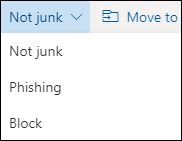
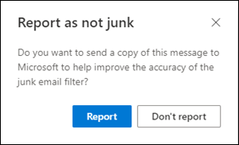

# <a name="report-junk-and-phishing-email-in-outlook-on-the-web-in-exchange-online"></a>Melden von Junk- und Phishing-E-Mails in Outlook im Web in Exchange Online

[!INCLUDE [Microsoft 365 Defender rebranding](../includes/microsoft-defender-for-office.md)]

**Gilt für**
- [Exchange Online Protection](exchange-online-protection-overview.md)
- [Microsoft Defender für Office 365 Plan 1 und Plan 2](office-365-atp.md)
- [Microsoft 365 Defender](../mtp/microsoft-threat-protection.md)

In Microsoft 365-Organisationen mit Postfächern in Exchange Online können Sie die integrierten Berichtsoptionen in Outlook im Web (früher als Outlook Web App bezeichnet) verwenden, um falsch positive Ergebnisse (gute E-Mails als Spam gekennzeichnet), falsch negative Ergebnisse (ungültige E-Mails sind zulässig) und Phishingnachrichten an Exchange Online Protection (EOP) zu übermitteln.

## <a name="what-do-you-need-to-know-before-you-begin"></a>Was sollten Sie wissen, bevor Sie beginnen?

- Wenn Sie ein Administrator in einer Organisation mit Exchange Online-Postfächern sind, empfehlen wir die Verwendung des Übermittlungsportals im Security & Compliance Center. Weitere Informationen finden Sie unter "Use Admin Submission", um verdächtige [Spam-, Phishing-, URLs-](admin-submission.md)und Dateien an Microsoft zu übermitteln.

- Administratoren können die Möglichkeit für Benutzer, Nachrichten an Microsoft in Outlook im Web zu melden, deaktivieren oder aktivieren. Weitere Informationen finden Sie im Abschnitt "Deaktivieren oder [Aktivieren der Junk-E-Mail-Berichterstellung in Outlook im Web"](#disable-or-enable-junk-email-reporting-in-outlook-on-the-web) weiter später in diesem Artikel.

- Sie können gemeldete Nachrichten so konfigurieren, dass sie kopiert oder an ein von Ihnen festgelegtes Postfach umgeleitet werden. Weitere Informationen finden Sie unter [Richtlinien für Benutzerübermittlungen.](user-submission.md)

- Weitere Informationen zum Melden von Nachrichten an Microsoft finden Sie unter ["Melden von Nachrichten und Dateien an Microsoft".](report-junk-email-messages-to-microsoft.md)

## <a name="report-spam-and-phishing-messages-in-outlook-on-the-web"></a>Melden von Spam- und Phishingnachrichten in Outlook im Web

1. Verwenden Sie für Nachrichten im Posteingang oder einem anderen E-Mail-Ordner mit Ausnahme von Junk-E-Mails eine der folgenden Methoden, um Spam- und Phishingnachrichten zu melden:

   - Wählen Sie die Nachricht aus, klicken **Sie auf der** Symbolleiste auf "Junk", und wählen Sie dann **"Junk"** oder **"Phishing" aus.**

     

   - Wählen Sie eine oder mehrere Nachrichten aus, klicken Sie mit der rechten Maustaste, und wählen Sie **dann "Als Junk markieren" aus.**

2. Klicken Sie im angezeigten Dialogfeld auf **Bericht**. Wenn Sie Ihre Meinung ändern, klicken Sie auf **"Nicht melden".**

   |Junk-E-Mail|Phishing-E-Mail|
   |:---:|:---:|
   |||

3. Die ausgewählten Nachrichten werden zur Analyse an Microsoft gesendet. Wenn Sie überprüfen möchten, ob die Nachrichten gesendet wurden, öffnen Sie den Ordner **Gesendete Objekte**, in dem die gesendeten Nachrichten angezeigt werden sollten.

## <a name="report-non-spam-and-phishing-messages-from-the-junk-email-folder-in-outlook-on-the-web"></a>Melden von Nichtspam- und Phishingnachrichten aus dem Junk-E-Mail-Ordner in Outlook im Web

1. Verwenden Sie im Junk-E-Mail-Ordner eine der folgenden Methoden, um falsch positive Spam- oder Phishingnachrichten zu melden:

   - Wählen Sie die Nachricht aus, klicken Sie auf der Symbolleiste auf "Kein **Junk",** und wählen Sie dann **"Kein Junk"** oder **"Phishing" aus.**

     

   - Wählen Sie eine oder mehrere Nachrichten aus, klicken Sie mit der rechten Maustaste, und wählen Sie dann "Als Junk **markieren" aus.**

2. Lesen Sie im angezeigten Dialogfeld die Informationen, und klicken Sie auf **"Bericht".** Wenn Sie Ihre Meinung ändern, klicken Sie auf **"Nicht melden"**.

   |Keine Junk-E-Mail|Phishing|
   |:---:|:---:|
   |||

3. Die ausgewählten Nachrichten werden zur Analyse an Microsoft gesendet. Wenn Sie überprüfen möchten, ob die Nachrichten gesendet wurden, öffnen Sie den Ordner **Gesendete Objekte**, in dem die gesendeten Nachrichten angezeigt werden sollten.

## <a name="disable-or-enable-junk-email-reporting-in-outlook-on-the-web"></a>Deaktivieren oder Aktivieren der Junk-E-Mail-Berichterstellung in Outlook im Web

Standardmäßig können Benutzer Falsch positive Spamnachrichten, falsch negative Ergebnisse und Phishingnachrichten zur Analyse in Outlook im Web an Microsoft melden. Administratoren können Outlook im Web-Postfachrichtlinien in Exchange Online PowerShell konfigurieren, um zu verhindern, dass Benutzer falsch positive Spam- und Spam-E-Mails an Microsoft melden. Sie können die Möglichkeit für Benutzer, Phishingnachrichten an Microsoft zu melden, nicht deaktivieren.

### <a name="what-do-you-need-to-know-before-you-begin"></a>Was sollten Sie wissen, bevor Sie beginnen?

- Wie Sie eine Verbindung mit Exchange Online PowerShell herstellen, finden Sie unter [Herstellen einer Verbindung mit Exchange Online PowerShell](https://docs.microsoft.com/powershell/exchange/connect-to-exchange-online-powershell).

- Bevor Sie die Verfahren in diesem Artikel tun können, müssen Ihnen in Exchange Online die entsprechenden Berechtigungen zugewiesen werden. Insbesondere benötigen Sie die Rollen **"Empfängerrichtlinien"** oder **"E-Mail-Empfänger",** die standardmäßig den Rollengruppen "Organisationsverwaltung" und "Empfängerverwaltung" zugewiesen sind.   Weitere Informationen zu Rollengruppen in Exchange Online finden Sie unter Berechtigungen [in Exchange Online](https://docs.microsoft.com/exchange/permissions-exo/permissions-exo) und Ändern von [Rollengruppen in Exchange Online.](https://docs.microsoft.com/Exchange/permissions-exo/role-groups#modify-role-groups)

- Jede Organisation verfügt über eine Standardrichtlinie mit dem Namen "OwaMailboxPolicy-Default", aber Sie können benutzerdefinierte Richtlinien erstellen. Benutzerdefinierte Richtlinien werden vor der Standardrichtlinie auf benutzerbereichsspezifische Benutzer angewendet. Weitere Informationen zu Outlook im Web-Postfachrichtlinien finden Sie unter [Outlook im Web-Postfachrichtlinien in Exchange Online.](https://docs.microsoft.com/Exchange/clients-and-mobile-in-exchange-online/outlook-on-the-web/outlook-web-app-mailbox-policies)

- Durch das Deaktivieren der Junk-E-Mail-Berichterstellung wird die Möglichkeit, eine Nachricht in Outlook im Web als Junk oder nicht als Junk zu kennzeichnen, nicht entfernt. Wenn Sie eine Nachricht im Junk-E-Mail-Ordner auswählen und auf "Nicht  \> **Junk-E-Mail"** klicken, wird die Nachricht wieder in den Posteingang verschoben. Wenn Sie eine Nachricht in einem  anderen E-Mail-Ordner auswählen und auf Junk-Junk-E-Mail klicken, wird die Nachricht weiterhin \>  in den Junk-E-Mail-Ordner verschoben. Nicht mehr verfügbar ist die Option, die Nachricht an Microsoft zu melden.

### <a name="use-exchange-online-powershell-to-disable-or-enable-junk-email-reporting-in-outlook-on-the-web"></a>Verwenden von Exchange Online PowerShell zum Deaktivieren oder Aktivieren der Junk-E-Mail-Berichterstellung in Outlook im Web

1. Führen Sie den folgenden Befehl aus, um ihre vorhandenen Outlook im Web-Postfachrichtlinien und den Status der Junk-E-Mail-Berichterstellung zu finden:

   ```powershell
   Get-OwaMailboxPolicy | Format-Table Name,ReportJunkEmailEnabled
   ```

2. Verwenden Sie die folgende Syntax, um die Junk-E-Mail-Berichterstellung in Outlook im Web zu deaktivieren oder zu aktivieren:

   ```powershell
   Set-OwaMailboxPolicy -Identity "<OWAMailboxPolicyName>" -ReportJunkEmailEnabled <$true | $false>
   ```

   In diesem Beispiel wird die Junk-E-Mail-Berichterstellung in der Standardrichtlinie deaktiviert.

   ```powershell
   Set-OwaMailboxPolicy -Identity "OwaMailboxPolicy-Default" -ReportJunkEmailEnabled $false
   ```

   In diesem Beispiel wird die Junk-E-Mail-Berichterstellung in der benutzerdefinierten Richtlinie "Contoso Managers" aktiviert.

   ```powershell
   Set-OwaMailboxPolicy -Identity "Contoso Managers" -ReportJunkEmailEnabled $true
   ```

Ausführliche Informationen zu Syntax und Parametern finden Sie unter ["Get-OwaMailboxPolicy"](https://docs.microsoft.com/powershell/module/exchange/get-owamailboxpolicy) und ["Set-OwaMailboxPolicy".](https://docs.microsoft.com/powershell/module/exchange/set-owamailboxpolicy)

### <a name="how-do-you-know-this-worked"></a>Woher wissen Sie, dass dieses Verfahren erfolgreich war?

Um sicherzustellen, dass Sie die Junk-E-Mail-Berichterstellung in Outlook im Web erfolgreich aktiviert oder deaktiviert haben, verwenden Sie einen der folgenden Schritte:

- Führen Sie in Exchange Online PowerShell den folgenden Befehl aus, und überprüfen Sie den Wert der **Eigenschaft "ReportJunkEmailEnabled":**

  ```powershell
  Get-OwaMailboxPolicy | Format-Table Name,ReportJunkEmailEnabled
  ```

- Öffnen Sie das Postfach eines betroffenen Benutzers in Outlook im Web,  wählen Sie eine Nachricht im Posteingang aus, klicken Sie auf Junk-E-Mail, und überprüfen Sie, ob die Aufforderung zum Melden der Nachricht an Microsoft angezeigt wird oder nicht \>  angezeigt wird.<sup>\*</sup>

- Öffnen Sie das Postfach eines betroffenen Benutzers in Outlook im Web,  wählen Sie eine Nachricht im Junk-E-Mail-Ordner aus, klicken Sie auf Junk-E-Mail, und überprüfen Sie, ob die Aufforderung zum Melden der Nachricht an Microsoft angezeigt wird oder nicht \>  angezeigt wird.<sup>\*</sup>

<sup>\*</sup> Benutzer können die Eingabeaufforderung ausblenden, um die Nachricht zu melden, während sie die Nachricht weiterhin meldet. So überprüfen Sie diese Einstellung in Outlook im Web:

1. Klicken **Sie auf**  \> **Anzeigen aller Outlook-Einstellungen** \> **Junk-E-Mail.**
2. Überprüfen Sie **im Abschnitt** "Berichterstellung" den Wert: Fragen Sie mich vor dem Senden **eines Berichts.**

   
