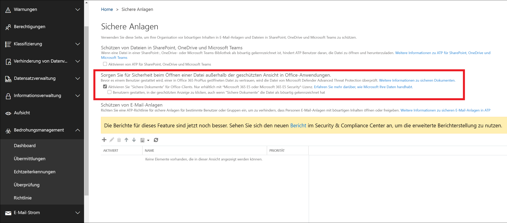

# <a name="safe-documents-in-office-365-advanced-threat-protection"></a><span data-ttu-id="7045e-103">Sichere Dokumente in Office 365 Advanced Threat Protection</span><span class="sxs-lookup"><span data-stu-id="7045e-103">Safe Documents in Office 365 Advanced Threat Protection</span></span>

<span data-ttu-id="7045e-104">Safe Documents ist ein Feature in Office 365 Advanced Threat Protection (ATP), das [Microsoft Defender Advanced Threat Protection](https://docs.microsoft.com/windows/security/threat-protection/microsoft-defender-atp/microsoft-defender-advanced-threat-protection) zum Überprüfen von Dokumenten und Dateien verwendet, die in der [geschützten Ansicht](https://support.office.com/article/d6f09ac7-e6b9-4495-8e43-2bbcdbcb6653)geöffnet werden.</span><span class="sxs-lookup"><span data-stu-id="7045e-104">Safe Documents is a feature in Office 365 Advanced Threat Protection (ATP) that uses [Microsoft Defender Advanced Threat Protection](https://docs.microsoft.com/windows/security/threat-protection/microsoft-defender-atp/microsoft-defender-advanced-threat-protection) to scan documents and files that are opened in [Protected View](https://support.office.com/article/d6f09ac7-e6b9-4495-8e43-2bbcdbcb6653).</span></span>

## <a name="what-do-you-need-to-know-before-you-begin"></a><span data-ttu-id="7045e-105">Was sollten Sie wissen, bevor Sie beginnen?</span><span class="sxs-lookup"><span data-stu-id="7045e-105">What do you need to know before you begin?</span></span>

- <span data-ttu-id="7045e-106">Dieses Feature steht nur Benutzern mit der Sicherheitslizenz Microsoft 365 E5 oder Microsoft 365 E5 zur Verfügung.</span><span class="sxs-lookup"><span data-stu-id="7045e-106">This feature is only available to users with the Microsoft 365 E5 or Microsoft 365 E5 Security license.</span></span>

- <span data-ttu-id="7045e-107">Sichere Dokumente stehen derzeit für die öffentliche Vorschau zur Verfügung, die für Benutzer verfügbar sind, die Teil des [Office-Insider Programms](https://insider.office.com/en-us/join) auf dem "monatlichen Kanal (Targeted)" mit der Office-Version 2002 (12527,20092) oder höher sind.</span><span class="sxs-lookup"><span data-stu-id="7045e-107">Safe Documents is currently available for public preview, available to users that are part of the [Office Insider Program](https://insider.office.com/en-us/join) on the 'Monthly Channel (Targeted)' with Office Version 2002 (12527.20092) or greater.</span></span> <span data-ttu-id="7045e-108">Dieses Feature ist standardmäßig deaktiviert und muss vom Sicherheits Administrator aktiviert werden.</span><span class="sxs-lookup"><span data-stu-id="7045e-108">This feature is off by default and will need to be enabled by the Security Administrator.</span></span>

- <span data-ttu-id="7045e-109">Derzeit wird nur die US-Region für die kompatible Dateiverarbeitung unterstützt (alle Dateien werden zur Überprüfung in die US-Region Reisen).</span><span class="sxs-lookup"><span data-stu-id="7045e-109">Only US Region currently supported for compliant file processing (All files will travel to the US Region for scanning).</span></span> <span data-ttu-id="7045e-110">Die Unterstützung für die Region Großbritannien/EU ist in einem zukünftigen Update geplant.</span><span class="sxs-lookup"><span data-stu-id="7045e-110">Support for UK/EU region is planned in a future update.</span></span>

- <span data-ttu-id="7045e-111">Wie Sie eine Verbindung mit Exchange Online PowerShell herstellen, finden Sie unter [Herstellen einer Verbindung mit Exchange Online PowerShell](https://docs.microsoft.com/powershell/exchange/exchange-online/connect-to-exchange-online-powershell/connect-to-exchange-online-powershell).</span><span class="sxs-lookup"><span data-stu-id="7045e-111">To connect to Exchange Online PowerShell, see [Connect to Exchange Online PowerShell](https://docs.microsoft.com/powershell/exchange/exchange-online/connect-to-exchange-online-powershell/connect-to-exchange-online-powershell).</span></span> <span data-ttu-id="7045e-112">Informationen zum Herstellen einer Verbindung mit Exchange Online Protection PowerShell finden Sie unter [Connect to Exchange Online Protection PowerShell](https://docs.microsoft.com/powershell/exchange/exchange-eop/connect-to-exchange-online-protection-powershell).</span><span class="sxs-lookup"><span data-stu-id="7045e-112">To connect to Exchange Online Protection PowerShell, see [Connect to Exchange Online Protection PowerShell](https://docs.microsoft.com/powershell/exchange/exchange-eop/connect-to-exchange-online-protection-powershell).</span></span>

- <span data-ttu-id="7045e-113">Sie müssen Berechtigungen zugewiesen haben, bevor Sie die Verfahren in diesem Thema ausführen können.</span><span class="sxs-lookup"><span data-stu-id="7045e-113">You need to be assigned permissions before you can perform the procedures in this topic.</span></span> <span data-ttu-id="7045e-114">Um sichere Dokumente zu aktivieren und zu konfigurieren, müssen Sie Mitglied der Rollengruppen " **Organisationsverwaltung** " oder " **Sicherheits Administrator** " sein.</span><span class="sxs-lookup"><span data-stu-id="7045e-114">To enable and configure Safe Documents, you need to be a member of the **Organization Management** or **Security Administrator** role groups.</span></span> <span data-ttu-id="7045e-115">Weitere Informationen zu Rollengruppen im Security & Compliance Center finden Sie unter [Permissions in the Office 365 Security & Compliance Center](permissions-in-the-security-and-compliance-center.md).</span><span class="sxs-lookup"><span data-stu-id="7045e-115">For more information about role groups in the Security & Compliance Center, see [Permissions in the Office 365 Security & Compliance Center](permissions-in-the-security-and-compliance-center.md).</span></span>

## <a name="use-the-office-365-security--compliance-center-to-configure-safe-documents"></a><span data-ttu-id="7045e-116">Konfigurieren sicherer Dokumente mithilfe des Office 365 Security & Compliance Center</span><span class="sxs-lookup"><span data-stu-id="7045e-116">Use the Office 365 Security & Compliance Center to configure Safe Documents</span></span>

1. <span data-ttu-id="7045e-117">Öffnen Sie das Office 365 Security & Compliance Center <https://protection.office.com>unter.</span><span class="sxs-lookup"><span data-stu-id="7045e-117">Open the Office 365 Security & Compliance Center at <https://protection.office.com>.</span></span>

2. <span data-ttu-id="7045e-118">Wechseln Sie zu **Threat Management** \> **Policy** \> **ATP Safe Attachments**.</span><span class="sxs-lookup"><span data-stu-id="7045e-118">Go to **Threat management** \> **Policy** \> **ATP Safe Attachments**.</span></span>

3. <span data-ttu-id="7045e-119">Konfigurieren Sie im Abschnitt **Hilfe für Personen, die beim Vertrauen auf eine Datei beim Öffnen außerhalb geschützter Ansicht in Office-Anwendungen sicher bleiben eine** der folgenden Einstellungen:</span><span class="sxs-lookup"><span data-stu-id="7045e-119">In the **Help people stay safe when trusting a file to open outside Protected View in Office applications** section, configure either of the following settings:</span></span>

   - <span data-ttu-id="7045e-120">**Aktivieren sicherer Dokumente für Office-Clients (Dateien werden auch an Microsoft Cloud für tiefe Analysen gesendet)**</span><span class="sxs-lookup"><span data-stu-id="7045e-120">**Turn on Safe Documents for Office clients (Files will also be sent to Microsoft Cloud for deep analyses)**</span></span>

   - <span data-ttu-id="7045e-121">**Personen können durch die geschützte Ansicht klicken, selbst wenn sichere Dokumente die Datei als bösartig Kenn**zeichnen: Es wird empfohlen, diese Option nicht zu aktivieren.</span><span class="sxs-lookup"><span data-stu-id="7045e-121">**Allow people to click through Protected View even if Safe Documents identifies the file as malicious**: We recommend that you don't enable this option.</span></span>

4. <span data-ttu-id="7045e-122">Klicken Sie nach Abschluss des Vorgangs auf **Speichern**.</span><span class="sxs-lookup"><span data-stu-id="7045e-122">When you're finished, click **Save**.</span></span>



### <a name="use-exchange-online-powershell-or-exchange-online-protection-powershell-to-configure-safe-documents"></a><span data-ttu-id="7045e-124">Konfigurieren sicherer Dokumente mithilfe von Exchange Online PowerShell oder Exchange Online Protection PowerShell</span><span class="sxs-lookup"><span data-stu-id="7045e-124">Use Exchange Online PowerShell or Exchange Online Protection PowerShell to configure Safe Documents</span></span>

<span data-ttu-id="7045e-125">Verwenden Sie die folgende Syntax:</span><span class="sxs-lookup"><span data-stu-id="7045e-125">Use the following syntax:</span></span>

```powershell
Set-AtpPolicyForO365 -EnableSafeDocs <$true|$false> -AllowSafeDocsOpen <$true|$false>
```

- <span data-ttu-id="7045e-126">Der Parameter _EnableSafeDocs_ aktiviert oder deaktiviert sichere Dokumente für die gesamte Organisation.</span><span class="sxs-lookup"><span data-stu-id="7045e-126">The _EnableSafeDocs_ parameter enables or disables Safe Documents for the entire organization.</span></span>

- <span data-ttu-id="7045e-127">Der Parameter _AllowSafeDocsOpen_ ermöglicht oder verhindert, dass Benutzer die geschützte Ansicht (also das Öffnen des Dokuments) verlassen, wenn das Dokument als bösartig gekennzeichnet wurde.</span><span class="sxs-lookup"><span data-stu-id="7045e-127">The _AllowSafeDocsOpen_ parameter allows or prevents users from leaving Protected View (that is, opening the document) if the document has been identified as malicious.</span></span>

<span data-ttu-id="7045e-128">In diesem Beispiel werden sichere Dokumente für die gesamte Organisation aktiviert, und es wird verhindert, dass Benutzer Dokumente öffnen, die als "bösartig" aus geschützter Ansicht identifiziert wurden.</span><span class="sxs-lookup"><span data-stu-id="7045e-128">This example enables Safe Documents for the entire organization, and prevents users from opening documents that have been identified as malicious from Protected View.</span></span>

```powershell
Set-AtpPolicyForO365 -EnableSafeDocs $true -AllowSafeDocsOpen $false
```

<span data-ttu-id="7045e-129">Ausführliche Informationen zu Syntax und Parametern finden Sie unter [Sets-AtpPolicyForO365](https://docs.microsoft.com/powershell/module/exchange/advanced-threat-protection/set-atppolicyforo365).</span><span class="sxs-lookup"><span data-stu-id="7045e-129">For detailed syntax and parameter information, see [Set-AtpPolicyForO365](https://docs.microsoft.com/powershell/module/exchange/advanced-threat-protection/set-atppolicyforo365).</span></span>

### <a name="how-do-i-know-this-worked"></a><span data-ttu-id="7045e-130">Woher weiß ich, dass der Vorgang erfolgreich war?</span><span class="sxs-lookup"><span data-stu-id="7045e-130">How do I know this worked?</span></span>

<span data-ttu-id="7045e-131">Führen Sie einen der folgenden Schritte aus, um zu überprüfen, ob Sie sichere Dokumente aktiviert und konfiguriert haben:</span><span class="sxs-lookup"><span data-stu-id="7045e-131">To verify that you've enabled and configured Safe Documents, do any of the following steps:</span></span>

- <span data-ttu-id="7045e-132">Im Security & Compliance Center gehen Sie zu **Threat Management** \> **Policy** \> **ATP Safe Attachments**, und überprüfen Sie die Auswahl im Abschnitt **Hilfe Personen bleiben sicher, wenn Sie einer Datei vertrauen, dass Sie außerhalb geschützter Ansicht in Office-Anwendungen geöffnet** wird.</span><span class="sxs-lookup"><span data-stu-id="7045e-132">In the Security & Compliance Center go to **Threat management** \> **Policy** \> **ATP Safe Attachments**, and verify the selections in the **Help people stay safe when trusting a file to open outside Protected View in Office applications** section.</span></span>

- <span data-ttu-id="7045e-133">Führen Sie den folgenden Befehl in Exchange Online PowerShell aus, und überprüfen Sie die Eigenschaftswerte:</span><span class="sxs-lookup"><span data-stu-id="7045e-133">Run the following command in Exchange Online PowerShell and verify the property values:</span></span>

  ```powershell
  Get-AtpPolicyForO365 | Format-List *SafeDocs*
  ```
