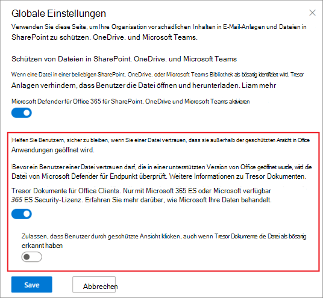

# <a name="safe-documents-in-microsoft-365-e5"></a>Sichere Dokumente in Microsoft 365 E5

[!INCLUDE [Microsoft 365 Defender rebranding](../includes/microsoft-defender-for-office.md)]

**Gilt für**
- [Microsoft 365 Defender](../defender/microsoft-365-defender.md)

Tresor Dokumente sind ein Feature in Microsoft 365 E5 oder Microsoft 365 E5 Security, das [Microsoft Defender für Endpunkt](/windows/security/threat-protection/microsoft-defender-atp/microsoft-defender-advanced-threat-protection) zum Scannen von Dokumenten und Dateien verwendet, die in der [geschützten Ansicht](https://support.microsoft.com/office/d6f09ac7-e6b9-4495-8e43-2bbcdbcb6653) oder in Application Guard für [Office](https://support.microsoft.com/topic/9e0fb9c2-ffad-43bf-8ba3-78f785fdba46)geöffnet werden.

## <a name="what-do-you-need-to-know-before-you-begin"></a>Was sollten Sie wissen, bevor Sie beginnen?

- Tresor Dokumente sind nur für Benutzer mit *Microsoft 365 E5* oder *Microsoft 365 E5 Security* Lizenzen verfügbar. Diese Lizenzen sind in Microsoft Defender für Office 365 Pläne nicht enthalten.

- Tresor Dokumente werden in Microsoft 365 Apps for Enterprise (früher als Office 365 ProPlus bezeichnet) Version 2004 oder höher unterstützt.

- Sie öffnen das Microsoft 365 Defender-Portal unter <https://security.microsoft.com>. To go directly to the **Tresor Attachments** page, use <https://security.microsoft.com/safeattachmentv2> .

- Wie Sie eine Verbindung mit Exchange Online PowerShell herstellen, finden Sie unter [Herstellen einer Verbindung mit Exchange Online PowerShell](/powershell/exchange/connect-to-exchange-online-powershell).

- Sie benötigen Berechtigungen in **Exchange Online,** bevor Sie die Verfahren in diesem Artikel ausführen können:
  - Um Tresor Dokumenteinstellungen zu konfigurieren, müssen Sie Mitglied der Rollengruppen **"Organisationsverwaltung"** oder **"Sicherheitsadministrator"** sein.
  - Für den schreibgeschützten Zugriff auf Tresor Dokumenteneinstellungen müssen Sie Mitglied der Rollengruppe **"Globaler Leser"** oder **"Sicherheitsleseberechtigter"** sein.

  Weitere Informationen finden Sie unter [Berechtigungen in Exchange Online](/exchange/permissions-exo/permissions-exo).

  > [!NOTE]
  >
  > - Durch das Hinzufügen von Benutzern zur entsprechenden Azure Active Directory-Rolle im Microsoft 365 Admin Center erhalten Benutzer die erforderlichen Berechtigungen _und_ Berechtigungen für andere Features in Microsoft 365. Weitere Informationen finden Sie unter [Informationen zu Administratorrollen](../../admin/add-users/about-admin-roles.md).
  >
  > - Die Rollengruppe **Organisationsverwaltung mit Leserechten** in [Exchange Online](/Exchange/permissions-exo/permissions-exo#role-groups) ermöglicht auch einen schreibgeschützten Zugriff auf das Feature.

### <a name="how-does-microsoft-handle-your-data"></a>Wie behandelt Microsoft Ihre Daten?

Um Sie zu schützen, sendet Tresor Dokumente Dateien zur Analyse an die [Microsoft Defender für Endpunkt-Cloud.](/windows/security/threat-protection/microsoft-defender-atp/microsoft-defender-advanced-threat-protection) Details dazu, wie Microsoft Defender für Endpunkt Ihre Daten behandelt, finden Sie hier: [Microsoft Defender für Endpunkt-Datenspeicherung und Datenschutz.](/windows/security/threat-protection/microsoft-defender-atp/data-storage-privacy)

Dateien, die von Tresor Dokumente gesendet werden, werden in Defender nicht über die für die Analyse benötigte Zeit hinaus aufbewahrt (in der Regel weniger als 24 Stunden).

## <a name="use-the-microsoft-365-defender-to-configure-safe-documents"></a>Verwenden der Microsoft 365 Defender zum Konfigurieren Tresor Dokumente

1. Öffnen Sie das portal Microsoft 365 Defender, und wechseln Sie zu **E-Mail & Richtlinien** für die Zusammenarbeit & Richtlinien für \>  \> **Bedrohungsregeln** Seite \> **Richtlinien** \> **Tresor Anlagen**.

2. Klicken Sie auf der Seite **Tresor Anlagen** auf **globale Einstellungen.**

3. Konfigurieren Sie im angezeigten **Flyout "Globale Einstellungen"** die folgenden Einstellungen:
   - **Aktivieren Sie Tresor Dokumente für Office Clients:** Verschieben Sie die Umschaltfläche nach rechts, um das Feature zu aktivieren: 
   - **Zulassen, dass Benutzer durch die geschützte Ansicht klicken, auch wenn Tresor Dokumente die Datei als bösartig identifiziert** haben: Es wird empfohlen, diese Option deaktiviert zu lassen (lassen Sie die Umschaltfläche links:  deaktivieren).

   Klicken Sie nach Abschluss des Vorgangs auf **Speichern**.

   

### <a name="use-exchange-online-powershell-to-configure-safe-documents"></a>Verwenden von Exchange Online PowerShell zum Konfigurieren Tresor Dokumente

Verwenden Sie die folgende Syntax:

```powershell
Set-AtpPolicyForO365 -EnableSafeDocs <$true | $false> -AllowSafeDocsOpen <$true | $false>
```

- Der _Parameter EnableSafeDocs_ aktiviert oder deaktiviert Tresor Dokumente für die gesamte Organisation.
- Der _Parameter AllowSafeDocsOpen_ ermöglicht oder verhindert, dass Benutzer die geschützte Ansicht verlassen (d. h. das Dokument öffnen), wenn das Dokument als bösartig erkannt wurde.

In diesem Beispiel wird Tresor Dokumente für die gesamte Organisation aktiviert und verhindert, dass Benutzer Dokumente öffnen, die als bösartig aus der geschützten Ansicht identifiziert wurden.

```powershell
Set-AtpPolicyForO365 -EnableSafeDocs $true -AllowSafeDocsOpen $false
```

Ausführliche Informationen zu Syntax und Parametern finden Sie unter ["Set-AtpPolicyForO365".](/powershell/module/exchange/set-atppolicyforo365)

### <a name="onboard-to-the-microsoft-defender-for-endpoint-service-to-enable-auditing-capabilities"></a>Onboarding in den Microsoft Defender für Endpunktdienst zum Aktivieren von Überwachungsfunktionen

Um Microsoft Defender für Endpunkt bereitzustellen, müssen Sie die verschiedenen Phasen der Bereitstellung durchlaufen. Nach dem Onboarding können Sie Überwachungsfunktionen im Microsoft 365 Defender-Portal konfigurieren.

Weitere Informationen finden Sie unter [Onboarding für den Microsoft Defender für Endpunkt-Dienst.](/microsoft-365/security/defender-endpoint/onboarding) Wenn Sie zusätzliche Hilfe benötigen, finden Sie informationen zur Problembehandlung bei Problemen beim [Onboarding von Microsoft Defender für Endpunkten.](/microsoft-365/security/defender-endpoint/troubleshoot-onboarding)

### <a name="how-do-i-know-this-worked"></a>Woher weiß ich, dass der Vorgang erfolgreich war?

Führen Sie einen der folgenden Schritte aus, um zu überprüfen, ob Sie Tresor Dokumente aktiviert und konfiguriert haben:

- Wechseln Sie im Microsoft 365 Defender Portal zur Seite "Richtlinien für **E-Mail-& Zusammenarbeit** & Richtlinien für \> **Bedrohungsregeln"** im Abschnitt \> "Richtlinien für **Bedrohungsregeln"** \>  \> **Tresor "Attachments** \> **Global"-Einstellungen,** und überprüfen Sie die Option **"Tresor Dokumente für Office Clients aktivieren"** und **"Personen das Klicken durch die geschützte Ansicht erlauben", auch wenn Tresor "Dokumente" die Datei als schädliche** Einstellungen identifiziert.

- Führen Sie den folgenden Befehl in Exchange Online PowerShell aus, und überprüfen Sie die Eigenschaftswerte:

  ```powershell
  Get-AtpPolicyForO365 | Format-List *SafeDocs*
  ```

- Die folgenden Dateien stehen zum Testen Tresor Dokumentenschutz zur Verfügung. Diese Dokumente ähneln der EICAR.TXT-Datei zum Testen von Antischadsoftware- und Antivirenlösungen. Die Dateien sind nicht schädlich, lösen jedoch Tresor Dokumentenschutz aus.

  - [SafeDocsDemo.docx](https://github.com/MicrosoftDocs/microsoft-365-docs/raw/public/microsoft-365/downloads/SafeDocsDemo.docx)
  - [SafeDocsDemo.pptx](https://github.com/MicrosoftDocs/microsoft-365-docs/raw/public/microsoft-365/downloads/SafeDocsDemo.pptx)
  - [SafeDocsDemo.xlsx](https://github.com/MicrosoftDocs/microsoft-365-docs/raw/public/microsoft-365/downloads/SafeDocsDemo.xlsx)
