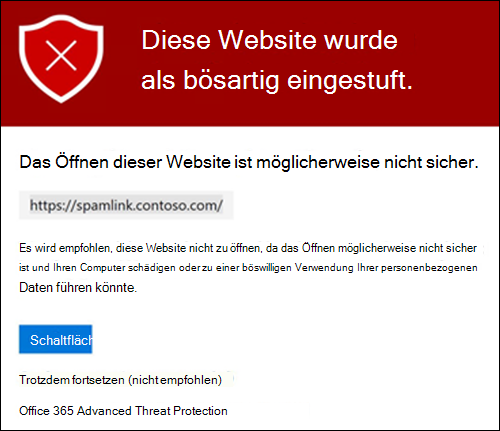
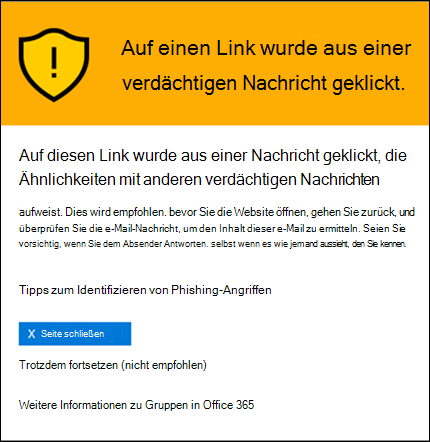
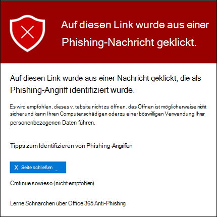
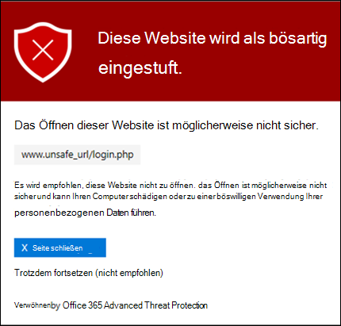
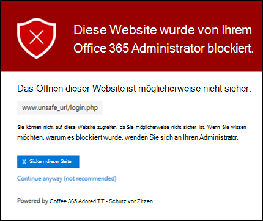
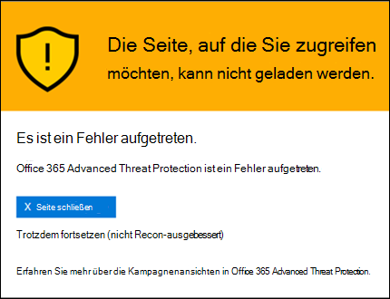

# Sichere Links in Microsoft Defender für Office 365Safe Links in Microsoft Defender for Office 365

[!INCLUDE [Microsoft 365 Defender rebranding](../includes/microsoft-defender-for-office.md)]

**Gilt für****Applies to**
- [Microsoft Defender für Office 365 Plan 1 und Plan 2Microsoft Defender for Office 365 plan 1 and plan 2](defender-for-office-365.md)
- [Microsoft 365 DefenderMicrosoft 365 Defender](../defender/microsoft-365-defender.md)

> [!IMPORTANT]
> Dieser Artikel richtet sich an Geschäftskunden, die über [Microsoft Defender für Office 365](defender-for-office-365.md) verfügen.This article is intended for business customers who have [Microsoft Defender for Office 365](defender-for-office-365.md). Wenn Sie Outlook.com, Microsoft 365 Family oder Microsoft 365 Single verwenden und Informationen zu Safelinks in Outlook suchen, lesen Sie [Advanced Outlook.com security](https://support.microsoft.com/office/882d2243-eab9-4545-a58a-b36fee4a46e2).If you're using Outlook.com, Microsoft 365 Family, or Microsoft 365 Personal, and you're looking for information about Safelinks in Outlook, see [Advanced Outlook.com security](https://support.microsoft.com/office/882d2243-eab9-4545-a58a-b36fee4a46e2).

Sichere Links ist ein Feature in [Defender for Office 365,](defender-for-office-365.md) das die URL-Überprüfung und das Neuschreiben eingehender E-Mail-Nachrichten im Nachrichtenfluss sowie die Überprüfung von URLs und Links in E-Mail-Nachrichten und anderen Speicherorten zum Zeitpunkt des Klicks ermöglicht.Safe Links is a feature in [Defender for Office 365](defender-for-office-365.md) that provides URL scanning and rewriting of inbound email messages in mail flow, and time-of-click verification of URLs and links in email messages and other locations. Die Überprüfung sicherer Links erfolgt zusätzlich zum regulären Antispam- und [Anti-Malware-Schutz in eingehenden E-Mail-Nachrichten](anti-spam-and-anti-malware-protection.md) in Exchange Online Protection (EOP).Safe Links scanning occurs in addition to the regular [anti-spam and anti-malware protection](anti-spam-and-anti-malware-protection.md) in inbound email messages in Exchange Online Protection (EOP). Die Überprüfung sicherer Links kann Ihre Organisation vor bösartigen Links schützen, die bei Phishing und anderen Angriffen verwendet werden.Safe Links scanning can help protect your organization from malicious links that are used in phishing and other attacks.

Der Schutz sicherer Links ist an den folgenden Speicherorten verfügbar:Safe Links protection is available in the following locations:

- **E-Mail-Nachrichten:** Der Schutz sicherer Links für Links in E-Mail-Nachrichten wird durch Richtlinien für sichere Links gesteuert.**Email messages**: Safe Links protection for links in email messages is controlled by Safe Links policies. Es gibt keine Standardmäßige Richtlinie für sichere Links. Um den Schutz sicherer Links in E-Mail-Nachrichten zu erhalten, müssen Sie eine oder mehrere Richtlinien für sichere **Links erstellen.**There is no default Safe Links policy, **so to get the protection of Safe Links in email messages, you need to create one or more Safe Links policies**. Anweisungen finden Sie unter [Set up Safe Links policies in Microsoft Defender for Office 365](set-up-safe-links-policies.md).For instructions, see [Set up Safe Links policies in Microsoft Defender for Office 365](set-up-safe-links-policies.md).

  Weitere Informationen zum Schutz sicherer Links für  E-Mail-Nachrichten finden Sie im Abschnitt Einstellungen für sichere Links für E-Mail-Nachrichten weiter unten in diesem Artikel.For more information about Safe Links protection for email messages, see the [Safe Links settings for email messages](#safe-links-settings-for-email-messages) section later in this article.

- **Microsoft Teams** (derzeit in der TAP-Vorschau): Der Schutz sicherer Links für Links in Teams Unterhaltungen, Gruppenchats oder kanälen wird auch durch Richtlinien für sichere Links gesteuert.**Microsoft Teams** (currently in TAP Preview): Safe Links protection for links in Teams conversations, group chats, or from channels is also controlled by Safe Links policies. Es gibt keine Standardrichtlinie für sichere Links. Um den Schutz sicherer Links in Teams zu erhalten, müssen Sie eine oder mehrere Richtlinien für sichere Links **erstellen.**There is no default Safe Links policy, **so to get the protection of Safe Links in Teams, you need to create one or more Safe Links policies**.

  Weitere Informationen zum Schutz sicherer Links in Teams finden Sie im Abschnitt Safe [Links settings for Microsoft Teams](#safe-links-settings-for-microsoft-teams) weiter unten in diesem Artikel.For more information about Safe Links protection in Teams, see the [Safe Links settings for Microsoft Teams](#safe-links-settings-for-microsoft-teams) section later in this article.

- **Office 365:** Schutz für sichere Links für Office 365 ist in unterstützten Desktop-, Mobile- und Web-Apps verfügbar.**Office 365 apps**: Safe Links protection for Office 365 apps is available in supported desktop, mobile, and web apps. Sie **konfigurieren den** Schutz sicherer Links für Office 365 Apps in der globalen Einstellung, die sich **außerhalb** von Richtlinien für sichere Links befinden.You **configure** Safe Links protection for Office 365 apps in the global setting that are **outside** of Safe Links policies. Anweisungen finden Sie unter [Configure global settings for Safe Links settings in Microsoft Defender for Office 365](configure-global-settings-for-safe-links.md).For instructions, see [Configure global settings for Safe Links settings in Microsoft Defender for Office 365](configure-global-settings-for-safe-links.md).

  Der Schutz für sichere Links für Office 365-Apps wird auf alle Benutzer in der Organisation angewendet, die für Defender für Office 365 lizenziert sind, unabhängig davon, ob die Benutzer in aktiven Richtlinien für sichere Links enthalten sind oder nicht.Safe Links protection for Office 365 apps is applied to all users in the organization who are licensed for Defender for Office 365, regardless of whether the users are included in active Safe Links policies or not.

  Weitere Informationen zum Schutz sicherer Links in Office 365 apps finden Sie im Abschnitt Einstellungen für sichere Links für [Office 365](#safe-links-settings-for-office-365-apps) Apps weiter unten in diesem Artikel.For more information about Safe Links protection in Office 365 apps, see the [Safe Links settings for Office 365 apps](#safe-links-settings-for-office-365-apps) section later in this article.

Dieser Artikel enthält detaillierte Beschreibungen der folgenden Arten von Einstellungen für sichere Links:This article includes detailed descriptions of the following types of Safe Links settings:

- **Einstellungen in Richtlinien** für sichere Links: Diese Einstellungen gelten nur für die Benutzer, die in den spezifischen Richtlinien enthalten sind, und die Einstellungen können zwischen den Richtlinien unterschiedlich sein.**Settings in Safe Links policies**: These settings apply only to the users who are included in the specific policies, and the settings might be different between policies. Dazu zählen die folgenden Einstellungen:These settings include:

  - [Einstellungen für sichere Links für E-Mail-NachrichtenSafe Links settings for email messages](#safe-links-settings-for-email-messages)
  - [Einstellungen für sichere Links für Microsoft TeamsSafe Links settings for Microsoft Teams](#safe-links-settings-for-microsoft-teams)
  - ["Die folgenden URLs nicht umschreiben" in Richtlinien für sichere Links"Do not rewrite the following URLs" lists in Safe Links policies](#do-not-rewrite-the-following-urls-lists-in-safe-links-policies)

- **Einstellungen für globale sichere** Links: Diese Einstellungen sind global konfiguriert, nicht in Richtlinien für sichere Links.**Global Safe Links settings**: These settings are configured globally, not in Safe Links policies. Die Einstellungen gelten jedoch nur für Benutzer, die in aktiven Richtlinien für sichere Links enthalten sind.But, the settings apply only to users who are included in active Safe Links policies. Dazu zählen die folgenden Einstellungen:These settings include:

  - [Einstellungen für sichere Links für Office 365 AppsSafe Links settings for Office 365 apps](#safe-links-settings-for-office-365-apps)
  - [Liste "Blockieren der folgenden URLs" für sichere Links"Block the following URLs" list for Safe Links](#block-the-following-urls-list-for-safe-links)

In der folgenden Tabelle werden Szenarien für sichere Links in Microsoft 365- und Office 365-Organisationen beschrieben, zu denen Defender für Office 365 gehört (mit anderen Worten: Fehlende Lizenzierung ist in den Beispielen nie ein Problem).The following table describes scenarios for Safe Links in Microsoft 365 and Office 365 organizations that include Defender for Office 365 (in other words, lack of licensing is never an issue in the examples).

 

****

|SzenarioScenario|ErgebnisResult|
|---|---|
|Er ist Mitglied der Marketingabteilung.Jean is a member of the marketing department. Der Schutz sicherer Links für Office 365 apps ist in den globalen Einstellungen für sichere Links aktiviert, und es gibt eine Richtlinie für sichere Links, die für Mitglieder der Marketingabteilung gilt.Safe Links protection for Office 365 apps is turned on in the global settings for Safe Links, and a Safe Links policy that applies to members of the marketing department exists. In einer E-Mail PowerPoint öffnet Er eine Präsentation und klickt dann auf eine URL in der Präsentation.Jean opens a PowerPoint presentation in an email message, and then clicks a URL in the presentation.|"Jean" ist durch sichere Links geschützt.Jean is protected by Safe Links. 
 "Jean" ist in einer Richtlinie für sichere Links enthalten, und der Schutz für sichere Links für Office 365 apps ist aktiviert.Jean is included in a Safe Links policy, and Safe Links protection for Office 365 apps is turned on. 
 Weitere Informationen zu den Anforderungen für den Schutz sicherer Links in Office 365 finden Sie im Abschnitt Einstellungen für sichere Links für [Office 365 Apps](#safe-links-settings-for-office-365-apps) weiter unten in diesem Artikel.For more information about the requirements for Safe Links protection in Office 365 apps, see the [Safe Links settings for Office 365 apps](#safe-links-settings-for-office-365-apps) section later in this article.|
|Chris' organisation Microsoft 365 E5 hat keine Richtlinien für sichere Links konfiguriert.Chris's Microsoft 365 E5 organization has no Safe Links policies configured. Chris empfängt eine E-Mail von einem externen Absender, der eine URL zu einer schädlichen Website enthält, auf die er schließlich klickt.Chris receives an email from an external sender that contains a URL to a malicious website that he ultimately clicks.|Chris ist nicht durch sichere Links geschützt.Chris is not protected by Safe Links. 
 Ein Administrator muss mindestens eine Richtlinie für sichere Links erstellen, damit jeder benutzer den Schutz für sichere Links in eingehenden E-Mail-Nachrichten erhalten kann.An admin must create at least one Safe Links policy for anyone to get Safe Links protection in inbound email messages. Chris muss in die Bedingungen der Richtlinie einbezogen werden, um schutz vor sicheren Links zu erhalten.Chris must be included in the conditions of policy to get Safe Links protection.|
|In Pats Organisation haben keine Administratoren Richtlinien für sichere Links erstellt, aber der Schutz sicherer Links für Office 365 apps ist aktiviert.In Pat's organization, no admins have created any Safe Links policies, but Safe Links protection for Office 365 apps is turned on. Pat öffnet ein Word-Dokument und klickt auf eine URL in der Datei.Pat opens a Word document and clicks a URL in the file.|Pat ist nicht durch sichere Links geschützt.Pat is not protected by Safe Links. 
 Obwohl der Schutz sicherer Links für Office 365 Apps global aktiviert ist, ist Pat nicht in aktiven Richtlinien für sichere Links enthalten, sodass der Schutz nicht angewendet werden kann.Although Safe Links protection for Office 365 apps is turned on globally, Pat is not included in any active Safe Links policies, so the protection can't be applied.|
|In Lees Organisation wird in der Liste Blockieren der folgenden URLs in den globalen Einstellungen für `https://tailspintoys.com` sichere Links konfiguriert. In Lee's organization, `https://tailspintoys.com` is configured in the **Block the following URLs** list in the global settings for Safe Links. Eine Richtlinie für sichere Links, die Lee enthält, ist bereits vorhanden.A Safe Links policy that includes Lee already exists. Lee empfängt eine E-Mail-Nachricht, die die URL `https://tailspintoys.com/aboutus/trythispage` enthält.Lee receives an email message that contains the URL `https://tailspintoys.com/aboutus/trythispage`. Lee klickt auf die URL.Lee clicks the URL.|Die URL wird möglicherweise automatisch für Lee blockiert. dies hängt vom URL-Eintrag in der Liste und dem verwendeten E-Mail-Client Lee ab.The URL might be automatically blocked for Lee; it depends on the URL entry in the list and the email client Lee used. Weitere Informationen finden Sie im Abschnitt "Blockieren der [folgenden URLs" für](#block-the-following-urls-list-for-safe-links) sichere Links weiter unten in diesem Artikel.For more information, see the ["Block the following URLs" list for Safe Links](#block-the-following-urls-list-for-safe-links) section later in this article.|
|Sowohl Füry als auch Julia arbeiten für contoso.com.Jamie and Julia both work for contoso.com. Vor langer Zeit haben Administratoren Richtlinien für sichere Links konfiguriert, die sowohl für Jamie als auch für Julia gelten.A long time ago, admins configured Safe Links policies that apply to both of Jamie and Julia. Jamie sendet eine E-Mail an Julia, ohne zu wissen, dass die E-Mail eine schädliche URL enthält.Jamie sends an email to Julia, not knowing that the email contains a malicious URL.|Julia ist durch sichere **Links** geschützt, wenn die richtlinie für sichere Links, die für sie gilt, so konfiguriert ist, dass sie auf Nachrichten zwischen internen Empfängern angewendet wird.Julia is protected by Safe Links **if** the Safe Links policy that applies to her is configured to apply to messages between internal recipients. Weitere Informationen finden Sie im Abschnitt Einstellungen für sichere Links für [E-Mail-Nachrichten](#safe-links-settings-for-email-messages) weiter unten in diesem Artikel.For more information, see the [Safe Links settings for email messages](#safe-links-settings-for-email-messages) section later in this article.|
|

## Einstellungen für sichere Links für E-Mail-NachrichtenSafe Links settings for email messages

Sichere Links überprüft eingehende E-Mails auf bekannte schädliche Hyperlinks.Safe Links scans incoming email for known malicious hyperlinks. Gescannte URLs werden mit dem Microsoft-Standard-URL-Präfix umgeschrieben: `https://nam01.safelinks.protection.outlook.com` .Scanned URLs are rewritten using the Microsoft standard URL prefix: `https://nam01.safelinks.protection.outlook.com`. Nachdem der Link umgeschrieben wurde, wird er auf potenziell schädliche Inhalte analysiert.After the link is rewritten, it's analyzed for potentially malicious content.

Nachdem sichere Links eine URL umgeschrieben haben, bleibt die  URL auch dann neu geschrieben, wenn die Nachricht manuell weitergeleitet oder beantwortet wird (sowohl an interne als auch an externe Empfänger).After Safe Links rewrites a URL, the URL remains rewritten even if the message is *manually* forwarded or replied to (both to internal and external recipients). Zusätzliche Links, die der weitergeleiteten oder beantworteten Nachricht hinzugefügt werden, werden nicht umgeschrieben.Additional links that are added to the forwarded or replied to message are not rewritten. Bei der automatischen  Weiterleitung durch Posteingangsregeln oder smtp-Weiterleitung wird die URL jedoch nicht in der Nachricht  umgeschrieben, die für den endgültigen Empfänger vorgesehen ist, es sei denn, dieser Empfänger ist auch durch sichere Links geschützt, oder die URL wurde bereits in einer vorherigen Kommunikation umgeschrieben.However, in the case of *automatic* forwarding by Inbox rules or SMTP forwarding, the URL will not be rewritten in the message that's intended for the final recipient *unless* that recipient is also protected by Safe Links or the URL had already been rewritten in a previous communication. 

Die Einstellungen in Richtlinien für sichere Links, die für E-Mail-Nachrichten gelten, werden in der folgenden Liste beschrieben:The settings in Safe Links policies that apply to email messages are described in the following list:

- **Wählen Sie die Aktion für unbekannte potenziell** schädliche URLs in Nachrichten aus: Aktiviert oder deaktiviert die Überprüfung sicherer Links in E-Mail-Nachrichten.**Select the action for unknown potentially malicious URLs in messages**: Enables or disables Safe Links scanning in email messages. Der empfohlene Wert ist **On**.The recommended value is **On**. Das Aktivieren dieser Einstellung führt zu den folgenden Aktionen.Turning on this setting results in the following actions.

  - Die Überprüfung sicherer Links ist in Outlook (C2R) auf Windows.Safe Links scanning is enabled in Outlook (C2R) on Windows.
  - URLs werden umgeschrieben, und Benutzer werden durch den Schutz sicherer Links geroutet, wenn sie in Nachrichten auf URLs klicken.URLs are rewritten and users are routed through Safe Links protection when they click URLs in messages.
  - Wenn Sie darauf klicken, werden URLs mit einer Liste bekannter bösartiger URLs und der Liste "Die folgenden [URLs blockieren" überprüft.](#block-the-following-urls-list-for-safe-links)When clicked, URLs are checked against a list of known malicious URLs and the ["Block the following URLs" list](#block-the-following-urls-list-for-safe-links).
  - URLs ohne gültige Reputation werden asynchron im Hintergrund detoniert.URLs that don't have a valid reputation are detonated asynchronously in the background.

- **Anwenden der Echtzeit-URL-Überprüfung** auf verdächtige Links und Links, die auf Dateien verweisen: Ermöglicht das Scannen von Links in Echtzeit, einschließlich Links in E-Mail-Nachrichten, die auf herunterladbare Inhalte verweisen.**Apply real-time URL scanning for suspicious links and links that point to files**: Enables real-time scanning of links, including links in email messages that point to downloadable content. Der empfohlene Wert ist aktiviert.The recommended value is enabled.
  - **Warten Sie, bis die URL-Überprüfung abgeschlossen ist, bevor Sie die Nachricht senden:****Wait for URL scanning to complete before delivering the message**:
    - Aktiviert: Nachrichten, die URLs enthalten, werden bis zum Abschluss der Überprüfung gehalten.Enabled: Messages that contain URLs are held until scanning is finished. Nachrichten werden nur zugestellt, nachdem die URLs als sicher bestätigt wurden.Messages are delivered only after the URLs are confirmed to be safe. Dies ist der empfohlene Wert.This is the recommended value.
    - Deaktiviert: Wenn die URL-Überprüfung nicht abgeschlossen werden kann, senden Sie die Nachricht trotzdem.Disabled: If URL scanning can't complete, deliver the message anyway.

- **Anwenden sicherer Links** auf E-Mail-Nachrichten, die innerhalb der Organisation gesendet werden: Aktiviert oder deaktiviert die Überprüfung sicherer Links auf Nachrichten, die zwischen internen Absendern und internen Empfängern innerhalb derselben Organisation Exchange Online werden.**Apply Safe Links to email messages sent within the organization**: Enables or disables Safe Links scanning on messages sent between internal senders and internal recipients within the same Exchange Online organization. Der empfohlene Wert ist aktiviert.The recommended value is enabled.

- **Benutzerklicks** nicht nachverfolgen: Aktiviert oder deaktiviert das Speichern sicherer Links klicken Sie auf Daten für URLs, auf die in E-Mail-Nachrichten geklickt wurde.**Do not track user clicks**: Enables or disables storing Safe Links click data for URLs clicked in email messages. Der Empfehlungswert besteht in der Unauswahl dieser Einstellung (um Benutzerklicks nachverfolgt zu werden).The recommend value is to leave this setting unselected (to track user clicks).

  Die URL-Klickverfolgung für Links in E-Mail-Nachrichten, die zwischen internen Absendern und internen Empfängern gesendet werden, wird derzeit nicht unterstützt.URL click tracking for links in email messages sent between internal senders and internal recipients is currently not supported.

- **Benutzer dürfen nicht zur ursprünglichen URL** durchklicken: Ermöglicht  oder verhindert, dass Benutzer auf die Warnseite zur ursprünglichen URL klicken.**Do not allow users to click through to original URL**: Allows or blocks users from clicking through the [warning page](#warning-pages-from-safe-links) to the original URL. Der Empfehlungswert ist aktiviert.The recommend value is enabled.

- **Anzeigen des Unternehmensbrandings auf Benachrichtigungs-** und Warnungsseiten: Diese Option zeigt das Branding Ihrer Organisation auf Warnseiten an.**Display the organization branding on notification and warning pages**: This option shows your organization's branding on warning pages. Branding hilft Benutzern, legitime Warnungen zu identifizieren, da Standardmäßige Microsoft-Warnseiten häufig von Angreifern verwendet werden.Branding helps users identify legitimate warnings, because default Microsoft warning pages are often used by attackers. Weitere Informationen zum angepassten Branding finden Sie unter [Customize the Microsoft 365 theme for your organization](../../admin/setup/customize-your-organization-theme.md).For more information about customized branding, see [Customize the Microsoft 365 theme for your organization](../../admin/setup/customize-your-organization-theme.md).

- **Not rewrite the following URLs**: Leaves URLs as they are.**Do not rewrite the following URLs**: Leaves URLs as they are. Behält eine benutzerdefinierte Liste sicherer URLs bei, die nicht gescannt werden müssen.Keeps a custom list of safe URLs that don't need scanning. Die Liste ist für jede Richtlinie für sichere Links eindeutig.The list is unique for each Safe Links policy. Weitere Informationen zur Liste Nicht umschreiben der folgenden **URLs** finden Sie in den Listen "Die folgenden [URLs](#do-not-rewrite-the-following-urls-lists-in-safe-links-policies) nicht umschreiben" im Abschnitt Richtlinien für sichere Links weiter unten in diesem Artikel.For more information about the **Do not rewrite the following URLs** list, see the ["Do not rewrite the following URLs" lists in Safe Links policies](#do-not-rewrite-the-following-urls-lists-in-safe-links-policies) section later in this article.

  Weitere Informationen zu den empfohlenen Werten für Standard- und Strikte Richtlinieneinstellungen für Richtlinien für sichere Links finden Sie unter [Richtlinieneinstellungen](recommended-settings-for-eop-and-office365.md#safe-links-policy-settings)für sichere Links .For more information about the recommended values for Standard and Strict policy settings for Safe Links policies, see [Safe Links policy settings](recommended-settings-for-eop-and-office365.md#safe-links-policy-settings).

- **Empfängerfilter:** Sie müssen die Empfängerbedingungen und Ausnahmen angeben, die bestimmen, auf wen die Richtlinie angewendet wird.**Recipient filters**: You need to specify the recipient conditions and exceptions that determine who the policy applies to. Sie können die folgenden Eigenschaften für Bedingungen und Ausnahmen verwenden:You can use these properties for conditions and exceptions:
  - **Der Empfänger ist****The recipient is**
  - **Die Empfängerdomäne ist****The recipient domain is**
  - **Der Empfänger ist Mitglied von****The recipient is a member of**

  Sie können eine Bedingung oder Ausnahme nur einmal verwenden, die Bedingung oder Ausnahme kann aber mehrere Werte enthalten.You can only use a condition or exception once, but the condition or exception can contain multiple values. Bei mehreren Werten derselben Bedingung oder Ausnahme wird ODER-Logik verwendet (z. B. _\<recipient1\>_ oder _\<recipient2\>_).Multiple values of the same condition or exception use OR logic (for example, _\<recipient1\>_ or _\<recipient2\>_). Bei unterschiedlichen Bedingungen oder Ausnahmen wird UND-Logik verwendet (z. B. _\<recipient1\>_ und _\<member of group 1\>_).Different conditions or exceptions use AND logic (for example, _\<recipient1\>_ and _\<member of group 1\>_).

- **Priorität:** Wenn Sie mehrere Richtlinien erstellen, können Sie die Reihenfolge angeben, in der sie angewendet werden.**Priority**: If you create multiple policies, you can specify the order that they're applied. Keine zwei Richtlinien können die gleiche Priorität aufweisen, und die Richtlinienverarbeitung endet, nachdem die erste Richtlinie angewendet wurde.No two policies can have the same priority, and policy processing stops after the first policy is applied.

  Weitere Informationen über die Prioritätsreihenfolge und darüber, wie mehrere Richtlinien ausgewertet und angewendet werden, finden Sie unter [Reihenfolge und Priorität beim E-Mail-Schutz](how-policies-and-protections-are-combined.md).For more information about the order of precedence and how multiple policies are evaluated and applied, see [Order and precedence of email protection](how-policies-and-protections-are-combined.md).

### Funktionsweise sicherer Links in E-Mail-NachrichtenHow Safe Links works in email messages

Auf einer hohen Ebene funktioniert der Schutz sicherer Links bei URLs in E-Mail-Nachrichten:At a high level, here's how Safe Links protection works on URLs in email messages:

1. Alle E-Mails werden über EOP gesendet, wobei Internetprotokoll- und Umschlagfilter, signaturbasierter Schadsoftwareschutz, Antispam- und Anti-Malware-Filter vor der Zugestellten Nachricht an das Postfach des Empfängers verwendet werden.All email goes through EOP, where internet protocol (IP) and envelope filters, signature-based malware protection, anti-spam and anti-malware filters before the message is delivered to the recipient's mailbox.

2. Der Benutzer öffnet die Nachricht in ihrem Postfach und klickt auf eine URL in der Nachricht.The user opens the message in their mailbox and clicks on a URL in the message.

3. Sichere Links überprüfen die URL sofort, bevor sie die Website öffnen:Safe Links immediately checks the URL before opening the website:

   - Wenn die URL in der Liste Die folgende **URLs** blockieren enthalten ist, wird eine Warnung für [blockierte URLs](#blocked-url-warning) geöffnet.If the URL is included in the **Block the following URLs** list, a [blocked URL warning](#blocked-url-warning) opens.

   - Wenn die URL auf eine Website verweist, die  als schädlich ermittelt wurde, wird eine Warnungsseite für schädliche Websites (oder eine andere Warnseite) geöffnet.If the URL points to a website that has been determined to be malicious, a [malicious website warning](#malicious-website-warning) page (or a different warning page) opens.

   - Wenn die URL auf eine herunterladbare Datei verweist und die Einstellung Url **in** Echtzeit auf verdächtige Links und Links anwenden, die auf Dateien verweisen, in der Richtlinie aktiviert ist, die für den Benutzer gilt, wird die herunterladbare Datei überprüft.If the URL points to a downloadable file, and the **Apply real-time URL scanning for suspicious links and links that point to files** setting is enabled in the policy that applies to the user, the downloadable file is checked.

   - Wenn die URL als sicher festgelegt ist, wird die Website geöffnet.If the URL is determined to be safe, the website opens.

## Einstellungen für sichere Links für Microsoft TeamsSafe Links settings for Microsoft Teams

> [!IMPORTANT]
> Ab März 2020 befindet sich dieses Feature in der Vorschau und ist nur für Mitglieder des Microsoft Teams Technology Adoption Program (TAP) verfügbar.As of March 2020, this feature is in Preview and is available only to members of the Microsoft Teams Technology Adoption Program (TAP). Informationen zum Veröffentlichungszeitplan finden Sie in der [Microsoft 365 Roadmap](https://www.microsoft.com/microsoft-365/roadmap?rtc=1&filters=&searchterms=Safe%2CLinks%2CProtection%2Cfor%2CMicrosoft%2CTeams).For information about the release schedule, check out the [Microsoft 365 roadmap](https://www.microsoft.com/microsoft-365/roadmap?rtc=1&filters=&searchterms=Safe%2CLinks%2CProtection%2Cfor%2CMicrosoft%2CTeams).

Sie aktivieren oder deaktivieren den Schutz sicherer Links für Microsoft Teams in Richtlinien für sichere Links.You enable or disable Safe Links protection for Microsoft Teams in Safe Links policies. Insbesondere verwenden Sie die Aktion Auswählen für unbekannte oder potenziell **schädliche URLs innerhalb Microsoft Teams** Einstellung.Specifically, you use the **Select the action for unknown or potentially malicious URLs within Microsoft Teams** setting. Der empfohlene Wert ist **On**.The recommended value is **On**.

Die folgenden Einstellungen in Richtlinien für sichere Links, die für Links in E-Mail-Nachrichten gelten, gelten auch für Links in Teams:The following settings in Safe Links policies that apply to links in email messages also apply to links in Teams:

- **Anwenden der Echtzeit-URL-Überprüfung auf verdächtige Links und Links, die auf Dateien verweisen****Apply real-time URL scanning for suspicious links and links that point to files**
- **Benutzerklicks nicht nachverfolgen****Do not track user clicks**
- **Benutzer dürfen nicht zur ursprünglichen URL klicken****Do not allow users to click through to original URL**

Diese Einstellungen werden zuvor unter Einstellungen für sichere [Links für E-Mail-Nachrichten erläutert.](#safe-links-settings-for-email-messages)These settings are explained previously in [Safe Links settings for email messages](#safe-links-settings-for-email-messages).

Nachdem Sie den Schutz für sichere Links für Microsoft Teams aktiviert haben, werden URLs in Teams auf eine Liste bekannter schädlicher Links überprüft, wenn der geschützte Benutzer auf den Link klickt (Time-of-Click-Schutz).After you turn on Safe Links protection for Microsoft Teams, URLs in Teams are checked against a list of known malicious links when the protected user clicks the link (time-of-click protection). URLs werden nicht umgeschrieben.URLs are not rewritten. Wenn ein Link als bösartig gefunden wird, haben Benutzer die folgenden Erfahrungen:If a link is found to be malicious, users will have the following experiences:

- Wenn auf den Link in einer Teams, einem Gruppenchat oder kanälen geklickt wurde, wird die Warnseite wie im screenshot unten gezeigt im Standardwebbrowser angezeigt.If the link was clicked in a Teams conversation, group chat, or from channels, the warning page as shown in the screenshot below will appear in the default web browser.
- Wenn auf den Link von einer angeheftierten Registerkarte geklickt wurde, wird die Warnungsseite in der Teams auf dieser Registerkarte angezeigt. Die Option zum Öffnen des Links in einem Webbrowser ist aus Sicherheitsgründen deaktiviert.If the link was clicked from a pinned tab, the warning page will appear in the Teams interface within that tab. The option to open the link in a web browser is disabled for security reasons.
- Je nachdem, wie die Einstellung Nicht zulassen, dass Benutzer in der Richtlinie auf die ursprüngliche **URL-Einstellung** klicken können, kann der Benutzer auf die ursprüngliche URL klicken ( Weiter trotzdem **(nicht empfohlen)** im Screenshot).Depending on how the **Do not allow users to click through to original URL** setting in the policy is configured, the user will or will not be allowed to click through to the original URL (**Continue anyway (not recommended)** in the screenshot). Es wird empfohlen, dass Sie die Einstellung Benutzer nicht zulassen aktivieren, um auf die ursprüngliche **URL** zu klicken, damit Benutzer nicht zur ursprünglichen URL klicken können.We recommend that you enable the **Do not allow users to click through to original URL** setting so users can't click through to the original URL.

Wenn der Benutzer, der den Link gesendet hat, nicht in einer Richtlinie für sichere Links enthalten ist, bei der Teams-Schutz aktiviert ist, kann der Benutzer auf dem Computer oder Gerät auf die ursprüngliche URL klicken.If the user who sent the link isn't included in a Safe Links policy where Teams protection is enabled, the user is free to click through to the original URL on their computer or device.

Wenn Sie auf **der Warnungsseite** auf die Schaltfläche Zurück wechseln klicken, wird der Benutzer an seinen ursprünglichen Kontext- oder URL-Speicherort zurückkehren.Clicking the **Go Back** button on the warning page will return the user to their original context or URL location. Wenn Sie jedoch erneut auf den ursprünglichen Link klicken, werden sichere Links die URL erneut scannen, sodass die Warnungsseite erneut angezeigt wird.However, clicking on the original link again will cause Safe Links to rescan the URL, so the warning page will reappear.

### Funktionsweise sicherer Links in TeamsHow Safe Links works in Teams

Auf einer hohen Ebene funktioniert der Schutz sicherer Links für URLs in Microsoft Teams:At a high level, here's how Safe Links protection works for URLs in Microsoft Teams:

1. Ein Benutzer startet die Teams App.A user starts the Teams app.

2. Microsoft 365 überprüft, ob die Organisation des Benutzers Microsoft Defender für Office 365 enthält und dass der Benutzer in einer aktiven Richtlinie für sichere Links enthalten ist, in der der Microsoft Teams aktiviert ist.Microsoft 365 verifies that the user's organization includes Microsoft Defender for Office 365, and that the user is included in an active Safe Links policy where protection for Microsoft Teams is enabled.

3. URLs werden zum Zeitpunkt des Klickens für den Benutzer in Chats, Gruppenchats, Kanälen und Registerkarten überprüft.URLs are validated at the time of click for the user in chats, group chats, channels, and tabs.

## Einstellungen für sichere Links für Office 365 AppsSafe Links settings for Office 365 apps

Safe Links Protection for Office 365 apps checks links in Office documents, not links in email messages (but it can check links in attached Office documents in email messages after the document is opened).Safe Links protection for Office 365 apps checks links in Office documents, not links in email messages (but it can check links in attached Office documents in email messages after the document is opened).

Der Schutz sicherer Links für Office 365 apps hat die folgenden Clientanforderungen:Safe Links protection for Office 365 apps has the following client requirements:

- Microsoft 365 Apps oder Microsoft 365 Business Premium.Microsoft 365 Apps or Microsoft 365 Business Premium.
  - Aktuelle Versionen von Word, Excel und PowerPoint auf Windows, Mac oder in einem Webbrowser.Current versions of Word, Excel, and PowerPoint on Windows, Mac, or in a web browser.
  - Office Apps auf iOS- oder Android-Geräten.Office apps on iOS or Android devices.
  - Visio auf Windows.Visio on Windows.
  - OneNote in einem Webbrowser.OneNote in a web browser.

- Office 365 apps are configured to use modern authentication.Office 365 apps are configured to use modern authentication. Weitere Informationen finden Sie unter Funktionsweise der modernen Authentifizierung für [Office 2013, Office 2016 und Office 2019-Client-Apps](../../enterprise/modern-auth-for-office-2013-and-2016.md).For more information, see [How modern authentication works for Office 2013, Office 2016, and Office 2019 client apps](../../enterprise/modern-auth-for-office-2013-and-2016.md).

- Benutzer sind mit ihren Arbeits- oder Schulkonten angemeldet.Users are signed in using their work or school accounts. Weitere Informationen finden Sie unter [Sign in to Office](https://support.microsoft.com/office/b9582171-fd1f-4284-9846-bdd72bb28426).For more information, see [Sign in to Office](https://support.microsoft.com/office/b9582171-fd1f-4284-9846-bdd72bb28426).

Sie konfigurieren den Schutz sicherer Links für Office 365 apps in den globalen Einstellungen für sichere Links, nicht in Richtlinien für sichere Links.You configure Safe Links protection for Office 365 apps in the global settings for Safe Links, not in Safe Links policies. Der Schutz wird auf alle Benutzer in der Organisation angewendet, die für Defender für Office 365 lizenziert sind, unabhängig davon, ob die Benutzer in aktiven Richtlinien für sichere Links enthalten sind oder nicht.The protection is applied to all users in the organization who are licensed for Defender for Office 365, regardless of whether the users are included in active Safe Links policies or not.

Die folgenden Einstellungen für sichere Links sind für Office 365 verfügbar:The following Safe Links settings are available for Office 365 apps:

- **Office 365:** Aktiviert oder deaktiviert die Überprüfung sicherer Links in unterstützten Office 365 Apps.**Office 365 applications**: Enables or disables Safe Links scanning in supported Office 365 apps. Der Standardwert und der empfohlene Wert ist **On**.The default and recommended value is **On**.

- Nicht nachverfolgen, wenn Benutzer auf Sichere Links **klicken:** Aktiviert oder deaktiviert das Speichern sicherer Links klicken Sie auf Daten für URLs, auf die in den Desktopversionen Word, Excel, PowerPoint und Visio.**Do not track when users click Safe Links**: Enables or disables storing Safe Links click data for URLs clicked in the desktop versions Word, Excel, PowerPoint, and Visio. Der empfohlene Wert ist **Off**, was bedeutet, dass Benutzerklicks nachverfolgt werden.The recommended value is **Off**, which means user clicks are tracked.

- Benutzer dürfen nicht auf sichere Links zur ursprünglichen **URL** klicken:  Ermöglicht oder blockiert Benutzern das Klicken über die Warnseite zur ursprünglichen URL in den Desktopversionen Word, Excel, PowerPoint und Visio.**Do not let users click through safe links to original URL**: Allows or blocks users from clicking through the [warning page](#warning-pages-from-safe-links) to the original URL in in the desktop versions Word, Excel, PowerPoint, and Visio. Der Standardwert und der empfohlene Wert ist **On**.The default and recommended value is **On**.

Informationen zum Konfigurieren der Einstellungen für sichere Links Office 365 Apps finden Sie unter [Configure Safe Links protection for Office 365 apps](configure-global-settings-for-safe-links.md#configure-safe-links-protection-for-office-365-apps-in-the-security--compliance-center).To configure the Safe Links settings for Office 365 apps, see [Configure Safe Links protection for Office 365 apps](configure-global-settings-for-safe-links.md#configure-safe-links-protection-for-office-365-apps-in-the-security--compliance-center).

Weitere Informationen zu den empfohlenen Werten für Standard- und Strict-Richtlinieneinstellungen finden Sie unter [Globale Einstellungen für sichere Links](recommended-settings-for-eop-and-office365.md#global-settings-for-safe-links).For more information about the recommended values for Standard and Strict policy settings, see [Global settings for Safe Links](recommended-settings-for-eop-and-office365.md#global-settings-for-safe-links).

### Funktionsweise sicherer Links in Office 365 AppsHow Safe Links works in Office 365 apps

Auf einer hohen Ebene funktioniert der Schutz sicherer Links für URLs in Office 365 Apps.At a high level, here's how Safe Links protection works for URLs in Office 365 apps. Die unterstützten Office 365 werden im vorherigen Abschnitt beschrieben.The supported Office 365 apps are described in the previous section.

1. Ein Benutzer meldet sich mit dem Arbeits- oder Schulkonto in einer Organisation an, die Microsoft 365 Apps oder Microsoft 365 Business Premium.A user signs in using their work or school account in an organization that includes Microsoft 365 Apps or Microsoft 365 Business Premium.

2. Der Benutzer öffnet und klickt auf einen Link, Office in einem unterstützten Dokument Office-App.The user opens and clicks on a link an Office document in a supported Office app.

3. Sichere Links überprüft die URL unmittelbar vor dem Öffnen der Zielwebsite:Safe Links immediately checks the URL before opening the target website:

   - Wenn die URL in der Liste enthalten ist, die die Überprüfung sicherer Links überspringt (in der Liste Blockieren der folgenden **URLs),** wird eine Warnungsseite für blockierte [URLs](#blocked-url-warning) geöffnet.If the URL is included in the list that skips Safe Links scanning (the **Block the following URLs** list) a [blocked URL warning](#blocked-url-warning) page opens.

   - Wenn die URL auf eine Website verweist, die  als schädlich ermittelt wurde, wird eine Warnungsseite für schädliche Websites (oder eine andere Warnseite) geöffnet.If the URL points to a website that has been determined to be malicious, a [malicious website warning](#malicious-website-warning) page (or a different warning page) opens.

   - Wenn die URL auf eine herunterladbare Datei verweist und die Richtlinie für sichere Links, die für den Benutzer gilt, so konfiguriert ist, dass Links zu herunterladbaren Inhalten überprüft werden ( Anwenden der **Echtzeit-URL-Überprüfung** auf verdächtige Links und Links, die auf Dateien verweisen), wird die herunterladbare Datei überprüft.If the URL points to a downloadable file, and the Safe Links policy that applies to the user is configured to scan links to downloadable content (**Apply real-time URL scanning for suspicious links and links that point to files**), the downloadable file is checked.

   - Wenn die URL als sicher betrachtet wird, wird der Benutzer zur Website übernommen.If the URL is considered safe, the user is taken to the website.

   - Wenn die Überprüfung sicherer Links nicht abgeschlossen werden kann, wird der Schutz sicherer Links nicht ausgelöst.If Safe Links scanning is unable to complete, Safe Links protection does not trigger. In Office Desktopclients wird der Benutzer gewarnt, bevor er zur Zielwebsite weitergeht.In Office desktop clients, the user will be warned before they proceed to the destination website.

> [!NOTE]
> Es kann mehrere Sekunden am Anfang jeder Sitzung dauern, um zu überprüfen, ob der Benutzer über sichere Links für Office verfügt.It may take several seconds at the beginning of each session to verify that the user has Safe Links for Office enabled.

## Liste "Blockieren der folgenden URLs" für sichere Links"Block the following URLs" list for Safe Links

In **der Liste Blockieren der folgenden URLs** werden die Links definiert, die immer von der Überprüfung sicherer Links an den folgenden Speicherorten blockiert werden:The **Block the following URLs** list defines the links that are always blocked by Safe Links scanning in the following locations:

- E-Mail-Nachrichten.Email messages.
- Dokumente in Office 365 apps in Windows und Mac.Documents in Office 365 apps in Windows and Mac.
- Dokumente in Office für iOS und Android.Documents in Office for iOS and Android.

Wenn ein Benutzer in einer aktiven Richtlinie für sichere Links auf einen blockierten Link in einer unterstützten App klickt, wird er zur Warnungsseite Blockierte [URL](#blocked-url-warning) weitergeleitet.When a user in an active Safe Links policy clicks a blocked link in a supported app, they're taken to the [Blocked URL warning](#blocked-url-warning) page.

Sie konfigurieren die Liste der URLs in den globalen Einstellungen für sichere Links.You configure the list of URLs in the global settings for Safe Links. Anweisungen finden Sie unter [Configure the "Block the following URLs" list](configure-global-settings-for-safe-links.md#configure-the-block-the-following-urls-list-in-the-security--compliance-center).For instructions, see [Configure the "Block the following URLs" list](configure-global-settings-for-safe-links.md#configure-the-block-the-following-urls-list-in-the-security--compliance-center).

**Hinweise**:**Notes**:

- Eine wirklich universelle Liste der überall blockierten URLs finden Sie unter [Manage the Tenant Allow/Block List](tenant-allow-block-list.md).For a truly universal list of URLs that are blocked everywhere, see [Manage the Tenant Allow/Block List](tenant-allow-block-list.md).
- Grenzwerte für die **Liste Blockieren der folgenden URLs:**Limits for the **Block the following URLs** list:
  - Die maximale Anzahl von Einträgen beträgt 500.The maximum number of entries is 500.
  - Die maximale Länge eines Eintrags beträgt 128 Zeichen.The maximum length of an entry is 128 characters.
  - Alle Einträge dürfen 10.000 Zeichen nicht überschreiten.All of the entries can't exceed 10,000 characters.
- Schließen Sie am Ende der URL keinen Schrägstrich ( `/` ) ein.Don't include a forward slash (`/`) at the end of the URL. Verwenden Sie beispielsweise `https://www.contoso.com` , nicht `https://www.contoso.com/` .For example, use `https://www.contoso.com`, not `https://www.contoso.com/`.
- Eine nur Domänen-URL (z. B. oder ) blockiert jede `contoso.com` `tailspintoys.com` URL, die die Domäne enthält.A domain only-URL (for example `contoso.com` or `tailspintoys.com`) will block any URL that contains the domain.
- Sie können eine Unterdomäne blockieren, ohne die vollständige Domäne zu blockieren.You can block a subdomain without blocking the full domain. Blockiert beispielsweise jede URL, die die Unterdomäne enthält, aber nicht `toys.contoso.com*` URLs, die die vollständige Domäne `contoso.com` enthalten.For example, `toys.contoso.com*` blocks any URL that contains the subdomain, but it doesn't block URLs that contain the full domain `contoso.com`.
- Sie können bis zu drei Platzhalter ( ) pro `*` URL-Eintrag angeben.You can include up to three wildcards (`*`) per URL entry.

### Eintragssyntax für die Liste "Die folgenden URLs blockieren"Entry syntax for the "Block the following URLs" list

Beispiele für die Werte, die Sie eingeben können, und deren Ergebnisse werden in der folgenden Tabelle beschrieben:Examples of the values that you can enter and their results are described in the following table:

 

****

|WertValue|ErgebnisResult|
|---|---|
|`contoso.com` 
 oderor 
 `*contoso.com*`|Blockiert die Domäne, Unterdomänen und Pfade.Blocks the domain, subdomains, and paths. Beispielsweise `https://www.contoso.com` , `https://sub.contoso.com` und `https://contoso.com/abc` werden blockiert.For example, `https://www.contoso.com`, `https://sub.contoso.com`, and `https://contoso.com/abc` are blocked.|
|`https://contoso.com/a`|Blöcke, `https://contoso.com/a` aber keine zusätzlichen Unterpfade wie `https://contoso.com/a/b` .Blocks `https://contoso.com/a` but not additional subpaths like `https://contoso.com/a/b`.|
|`https://contoso.com/a*`|Blöcke `https://contoso.com/a` und zusätzliche Unterpfade wie `https://contoso.com/a/b` .Blocks `https://contoso.com/a` and additional subpaths like `https://contoso.com/a/b`.|
|`https://toys.contoso.com*`|Blockiert eine Unterdomäne (in diesem Beispiel), lässt jedoch Klicks auf andere `toys` Domänen-URLs zu (z. B. `https://contoso.com` oder `https://home.contoso.com` ).Blocks a subdomain (`toys` in this example) but allow clicks to other domain URLs (like `https://contoso.com` or `https://home.contoso.com`).|
|

## "Die folgenden URLs nicht umschreiben" in Richtlinien für sichere Links"Do not rewrite the following URLs" lists in Safe Links policies

> [!NOTE]
> Wenn Ihre Organisation Richtlinien für sichere Links verwendet, sind die Folgenden **URLs-Listen** nicht umschreiben die einzige unterstützte Methode für Phishingtests von Drittanbietern.If your organization use Safe Links policies, the **Do not rewrite the following URLs** lists are the only supported method for third party phishing tests.

Jede Richtlinie für sichere Links enthält die folgende **URLs-Liste** nicht umschreiben, mit der Sie URLs angeben können, die nicht von der Überprüfung sicherer Links umgeschrieben werden.Each Safe Links policy contains a **Do not rewrite the following URLs** list that you can use to specify URLs that are not rewritten by Safe Links scanning. Mit anderen Worten, die Liste ermöglicht Benutzern, die in der Richtlinie enthalten sind, den Zugriff auf die angegebenen URLs, die andernfalls durch sichere Links blockiert würden.In other words, the list allows users who are included in the policy to access the specified URLs that would otherwise be blocked by Safe Links. Sie können verschiedene Listen in verschiedenen Richtlinien für sichere Links konfigurieren.You can configure different lists in different Safe Links policies. Die Richtlinienverarbeitung wird beendet, nachdem die erste Richtlinie (wahrscheinlich die höchste Priorität) auf den Benutzer angewendet wurde.Policy processing stops after the first (likely, the highest priority) policy is applied to the user. Daher wird nur eine Liste Nicht umschreiben die folgende **URLs-Liste** auf einen Benutzer angewendet, der in mehreren aktiven Richtlinien für sichere Links enthalten ist.So, only one **Do not rewrite the following URLs** list is applied to a user who is included in multiple active Safe Links policies.

Informationen zum Hinzufügen von Einträgen zur Liste in neuen oder vorhandenen Richtlinien für sichere Links finden Sie unter [Create Safe Links policies](set-up-safe-links-policies.md#use-the-security--compliance-center-to-create-safe-links-policies) or Modify Safe Links [policies](set-up-safe-links-policies.md#use-the-security--compliance-center-to-modify-safe-links-policies).To add entries to the list in new or existing Safe Links policies, see [Create Safe Links policies](set-up-safe-links-policies.md#use-the-security--compliance-center-to-create-safe-links-policies) or [Modify Safe Links policies](set-up-safe-links-policies.md#use-the-security--compliance-center-to-modify-safe-links-policies).

**Hinweise**:**Notes**:

- Die folgenden Clients erkennen die Folgenden **URLs-Listen** in Richtlinien für sichere Links nicht umschreiben.The following clients don't recognize the **Do not rewrite the following URLs** lists in Safe Links policies. Benutzer, die in den Polizeien enthalten sind, können basierend auf den Ergebnissen der Überprüfung sicherer Links in diesen Clients am Zugriff auf die URLs blockiert werden:Users included in the polices can be blocked from accessing the URLs based on the results of Safe Links scanning in these clients:
  - Microsoft TeamsMicrosoft Teams
  - Office-Web-AppsOffice web apps

  Eine wirklich universelle Liste der überall zulässigen URLs finden Sie unter [Manage the Tenant Allow/Block List](tenant-allow-block-list.md).For a truly universal list of URLs that are allowed everywhere, see [Manage the Tenant Allow/Block List](tenant-allow-block-list.md).

- Erwägen Sie, der Liste häufig verwendete interne URLs hinzuzufügen, um die Benutzerfreundlichkeit zu verbessern.Consider adding commonly used internal URLs to the list to improve the user experience. Wenn Sie beispielsweise über lokale Dienste wie Skype for Business oder SharePoint verfügen, können Sie diese URLs hinzufügen, um sie vom Scannen auszuschließen.For example, if you have on-premises services, such as Skype for Business or SharePoint, you can add those URLs to exclude them from scanning.
- Wenn Sie die folgenden **URLs-Einträge** in Ihren Richtlinien für sichere Links noch nicht umgeschrieben haben, überprüfen Sie unbedingt die Listen, und fügen Sie bei Bedarf Platzhalter hinzu.If you already have **Do not rewrite the following URLs** entries in your Safe Links policies, be sure to review the lists and add wildcards as required. Ihre Liste hat z. B. einen Eintrag wie, und Sie entscheiden sich später dafür, `https://contoso.com/a` Unterpfade wie `https://contoso.com/a/b` hinzuzufügen.For example, your list has an entry like `https://contoso.com/a` and you later decide to include subpaths like `https://contoso.com/a/b`. Anstatt einen neuen Eintrag hinzuzufügen, fügen Sie dem vorhandenen Eintrag einen Platzhalter hinzu, sodass er zu `https://contoso.com/a/*` wird.Instead of adding a new entry, add a wildcard to the existing entry so it becomes `https://contoso.com/a/*`.
- Sie können bis zu drei Platzhalter ( ) pro `*` URL-Eintrag angeben.You can include up to three wildcards (`*`) per URL entry. Platzhalter enthalten explizit Präfixe oder Unterdomänen.Wildcards explicitly include prefixes or subdomains. Beispielsweise ist der Eintrag nicht identisch mit , da Personen Unterdomänen und Pfade in der `contoso.com` `*.contoso.com/*` `*.contoso.com/*` angegebenen Domäne besuchen können.For example, the entry `contoso.com` is not the same as `*.contoso.com/*`, because `*.contoso.com/*` allows people to visit subdomains and paths in the specified domain.
- Wenn eine URL die automatische Umleitung für HTTP zu HTTPS verwendet (z. B. 302-Umleitung für ), und Sie versuchen, http- und HTTPS-Einträge für dieselbe URL in die Liste ein eingeben, wird möglicherweise festgestellt, dass der zweite URL-Eintrag den ersten `http://www.contoso.com` `https://www.contoso.com` URL-Eintrag ersetzt.If a URL uses automatic redirection for HTTP to HTTPS (for example, 302 redirection for `http://www.contoso.com` to `https://www.contoso.com`), and you try to enter both HTTP and HTTPS entries for the same URL to the list, you might notice that the second URL entry replaces the first URL entry. Dieses Verhalten tritt nicht auf, wenn die HTTP- und DIE HTTPS-Versionen der URL vollständig getrennt sind.This behavior does not occur if the HTTP and HTTPS versions of the URL are completely separate.

### Eintragssyntax für die Liste "Die folgenden URLs nicht umschreiben"Entry syntax for the "Do not rewrite the following URLs" list

Beispiele für die Werte, die Sie eingeben können, und deren Ergebnisse werden in der folgenden Tabelle beschrieben:Examples of the values that you can enter and their results are described in the following table:

 

****

|WertValue|ErgebnisResult|
|---|---|
|`contoso.com`|Ermöglicht den Zugriff `https://contoso.com` auf Unterdomänen oder Pfade.Allows access to `https://contoso.com` but not subdomains or paths.|
|`*.contoso.com/*`|Ermöglicht den Zugriff auf eine Domäne, Unterdomänen und Pfade (z. B. `https://www.contoso.com` `https://www.contoso.com` , , oder `https://maps.contoso.com` `https://www.contoso.com/a` ).Allows access to a domain, subdomains, and paths (for example, `https://www.contoso.com`, `https://www.contoso.com`, `https://maps.contoso.com`, or `https://www.contoso.com/a`). 
 Dieser Eintrag ist grundsätzlich besser als , da er potenziell betrügerische Websites wie oder `*contoso.com*` `https://www.falsecontoso.com``https://www.false.contoso.completelyfalse.com`This entry is inherently better than `*contoso.com*`, because it doesn't allow potentially fraudulent sites, like `https://www.falsecontoso.com` or `https://www.false.contoso.completelyfalse.com`|
|`https://contoso.com/a`|Ermöglicht den Zugriff `https://contoso.com/a` auf , aber nicht auf Unterpfade wie `https://contoso.com/a/b`Allows access to `https://contoso.com/a`, but not subpaths like `https://contoso.com/a/b`|
|`https://contoso.com/a/*`|Ermöglicht den Zugriff `https://contoso.com/a` auf und Unterpfade wie `https://contoso.com/a/b`Allows access to `https://contoso.com/a` and subpaths like `https://contoso.com/a/b`|
|

## Warnungsseiten von sicheren LinksWarning pages from Safe Links

Dieser Abschnitt enthält Beispiele für die verschiedenen Warnseiten, die durch den Schutz sicherer Links ausgelöst werden, wenn Sie auf eine URL klicken.This section contains examples of the various warning pages that are triggered by Safe Links protection when you click a URL.

Beachten Sie, dass mehrere Warnseiten aktualisiert wurden.Note that several warning pages have been updated. Wenn die aktualisierten Seiten noch nicht angezeigt werden, werden Sie bald folgen.If you're not already seeing the updated pages, you will soon. Die aktualisierten Seiten enthalten ein neues Farbschema, weitere Details und die Möglichkeit, trotz der angegebenen Warnung und Empfehlungen mit einer Website fortzufahren.The updated pages include a new color scheme, more detail, and the ability to proceed to a site despite the given warning and recommendations.

### Benachrichtigung zur Überprüfung in BearbeitungScan in progress notification

Die geklickte URL wird von sicheren Links überprüft.The clicked URL is being scanned by Safe Links. Möglicherweise müssen Sie einige Minuten warten, bevor Sie den Link erneut ausprobieren.You might need to wait a few moments before trying the link again.

Die ursprüngliche Benachrichtigungsseite sah wie dies aus:The original notification page looked like this:

### Warnung vor verdächtigen NachrichtenSuspicious message warning

Die geklickte URL war in einer E-Mail-Nachricht, die anderen verdächtigen Nachrichten ähnelt.The clicked URL was in an email message that's similar to other suspicious messages. Es wird empfohlen, die E-Mail-Nachricht zu überprüfen, bevor Sie zur Website fortfahren.We recommend that you double-check the email message before proceeding to the site.

### Warnung vor PhishingversuchenPhishing attempt warning

Die angeklickte URL war in einer E-Mail-Nachricht, die als Phishingangriff identifiziert wurde.The clicked URL was in an email message that has been identified as a phishing attack. Als Ergebnis werden alle URLs in der E-Mail-Nachricht blockiert.As a result, all URLs in the email message are blocked. Es wird empfohlen, nicht mit der Website fortzufahren.We recommend that you do not proceed to the site.

### Warnung vor bösartigen WebsitesMalicious website warning

Die angeklickte URL verweist auf eine Website, die als schädlich identifiziert wurde.The clicked URL points to a site that has been identified as malicious. Es wird empfohlen, nicht mit der Website fortzufahren.We recommend that you do not proceed to the site.

Die ursprüngliche Warnseite sah wie dies aus:The original warning page looked like this:

### Warnung für blockierte URLBlocked URL warning

Die geklickte URL wurde manuell von einem Administrator in Ihrer Organisation blockiert (die Liste "Folgende **URLs** blockieren" in den globalen Einstellungen für sichere Links).The clicked URL has been manually blocked by an admin in your organization (the **Block the following URLs** list in the global settings for Safe Links). Der Link wurde nicht von sicheren Links überprüft, da er manuell blockiert wurde.The link was not scanned by Safe Links because it was manually blocked.

Es gibt mehrere Gründe, warum ein Administrator bestimmte URLs manuell blockieren würde.There are several reasons why an admin would manually block specific URLs. Wenn Sie der Meinung sind, dass die Website nicht blockiert werden sollte, wenden Sie sich an Ihren Administrator.If you think the site should not be blocked, contact your admin.

Die ursprüngliche Warnseite sah wie dies aus:The original warning page looked like this:

### FehlerwarnungError warning

Es ist ein Fehler aufgetreten, und die URL kann nicht geöffnet werden.Some kind of error has occurred, and the URL can't be opened.

Die ursprüngliche Warnseite sah wie dies aus:The original warning page looked like this:

