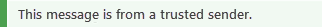

# Sicherheitstipps in E-Mail-Nachrichten

[!INCLUDE [Microsoft 365 Defender rebranding](../includes/microsoft-defender-for-office.md)]

**Gilt für**
- [Exchange Online Protection](exchange-online-protection-overview.md)
- [Microsoft Defender für Office 365 Plan 1 und Plan 2](defender-for-office-365.md)
- [Microsoft 365 Defender](../defender/microsoft-365-defender.md)

Exchange Online Protection (EOP) und Microsoft 365 schützen Sie mit Spam, Phishing und Schadsoftwareschutz. Heute sind einige dieser Angriffe so gut gestaltet, dass sie legitim aussehen. Das Senden von Nachrichten an den Junk-E-Mail-Ordner ist nicht immer ausreichend. Wenn Sie Nun Ihre E-Mails in Outlook oder Outlook im Web oder einem beliebigen E-Mail-Client überprüfen, überprüft EOP den Absender automatisch und fügt am oberen Rand der E-Mail einen Sicherheitstipp hinzu.

Sicherheitstipps in Outlook hängen nicht davon ab, welche Version von Outlook Sie verwenden, da die Sicherheitstipps geöffnet und direkt in den Nachrichtentext eingefügt wird. Dies bedeutet, dass der Sicherheitstipp in dem E-Mail-Client, den Sie verwenden, gezeigt wird. Dies erfolgt auf E-Mail-Filterebene und wird nicht auf E-Mail-Clientebene gerendert. Daher wird es nicht nur in jeder Version von Outlook angezeigt, sondern auch in jedem E-Mail-Client.

Der Sicherheitstipp – eine farblich codierte Nachricht – warnt Sie vor potenziell schädlichen Nachrichten. Die meisten Nachrichten in Ihrem Posteingang haben keinen Sicherheitstipp. Sie werden nur dann sehen, wenn EOP und Microsoft 365 über Informationen verfügen, die Sie benötigen, um Spam-, Phishing- und Schadsoftwareangriffe zu verhindern. Wenn Sicherheitstipps in Ihrem Posteingang angezeigt werden, können Sie die folgenden Beispiele verwenden, um mehr über die einzelnen Arten von Sicherheitstipps zu erfahren.

- Verdächtige E-Mails (rote Sicherheitstipps).

    

    Ein roter Sicherheitstipp in einer E-Mail bedeutet, dass die empfangene Nachricht etwas Verdächtiges enthält, z. B. einen Phishing-Betrug. Es wird empfohlen, diese Art von E-Mail-Nachricht aus Ihrem Posteingang zu löschen, ohne sie zu öffnen.

- Sichere E-Mails (grüne Sicherheitstipps).

    

    Neben unsicheren Nachrichten informieren wir Sie auch über gültige Nachrichten von Absendern, die wir mit einem grünen Sicherheitstipp vertrauen. Ein grüner Sicherheitstipp in einer E-Mail bedeutet, dass wir den Absender der Nachricht überprüft und überprüft haben, ob sie sicher ist. Microsoft verwaltet diese Liste vertrauenswürdiger Absender, die Finanzorganisationen und andere Organisationen umfasst, die häufig spoofiert oder als Identitätswechsel bezeichnet werden.

## Arbeiten mit Sicherheitstipps

Sicherheitstipps sind für Outlook im Web immer aktiviert, auch wenn nicht jede Nachricht eine erhält. Administratoren können Sicherheitstipps für andere E-Mail-Clients wie Outlook deaktivieren. Weitere Informationen finden Sie unter [Konfigurieren von Anti-Spam-Richtlinien in Office 365](configure-your-spam-filter-policies.md).

Wenn Sie nicht damit einverstanden sind, wie EOP eine Nachricht kategorisiert hat (d. h., die Nachricht ist kein Spam oder sie sollte als Spam gekennzeichnet sein), können Sie die Nachrichten zur Analyse an Microsoft übermitteln, um Ihre Erfahrung zu verbessern. Anweisungen finden Sie unter [Melden von Nachrichten und Dateien an Microsoft](report-junk-email-messages-to-microsoft.md). Sie können auch auf den Link Feedback im Sicherheitstipp klicken, um Kommentare direkt an Microsoft zu übermitteln, um uns bei der Verbesserung zu helfen.
