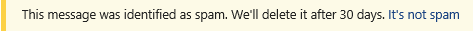

# Sicherheitstipps in E-Mail-NachrichtenSafety tips in email messages

Exchange Online Protection (EoP) und Microsoft 365 schützen Sie mit Spam, Phishing und Malware Prävention.Exchange Online Protection (EOP) and Microsoft 365 protect you with spam, phishing, and malware prevention. Heute sind einige dieser Angriffe so gut gestaltet, dass Sie legitim erscheinen.Today, some of these attacks are so well crafted that they look legitimate. Das Senden von Nachrichten an den Junk-e-Mail-Ordner ist nicht immer ausreichend.Sending messages to the Junk Email folder isn't always enough. Wenn Sie nun Ihre e-Mails in Outlook oder Outlook im Internet oder in einem beliebigen e-Mail-Client überprüfen, überprüft EoP automatisch den Absender und fügt einen Sicherheitshinweis oben in der e-Mail hinzu.Now, when you check your email in Outlook or Outlook on the web or any email client, EOP automatically checks the sender and adds a safety tip to the top of the email.

Sicherheitstipps in Outlook hängen nicht davon ab, welche Version von Outlook Sie verwenden, da der Sicherheitstipp geöffnet und direkt in den Nachrichtentext eingefügt wird.Safety tips in Outlook do not depend on what version of Outlook you're using because the safety tip is cracked open and inserted directly into the message body. Dies bedeutet, dass der Sicherheitshinweis in dem von Ihnen verwendeten e-Mail-Client angezeigt wird.This means that the safety tip will show up in whatever email client you're using. Er wird auf der Ebene der e-Mail-Filter ausgeführt und nicht auf der Ebene des e-Mail-Clients gerendert, sodass er nicht nur in einer beliebigen Version von Outlook angezeigt wird, sondern auch in einem beliebigen e-Mail-Client.It's done at the email filter level and not rendered at the mail client level, so not only does it show up in any version of Outlook, it also shows up in any email client.

Der Sicherheitstipp – eine farbcodierte Nachricht – warnt Sie vor potenziell schädlichen Nachrichten.The safety tip—a color-coded message—will warn you about potentially harmful messages. Die meisten Nachrichten in Ihrem Posteingang verfügen nicht über einen Sicherheitshinweis.Most messages in your inbox won't have a safety tip. Sie werden nur angezeigt, wenn EoP und Microsoft 365 Informationen enthalten, die Sie bei der Vermeidung von Spam-, Phishing-und Schadsoftware-Angriffen unterstützen müssen.You'll only see them when EOP and Microsoft 365 have information you need to help prevent spam, phishing, and malware attacks. Wenn in Ihrem Posteingang Sicherheitstipps angezeigt werden, können Sie anhand der folgenden Beispiele Weitere Informationen zu den einzelnen Sicherheitstipp Typen erhalten.If safety tips do show up on in your inbox, you can use the following examples to learn more about each type of safety tip.

- Verdächtige e-Mails (roter Sicherheitshinweis).Suspicious mail (red safety tip).

    

    Ein roter Sicherheitstipp in einer e-Mail bedeutet, dass die Nachricht, die Sie erhalten haben, etwas Verdächtiges enthält, beispielsweise einen Phishing-Betrug.A red safety tip in an email means that the message you received contains something suspicious, such as a phishing scam. Es wird empfohlen, diese Art von e-Mail-Nachrichten aus dem Posteingang zu löschen, ohne Sie zu öffnen.We recommend that you delete this kind of email message from your inbox without opening it.

- Spam (gelber Sicherheitstipp).Spam (yellow safety tip).

    

    Ein gelber Sicherheitstipp in einer e-Mail bedeutet, dass die Nachricht als Spam gekennzeichnet wurde.A yellow safety tip in an email means that the message has been marked as spam. Wenn Sie den Absender der Nachricht nicht erkennen und ihm vertrauen, laden Sie keine Anlagen oder Bilder herunter, und klicken Sie auf keine Links in der Nachricht.If you don't recognize and trust the sender of the message, don't download any attachments or pictures and don't click any links in the message. In Outlook im Internet können Sie in der gelben Leiste eines Junk-e-Mail-Elements auf **IT es not Spam** klicken, um die Nachricht in Ihren Posteingang zu verschieben.In Outlook on the web, you can click **It's not spam** in the yellow bar of a junk mail item to move the message to your inbox. Wenn der gelbe Sicherheitstipp in einer Nachricht angezeigt wird, die an Ihren Posteingang zugestellt wurde, ist Sie wahrscheinlich da, weil Sie das Verschieben von Spam in Ihren Junk-e-Mail-Ordner deaktiviert haben.If the yellow safety tip appears on a message that was delivered to your inbox, it's probably there because you've disabled moving spam to your Junk Email folder.

- Safe Mail (grüner Sicherheitstipp).Safe mail (green safety tip).

    

    Neben unsicheren Nachrichten informieren wir Sie auch über gültige Nachrichten von Absendern, denen wir Vertrauen, mit einem grünen Sicherheitstipp.In addition to unsafe messages, we'll also tell you about valid messages from senders we trust with a green safety tip. Ein grüner Sicherheitstipp in einer e-Mail bedeutet, dass wir den Absender der Nachricht überprüft und überprüft haben, dass Sie sicher ist.A green safety tip in an email means that we checked the sender of the message and verified that it's safe. Microsoft verwaltet diese Liste vertrauenswürdiger Absender, die Finanzorganisationen und andere häufig gefälschte oder imitierte Personen umfassen.Microsoft maintains this list of trusted senders which includes financial organizations and others that are frequently spoofed or impersonated.

- Ungefiltertes Mail (grauer Sicherheitstipp).Unfiltered mail (gray safety tip).

    

    Wir sagen Ihnen auch, wann die Überprüfung einer e-Mail übersprungen wurde, da Sie von einem Absender stammt, dem Sie Ihre Liste sicherer Absender Vertrauen, oder wenn eine Nachrichtenfluss Regel zur Umgehung der Filterung vorhanden ist.We'll also tell you when we skipped checking a mail because it's from a sender you trust on your Safe Senders list or if a mail flow rule exists to bypass filtering.

    Die graue Sicherheitsspitze wird auch angezeigt, wenn externe Bilder blockiert werden, das heißt, die Nachricht befindet sich in Ihrem Posteingang und scheint nicht Spam zu sein, sondern enthält externe Bilder, die Sie nicht zum Herunterladen entschieden haben.The gray safety tip also shows up when external images are blocked, that is, the message is in your inbox and doesn't appear to be spam, but contains external images that you haven't opted to download.
    

## Arbeiten mit SicherheitstippsWorking with safety tips

Sicherheitstipps sind für Outlook im Internet immer aktiviert, obwohl nicht jede Nachricht eine erhalten wird.Safety tips are always enabled for Outlook on the web, even though not every message will receive one. Administratoren können Sicherheitstipps für andere e-Mail-Clients wie Outlook deaktivieren.Admins can turn safety tips off for other email clients such as Outlook. Weitere Informationen finden Sie unter [Konfigurieren von Anti-Spam-Richtlinien in Office 365](configure-your-spam-filter-policies.md).For more information, see [Configure anti-spam policies in Office 365](configure-your-spam-filter-policies.md).

Wenn Sie mit der Kategorisierung einer Nachricht durch EoP nicht einverstanden sind (das heißt, die Nachricht ist kein Spam oder Sie sollte als Spam gekennzeichnet worden sein), können Sie die Nachrichten zur Analyse an Microsoft übermitteln, um eine bessere Benutzerfreundlichkeit zu ermöglichen.If you disagree with how EOP categorized a message (that is, the message is not spam or it should have been marked as spam), you can submit the messages to Microsoft for analysis to help make your experience better. Anweisungen finden Sie unter [Report Messages and files to Microsoft](report-junk-email-messages-to-microsoft.md).For instructions, see [Report messages and files to Microsoft](report-junk-email-messages-to-microsoft.md). Sie können auch auf den Link Feedback im Sicherheitstipp klicken, um Kommentare direkt an Microsoft zu senden und uns dabei zu verbessern.You can also click on the Feedback link in the safety tip to submit comments directly to Microsoft to help us improve.
